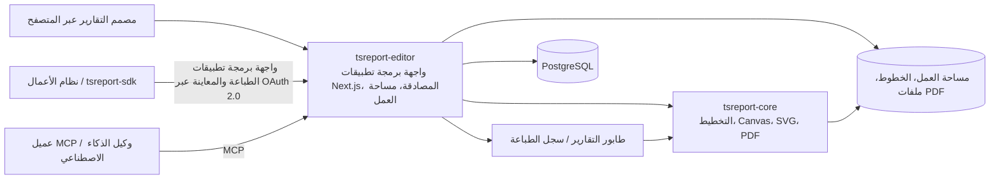

# tsreport-editor

[English](./README.md) | [日本語](./README.ja.md) | [简体中文](./README.zh-CN.md) | [繁體中文](./README.zh-TW.md) | [한국어](./README.ko.md) | [Tiếng Việt](./README.vi.md) | [ไทย](./README.th.md) | [Bahasa Indonesia](./README.id.md) | [Deutsch](./README.de.md) | [Français](./README.fr.md) | [Español](./README.es.md) | [Português](./README.pt.md) | العربية | [עברית](./README.he.md)

`tsreport-editor` هو مصمم تقارير وخادم تقارير يعمل عبر المتصفح، ويستخدم [`tsreport-core`](https://www.npmjs.com/package/tsreport-core) كمحرك تخطيط وعرض (Layout/Rendering Engine).

الأمر لا يقتصر على شاشة تصميم التقارير فحسب. فهو يوفر في خادم واحد: إدارة قوالب `.report` والموارد المرفقة، والمعاينة باستخدام بيانات فعلية، واستيراد ملفات PDF، وواجهة برمجة تطبيقات للطباعة (Print API) تعتمد على OAuth 2.0 للأنظمة الخارجية، وبروتوكول MCP لوكلاء الذكاء الاصطناعي، وطابور تقارير غير متزامن (Asynchronous Report Queue)، وسجل تدقيق للطباعة.

- **مصمم التقارير** — تحرير الأشرطة (Bands) والنصوص والأشكال والصور وملفات SVG والجداول والتقارير الفرعية (Subreports) والباركود والمعادلات، كل ذلك عبر المتصفح.
- **تطابق المعاينة مع ملف PDF** — يستخدم المحرر (Editor) ومعاينة الطباعة وإخراج PDF نفس نتائج التخطيط ونفس منطق الرسم من `tsreport-core`.
- **دعم متعدد اللغات وإدارة الخطوط** — إدارة الخطوط لكل حساب على حدة، وتضمين الخطوط، والخطوط التفريغية (Outline Fonts)، وخطوط مستوردة من PDF، ودعم تنضيد النصوص اليابانية والصينية والكورية والعربية وغيرها.
- **خادم واجهة برمجة تطبيقات التقارير** — طباعة غير متزامنة للقوالب المثبّتة عبر وسوم نشر (Published Tags) باستخدام OAuth 2.0 Client Credentials.
- **خادم MCP** — يتيح للذكاء الاصطناعي قراءة القوالب وتحريرها والتحقق منها ومراجعة التخطيط، وعرضها كصور PNG أو ملفات PDF، واستيراد ملفات PDF أصلية، ومقارنة الفروقات.
- **التشغيل وسجل التدقيق** — تتم معالجة طلبات الطباعة عبر واجهة برمجة التطبيقات ضمن طابور، ويتم تسجيل مخرجات PDF من المحرر وواجهة البرمجة وMCP في سجل طباعة مخصص لكل حساب.

## تصميم التقارير بالذكاء الاصطناعي عبر MCP

تعرض مقاطع الفيديو كيفية تصميم الذكاء الاصطناعي لتقرير عبر MCP ثم فتح المعاينة النهائية. كما تعرض النسخة الإنجليزية مثالًا على دعم التقارير متعددة اللغات.

| النسخة الإنجليزية — دعم التقارير متعددة اللغات | النسخة اليابانية |
| --- | --- |
| [](https://youtu.be/CHsNew6yQr4) | [](https://youtu.be/0I3ljxLUbys) |

### إدارة الخطوط

تتيح شاشة إدارة الخطوط تنزيل Google Fonts ورفع ملفات الخطوط الخاصة بك.

[](https://youtube.com/shorts/fAUjfFqaVtY)

## نظرة عامة على النظام



`tsreport-core` هو محرك تقارير مكتوب بـ TypeScript الخالص وبدون أي اعتمادية على بيئة التشغيل (Runtime). أما `tsreport-editor` فيبني فوقه بنية تتكون من Next.js وPostgreSQL والمصادقة وإدارة الملفات والطابور ولوحة الإدارة. ولأن جانب المحرر يستخدم Argon2id لتجزئة كلمات المرور ومكتبة `sharp` لتوليد صور PNG في MCP، فإننا لا نصنّف خادم المحرر بالكامل على أنه "خالٍ تمامًا من الاعتماديات الأصلية (Native Dependencies)".

## أبرز ميزات التصميم

- أشرطة (Bands) مثل Title وPage Header وColumn Header وDetail وGroup Header/Footer وSummary وPage Footer وLast Page Footer وBackground وNo Data وغيرها
- نصوص ثابتة، وحقول تعبيرية (Expression Fields)، وخطوط، ومستطيلات، وأشكال بيضاوية، ومسارات متجهية (Vector Paths)، وصور، وملفات SVG، وإطارات، وجداول، وتقارير فرعية، وباركود، ومعادلات، وفواصل صفحات
- خصائص رسم تشمل RGB وCMYK والألوان الخاصة (Spot Colors) والتدرجات والشفافية والقص (Clip) وأقنعة التنعيم (Soft Mask)
- تحرير مرئي وتحرير JSON لملفات `.report`، مع علامات تبويب متعددة، وتراجع/إعادة (Undo/Redo)، وطبقات، وتكبير، ومعاينة طباعة
- التحقق من الحقول والمعاملات والتعابير والتفاصيل المتكررة باستخدام بيانات اختبار بصيغة JSON
- استيراد عالي الدقة لصفحات PDF، مع تحويل النصوص والمتجهات والصور والخطوط المضمّنة إلى عناصر تقرير قابلة للتحرير أو رسم محفوظ كما هو
- وسوم نشر (Published Tags) للقوالب، تفصل بين المحتوى قيد التحرير والنسخة المثبّتة المستخدمة في واجهة البرمجة الخارجية

## البدء السريع

### المتطلبات المسبقة

- Docker وDocker Compose

تُثبَّت حزمتا `tsreport-core` و`tsreport-react` المنشورتان من npm وفق ملف القفل الخاص بالمحرر. لا تُستخدم مستودعات مجاورة.

يجب تنفيذ استعادة الاعتماديات وفحص الأنواع (Type Checking) والاختبارات وبناء Next.js الخاصة بالمحرر داخل Docker فقط. لا تُشغّل `npm install` أو `npm ci` أو `npx` أو سكربتات npm على `src/` من جهاز الاستضافة (Host).

### التشغيل

```sh
cd ../tsreport-editor/server
docker compose up
```

للتشغيل في الخلفية:

```sh
cd ../tsreport-editor/server
docker compose up -d
docker compose ps
docker compose logs -f tsreport_editor_node
```

يثبّت ملف `server/compose.yaml` الخاص بالتطوير اسم مشروع Compose على `tsreport-editor-dev`، بحيث يبقى منفصلاً في نطاق الحاويات والشبكة عن أي منتجات أخرى على نفس المضيف أو عن مشروع `tsreport-editor` الخاص بالإنتاج.

للإيقاف:

```sh
cd ../tsreport-editor/server
docker compose down
```

في التشغيل الاعتيادي حيث تريد الإبقاء على البيانات، تجنّب استخدام `down -v` أو حذف أدلة NFS/قاعدة البيانات.

### خدمات ومنافذ التطوير

| الخدمة | الدور | من جهة المضيف |
| --- | --- | --- |
| `tsreport_editor_node` | محرر Next.js وواجهة REST API | `http://localhost:52005` |
| `tsreport_editor_node` | مستمع MCP مخصص | `http://localhost:52006` |
| `tsreport_editor_node` | إشعارات تحديث مساحة العمل | `52007` |
| `tsreport_editor_db` | PostgreSQL | `localhost:52437` |
| `tsreport_editor_cron` | تشغيل طابور التقارير كل 10 ثوانٍ | داخليًا فقط |
| `tsreport_editor_nginx` | وكيل عكسي HTTP / HTTPS | `52085` / `52448` |

افتح في المتصفح `http://localhost:52005`، أو `https://localhost:52448` الذي يستخدم شهادة موقّعة ذاتيًا.

## أول تسجيل دخول وإعدادات الأمان الإلزامية

عند التشغيل لأول مرة، ينشئ التطبيق مرة واحدة فقط - تحت قفل قاعدة بيانات (DB Lock) - البيانات الأولية للمخطط، والحسابات، ومساحات العمل، وقوالب اختبار الانحدار (Regression).

| الغرض | معرّف الدخول | كلمة المرور الأولية | الصلاحية |
| --- | --- | --- | --- |
| المدير الأولي | `admin` | `pass` | مدير |
| اختبار الانحدار | `test` | `pass` | مستخدم عادي |

> **مهم:** كلمات المرور الأولية هي بيانات اعتماد تهيئة معروفة للعامة. يجب تغييرها قبل بدء التشغيل الفعلي. الواجهة الحالية لا تفرض التغيير تلقائيًا عند أول تسجيل دخول، لذا يجب على المشغّل التحقق من إتمام التغيير بنفسه.

بعد أول تسجيل دخول، نفّذ التالي من قائمة الهامبرغر:

1. غيّر كلمة المرور الأولية لحساب `admin` عبر "تغيير كلمة المرور".
2. احذف حساب `test` إن لم تكن تستخدمه في اختبار الانحدار. وإن أبقيته، فغيّر كلمة مروره حتمًا.
3. أعد توليد مفتاح MCP من "إعدادات MCP" لأي حساب أولي تُبقيه.
4. احذف عميل واجهة البرمجة الخاص باختبار الانحدار `test-report-client`، أو أعد ضبط Client Secret وصلاحيات الوصول الخاصة به.
5. غيّر بيانات اعتماد قاعدة البيانات و`REPORT_BATCH_TOKEN` في ملف `server/node/.env` وملف `.env` الخاص بالإنتاج عن القيم الافتراضية.
6. استبدل شهادة nginx الموقّعة ذاتيًا بشهادة رسمية قبل النشر للعامة، وتحقق من المنافذ المفتوحة للعامة وجدار الحماية.

يتم تجزئة كلمات مرور الحسابات المحلية بخوارزمية Argon2id قبل حفظها في قاعدة البيانات. يجب الإبقاء على حساب واحد على الأقل بصلاحية مدير، حتى لو كان `admin` نفسه.

## سير العمل الأساسي

1. سجّل الدخول وافتح مساحة عمل حسابك.
2. سجّل الخطوط المطلوبة للتقرير من "إدارة الخطوط".
3. أنشئ ملف `.report` جديدًا، أو افتح ملف `.report`/PDF موجودًا.
4. ضع الأشرطة والعناصر، وحدّد بيانات اختبار JSON عند الحاجة.
5. تحقق من الصفحات المتعددة وتجاوز التفاصيل (Detail Overflow) والصفحة الأخيرة في عرض المحرر ومعاينة الطباعة.
6. أخرج ملف PDF. يُسجَّل الإخراج في سجل الطباعة الخاص بحسابك.
7. عند الاستخدام من نظام خارجي، أنشئ وسم نشر (Published Tag) واضبط عميل واجهة البرمجة وصلاحيات الوصول.

الحفظ الاعتيادي يحدّث ملف التحرير في مساحة العمل. أما وسم النشر فيثبّت محتوى JSON للقالب عند تلك اللحظة، لذا فإن الحفظ الاعتيادي اللاحق لا يغيّر نتائج طباعة واجهة البرمجة للوسم الحالي. عند نشر التغييرات للاستخدام الخارجي، أنشئ وسمًا جديدًا أو حدّث الوسم المستهدف صراحةً.

## إدارة إصدارات قوالب التقارير عبر وسوم النشر

وسم النشر (Published Tag) ليس مجرد علامة تحوّل ملف `.report` قيد التحرير إلى حالة منشورة للخارج. بل هو **آلية تحفظ محتوى قالب التقرير كإصدار، وتتيح لواجهة البرمجة الخارجية تحديد ذلك الإصدار بالاسم**.

على سبيل المثال، بعد نشر المحتوى الحالي لقالب فاتورة باسم `v1`، يمكنك الاستمرار في تحرير ملف `invoice.report` في مساحة العمل. لا تنعكس التغييرات الناتجة عن الحفظ الاعتيادي تلقائيًا على `v1`. وإذا نشرت المحتوى بعد التغيير باسم `v2`، يمكن للأنظمة الخارجية اختيار الإصدار المراد استخدامه صراحةً عبر رابط واجهة البرمجة.

```text
invoice.report (النسخة العاملة قيد التحرير)
  ├─ v1 (ملف JSON للقالب المنشور)
  └─ v2 (ملف JSON للقالب المنشور بعد التعديل)

POST /api/report/print/{workspaceKey}/invoice.report/v1
POST /api/report/print/{workspaceKey}/invoice.report/v2
```

هذا الفصل يتيح ما يلي:

- استمرار استخدام نظام الأعمال للإصدار الحالي `v1` أثناء تحرير واختبار تخطيط تقرير جديد
- تغيير الجهة المستدعاة من `v1` إلى `v2` بما يتماشى مع توقيت تبديل مستخدمي واجهة البرمجة
- إبقاء عدة إصدارات متزامنة، واستخدام إصدار مختلف لكل جهة تكامل
- عند اكتشاف مشكلة، إعادة توجيه واجهة البرمجة إلى وسم سابق دون الحاجة لإعادة كتابة ملف القالب

عند إنشاء وسم جديد، يُحفظ محتوى JSON للقالب عند تلك اللحظة. يمكن أيضًا تحديث نفس الوسم صراحةً، لكن في تلك الحالة يتغيّر أيضًا المحتوى الذي يشير إليه رابط واجهة البرمجة نفسه. في التشغيل الذي يهتم بإعادة الإنتاجية (Reproducibility) والترحيل التدريجي، يُفضَّل إنشاء وسوم جديدة مثل `v1` و`v2` و`2026-07` بدلاً من الكتابة فوق وسم قائم.

ما يثبّته وسم النشر هو محتوى JSON للقالب فقط. أما `rows` و`parameters` في استدعاء واجهة البرمجة فلا تدخل ضمن الإصدار، بل تُحدَّد مع كل طلب طباعة. كذلك، فإن "النشر" هنا لا يعني النشر المجهول على الإنترنت العام. فالاستخدام الفعلي عبر واجهة البرمجة يتطلب تحقق نطاقات OAuth 2.0 وصلاحيات وصول عميل واجهة البرمجة وصلاحيات مساحة عمل المستخدم المالك معًا.

## المستخدمون ومساحات العمل والمشاركة

### إدارة المستخدمين

- لكل حساب مساحة عمل واحدة.
- تُعرَّف مساحة العمل بمعرّف UUID غير قابل للتغيير يُسمى `workspaceKey`.
- يمكن للمدير إنشاء المستخدمين وإدارة الاسم المعروض ومعرّف الدخول والصلاحية وإمكانية استخدام MCP وكلمة المرور، بالإضافة إلى إعدادات النظام.
- حتى المدير لا يمكنه الاطلاع على مساحة عمل حساب آخر دون قيد. بيانات التقارير معزولة لكل مستأجر (Tenant Isolation).
- حذف المستخدم هو حذف فعلي (Physical Delete). تُحذف البيانات المرتبطة بما في ذلك مساحة العمل والخطوط والمشاركات وعملاء واجهة البرمجة والرموز (Tokens) وسجل الطباعة، ولا يمكن استعادتها.

### مشاركة المجلدات

يمكن مشاركة مجلدات محددة فقط مع حساب آخر، دون الحاجة لمشاركة مساحة العمل بأكملها.

- تُحدَّد الجهة المشتركة عبر `workspaceKey` الخاص بها.
- يمكن السماح بالقراءة والكتابة بشكل منفصل.
- تسمح مشاركة القراءة بالرجوع إلى القوالب والموارد، وتسمح مشاركة الكتابة بالتحرير المشترك.
- يمكن للجهة المشتركة إلغاء المشاركة المستلمة.
- يُطبَّق نطاق الوصول الفعلي نفسه على واجهة البرمجة وMCP.

عندما يحدّث المحرر أو MCP مساحة عمل، يُبلَّغ حدث التحديث لعلامات تبويب المحرر الأخرى. إن لم تكن هناك تغييرات غير محفوظة تُعاد التحميل، وإن كانت هناك تغييرات غير محفوظة تُحمى التعديلات المحلية ويظهر تحذير.

المشاركة وصلاحيات واجهة البرمجة ووسوم النشر لها أغراض مختلفة.

| المفهوم | النطاق | الدور |
| --- | --- | --- |
| مشاركة المجلد | بين الحسابات | السماح بالقراءة/الكتابة لعمليات المحرر البشرية ولـ MCP العامل باسم ذلك الحساب |
| صلاحيات واجهة البرمجة | عميل واجهة البرمجة | تقييد `workspaceKey` والمجلدات التي يمكن للنظام الخارجي الوصول إليها |
| وسم النشر | إصدار ملف `.report` | تثبيت محتوى القالب المستخدم في طباعة واجهة البرمجة |

إضافة صلاحيات واجهة البرمجة وحدها لا تكفي إن لم تكن للمستخدم المالك نفسه صلاحية وصول للمجلد المستهدف. وعلى العكس، فإن مشاركة المجلد وحدها لا تجعله متاحًا لواجهة البرمجة الخارجية.

## إضافة الخطوط وإدارتها

يمكن لجميع المستخدمين استخدام "إدارة الخطوط" من قائمة الهامبرغر. تُحفظ الخطوط لكل حساب على حدة في `/var/nfs/fonts/{accountId}/`، ولا تظهر لحسابات أخرى.

### الرفع

1. افتح "إدارة الخطوط".
2. أضف الخطوط عبر اختيار الملف أو السحب والإفلات.
3. اختر معرّف الخط الظاهر في القائمة من خاصية `fontFamily` لعنصر النص.

الصيغ المدعومة هي TTF وOTF وTTC وOTC وWOFF وWOFF2. الحد الأقصى لحجم الملف الواحد في التطبيق هو 256 ميبيبايت. يمكن اختيار عدة خطوط نظام دفعة واحدة وتسجيلها، مثل الخطوط الموجودة في `/System/Library/Fonts` على macOS. لا يقرأ النظام خطوط نظام التشغيل المضيف ضمنيًا، ولا يثبّت أي خطوط على نظام التشغيل.

يُحدَّد التكرار على النحو التالي:

- نفس معرّف الخط ونفس الملف الثنائي: يُعامل كنجاح كإعادة محاولة لرفع دفعي
- نفس معرّف الخط وملف ثنائي مختلف: يُرفض كتعارض في المعرّف
- معرّف خط مختلف ونفس الملف الثنائي: يُرفض كتكرار مع الإشارة إلى المعرّف الموجود
- تطابق البيانات الوصفية فقط (كاسم العائلة أو اسم PostScript): يمكن تسجيله كخط مستقل إذا كان الملف الثنائي مختلفًا

يُحدَّد تطابق المحتوى بمقارنة كافة البايتات بعد تطابق حجم الملف، وليس فقط عبر البيانات الوصفية أو التجزئة (Hash).

### خطوط Google Fonts والخطوط المستوردة من PDF

في "Download Google Fonts" يمكنك اختيار اللغة وتنزيل المرشحات إلى مساحة الحساب. يفترض هذا وجود اتصال بشبكة خارجية.

عند استيراد PDF، تُسجَّل الخطوط المضمّنة القابلة لإعادة الاستخدام كخطوط تطبيق ضمن الحساب. إن لم يوجد برنامج الخط (Font Program)، تُطابَق الأسماء والأنماط مع خطوط الحساب وتُعرَض مرشحات وتحذيرات.

## استخدام واجهة برمجة التطبيقات الخارجية للطباعة

تستخدم واجهة البرمجة الخارجية رمز حامل (Bearer Token) من OAuth 2.0 Client Credentials، وليس ملف تعريف ارتباط (Cookie) تسجيل الدخول للشاشة. يلزم ثلاثة عناصر للبدء:

1. **وسم نشر** — أنشئ إصدارًا مثبّتًا لملف `.report` المستخدم في واجهة البرمجة.
2. **عميل واجهة البرمجة** — أنشئ Client ID وClient Secret ونطاقات (Scopes) من "عملاء واجهة البرمجة" في قائمة الهامبرغر.
3. **صلاحيات الوصول** — سجّل `workspaceKey` والمجلدات التي يمكن للعميل استخدامها.

النطاقات المتاحة هي `report:print` و`report:status` و`report:download` و`report:preview`. النطاق الفعلي لعميل واجهة البرمجة هو تقاطع "صلاحيات وصول العميل" مع "مساحات العمل/المجلدات المشتركة التي يمكن للمستخدم المالك نفسه الوصول إليها".

### تدفق REST API

```text
POST /api/oauth/token
  grant_type=client_credentials
  -> access_token

POST /api/report/print/{workspaceKey}/{templatePath}/{tag}
  -> { key }

GET /api/report/status/{key}
  -> queued | processing | completed | error

GET /api/report/download/{key}
  -> application/pdf
```

مثال:

```sh
BASE_URL=http://localhost:52005
CLIENT_ID=test-report-client
CLIENT_SECRET=test-report-secret

TOKEN=$(curl -sS -u "$CLIENT_ID:$CLIENT_SECRET" \
  -d grant_type=client_credentials \
  -d 'scope=report:print report:status report:download' \
  "$BASE_URL/api/oauth/token" | jq -r .access_token)

curl -sS \
  -H "Authorization: Bearer $TOKEN" \
  -H 'Content-Type: application/json' \
  -d '{"rows":[{"item":"seed"}],"parameters":{}}' \
  "$BASE_URL/api/report/print/00000000-0000-0000-0000-000000000002/invoice.report/v1"
```

حتى لو تضمّن `templatePath` رمز `/`، يُحل الجزء الأخير بعده كوسم (Tag). حالة الطلب والتنزيل يمكن أن يطّلع عليهما فقط عميل واجهة البرمجة نفسه الذي أنشأ طلب الطباعة.

### tsreport-sdk

باستخدام [`tsreport-sdk`](../tsreport-sdk) يمكنك التعامل مع الحصول على الرمز (Token) وإضافة الطلب إلى الطابور والاستطلاع (Polling) وجلب ملف PDF ضمن واجهة برمجة TypeScript واحدة.

```ts
import { TsreportClient } from 'tsreport-sdk'

const client = new TsreportClient({
    baseUrl: 'https://reports.example.com',
    clientId: process.env.REPORT_CLIENT_ID!,
    clientSecret: process.env.REPORT_CLIENT_SECRET!
})

const pdf = await client.printAndDownload(
    '00000000-0000-0000-0000-000000000002',
    'orders/invoice.report',
    'v1',
    { rows: [{ orderId: 42 }], parameters: {} }
)
```

لا تُضمّن Client Secret داخل المتصفح. عند الاستخدام من تطبيق متصفح، مرّر الطلب عبر الواجهة الخلفية (Backend) المصادَق عليها الخاصة بنظامك. يمكن استخدام `createPreviewEndpoint` من `tsreport-sdk/server` لتمرير آمن لواجهة برمجة موارد المعاينة.

## طابور التقارير وسجل الطباعة

تُسجَّل طلبات الطباعة القادمة من واجهة البرمجة في `PrintRequest` بقاعدة البيانات بحالة `queued`. تُشغّل `tsreport_editor_cron` نقطة نهاية دفعية (Batch Endpoint) مصادَق عليها كل 10 ثوانٍ، لتنقل الحالة من `queued` إلى `processing` ثم إلى `completed` أو `error`. تُسلسَل عمليات التشغيل المتزامنة عبر قفل قاعدة البيانات (DB Lock).

تُحفظ ملفات PDF المُنتَجة في `/var/nfs/report-pdf`. تتيح شاشة سجل الطباعة الاطلاع على ما يلي لحسابك الخاص:

- تاريخ ووقت التنفيذ
- مسار التنفيذ: `editor` / `api` / `mcp`
- مساحة العمل والقالب والصيغة
- حالة الاكتمال/الخطأ وسبب الخطأ
- إعادة تنزيل ملف PDF المكتمل

يُسجَّل ملف PDF الناتج من المحرر عبر المتصفح في واجهة برمجة السجل. كما تُسجَّل أداة `render_report(format="pdf")` الخاصة بـ MCP في السجل أيضًا. السجل معزول لكل حساب، ولا يمكن حتى للمدير الاطلاع على سجل حساب آخر.

عند التشغيل، احتفظ بنسخ احتياطية لقاعدة البيانات ومجلد `server/nfs` كنقطة استرداد واحدة. استعادة صفوف السجل فقط أو ملفات PDF فقط سيؤدي إلى عدم تطابق سجل التدقيق مع النواتج الفعلية. حدّد أيضًا فترة الاحتفاظ ومراقبة القرص بناءً على حجم المخرجات كجزء من التشغيل.

## استخدام MCP

MCP مستقل عن عميل OAuth الخاص بواجهة البرمجة الخارجية للطباعة. تتم المصادقة عبر معرّف الدخول ومفتاح MCP الخاصين بكل مستخدم، ويعمل بنفس صلاحيات مساحة العمل/المشاركة الخاصة بذلك المستخدم.

### التفعيل وبيانات الاعتماد

1. افتح "إعدادات MCP" من قائمة الهامبرغر.
2. فعّل استخدام MCP الخاص بك.
3. انسخ مفتاح MCP. أعد توليد المفتاح الأولي قبل التشغيل الفعلي.
4. يمكن للمدير من نفس الشاشة ضبط تفعيل/تعطيل MCP بشكل عام والمنفذ المخصص.

عادةً يُستخدم نفس رابط Next.js وهو `http://localhost:52005/api/mcp`. في بيئة التطوير يمكن أيضًا استخدام المستمع المخصص `http://localhost:52006`. اضبط في عميل MCP رابط Streamable HTTP وأحد نوعي المصادقة التاليين:

- `x-mcp-account: <معرّف الدخول>` و`x-mcp-key: <مفتاح MCP>`
- `Authorization: Bearer <معرّف الدخول>:<مفتاح MCP>`

يمكن الحصول على دليل الإعداد دون مصادقة.

```sh
curl http://localhost:52005/api/mcp
```

مثال للتحقق من قائمة الأدوات:

```sh
curl -sS http://localhost:52005/api/mcp \
  -H 'Content-Type: application/json' \
  -H 'x-mcp-account: admin' \
  -H 'x-mcp-key: <مفتاح MCP المُعاد توليده>' \
  -d '{"jsonrpc":"2.0","id":1,"method":"tools/list","params":{}}'
```

### أدوات MCP

| التصنيف | الأداة |
| --- | --- |
| المقدمة | `get_started` |
| الاكتشاف | `list_workspaces`, `list_templates`, `list_workspace_files`, `list_fonts` |
| القالب | `get_template`, `get_template_schema`, `validate_template`, `save_template`, `update_template_elements` |
| الموارد | `save_workspace_file`, `delete_workspace_file` |
| التحقق والإخراج | `layout_report`, `render_report`, `compare_reports` |
| استيراد النسخة الأصلية | `import_pdf` |

حلقة العمل الموصى بها هي كالتالي:

1. اقرأ `get_started` و`get_template_schema`.
2. تحقق من الموارد المتاحة عبر `list_workspaces` و`list_templates` و`list_workspace_files` و`list_fonts`.
3. أنشئ القالب أو احصل عليه عبر `get_template`.
4. تحقق من البنية والتعابير باستخدام `validate_template`.
5. تحقق رقميًا من الإحداثيات المطلقة وعدد الصفحات والعناصر الخارجة عن النطاق باستخدام `layout_report`.
6. تحقق بصريًا باستخدام `render_report(format="png")`.
7. احفظ باستخدام `save_template` أو `update_template_elements`.
8. قارن قبل وبعد التغيير باستخدام `compare_reports` للتأكد من عدم وجود إزاحة غير مقصودة.

في حال وجود ملف PDF أصلي، اتبع التسلسل: `save_workspace_file` ← `import_pdf` ← تعديل التعابير والأشرطة ← `layout_report` / `render_report`، بدلاً من إعادة الإنشاء بصريًا يدويًا.

## اللغات والتكامل الخارجي الاختياري

يمكن لواجهة المحرر اختيار اليابانية والإنجليزية والصينية المبسطة والكورية والصينية التقليدية والفيتنامية والتايلاندية والإندونيسية والألمانية والفرنسية والإسبانية والبرتغالية والعربية والعبرية. مع العربية والعبرية تصبح الواجهة أيضًا من اليمين إلى اليسار (RTL). هذا لا يقيّد مجموعات الأحرف القابلة للاستخدام داخل التقرير نفسه.

يمكن للمدير إعداد تسجيل الدخول الخارجي عبر Google/Microsoft. إذا لم يُفعَّل تسجيل الدخول الخارجي، يمكن التشغيل بالاعتماد فقط على الحسابات المحلية المحمية بـ Argon2id.

عند استخدام ميزات المساعدة بالذكاء الاصطناعي، سجّل مفتاح واجهة البرمجة والنموذج في إعدادات النظام بقاعدة البيانات. لا تتضمن القيم الأولية مفتاح واجهة برمجة خارجي فعّال. لا تحفظ القيم السرّية في الكود المصدري أو ملفات `.report` أو مساحة العمل أو ملف README.

## البيانات الأولية وبيئة اختبار الانحدار

عند التشغيل لأول مرة، يُنشأ ما يلي:

- حسابا `admin` و`test`، مع `workspaceKey` ثابت
- عميل واجهة البرمجة `test-report-client` الخاص باختبار الانحدار والمملوك لـ `test`
- ملفات `invoice.report` و`sub.report` و`assets/logo.png` في مساحة عمل `test`
- وسم النشر `v1` لـ `invoice.report`
- مشاركة قراءة/كتابة لمجلد `assets` من `test` إلى `admin`

المعرّفات الثابتة:

- `admin`: `00000000-0000-0000-0000-000000000001`
- `test`: `00000000-0000-0000-0000-000000000002`

تُستخدم هذه في اختبارات الانحدار الفعلية للخوادم عبر `tsreport-editor` و`tsreport-sdk` و`tsreport-react`. في التشغيل الفعلي، يجب تغيير أو حذف بيانات الاعتماد الأولية المذكورة أعلاه حتمًا.

### إعادة قاعدة بيانات التطوير إلى حالتها الأولية

لإعادة إنشاء PostgreSQL الخاصة ببيئة التطوير بالكامل، أوقف الحاوية ثم احذف `server/db/pgdata/data` وأعد التشغيل.

```sh
cd ../tsreport-editor/server
docker compose down
rm -rf db/pgdata/data
docker compose up
```

عند إعادة التشغيل، تُطبَّق تعريفات DDL الخاصة بـ PostgreSQL، وتُعاد إنشاء البيانات الأولية لقاعدة البيانات - كالحسابات الأولية وعملاء واجهة البرمجة ووسوم النشر - عند بدء تشغيل التطبيق. تُستكمَل ملفات مساحة عمل الانحدار فقط عند نقصانها. لا تحذف `pgdata` أثناء تشغيل حاوية قاعدة البيانات.

هذا الإجراء يعيد تهيئة PostgreSQL فقط. لا يُحذف ما هو محفوظ في `server/nfs` كمساحات العمل والخطوط وملفات PDF المُنتَجة. إذا احتجت إلى إعادة كل من قاعدة البيانات وNFS إلى حالتها الأولية، استخدم "إعادة التهيئة الكاملة (Factory Reset)" من قائمة المدير.

تحذف "إعادة التهيئة الكاملة" جميع جداول قاعدة البيانات ومساحات العمل ومخرجات التقارير، وتعيد إنشاء الحالة الأولية. لا يمكن التراجع عن هذا الإجراء. لا تُستثنى الخطوط والشهادات وملفات النقطة (Dotfiles) مثل `.gitignore` من هذا الإجراء.

## أماكن حفظ البيانات

| البيانات | داخل الحاوية | من جهة التطوير (Host) |
| --- | --- | --- |
| PostgreSQL | `/var/pgdata/data` | `server/db/pgdata` |
| مساحة العمل | `/var/nfs/workspaces/{workspaceKey}` | `server/nfs/workspaces` |
| خطوط الحساب | `/var/nfs/fonts/{accountId}` | `server/nfs/fonts` |
| ملفات PDF المُنتَجة | `/var/nfs/report-pdf` | `server/nfs/report-pdf` |
| سجلات nginx | `/var/log/nginx` | `logs/nginx` |

يمكن تنفيذ تصدير/استيراد بيانات التطبيق من قائمة المدير. للتعافي من الكوارث على مستوى البيئة بأكملها، لا تعتمد على هذه الميزة فقط، بل احتفظ أيضًا بنسخ احتياطية متسقة لكل من PostgreSQL وNFS.

## بناء الإنتاج والتشغيل

يفترض بناء الإنتاج والتشغيل أيضًا استخدام Docker Compose. سكربتات `build.sh` و`build_boot.sh` و`boot.sh` و`boot_db.sh` و`boot_web.sh` و`build_boot_web.sh` هي أغلفة بسيطة (Wrappers) لاستدعاء Docker Compose. ليست إجراءات لتثبيت اعتماديات Node.js على المضيف وتشغيل `server.js` مباشرة كخدمة مقيمة.

### 1. التحضير المسبق

تُستعاد `tsreport-core` و`tsreport-react` من npm بالإصدارين المثبّتين في `src/package-lock.json`.

```sh
cd ../tsreport-editor/server
```

عدّل إعدادات الإنتاج:

- `boot/web/.env`: معلومات الاتصال بقاعدة البيانات و`REPORT_BATCH_TOKEN`
- `boot/compose.yaml`: إعدادات PostgreSQL لبنية الخادم الواحد
- `boot/db/compose.yaml`: إعدادات PostgreSQL لبنية فصل قاعدة البيانات/الويب
- `nginx/cert`: شهادة TLS رسمية
- `nginx/conf`: اسم المضيف العام، وجهة التحويل، وضوابط الوصول اللازمة

اجعل `DB_PASS` في `boot/web/.env` مطابقًا لـ `DB_PASS` في ملف Compose الخاص بالبنية المعتمدة. يستخدم كل من الويب وcron نفس `REPORT_BATCH_TOKEN` الموجود في `boot/web/.env`. القيم داخل المستودع مخصصة للتشغيل المحلي، ويجب تغييرها حتمًا في بيئة الإنتاج.

### 2. بناء الإنتاج

```sh
cd ../tsreport-editor/server
./build.sh
```

لا يستعيد `build.sh` اعتماديات Node.js على جهة المضيف. بل يزامن `src` مع `server/build/src`، وينفّذ بناء إنتاج Next.js (Production Build) في بيئة بناء Docker معزولة، ثم يضع نواتج standalone في المسار التالي.

```text
server/boot/web/dist/standalone/
  ├─ server.js
  ├─ .next/
  ├─ node_modules/
  ├─ public/
  └─ seed/
```

يتضمن البناء فحص TypeScript وترجمة الإنتاج (Production Compilation) الخاصة بـ Next.js. تأكد من انتهاء الأمر بنجاح ومن وجود `boot/web/dist/standalone/server.js` قبل التشغيل.

### 3. تشغيل الخادم المُبنى مسبقًا (دون إعادة البناء)

إذا نجح `./build.sh` سابقًا وكان `boot/web/dist/standalone/server.js` موجودًا، يمكن تشغيل خادم الإنتاج دون تكرار بناء إنتاج Next.js.

لتشغيل قاعدة البيانات والويب على نفس الخادم:

```sh
cd ../tsreport-editor/server
./boot.sh
```

لفصل خادم قاعدة البيانات عن خادم الويب، نفّذ كلاً منهما على المضيف المخصص له.

```sh
# مضيف قاعدة البيانات
cd ../tsreport-editor/server
./boot_db.sh

# مضيف الويب
cd ../tsreport-editor/server
./boot_web.sh
```

يقوم كل من `boot.sh` و`boot_web.sh` بتحميل `boot/web/dist/standalone` الموجود مسبقًا إلى حاوية Node.js وتشغيله عبر PM2. تُحدَّث صورة تشغيل Docker (Runtime Image) عبر Compose عند الحاجة، لكن لا يُنفَّذ بناء إنتاج Next.js. لتطبيق تغييرات الكود المصدري، أعد تشغيل `./build.sh` أولًا.

### 4-A. بنية الخادم الواحد

بنية تُشغَّل فيها قاعدة البيانات وNode.js وcron الخاص بطابور التقارير وnginx على نفس مثيل الخادم. من البناء إلى التشغيل المقيم، ينفَّذ كل ذلك بأمر واحد كالتالي.

```sh
cd ../tsreport-editor/server
./build_boot.sh
```

إذا كان البناء منجزًا وتحتاج للتشغيل فقط، نفّذ `./boot.sh`. يستخدم `boot.sh` ملف `boot/compose.yaml` ويشغّل جميع الخدمات التالية في الخلفية كمشروع `tsreport-editor` منفصل عن مشاريع Compose الخاصة بمنتجات أخرى.

| الخدمة | الدور | المنفذ المعلن |
| --- | --- | --- |
| `tsreport_editor_db` | PostgreSQL | `52437` |
| `tsreport_editor_node` | Next.js standalone المبني مسبقًا، MCP، إشعارات التحديث | `52005`، `52006`، `52007` |
| `tsreport_editor_cron` | تشغيل طابور التقارير غير المتزامن كل 10 ثوانٍ | لا يوجد |
| `tsreport_editor_nginx` | وكيل عكسي HTTP/HTTPS | `52085`، `52448` |

لا تُحمّل حاوية الويب شجرة الكود المصدري بل `boot/web/dist/standalone` فقط في `/var/node`، وتُشغّل `server.js` عبر وضع العنقود (Cluster Mode) الخاص بـ PM2. تغيير `src` أثناء التشغيل لا ينعكس على خادم الإنتاج. لتطبيق التغييرات، نفّذ `./build.sh` مرة أخرى ثم أعد تشغيل خدمة الويب.

التحقق من التشغيل:

```sh
docker compose --project-name tsreport-editor -f boot/compose.yaml ps
docker compose --project-name tsreport-editor -f boot/compose.yaml logs -f tsreport_editor_node
```

الإيقاف:

```sh
docker compose --project-name tsreport-editor -f boot/compose.yaml down
```

### 4-B. بنية فصل خادم قاعدة البيانات عن خادم الويب

بنية تُشغَّل فيها PostgreSQL على خادم مخصص لقاعدة البيانات، وNode.js وcron الخاص بطابور التقارير وnginx على خادم الويب. ضع هذا المستودع على كلا المضيفين، ونفّذ أمرًا واحدًا لكل من مضيف قاعدة البيانات ومضيف الويب.

على مضيف قاعدة البيانات، شغّل `boot/db/compose.yaml` فقط.

```sh
cd ../tsreport-editor/server
./boot_db.sh
```

غيّر `boot/web/.env` الخاص بمضيف الويب ليشير إلى اسم DNS الخاص أو عنوان IP لمضيف قاعدة البيانات، والمنفذ الذي يعلنه مضيف قاعدة البيانات.

```dotenv
DB_HOST=db.internal.example
DB_PORT=52437
DB_NAME=TSREPORT_EDITOR_DB
DB_USER=postgres
DB_PASS=كلمة مرور قاعدة البيانات الخاصة بالإنتاج
REPORT_BATCH_TOKEN=السر المشترك الخاص بالإنتاج
```

على مضيف الويب، نفّذ بناء الإنتاج وتشغيل خدمات جانب الويب المقيمة بأمر واحد.

```sh
cd ../tsreport-editor/server
./build_boot_web.sh
```

إذا كان البناء منجزًا وتحتاج فقط لتشغيل جانب الويب، نفّذ `./boot_web.sh`. يشغّل `boot/web/compose.yaml` الخاص بجانب الويب فقط Node.js وcron وnginx، ولا يُنشئ حاوية PostgreSQL.

التحقق من تشغيل البنية المنفصلة:

```sh
# مضيف قاعدة البيانات
docker compose --project-name tsreport-editor-db -f boot/db/compose.yaml ps
docker compose --project-name tsreport-editor-db -f boot/db/compose.yaml logs -f tsreport_editor_db

# مضيف الويب
docker compose --project-name tsreport-editor-web -f boot/web/compose.yaml ps
docker compose --project-name tsreport-editor-web -f boot/web/compose.yaml logs -f tsreport_editor_node
```

إيقاف البنية المنفصلة:

```sh
# مضيف الويب
docker compose --project-name tsreport-editor-web -f boot/web/compose.yaml down

# مضيف قاعدة البيانات
docker compose --project-name tsreport-editor-db -f boot/db/compose.yaml down
```

لا تعلن المنفذ `52437` الخاص بقاعدة البيانات مباشرة على الإنترنت، بل اسمح به فقط ضمن شبكة خاصة يمكن الوصول إليها من مضيف الويب. اجعل `DB_PASS` في `boot/db/compose.yaml` على مضيف قاعدة البيانات مطابقًا لـ `DB_PASS` في `boot/web/.env` على جانب الويب. تُحفظ مساحة العمل والخطوط وملفات PDF المُنتَجة في `server/nfs` الخاص بمضيف الويب، ولا حاجة لنظام ملفات مشترك مع مضيف قاعدة البيانات.

### 5. التحقق المشترك من التشغيل

افتح في المتصفح `https://<مضيف الويب>:52448` أو `http://<مضيف الويب>:52005`. عند استخدام واجهة البرمجة الخارجية للطباعة، تأكد أيضًا من أن `tsreport_editor_cron` في حالة `Up`.

في الإيقاف وإعادة التشغيل الاعتياديين، تبقى `server/db/pgdata` و`server/nfs` الخاصة بمضيف الويب محفوظة. فقط عند الحاجة لإعادة تهيئة قاعدة البيانات، اتبع إجراء إعادة التهيئة المذكور أعلاه بحذف `db/pgdata/data` بعد إيقاف خدمة قاعدة البيانات.

قبل النشر للعامة في الإنتاج، تحقق على الأقل مما يلي:

- تغيير أو حذف المستخدم الأولي ومفتاح MCP وعميل واجهة البرمجة الخاص باختبار الانحدار
- تغيير كلمة مرور قاعدة البيانات و`REPORT_BATCH_TOKEN`
- إعداد شهادة TLS رسمية
- عدم كشف `/api/report/batch/process` للعامة دون مصادقة
- وجود نسخ احتياطية ومراقبة سعة لقاعدة البيانات ومساحة العمل والخطوط وملفات PDF المُنتَجة
- تسجيل الخطوط ووسوم النشر اللازمة للحسابات المستهدفة
- التحقق من المحرر والمعاينة وطباعة واجهة البرمجة باستخدام تقرير متعدد الصفحات مماثل للبيانات الفعلية

## متغيرات البيئة

توضع إعدادات التطبيق في `server/node/.env` في بيئة التطوير، وفي `server/boot/web/.env` في بيئة الإنتاج.

| المتغير | الوصف | القيمة الافتراضية في التطوير |
| --- | --- | --- |
| `DB_HOST` | مضيف PostgreSQL | `172.31.0.30` |
| `DB_PORT` | منفذ PostgreSQL | `15432` |
| `DB_NAME` | اسم قاعدة البيانات | `TSREPORT_EDITOR_DB` |
| `DB_USER` | مستخدم قاعدة البيانات | `postgres` |
| `DB_PASS` | كلمة مرور قاعدة البيانات | `postgres1234` |
| `REPORT_BATCH_TOKEN` | سر مشترك لتشغيل الدفعات (Batch) | `tsreport-report-batch-local` |
| `WORKSPACES_ROOT` | جذر مساحة العمل | `/var/nfs/workspaces` |
| `NEXT_TELEMETRY_DISABLED` | تعطيل قياس استخدام Next.js (Telemetry) | `1` |

تُدار حالة تفعيل MCP العامة والمنفذ المخصص كإعدادات نظام في قاعدة البيانات من لوحة الإدارة. كذلك تُدار إعدادات OAuth الخاصة بتسجيل الدخول الخارجي وإعدادات المساعدة الاختيارية بالذكاء الاصطناعي من لوحة الإدارة/SystemProperty، ويجب عدم كتابة القيم السرّية في README أو الكود المصدري.

## التطوير والتحقق

```sh
cd ../tsreport-editor

docker compose -f server/compose.yaml exec tsreport_editor_node npx tsc --noEmit
docker compose -f server/compose.yaml exec tsreport_editor_node npm test
docker compose -f server/compose.yaml exec \
  -e TSREPORT_EDITOR_LIVE_BASE=http://localhost:3000 \
  tsreport_editor_node npm run test:live

cd server
./build.sh
```

تستعيد عمليات التطوير والاختبار وبناء الإنتاج `tsreport-core` و`tsreport-react` من npm. لا يلزم استنساخ مستودعات مجاورة.

## بنية المستودع

| المسار | المحتوى |
| --- | --- |
| `src/` | محرر Next.js وواجهة REST API وMCP ومنطق الخادم |
| `tests/` | اختبارات الوحدة والتكامل واختبارات انحدار الخادم الفعلي |
| `server/` | إعدادات تطوير Docker والبناء وتشغيل الإنتاج |
| `cli/` | سكربتات مساعدة |

المستودعات ذات الصلة:

| المستودع | المحتوى |
| --- | --- |
| [`tsreport-core`](https://github.com/pontasan/tsreport-core) | محرك تخطيط ورسم وPDF وخطوط للتقارير بلغة TypeScript الخالص |
| [`tsreport-editor`](https://github.com/pontasan/tsreport-editor) | مصمم التقارير وخادم التقارير هذا عبر المتصفح |
| [`tsreport-sdk`](https://github.com/pontasan/tsreport-sdk) | حزمة تطوير برمجيات (SDK) بـ TypeScript خالية من الاعتماديات لواجهة برمجة الطباعة والمعاينة |
| [`tsreport-react`](https://github.com/pontasan/tsreport-react) | واجهة معاينة React تستخدم `tsreport-core` |

## الترخيص

يمكن استخدام tsreport-editor بموجب [رخصة MIT](./LICENSE-MIT) أو [رخصة Apache 2.0](./LICENSE-APACHE) حسب اختيار المستخدم (SPDX: `MIT OR Apache-2.0`).
