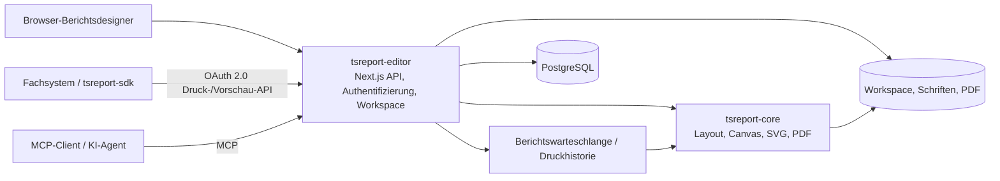

# tsreport-editor

[English](./README.md) | [日本語](./README.ja.md) | [简体中文](./README.zh-CN.md) | [繁體中文](./README.zh-TW.md) | [한국어](./README.ko.md) | [Tiếng Việt](./README.vi.md) | [ไทย](./README.th.md) | [Bahasa Indonesia](./README.id.md) | Deutsch | [Français](./README.fr.md) | [Español](./README.es.md) | [Português](./README.pt.md) | [العربية](./README.ar.md) | [עברית](./README.he.md)

`tsreport-editor` ist ein browserbasierter Berichtsdesigner und Berichtsserver, der [`tsreport-core`](https://www.npmjs.com/package/tsreport-core) als Layout- und Rendering-Engine verwendet.

Es ist nicht nur ein Bildschirm zum Entwerfen von Berichten. Ein einziger Server bietet die Verwaltung von `.report`-Vorlagen und Materialien, Vorschau mit echten Daten, PDF-Import, eine OAuth-2.0-Druck-API für externe Systeme, MCP für KI-Agenten, eine asynchrone Berichtswarteschlange sowie Druckprotokolle.

- **Berichtsdesigner** — Bearbeiten von Bändern, Text, Formen, Bildern, SVG, Tabellen, Unterberichten, Barcodes, Formeln usw. im Browser.
- **Übereinstimmung von Vorschau und PDF** — Editor, Druckvorschau und PDF-Ausgabe verwenden dasselbe Layout-Ergebnis und dieselbe Rendering-Implementierung von `tsreport-core`.
- **Mehrsprachigkeit und Schriftverwaltung** — Kontobezogene Schriftverwaltung, eingebettete Schriften, Umrisse, aus PDFs importierte Schriften sowie Satz von Japanisch, Chinesisch, Koreanisch, arabischer Schrift usw.
- **Berichts-API-Server** — Asynchroner Druck von durch öffentliche Tags fixierten Vorlagen mittels OAuth 2.0 Client Credentials.
- **MCP-Server** — Ermöglicht KI, Vorlagen zu lesen, zu bearbeiten, zu validieren, das Layout zu prüfen, PNG/PDF zu rendern, PDF-Originale zu importieren und Differenzen zu vergleichen.
- **Betrieb und Nachverfolgbarkeit** — API-Druckaufträge werden in einer Warteschlange verarbeitet, und PDF-Ausgaben aus Editor, API und MCP werden pro Konto in der Druckhistorie protokolliert.

## KI-gestütztes Berichtsdesign mit MCP

Die Videos zeigen, wie eine KI über MCP einen Bericht entwirft und anschließend die fertige Vorschau öffnet. Die englische Version demonstriert außerdem die Unterstützung mehrsprachiger Berichte.

| Englische Version — mehrsprachige Berichte | Japanische Version |
| --- | --- |
| [](https://youtu.be/CHsNew6yQr4) | [](https://youtu.be/0I3ljxLUbys) |

### Schriftverwaltung

Die Schriftverwaltung ermöglicht das Herunterladen von Google Fonts und das Hochladen eigener Schriftdateien.

[](https://youtube.com/shorts/fAUjfFqaVtY)

## Gesamtübersicht des Systems



`tsreport-core` ist eine reine TypeScript-Berichts-Engine ohne Laufzeitabhängigkeiten. `tsreport-editor` baut darauf Next.js, PostgreSQL, Authentifizierung, Dateiverwaltung, Warteschlangen und ein Admin-Panel auf. Da der Editor Argon2id für das Passwort-Hashing und `sharp` für die MCP-PNG-Erzeugung verwendet, wird der gesamte Editor-Server nicht als „frei von nativen Abhängigkeiten“ betrachtet.

## Wichtigste Design-Funktionen

- Bänder wie Title, Page Header, Column Header, Detail, Group Header/Footer, Summary, Page Footer, Last Page Footer, Background, No Data usw.
- Feststehender Text, Ausdrucksfelder, Linien, Rechtecke, Ellipsen, Vektorpfade, Bilder, SVG, Rahmen, Tabellen, Unterberichte, Barcodes, Formeln, Seitenumbrüche
- Darstellungsattribute einschließlich RGB, CMYK, Schmuckfarben, Farbverläufe, Transparenz, Clipping und Soft Mask
- Visuelle und JSON-Bearbeitung von `.report`, mehrere Tabs, Undo/Redo, Ebenen, Zoom, Druckvorschau
- Überprüfung von Feldern, Parametern, Ausdrücken und wiederholenden Detailzeilen mithilfe von JSON-Testdaten
- Hochpräziser Import von PDF-Seiten. Text, Vektoren, Bilder und eingebettete Schriften werden in editierbare Berichtselemente oder beibehaltene Darstellung umgewandelt
- Öffentliche Tags für Vorlagen. Trennung zwischen dem in Bearbeitung befindlichen Inhalt und der fixierten Version, die von externen APIs verwendet wird

## Schnellstart

### Voraussetzungen

- Docker und Docker Compose

Die veröffentlichten Pakete `tsreport-core` und `tsreport-react` werden gemäß Lockfile des Editors von npm installiert. Benachbarte Repository-Checkouts werden nicht verwendet.

Für die normale Entwicklung und Prüfung können npm-Befehle auch im hostseitigen `src/` ausgeführt werden. Docker bleibt davon getrennt: Abhängigkeiten werden beim Erstellen des Node.js-Images aus dem Lockfile installiert, beim Containerstart läuft kein `npm install` oder `npm ci`, und Compose Watch synchronisiert nur den Quellcode ohne das hostseitige `node_modules`.

### Start

```sh
cd ../tsreport-editor/server
docker compose up --build --watch
```

Beim Start im Hintergrund:

```sh
cd ../tsreport-editor/server
docker compose up -d --build
docker compose ps
docker compose logs -f tsreport_editor_node
```

Das Entwicklungs-`server/compose.yaml` legt den Compose-Projektnamen fest auf `tsreport-editor-dev` und trennt so den Container- und Netzwerk-Namespace von anderen Produkten auf demselben Host sowie vom Produktions-`tsreport-editor`-Projekt.

Zum Stoppen:

```sh
cd ../tsreport-editor/server
docker compose down
```

Führen Sie im normalen Betrieb, bei dem die Daten erhalten bleiben sollen, kein `down -v` aus und löschen Sie nicht die NFS-/DB-Verzeichnisse.

### Entwicklungsdienste und Ports

| Dienst | Rolle | Host-Seite |
| --- | --- | --- |
| `tsreport_editor_node` | Next.js Editor / REST-API | `http://localhost:52005` |
| `tsreport_editor_node` | Dedizierter MCP-Listener | `http://localhost:52006` |
| `tsreport_editor_node` | Workspace-Aktualisierungsbenachrichtigung | `52007` |
| `tsreport_editor_db` | PostgreSQL | `localhost:52437` |
| `tsreport_editor_cron` | Startet die Berichtswarteschlange im 10-Sekunden-Intervall | nur intern |
| `tsreport_editor_nginx` | HTTP-/HTTPS-Reverse-Proxy | `52085` / `52448` |

Öffnen Sie im Browser `http://localhost:52005` oder `https://localhost:52448`, das ein selbstsigniertes Zertifikat verwendet.

## Erster Login und erforderliche Sicherheitskonfiguration

Beim ersten Start erstellt die Anwendung unter DB-Sperre einmalig die Initialdaten des Schemas, Konten, Workspaces und Vorlagen für Regressionstests.

| Zweck | Login-ID | Anfangspasswort | Berechtigung |
| --- | --- | --- | --- |
| Erster Administrator | `admin` | `pass` | Administrator |
| Für Regressionstests | `test` | `pass` | Normaler Benutzer |

> **Wichtig:** Das Anfangspasswort ist ein öffentlich bekanntes Initialisierungs-Anmeldedatum. Ändern Sie es unbedingt vor der Inbetriebnahme. Da die aktuelle UI die Änderung beim ersten Login nicht automatisch erzwingt, muss der Betreiber selbst überprüfen, dass die Änderung durchgeführt wurde.

Führen Sie nach dem ersten Login über das Hamburger-Menü Folgendes aus:

1. Ändern Sie das Anfangspasswort von `admin` unter „Passwort ändern“.
2. Löschen Sie `test`, falls es in Ihrer Umgebung nicht für Regressionstests verwendet wird. Falls Sie es behalten, ändern Sie unbedingt das Passwort.
3. Erzeugen Sie für die beizubehaltenden Anfangskonten den MCP-Schlüssel in den „MCP-Einstellungen“ neu.
4. Löschen Sie den API-Client `test-report-client` für Regressionstests, oder setzen Sie Client Secret und Zugriffsberechtigungen neu.
5. Ändern Sie die DB-Anmeldedaten und den `REPORT_BATCH_TOKEN` in `server/node/.env` sowie der Produktions-`.env` gegenüber den Standardwerten.
6. Ersetzen Sie vor der externen Veröffentlichung das selbstsignierte Zertifikat von nginx durch ein offizielles Zertifikat und überprüfen Sie öffentliche Ports und Firewall.

Passwörter lokaler Konten werden mit Argon2id gehasht und in der DB gespeichert. Mindestens ein Konto muss als Administrator erhalten bleiben, auch `admin` selbst.

## Grundlegender Nutzungsablauf

1. Anmelden und den eigenen Workspace des Kontos öffnen.
2. Die für den Bericht benötigten Schriften unter „Schriftverwaltung“ registrieren.
3. Eine neue `.report`-Datei erstellen oder eine vorhandene `.report`/PDF-Datei öffnen.
4. Bänder und Elemente platzieren und bei Bedarf Test-JSON-Daten angeben.
5. Mehrere Seiten, Detailüberlauf und die letzte Seite in der Editor-Ansicht und der Druckvorschau überprüfen.
6. Ein PDF ausgeben. Die Ausgabe wird in der Druckhistorie des eigenen Kontos protokolliert.
7. Bei Nutzung durch ein externes System einen öffentlichen Tag erstellen sowie einen API-Client und Zugriffsberechtigungen einrichten.

Ein normales Speichern aktualisiert die Bearbeitungsdatei im Workspace. Da ein öffentlicher Tag den Vorlagen-JSON zu diesem Zeitpunkt fixiert, ändert ein späteres normales Speichern das Ergebnis des API-Drucks für einen bestehenden Tag nicht. Um Änderungen extern zu veröffentlichen, erstellen Sie einen neuen Tag oder aktualisieren Sie explizit den Ziel-Tag.

## Versionsverwaltung von Berichtsvorlagen mittels öffentlicher Tags

Ein öffentlicher Tag ist nicht einfach ein Flag, das die in Bearbeitung befindliche `.report`-Datei nur auf einen extern veröffentlichten Zustand umschaltet. Es ist ein **Mechanismus, der den Inhalt einer Berichtsvorlage als Version speichert und es ermöglicht, diese Version über die externe API anhand eines Namens anzugeben**.

Zum Beispiel kann `invoice.report` im Workspace weiterhin bearbeitet werden, nachdem der aktuelle Inhalt einer Rechnungsvorlage als `v1` veröffentlicht wurde. Änderungen durch normales Speichern werden nicht automatisch in `v1` übernommen. Wenn der geänderte Inhalt als `v2` veröffentlicht wird, kann das externe System die zu verwendende Version explizit über die API-URL auswählen.

```text
invoice.report (Arbeitsversion in Bearbeitung)
  ├─ v1 (veröffentlichtes Template-JSON)
  └─ v2 (nach der Änderung veröffentlichtes Template-JSON)

POST /api/report/print/{workspaceKey}/invoice.report/v1
POST /api/report/print/{workspaceKey}/invoice.report/v2
```

Diese Trennung ermöglicht folgenden Betrieb:

- Während ein neues Berichtslayout bearbeitet und validiert wird, kann das Fachsystem weiterhin das bestehende `v1` verwenden.
- Der Zielaufruf kann passend zum Umstellungszeitpunkt der API-Nutzung von `v1` auf `v2` geändert werden.
- Mehrere Versionen können nebeneinander existieren, wobei jedes angebundene System eine andere Version verwenden kann.
- Bei entdeckten Problemen kann die API-Angabe auf einen früheren Tag zurückgesetzt werden, ohne die Vorlagendatei zurückzuschreiben.

Beim Erstellen eines neuen Tags wird der Vorlagen-JSON zu diesem Zeitpunkt gespeichert. Derselbe Tag kann auch explizit aktualisiert werden, wobei sich in diesem Fall auch der Inhalt ändert, auf den dieselbe API-URL verweist. Für einen Betrieb, bei dem Reproduzierbarkeit und schrittweise Migration wichtig sind, erstellen Sie neue Tags wie `v1`, `v2` oder `2026-07`, anstatt bestehende Tags zu überschreiben.

Was ein öffentlicher Tag fixiert, ist der Vorlagen-JSON. `rows` und `parameters` beim API-Aufruf sind nicht Teil der Version und werden bei jeder Druckanfrage angegeben. Zudem bedeutet „öffentlich“ hier nicht, dass es anonym im Internet veröffentlicht wird. Um es tatsächlich über die API zu nutzen, müssen der OAuth-2.0-Scope, die Zugriffsberechtigungen des API-Clients und die Workspace-Berechtigungen des Besitzerbenutzers alle erfüllt sein.

## Benutzer, Workspaces und Freigabe

### Benutzerverwaltung

- Jedes Konto verfügt über genau einen Workspace.
- Ein Workspace wird durch eine unveränderliche UUID `workspaceKey` identifiziert.
- Administratoren können Benutzer erstellen, Anzeigename, Login-ID, Berechtigungen, MCP-Nutzungsmöglichkeit und Passwort verwalten sowie Systemeinstellungen vornehmen.
- Auch Administratoren können nicht bedingungslos den Workspace eines anderen Kontos einsehen. Berichtsdaten sind mandantengetrennt.
- Das Löschen eines Benutzers ist eine physische Löschung. Zugehörige Daten wie Workspace, Schriften, Freigaben, API-Clients, Tokens und Druckhistorie werden gelöscht und können nicht wiederhergestellt werden.

### Ordnerfreigabe

Sie können nicht den gesamten Workspace, sondern nur benötigte Ordner für ein anderes Konto freigeben.

- Das Ziel der Freigabe wird über den `workspaceKey` des Empfängers angegeben.
- Lese- und Schreibzugriff können separat erlaubt werden.
- Lesefreigabe erlaubt das Referenzieren von Vorlagen und Materialien, Schreibfreigabe erlaubt gemeinsames Bearbeiten.
- Das Freigabeziel kann eine erhaltene Freigabe wieder aufheben.
- Derselbe effektive Zugriffsbereich gilt auch für API und MCP.

Wenn Editor oder MCP einen Workspace aktualisieren, wird das Aktualisierungsereignis an andere Editor-Tabs gemeldet. Ohne ungespeicherte Änderungen wird neu geladen; bei ungespeicherten Änderungen werden die lokalen Bearbeitungen geschützt und eine Warnung angezeigt.

Freigabe, API-Berechtigungen und öffentliche Tags haben unterschiedliche Zwecke.

| Konzept | Ziel | Rolle |
| --- | --- | --- |
| Ordnerfreigabe | zwischen Konten | Erlaubt Lese-/Schreibzugriff für menschliche Editor-Bedienung und für MCP, das als dieses Konto agiert |
| API-Zugriffsberechtigung | API-Client | Beschränkt `workspaceKey` und Ordner, die ein externes System referenzieren kann |
| Öffentlicher Tag | Version einer `.report`-Datei | Fixiert den Vorlageninhalt, der für den API-Druck verwendet wird |

Auch wenn nur eine API-Zugriffsberechtigung hinzugefügt wird, kann sie nicht genutzt werden, wenn der Besitzerbenutzer selbst keinen Zugriff auf den Zielordner hat. Umgekehrt wird durch eine reine Ordnerfreigabe nichts an der externen API veröffentlicht.

## Hinzufügen und Verwalten von Schriften

Die „Schriftverwaltung“ im Hamburger-Menü steht allen Benutzern zur Verfügung. Schriften werden pro Konto unter `/var/nfs/fonts/{accountId}/` gespeichert und sind von anderen Konten aus nicht sichtbar.

### Hochladen

1. Öffnen Sie „Schriftverwaltung“.
2. Fügen Sie Dateien per Dateiauswahl oder Drag & Drop hinzu.
3. Wählen Sie die in der Liste angezeigte Schrift-ID im `fontFamily`-Feld eines Textelements aus.

Unterstützte Formate sind TTF, OTF, TTC, OTC, WOFF und WOFF2. Das App-seitige Limit für eine einzelne Datei beträgt 256 MiB. Sie können mehrere Systemschriften wie z. B. aus `/System/Library/Fonts` unter macOS gemeinsam auswählen und registrieren. Schriften des Host-Betriebssystems werden weder implizit gelesen noch werden Schriften im Betriebssystem installiert.

Duplikate werden wie folgt beurteilt:

- Gleiche Schrift-ID, identische Binärdatei: als erfolgreicher erneuter Versuch eines Massen-Uploads behandelt
- Gleiche Schrift-ID, unterschiedliche Binärdatei: als ID-Konflikt abgelehnt
- Unterschiedliche Schrift-ID, identische Binärdatei: als Duplikat unter Angabe der bestehenden ID abgelehnt
- Nur Metainformationen wie Family-Name oder PostScript-Name stimmen überein: kann als eigenständige Schrift registriert werden, wenn die Binärdatei unterschiedlich ist

Die Inhaltsübereinstimmung wird nicht nur anhand von Metainformationen oder Hashwerten, sondern durch einen vollständigen Byte-für-Byte-Vergleich nach übereinstimmender Dateigröße festgestellt.

### Google Fonts und aus PDFs importierte Schriften

Unter „Download Google Fonts“ können Sie eine Sprache auswählen und Kandidaten in den Kontobereich herunterladen. Voraussetzung ist eine Verbindung zu einem externen Netzwerk.

Beim PDF-Import werden wiederverwendbare eingebettete Schriften als Anwendungsschriften innerhalb des Kontos registriert. Ist kein Schriftprogramm vorhanden, werden Name und Stil anhand der Kontoschriften abgeglichen und Kandidaten sowie Warnungen angezeigt.

## Nutzung der externen Druck-API

Die externe API verwendet nicht das Cookie für den Bildschirm-Login, sondern das Bearer Token von OAuth 2.0 Client Credentials. Für die Nutzung sind folgende drei Punkte erforderlich:

1. **Öffentlicher Tag** — Erstellen Sie eine fixierte Version der `.report`-Datei, die über die API verwendet wird.
2. **API-Client** — Erstellen Sie unter „API-Clients“ im Hamburger-Menü Client ID, Client Secret und Scopes.
3. **Zugriffsberechtigung** — Registrieren Sie `workspaceKey` und Ordner, die der Client nutzen kann.

Verfügbare Scopes sind `report:print`, `report:status`, `report:download` und `report:preview`. Der effektive Bereich eines API-Clients ist die Schnittmenge aus „Zugriffsberechtigungen des Clients“ und „Workspace/freigegebenen Ordnern, auf die der Besitzerbenutzer selbst zugreifen kann“.

### Ablauf der REST-API

```text
POST /api/oauth/token
  grant_type=client_credentials
  -> access_token

POST /api/report/print/{workspaceKey}/{templatePath}/{tag}
  -> { key }

GET /api/report/status/{key}
  -> queued | processing | completed | error

GET /api/report/download/{key}
  -> application/pdf
```

Beispiel:

```sh
BASE_URL=http://localhost:52005
CLIENT_ID=test-report-client
CLIENT_SECRET=test-report-secret

TOKEN=$(curl -sS -u "$CLIENT_ID:$CLIENT_SECRET" \
  -d grant_type=client_credentials \
  -d 'scope=report:print report:status report:download' \
  "$BASE_URL/api/oauth/token" | jq -r .access_token)

curl -sS \
  -H "Authorization: Bearer $TOKEN" \
  -H 'Content-Type: application/json' \
  -d '{"rows":[{"item":"seed"}],"parameters":{}}' \
  "$BASE_URL/api/report/print/00000000-0000-0000-0000-000000000002/invoice.report/v1"
```

Auch wenn `templatePath` ein `/` enthält, wird das letzte Segment danach als Tag aufgelöst. Status und Download können nur von demselben API-Client abgerufen werden, der die Druckanfrage erstellt hat.

### tsreport-sdk

Mit [`tsreport-sdk`](../tsreport-sdk) können Token-Abruf, Einreihen in die Warteschlange, Polling und PDF-Abruf über eine einzige TypeScript-API abgewickelt werden.

```ts
import { TsreportClient } from 'tsreport-sdk'

const client = new TsreportClient({
    baseUrl: 'https://reports.example.com',
    clientId: process.env.REPORT_CLIENT_ID!,
    clientSecret: process.env.REPORT_CLIENT_SECRET!
})

const pdf = await client.printAndDownload(
    '00000000-0000-0000-0000-000000000002',
    'orders/invoice.report',
    'v1',
    { rows: [{ orderId: 42 }], parameters: {} }
)
```

Betten Sie das Client Secret nicht in den Browser ein. Bei Nutzung aus einer Browser-Anwendung leiten Sie den Aufruf über ein authentifiziertes Backend Ihres eigenen Systems weiter. Für ein sicheres Weiterleiten der Vorschau-Material-API kann `createPreviewEndpoint` aus `tsreport-sdk/server` verwendet werden.

## Berichtswarteschlange und Druckprotokolle

Druckanfragen von der API werden mit Status `queued` in `PrintRequest` in der DB registriert. `tsreport_editor_cron` startet im 10-Sekunden-Intervall den authentifizierten Batch-Endpunkt und überführt den Status von `queued` → `processing` nach `completed` oder `error`. Gleichzeitige Ausführungen werden durch DB-Sperren serialisiert.

Erzeugte PDFs werden unter `/var/nfs/report-pdf` gespeichert. Im Druckhistorie-Bildschirm können für das eigene Konto folgende Informationen überprüft werden:

- Ausführungsdatum und -zeit
- Ausführungsweg: `editor` / `api` / `mcp`
- Workspace, Vorlage, Format
- Status abgeschlossen/Fehler sowie Fehlergrund
- Erneuter Download eines abgeschlossenen PDFs

Vom Editor erzeugte PDFs werden über den Browser an die Historie-API gemeldet. Auch `render_report(format="pdf")` von MCP wird in der Historie protokolliert. Die Historie ist kontogetrennt; auch Administratoren können die Historie eines anderen Kontos nicht einsehen.

Sichern Sie im Betrieb die DB und `server/nfs` als denselben Wiederherstellungspunkt. Wenn nur Historieneinträge oder nur PDF-Dateien wiederhergestellt werden, stimmen Protokoll und Ergebnisse nicht mehr überein. Legen Sie zudem die Aufbewahrungsdauer und Festplattenüberwachung entsprechend dem Ausgabevolumen betrieblich fest.

## Nutzung von MCP

MCP ist unabhängig vom OAuth-Client der externen Druck-API. Die Authentifizierung erfolgt über die Login-ID und den MCP-Schlüssel jedes Benutzers, und der Betrieb erfolgt mit denselben Workspace-/Freigabeberechtigungen wie dieser Benutzer.

### Aktivierung und Anmeldedaten

1. Öffnen Sie „MCP-Einstellungen“ im Hamburger-Menü.
2. Aktivieren Sie die eigene MCP-Nutzung.
3. Kopieren Sie den MCP-Schlüssel. Erzeugen Sie den anfänglichen Schlüssel vor der Inbetriebnahme neu.
4. Administratoren können auf demselben Bildschirm MCP insgesamt EIN/AUS schalten und einen dedizierten Port festlegen.

Normalerweise wird dasselbe `http://localhost:52005/api/mcp` wie für Next.js verwendet. In der Entwicklungsumgebung steht auch der dedizierte Listener `http://localhost:52006` zur Verfügung. Konfigurieren Sie im MCP-Client die Streamable-HTTP-URL sowie eine der folgenden Authentifizierungsmethoden:

- `x-mcp-account: <Login-ID>` und `x-mcp-key: <MCP-Schlüssel>`
- `Authorization: Bearer <Login-ID>:<MCP-Schlüssel>`

Die Einrichtungsanleitung kann ohne Authentifizierung abgerufen werden.

```sh
curl http://localhost:52005/api/mcp
```

Beispiel zur Überprüfung der Tool-Liste:

```sh
curl -sS http://localhost:52005/api/mcp \
  -H 'Content-Type: application/json' \
  -H 'x-mcp-account: admin' \
  -H 'x-mcp-key: <neu generierter MCP-Schlüssel>' \
  -d '{"jsonrpc":"2.0","id":1,"method":"tools/list","params":{}}'
```

### MCP-Tools

| Kategorie | Tools |
| --- | --- |
| Einführung | `get_started` |
| Entdeckung | `list_workspaces`, `list_templates`, `list_workspace_files`, `list_fonts` |
| Vorlage | `get_template`, `get_template_schema`, `validate_template`, `save_template`, `update_template_elements` |
| Material | `save_workspace_file`, `delete_workspace_file` |
| Validierung/Ausgabe | `layout_report`, `render_report`, `compare_reports` |
| Import von Originalen | `import_pdf` |

Die empfohlene Arbeitsschleife lautet wie folgt:

1. `get_started` und `get_template_schema` lesen.
2. Mit `list_workspaces`, `list_templates`, `list_workspace_files` und `list_fonts` die verfügbaren Ressourcen prüfen.
3. Eine Vorlage erzeugen oder mit `get_template` abrufen.
4. Struktur und Ausdrücke mit `validate_template` validieren.
5. Mit `layout_report` absolute Koordinaten, Seitenzahl und Elemente außerhalb des Bereichs numerisch prüfen.
6. Mit `render_report(format="png")` visuell überprüfen.
7. Mit `save_template` oder `update_template_elements` speichern.
8. Vor und nach der Änderung mit `compare_reports` vergleichen, um unbeabsichtigte Verschiebungen auszuschließen.

Liegt ein Original-PDF vor, gehen Sie nicht durch visuelle Nachbildung vor, sondern in der Reihenfolge `save_workspace_file` → `import_pdf` → Anpassung von Ausdrücken und Bändern → `layout_report`/`render_report`.

## Sprachen und optionale externe Anbindungen

Die Editor-UI kann in Japanisch, Englisch, vereinfachtem Chinesisch, Koreanisch, traditionellem Chinesisch, Vietnamesisch, Thailändisch, Indonesisch, Deutsch, Französisch, Spanisch, Portugiesisch, Arabisch und Hebräisch ausgewählt werden. Bei Arabisch und Hebräisch wird auch die UI auf RTL umgestellt. Dies schränkt nicht die im Bericht selbst verwendbaren Schriftsysteme ein.

Administratoren können externe Anmeldung über Google/Microsoft konfigurieren. Wenn die externe Anmeldung nicht aktiviert wird, kann der Betrieb ausschließlich mit durch Argon2id geschützten lokalen Konten erfolgen.

Bei Nutzung von KI-Unterstützungsfunktionen registrieren Sie API-Schlüssel und Modell in den Systemeinstellungen der DB. In den Anfangswerten ist kein gültiger externer API-Schlüssel enthalten. Speichern Sie geheime Werte nicht in der Quelle, in `.report`-Dateien, im Workspace oder in der README.

## Initialdaten und Regressionsumgebung

Beim ersten Start werden folgende Elemente erstellt:

- Die Konten `admin` und `test` sowie feste `workspaceKey`-Werte
- Der API-Client `test-report-client` für Regressionstests im Besitz von `test`
- `invoice.report`, `sub.report` und `assets/logo.png` im Workspace von `test`
- Der öffentliche Tag `v1` für `invoice.report`
- Eine Lese-/Schreibfreigabe des Ordners `assets` von `test` an `admin`

Feste Schlüssel:

- `admin`: `00000000-0000-0000-0000-000000000001`
- `test`: `00000000-0000-0000-0000-000000000002`

Diese werden für die echten Server-Regressionstests von `tsreport-editor`, `tsreport-sdk` und `tsreport-react` verwendet. Ändern oder löschen Sie im Produktivbetrieb unbedingt die zuvor genannten Anfangsanmeldedaten.

### Zurücksetzen der Entwicklungs-DB auf den Anfangszustand

Um die PostgreSQL-Instanz der Entwicklungsumgebung vollständig neu zu erstellen, stoppen Sie den Container, löschen Sie anschließend `server/db/pgdata/data` und starten Sie neu.

```sh
cd ../tsreport-editor/server
docker compose down
rm -rf db/pgdata/data
docker compose up --build --watch
```

Beim Neustart wird das PostgreSQL-DDL angewendet, und beim Start der Anwendung werden die DB-Initialdaten wie Anfangskonten, API-Clients und öffentliche Tags neu erstellt. Fehlende Workspace-Dateien für Regressionstests werden nur bei Bedarf nachgefüllt. Löschen Sie `pgdata` nicht, während der DB-Container läuft.

Dieser Vorgang initialisiert nur PostgreSQL. Workspace, Schriften, erzeugte PDFs usw., die in `server/nfs` gespeichert sind, werden dabei nicht gelöscht. Wenn sowohl DB als auch NFS auf den Anfangszustand zurückgesetzt werden müssen, verwenden Sie „Werksreset“ im Administrator-Menü.

„Werksreset“ löscht alle DB-Tabellen, Workspaces und Berichtsausgaben und erstellt den Zustand des ersten Starts neu. Dies kann nicht rückgängig gemacht werden. Schriften, Zertifikate und Punktdateien wie `.gitignore` sind davon ausgenommen.

## Speicherorte der Daten

| Daten | Im Container | Entwicklungs-Host-Seite |
| --- | --- | --- |
| PostgreSQL | `/var/pgdata/data` | `server/db/pgdata` |
| Workspace | `/var/nfs/workspaces/{workspaceKey}` | `server/nfs/workspaces` |
| Kontoschriften | `/var/nfs/fonts/{accountId}` | `server/nfs/fonts` |
| Erzeugte PDFs | `/var/nfs/report-pdf` | `server/nfs/report-pdf` |
| nginx-Logs | `/var/log/nginx` | `logs/nginx` |

Export/Import der Anwendungsdaten kann über das Administrator-Menü ausgeführt werden. Verlassen Sie sich für die Disaster Recovery der gesamten Umgebung nicht allein auf diese Funktion, sondern halten Sie auch konsistente Backups von PostgreSQL und NFS bereit.

## Produktions-Build und -Start

Auch Produktions-Build und -Start setzen Docker Compose voraus. `build.sh`, `build_boot.sh`, `boot.sh`, `boot_db.sh`, `boot_web.sh` und `build_boot_web.sh` sind dünne Wrapper, die Docker Compose aufrufen. Es handelt sich nicht um ein Verfahren, bei dem Node.js-Abhängigkeiten auf dem Host installiert und `server.js` direkt dauerhaft betrieben wird.

### 1. Vorbereitung

`tsreport-core` und `tsreport-react` werden in den von `src/package-lock.json` festgelegten Versionen von npm wiederhergestellt.

```sh
cd ../tsreport-editor/server
```

Bearbeiten Sie die Produktionskonfiguration.

- `boot/web/.env`: DB-Verbindungsinformationen und `REPORT_BATCH_TOKEN`
- `boot/compose.yaml`: PostgreSQL-Konfiguration für die Konfiguration mit einem einzelnen Server
- `boot/db/compose.yaml`: PostgreSQL-Konfiguration für die getrennte DB-/Web-Konfiguration
- `nginx/cert`: offizielles TLS-Zertifikat
- `nginx/conf`: öffentlicher Hostname, Weiterleitungsziel, erforderliche Zugriffskontrolle

Stellen Sie sicher, dass `DB_PASS` in `boot/web/.env` mit dem `DB_PASS` in der Compose-Konfiguration übereinstimmt, die Sie verwenden. Web und cron verwenden denselben `REPORT_BATCH_TOKEN` aus `boot/web/.env`. Die Werte im Repository dienen der lokalen Ausführung und müssen im Produktivbetrieb unbedingt geändert werden.

### 2. Produktions-Build

```sh
cd ../tsreport-editor/server
./build.sh
```

`build.sh` stellt keine Node.js-Abhängigkeiten auf der Host-Seite wieder her. Es synchronisiert `src` nach `server/build/src`, führt den Produktions-Build von Next.js in einer isolierten Docker-Build-Umgebung aus und platziert die Standalone-Artefakte wie folgt:

```text
server/boot/web/dist/standalone/
  ├─ server.js
  ├─ .next/
  ├─ node_modules/
  ├─ public/
  └─ seed/
```

Der Build umfasst die TypeScript-Prüfung und die Production-Compilation von Next.js. Starten Sie erst, nachdem Sie überprüft haben, dass der Befehl normal beendet wurde und `boot/web/dist/standalone/server.js` existiert.

### 3. Starten des bereits gebauten Servers (ohne erneuten Build)

Wenn `./build.sh` erfolgreich war und `boot/web/dist/standalone/server.js` existiert, kann der Produktivserver gestartet werden, ohne den Production-Build von Next.js zu wiederholen.

Um DB und Web auf demselben Server zu starten:

```sh
cd ../tsreport-editor/server
./boot.sh
```

Um DB-Server und Web-Server zu trennen, führen Sie den jeweiligen Befehl auf dem DB-Host und dem Web-Host aus.

```sh
# DB-Host
cd ../tsreport-editor/server
./boot_db.sh

# Web-Host
cd ../tsreport-editor/server
./boot_web.sh
```

`boot.sh` und `boot_web.sh` mounten das bestehende `boot/web/dist/standalone` in den Node.js-Container und starten es mit PM2. Das Docker-Runtime-Image wird bei Bedarf von Compose aktualisiert, aber der Production-Build von Next.js wird dabei nicht ausgeführt. Um Quelländerungen zu übernehmen, führen Sie zuvor erneut `./build.sh` aus.

### 4-A. Konfiguration mit einem einzelnen Server

Eine Konfiguration, bei der DB, Node.js, der Cron-Job für die Berichtswarteschlange und nginx auf derselben Serverinstanz laufen. Vom Build bis zum dauerhaften Start wird alles mit einem einzigen Befehl ausgeführt.

```sh
cd ../tsreport-editor/server
./build_boot.sh
```

Wenn bereits gebaut wurde und nur der Start erfolgen soll, führen Sie `./boot.sh` aus. `boot.sh` verwendet `boot/compose.yaml` und startet alle folgenden Dienste im Hintergrund als Projekt `tsreport-editor`, das nicht mit Compose-Projekten anderer Produkte kollidiert.

| Dienst | Rolle | Öffentlicher Port |
| --- | --- | --- |
| `tsreport_editor_db` | PostgreSQL | `52437` |
| `tsreport_editor_node` | Bereits gebautes Next.js Standalone, MCP, Aktualisierungsbenachrichtigung | `52005`, `52006`, `52007` |
| `tsreport_editor_cron` | Startet die asynchrone Berichtswarteschlange im 10-Sekunden-Intervall | keiner |
| `tsreport_editor_nginx` | HTTP-/HTTPS-Reverse-Proxy | `52085`, `52448` |

Der Web-Container mountet nicht den Quellbaum, sondern nur `boot/web/dist/standalone` nach `/var/node` und führt `server.js` im Cluster-Modus von PM2 aus. Änderungen an `src` während des laufenden Betriebs werden nicht auf den Produktivserver übertragen. Um Änderungen zu übernehmen, führen Sie erneut `./build.sh` aus und starten Sie anschließend den Webdienst neu.

Startüberprüfung:

```sh
docker compose --project-name tsreport-editor -f boot/compose.yaml ps
docker compose --project-name tsreport-editor -f boot/compose.yaml logs -f tsreport_editor_node
```

Stoppen:

```sh
docker compose --project-name tsreport-editor -f boot/compose.yaml down
```

### 4-B. Getrennte Konfiguration von DB-Server und Web-Server

Eine Konfiguration, bei der PostgreSQL auf einem dedizierten DB-Server läuft und Node.js, der Cron-Job für die Berichtswarteschlange sowie nginx auf einem Web-Server laufen. Legen Sie dieses Repository auf beiden Hosts ab und führen Sie auf dem DB-Host und dem Web-Host jeweils einen Befehl aus.

Starten Sie auf dem DB-Host nur `boot/db/compose.yaml`.

```sh
cd ../tsreport-editor/server
./boot_db.sh
```

Ändern Sie `boot/web/.env` auf dem Web-Host auf den privaten DNS-Namen oder die IP-Adresse des DB-Hosts sowie den vom DB-Host veröffentlichten Port.

```dotenv
DB_HOST=db.internal.example
DB_PORT=52437
DB_NAME=TSREPORT_EDITOR_DB
DB_USER=postgres
DB_PASS=DB-Passwort-für-die-Produktion
REPORT_BATCH_TOKEN=gemeinsames-Secret-für-die-Produktion
```

Führen Sie auf dem Web-Host den Production-Build und den dauerhaften Start des Web-seitigen Dienstes mit einem einzigen Befehl aus.

```sh
cd ../tsreport-editor/server
./build_boot_web.sh
```

Wenn bereits gebaut wurde und nur der Start des Web-seitigen Dienstes erfolgen soll, führen Sie `./boot_web.sh` aus. Das Web-seitige `boot/web/compose.yaml` startet nur Node.js, cron und nginx und erstellt keinen PostgreSQL-Container.

Startüberprüfung für die getrennte Konfiguration:

```sh
# DB-Host
docker compose --project-name tsreport-editor-db -f boot/db/compose.yaml ps
docker compose --project-name tsreport-editor-db -f boot/db/compose.yaml logs -f tsreport_editor_db

# Web-Host
docker compose --project-name tsreport-editor-web -f boot/web/compose.yaml ps
docker compose --project-name tsreport-editor-web -f boot/web/compose.yaml logs -f tsreport_editor_node
```

Stoppen der getrennten Konfiguration:

```sh
# Web-Host
docker compose --project-name tsreport-editor-web -f boot/web/compose.yaml down

# DB-Host
docker compose --project-name tsreport-editor-db -f boot/db/compose.yaml down
```

Veröffentlichen Sie `52437` der DB nicht direkt im Internet, sondern erlauben Sie ihn nur innerhalb eines privaten Netzwerks, das vom Web-Host aus erreichbar ist. Der `DB_PASS` in `boot/db/compose.yaml` auf der DB-Host-Seite und der `DB_PASS` in `boot/web/.env` auf der Web-Seite müssen denselben Wert haben. Workspace, Schriften und erzeugte PDFs werden in `server/nfs` auf der Web-Host-Seite gespeichert; ein gemeinsames Dateisystem mit dem DB-Host ist nicht erforderlich.

### 5. Gemeinsame Betriebsüberprüfung

Öffnen Sie im Browser `https://<Web-Host>:52448` oder `http://<Web-Host>:52005`. Bei Nutzung der externen Druck-API überprüfen Sie auch, dass `tsreport_editor_cron` „Up“ ist.

Bei normalem Stopp/Neustart bleiben `server/db/pgdata` und `server/nfs` auf der Web-Host-Seite erhalten. Nur wenn eine DB-Initialisierung erforderlich ist, folgen Sie den zuvor beschriebenen Initialisierungsschritten und löschen Sie `db/pgdata/data`, nachdem Sie den DB-Dienst gestoppt haben.

Überprüfen Sie vor der öffentlichen Freigabe im Produktivbetrieb mindestens Folgendes:

- Anfangsbenutzer, MCP-Schlüssel und API-Client für Regressionstests wurden geändert oder gelöscht
- DB-Passwort und `REPORT_BATCH_TOKEN` wurden geändert
- Ein offizielles TLS-Zertifikat wurde eingerichtet
- `/api/report/batch/process` wird nicht ohne Authentifizierung öffentlich zugänglich gemacht
- Es gibt Backups und Kapazitätsüberwachung für DB, Workspace, Schriften und erzeugte PDFs
- Benötigte Schriften und öffentliche Tags sind für die Zielkonten registriert
- Editor, Vorschau und API-Druck wurden mit einem mehrseitigen Bericht überprüft, der echten Daten entspricht

## Umgebungsvariablen

Die Anwendungskonfiguration liegt in der Entwicklung in `server/node/.env`, im Produktivbetrieb in `server/boot/web/.env`.

| Variable | Beschreibung | Entwicklungs-Standardwert |
| --- | --- | --- |
| `DB_HOST` | PostgreSQL-Host | `172.31.0.30` |
| `DB_PORT` | PostgreSQL-Port | `15432` |
| `DB_NAME` | DB-Name | `TSREPORT_EDITOR_DB` |
| `DB_USER` | DB-Benutzer | `postgres` |
| `DB_PASS` | DB-Passwort | `postgres1234` |
| `REPORT_BATCH_TOKEN` | Gemeinsames Geheimnis für den Batch-Start | `tsreport-report-batch-local` |
| `WORKSPACES_ROOT` | Workspace-Wurzelverzeichnis | `/var/nfs/workspaces` |
| `NEXT_TELEMETRY_DISABLED` | Deaktivierung der Next.js-Telemetrie | `1` |

Der gesamte Aktivierungsstatus von MCP und der dedizierte Port werden als Systemeinstellung in der DB verwaltet und über das Admin-Panel geändert. Auch die OAuth-Konfiguration für externe Anmeldung und optionale KI-Unterstützungseinstellungen werden über das Admin-Panel/SystemProperty verwaltet; schreiben Sie geheime Werte nicht in die README oder den Quellcode.

## Entwicklung und Verifikation

```sh
cd ../tsreport-editor

docker compose -f server/compose.yaml exec tsreport_editor_node npx tsc --noEmit
docker compose -f server/compose.yaml exec tsreport_editor_node npm test
docker compose -f server/compose.yaml exec \
  -e TSREPORT_EDITOR_LIVE_BASE=http://localhost:3000 \
  tsreport_editor_node npm run test:live

cd server
./build.sh
```

Entwicklung, Tests und Produktions-Builds stellen `tsreport-core` und `tsreport-react` von npm wieder her. Ein Checkout benachbarter Repositorys ist nicht erforderlich.

## Repository-Struktur

| Pfad | Inhalt |
| --- | --- |
| `src/` | Next.js Editor, REST-API, MCP, Serverlogik |
| `tests/` | Unit-, Integrations- und echte Server-Regressionstests |
| `server/` | Docker-Entwicklung, Build, Produktions-Startkonfiguration |
| `cli/` | Hilfsskripte |

Verwandte Repositories:

| Repository | Inhalt |
| --- | --- |
| [`tsreport-core`](https://github.com/pontasan/tsreport-core) | Reine TypeScript-Engine für Berichtslayout, Rendering, PDF und Schriften |
| [`tsreport-editor`](https://github.com/pontasan/tsreport-editor) | Dieser browserbasierte Berichtsdesigner und Berichtsserver |
| [`tsreport-sdk`](https://github.com/pontasan/tsreport-sdk) | Abhängigkeitsfreies TypeScript-SDK für die Druck-/Vorschau-API |
| [`tsreport-react`](https://github.com/pontasan/tsreport-react) | React-Vorschau-UI, die `tsreport-core` verwendet |

## Lizenz

tsreport-editor kann nach Wahl des Nutzers unter der [MIT License](./LICENSE-MIT) oder der [Apache License 2.0](./LICENSE-APACHE) verwendet werden (SPDX: `MIT OR Apache-2.0`).
