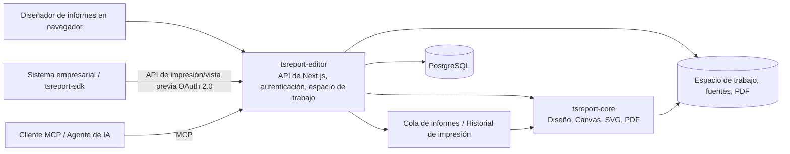

# tsreport-editor

[English](./README.md) | [日本語](./README.ja.md) | [简体中文](./README.zh-CN.md) | [繁體中文](./README.zh-TW.md) | [한국어](./README.ko.md) | [Tiếng Việt](./README.vi.md) | [ไทย](./README.th.md) | [Bahasa Indonesia](./README.id.md) | [Deutsch](./README.de.md) | [Français](./README.fr.md) | Español | [Português](./README.pt.md) | [العربية](./README.ar.md) | [עברית](./README.he.md)

`tsreport-editor` es un diseñador de informes y servidor de informes basado en navegador que utiliza [`tsreport-core`](https://www.npmjs.com/package/tsreport-core) como motor de diseño y renderizado.

No es solo una pantalla para diseñar informes. Proporciona en un único servidor la gestión de plantillas `.report` y materiales, vistas previas con datos reales, importación de PDF, una API de impresión OAuth 2.0 para sistemas externos, MCP para agentes de IA, una cola asíncrona de informes y un registro de auditoría de impresión.

- **Diseñador de informes** — edite bandas, texto, figuras, imágenes, SVG, tablas, subinformes, códigos de barras, fórmulas, etc. en el navegador.
- **Coherencia entre vista previa y PDF** — el Editor, la vista previa de impresión y la salida en PDF utilizan el mismo resultado de diseño y la misma implementación de renderizado de `tsreport-core`.
- **Operación multilingüe y de fuentes** — gestión de fuentes por cuenta, fuentes incrustadas, contornos, fuentes importadas de PDF, y composición tipográfica para japonés, chino, coreano, escritura árabe, etc.
- **Servidor de API de informes** — imprime de forma asíncrona, mediante OAuth 2.0 Client Credentials, plantillas fijadas con etiquetas publicadas.
- **Servidor MCP** — permite que la IA lea, edite, valide y verifique el diseño de plantillas, renderice PNG/PDF, importe PDF originales y compare diferencias.
- **Operación y auditoría** — las impresiones por API se procesan en cola, y las salidas en PDF del Editor, la API y el MCP se registran en un historial de impresión por cuenta.

## Diseño de informes con IA mediante MCP

Los vídeos muestran cómo la IA diseña un informe mediante MCP y abre la vista previa final. La versión en inglés también demuestra la compatibilidad con informes multilingües.

| Versión en inglés — informes multilingües | Versión en japonés |
| --- | --- |
| [](https://youtu.be/CHsNew6yQr4) | [](https://youtu.be/0I3ljxLUbys) |

### Gestión de fuentes

La gestión de fuentes permite descargar Google Fonts y cargar archivos de fuentes propios.

[](https://youtube.com/shorts/fAUjfFqaVtY)

## Panorama general del sistema



`tsreport-core` es un motor de informes en TypeScript puro, sin dependencias de runtime. `tsreport-editor` construye sobre él Next.js, PostgreSQL, autenticación, gestión de archivos, colas y una pantalla de administración. Dado que el lado del Editor utiliza Argon2id para el hash de contraseñas y `sharp` para la generación de PNG en el MCP, no consideramos que todo el servidor Editor tenga "cero dependencias nativas".

## Principales funciones de diseño

- Bandas como Title, Page Header, Column Header, Detail, Group Header/Footer, Summary, Page Footer, Last Page Footer, Background, No Data, etc.
- Texto fijo, campos de expresión, líneas, rectángulos, elipses, rutas vectoriales, imágenes, SVG, marcos, tablas, subinformes, códigos de barras, fórmulas, saltos de página
- Atributos de dibujo que incluyen RGB, CMYK, colores planos, degradados, transparencia, recorte (clip) y soft mask
- Edición visual y edición JSON de `.report`, múltiples pestañas, deshacer/rehacer, capas, zoom, vista previa de impresión
- Verificación de campos, parámetros, expresiones y detalle repetitivo mediante datos de prueba en JSON
- Importación de páginas PDF con alta fidelidad. Convierte texto, vectores, imágenes y fuentes incrustadas en elementos de informe editables o en dibujo conservado
- Etiquetas publicadas de plantillas. Separa el contenido en edición de la versión fija utilizada por la API externa

## Inicio rápido

### Requisitos previos

- Docker y Docker Compose

Los paquetes publicados `tsreport-core` y `tsreport-react` se instalan desde npm según el lockfile del Editor. No se utilizan repositorios hermanos.

Para el desarrollo y la verificación normales, también se pueden ejecutar comandos npm en `src/` del host. Docker permanece aislado: las dependencias se instalan desde el lockfile al construir la imagen de Node.js, el inicio del contenedor no ejecuta `npm install` ni `npm ci`, y Compose Watch sincroniza solo el código fuente, excluyendo `node_modules` del host.

### Puesta en marcha

```sh
cd ../tsreport-editor/server
docker compose up --build --watch
```

Para iniciar en segundo plano:

```sh
cd ../tsreport-editor/server
docker compose up -d --build
docker compose ps
docker compose logs -f tsreport_editor_node
```

El `server/compose.yaml` de desarrollo fija el nombre del proyecto de Compose como `tsreport-editor-dev`, separando el espacio de nombres de contenedores y redes de otros productos en el mismo host y del proyecto `tsreport-editor` de producción.

Para detenerlo:

```sh
cd ../tsreport-editor/server
docker compose down
```

En la operación normal, donde se detiene conservando los datos, no ejecute `down -v` ni elimine los directorios de NFS/DB.

### Servicios y puertos de desarrollo

| Servicio | Rol | Lado del host |
| --- | --- | --- |
| `tsreport_editor_node` | Editor Next.js, API REST | `http://localhost:52005` |
| `tsreport_editor_node` | Listener MCP dedicado | `http://localhost:52006` |
| `tsreport_editor_node` | Notificaciones de actualización del espacio de trabajo | `52007` |
| `tsreport_editor_db` | PostgreSQL | `localhost:52437` |
| `tsreport_editor_cron` | Ejecuta la cola de informes cada 10 segundos | Solo interno |
| `tsreport_editor_nginx` | Proxy inverso HTTP / HTTPS | `52085` / `52448` |

Abra `http://localhost:52005` en el navegador, o `https://localhost:52448` si usa el certificado autofirmado.

## Primer inicio de sesión y configuración de seguridad obligatoria

En el primer arranque, la aplicación crea una sola vez, bajo bloqueo de la base de datos, los datos iniciales del esquema, las cuentas, los espacios de trabajo y las plantillas para regresión.

| Uso | ID de inicio de sesión | Contraseña inicial | Permisos |
| --- | --- | --- | --- |
| Administrador inicial | `admin` | `pass` | Administrador |
| Para pruebas de regresión | `test` | `pass` | Usuario general |

> **Importante:** las contraseñas iniciales son credenciales de inicialización de conocimiento público. Cámbielas obligatoriamente antes de iniciar operaciones. La interfaz actual no fuerza automáticamente el cambio en el primer inicio de sesión, por lo que el operador debe verificar que el cambio se haya completado.

Después del primer inicio de sesión, realice lo siguiente desde el menú hamburguesa:

1. Cambie la contraseña inicial de `admin` en "Cambiar contraseña".
2. Elimine `test` si no lo va a usar para pruebas de regresión en ese entorno. Si lo conserva, cambie obligatoriamente su contraseña.
3. Regenere la clave MCP en "Configuración de MCP" para las cuentas iniciales que conserve.
4. Elimine el cliente API de regresión `test-report-client`, o vuelva a configurar su Client Secret y sus permisos de acceso.
5. Cambie las credenciales de la base de datos y el `REPORT_BATCH_TOKEN` en `server/node/.env` y en el `.env` de producción respecto de sus valores por defecto.
6. Antes de exponerlo externamente, reemplace el certificado autofirmado de nginx por un certificado oficial y verifique los puertos públicos y el firewall.

Las contraseñas de las cuentas locales se hashean con Argon2id antes de guardarse en la base de datos. Se debe conservar al menos una cuenta con permisos de administrador, incluyendo al administrador.

## Flujo básico de uso

1. Inicie sesión y abra el espacio de trabajo de la cuenta.
2. Registre en "Gestión de fuentes" las fuentes necesarias para el informe.
3. Cree un nuevo `.report`, o abra un `.report` o PDF existente.
4. Coloque bandas y elementos, y especifique el JSON de datos de prueba si es necesario.
5. Verifique múltiples páginas, desbordamiento de detalle y la última página en la vista del Editor y en la vista previa de impresión.
6. Genere el PDF. La salida queda registrada en el historial de impresión de la propia cuenta.
7. Si se va a usar desde un sistema externo, cree una etiqueta publicada y configure el cliente API y sus permisos de acceso.

El guardado normal actualiza el archivo de edición del espacio de trabajo. Como la etiqueta publicada fija el JSON de la plantilla en ese momento, un guardado normal posterior no cambia el resultado de impresión por API de una etiqueta existente. Para publicar cambios externamente, cree una nueva etiqueta o actualice explícitamente la etiqueta objetivo.

## Control de versiones de plantillas de informes mediante etiquetas publicadas

Una etiqueta publicada no es simplemente una bandera que cambia el `.report` en edición a un estado publicado externamente. **Es un mecanismo que guarda el contenido de la plantilla del informe como una versión, y permite que esa versión sea invocada por nombre desde la API externa.**

Por ejemplo, después de publicar el contenido actual de una plantilla de factura como `v1`, el `invoice.report` en el espacio de trabajo puede seguir editándose. Los cambios por guardado normal no se reflejan automáticamente en `v1`. Si se publica el contenido modificado como `v2`, el sistema externo puede elegir explícitamente qué versión usar mediante la URL de la API.

```text
invoice.report (versión de trabajo en edición)
  ├─ v1 (JSON de la plantilla publicada)
  └─ v2 (JSON de la plantilla publicada tras los cambios)

POST /api/report/print/{workspaceKey}/invoice.report/v1
POST /api/report/print/{workspaceKey}/invoice.report/v2
```

Esta separación permite las siguientes operaciones:

- El sistema empresarial sigue utilizando el `v1` existente mientras se edita y valida un nuevo diseño de informe.
- Cambiar el destino invocado de `v1` a `v2` según el calendario de migración del lado que consume la API.
- Mantener varias versiones en paralelo, usando una versión distinta según el sistema conectado.
- Si se detecta un problema, revertir la referencia de la API a una etiqueta anterior sin tener que restaurar el archivo de plantilla.

Al crear una nueva etiqueta se guarda el JSON de la plantilla en ese momento. También es posible actualizar explícitamente la misma etiqueta, pero en ese caso también cambia el contenido al que apunta la misma URL de la API. En operaciones donde importa la reproducibilidad o una migración gradual, cree nuevas etiquetas como `v1`, `v2` o `2026-07` en lugar de sobrescribir las existentes.

Lo que fija la etiqueta publicada es el JSON de la plantilla. Los `rows` y `parameters` de la llamada a la API no forman parte de la versión y se especifican en cada solicitud de impresión. Además, "publicar" aquí no significa exponerlo anónimamente en internet. Para usarlo realmente desde la API se deben cumplir todos estos requisitos: el alcance (scope) de OAuth 2.0, los permisos de acceso del cliente API y los permisos del propio usuario propietario sobre el espacio de trabajo.

## Usuarios, espacios de trabajo y uso compartido

### Gestión de usuarios

- Cada cuenta tiene un único espacio de trabajo.
- El espacio de trabajo se identifica mediante un `workspaceKey` UUID inmutable.
- El administrador puede crear usuarios, gestionar el nombre visible, el ID de inicio de sesión, los permisos, la disponibilidad de MCP, la contraseña, y configurar el sistema.
- Ni siquiera el administrador puede ver incondicionalmente el espacio de trabajo de otra cuenta. Los datos de informes están aislados por inquilino (tenant).
- La eliminación de un usuario es física. Se eliminan los datos relacionados —espacio de trabajo, fuentes, comparticiones, clientes API, tokens, historial de impresión— y no se pueden restaurar.

### Compartición de carpetas

En lugar de todo el espacio de trabajo, se pueden compartir solo las carpetas necesarias con otra cuenta.

- El destino de la compartición se especifica mediante el `workspaceKey` de la otra parte.
- Se pueden permitir lectura y escritura por separado.
- La compartición de lectura permite consultar plantillas y materiales; la de escritura permite la edición conjunta.
- El destinatario puede cancelar la compartición recibida.
- El mismo alcance efectivo de acceso se aplica también a la API y al MCP.

Cuando el Editor o el MCP actualizan un espacio de trabajo, el evento de actualización se notifica a las demás pestañas del Editor. Si no hay cambios sin guardar, se recarga; si los hay, se protege la edición local y se muestra una advertencia.

La compartición, los permisos de API y las etiquetas publicadas tienen propósitos diferentes.

| Concepto | Objeto | Rol |
| --- | --- | --- |
| Compartición de carpetas | Entre cuentas | Permite lectura/escritura a la operación humana en el Editor y al MCP que actúa como esa cuenta |
| Permisos de acceso de la API | Cliente API | Restringe el `workspaceKey` y las carpetas que el sistema externo puede consultar |
| Etiqueta publicada | Versión de `.report` | Fija el contenido de la plantilla usado para la impresión por API |

Aunque se agreguen solo permisos de acceso de API, no se podrán usar si el propio usuario propietario no tiene acceso a la carpeta objetivo. A la inversa, la sola compartición de carpetas no se publica hacia la API externa.

## Agregar y gestionar fuentes

"Gestión de fuentes" en el menú hamburguesa está disponible para todos los usuarios. Las fuentes se guardan por cuenta en `/var/nfs/fonts/{accountId}/` y no son visibles desde otras cuentas.

### Carga

1. Abra "Gestión de fuentes".
2. Agréguelas seleccionando el archivo, o mediante arrastrar y soltar.
3. Seleccione el ID de fuente que aparece en la lista en el `fontFamily` del elemento de texto.

Los formatos admitidos son TTF, OTF, TTC, OTC, WOFF y WOFF2. El límite de la aplicación por archivo individual es de 256 MiB. Se pueden seleccionar y registrar en bloque varias fuentes del sistema, como las de `/System/Library/Fonts` en macOS. No se leen implícitamente fuentes del SO anfitrión ni se instalan fuentes en el SO.

Los duplicados se determinan de la siguiente manera:

- Mismo ID de fuente, mismo binario: se trata como un éxito, como reintento de una carga masiva
- Mismo ID de fuente, binario distinto: se rechaza por conflicto de ID
- ID de fuente distinto, mismo binario: se rechaza por duplicado, indicando el ID existente
- Coinciden solo metadatos como el nombre de familia o el nombre PostScript: si el binario es distinto, se puede registrar como fuente independiente

La coincidencia de contenido no se determina solo por metadatos o hash, sino por comparación completa de bytes tras confirmar que el tamaño del archivo coincide.

### Google Fonts y fuentes importadas de PDF

En "Download Google Fonts" se puede elegir el idioma y descargar candidatos al área de la cuenta. Se presupone acceso a la red externa.

En la importación de PDF, las fuentes incrustadas reutilizables se registran como fuentes de aplicación dentro de la cuenta. Si no hay programa de fuente disponible, se cotejan nombre y estilo con las fuentes de la cuenta, mostrando candidatos y advertencias.

## Usar la API de impresión externa

La API externa utiliza el Bearer Token de OAuth 2.0 Client Credentials, no la cookie de inicio de sesión de la pantalla. Para comenzar a usarla se necesitan estos tres elementos:

1. **Etiqueta publicada** — cree la versión fija del `.report` que se usará en la API.
2. **Cliente API** — cree el Client ID, el Client Secret y los scopes en "Clientes API" del menú hamburguesa.
3. **Permisos de acceso** — registre el `workspaceKey` y las carpetas que el cliente puede usar.

Los scopes disponibles son `report:print`, `report:status`, `report:download` y `report:preview`. El alcance efectivo del cliente API es la intersección entre "los permisos de acceso del cliente" y "el espacio de trabajo/las carpetas compartidas a las que el propio usuario propietario tiene acceso".

### Flujo de la API REST

```text
POST /api/oauth/token
  grant_type=client_credentials
  -> access_token

POST /api/report/print/{workspaceKey}/{templatePath}/{tag}
  -> { key }

GET /api/report/status/{key}
  -> queued | processing | completed | error

GET /api/report/download/{key}
  -> application/pdf
```

Ejemplo:

```sh
BASE_URL=http://localhost:52005
CLIENT_ID=test-report-client
CLIENT_SECRET=test-report-secret

TOKEN=$(curl -sS -u "$CLIENT_ID:$CLIENT_SECRET" \
  -d grant_type=client_credentials \
  -d 'scope=report:print report:status report:download' \
  "$BASE_URL/api/oauth/token" | jq -r .access_token)

curl -sS \
  -H "Authorization: Bearer $TOKEN" \
  -H 'Content-Type: application/json' \
  -d '{"rows":[{"item":"seed"}],"parameters":{}}' \
  "$BASE_URL/api/report/print/00000000-0000-0000-0000-000000000002/invoice.report/v1"
```

Aunque `templatePath` contenga `/`, el último segmento posterior se resuelve como la etiqueta. El estado y la descarga solo pueden consultarlos el mismo cliente API que creó la solicitud de impresión.

### tsreport-sdk

Usando [`tsreport-sdk`](../tsreport-sdk) se puede manejar en una única API de TypeScript la obtención de tokens, el encolado, el sondeo (polling) y la obtención del PDF.

```ts
import { TsreportClient } from 'tsreport-sdk'

const client = new TsreportClient({
    baseUrl: 'https://reports.example.com',
    clientId: process.env.REPORT_CLIENT_ID!,
    clientSecret: process.env.REPORT_CLIENT_SECRET!
})

const pdf = await client.printAndDownload(
    '00000000-0000-0000-0000-000000000002',
    'orders/invoice.report',
    'v1',
    { rows: [{ orderId: 42 }], parameters: {} }
)
```

No incorpore el Client Secret en el navegador. Si se usa desde una aplicación de navegador, pásela a través del backend autenticado de su propio sistema. Para retransmitir de forma segura la API de materiales de vista previa se puede usar `createPreviewEndpoint` de `tsreport-sdk/server`.

## Cola de informes y registro de auditoría de impresión

Las solicitudes de impresión provenientes de la API se registran en `PrintRequest` de la base de datos con estado `queued`. `tsreport_editor_cron` invoca el endpoint de lotes autenticado cada 10 segundos, haciendo transicionar el estado de `queued` → `processing` a `completed` o `error`. La ejecución concurrente se serializa mediante bloqueo de la base de datos.

El PDF generado se guarda en `/var/nfs/report-pdf`. En la pantalla de historial de impresión se puede consultar, para la propia cuenta, lo siguiente:

- Fecha y hora de ejecución
- Vía de ejecución: `editor` / `api` / `mcp`
- Espacio de trabajo, plantilla, formato
- Estado de completado/error y motivo del error
- Nueva descarga del PDF completado

El PDF generado en el Editor se registra en la API de historial desde el navegador. El `render_report(format="pdf")` del MCP también se registra en el historial. El historial está aislado por cuenta; ni siquiera el administrador puede ver el historial de otra cuenta.

En operación, respalde la base de datos y `server/nfs` como el mismo punto de recuperación. Si se restauran solo las filas del historial, o solo los archivos PDF, el registro de auditoría y los productos generados dejarán de coincidir. El período de retención según el volumen de salida y el monitoreo del disco también deben decidirse en el lado operativo.

## Uso del MCP

El MCP es independiente del cliente OAuth de la API de impresión externa. Se autentica con el ID de inicio de sesión y la clave MCP de cada usuario, y opera con los mismos permisos de espacio de trabajo/compartición que ese usuario.

### Activación y credenciales

1. Abra "Configuración de MCP" desde el menú hamburguesa.
2. Active su propio uso de MCP.
3. Copie la clave MCP. Regenere la clave inicial antes de operar.
4. El administrador puede configurar en la misma pantalla el encendido/apagado general del MCP y el puerto dedicado.

Normalmente se usa `http://localhost:52005/api/mcp`, el mismo que Next.js. En el entorno de desarrollo también se puede usar el listener dedicado `http://localhost:52006`. En el cliente MCP configure la URL de Streamable HTTP y uno de los siguientes métodos de autenticación:

- `x-mcp-account: <ID de inicio de sesión>` y `x-mcp-key: <clave MCP>`
- `Authorization: Bearer <ID de inicio de sesión>:<clave MCP>`

La guía de configuración se puede obtener sin autenticación.

```sh
curl http://localhost:52005/api/mcp
```

Ejemplo para consultar la lista de herramientas:

```sh
curl -sS http://localhost:52005/api/mcp \
  -H 'Content-Type: application/json' \
  -H 'x-mcp-account: admin' \
  -H 'x-mcp-key: <clave MCP regenerada>' \
  -d '{"jsonrpc":"2.0","id":1,"method":"tools/list","params":{}}'
```

### Herramientas MCP

| Categoría | Herramienta |
| --- | --- |
| Introducción | `get_started` |
| Descubrimiento | `list_workspaces`, `list_templates`, `list_workspace_files`, `list_fonts` |
| Plantilla | `get_template`, `get_template_schema`, `validate_template`, `save_template`, `update_template_elements` |
| Materiales | `save_workspace_file`, `delete_workspace_file` |
| Validación/salida | `layout_report`, `render_report`, `compare_reports` |
| Importación de originales | `import_pdf` |

El ciclo de trabajo recomendado es el siguiente:

1. Leer `get_started` y `get_template_schema`.
2. Confirmar los recursos disponibles con `list_workspaces`, `list_templates`, `list_workspace_files` y `list_fonts`.
3. Generar una plantilla u obtenerla con `get_template`.
4. Validar la estructura y las expresiones con `validate_template`.
5. Confirmar numéricamente coordenadas absolutas, número de páginas y elementos fuera de rango con `layout_report`.
6. Confirmar visualmente con `render_report(format="png")`.
7. Guardar con `save_template` o `update_template_elements`.
8. Comparar antes y después del cambio con `compare_reports`, confirmando que no haya movimientos no intencionados.

Si existe un PDF original, en lugar de recrearlo a simple vista, proceda en el orden `save_workspace_file` → `import_pdf` → ajuste de expresiones y bandas → `layout_report` / `render_report`.

## Idiomas e integraciones externas opcionales

La interfaz del Editor permite elegir japonés, inglés, chino simplificado, coreano, chino tradicional, vietnamita, tailandés, indonesio, alemán, francés, español, portugués, árabe y hebreo. En árabe y hebreo la interfaz también pasa a RTL. Esto no limita los sistemas de escritura que se pueden usar dentro del informe.

El administrador puede configurar el inicio de sesión externo de Google/Microsoft. Si no se habilita el inicio de sesión externo, se puede operar solo con cuentas locales protegidas por Argon2id.

Para usar las funciones de asistencia de IA, registre la clave de API y el modelo en la configuración del sistema de la base de datos. Los valores iniciales no incluyen una clave de API externa válida. No guarde valores secretos en el código fuente, en `.report`, en el espacio de trabajo ni en el README.

## Datos iniciales y entorno de regresión

En el primer arranque se crea lo siguiente:

- Las cuentas `admin` y `test`, y sus `workspaceKey` fijos
- El cliente API de regresión `test-report-client`, propiedad de `test`
- `invoice.report`, `sub.report` y `assets/logo.png` en el espacio de trabajo de `test`
- La etiqueta publicada `v1` de `invoice.report`
- Compartición de lectura/escritura de la carpeta `assets` de `test` hacia `admin`

Claves fijas:

- `admin`: `00000000-0000-0000-0000-000000000001`
- `test`: `00000000-0000-0000-0000-000000000002`

Estas se usan en la regresión con servidor real de `tsreport-editor`, `tsreport-sdk` y `tsreport-react`. En operación de producción, cambie o elimine obligatoriamente las credenciales iniciales mencionadas antes.

### Restaurar la base de datos de desarrollo a su estado inicial

Si desea recrear por completo el PostgreSQL del entorno de desarrollo, detenga los contenedores, elimine `server/db/pgdata/data` y reinícielos.

```sh
cd ../tsreport-editor/server
docker compose down
rm -rf db/pgdata/data
docker compose up --build --watch
```

Al reiniciar se aplica el DDL de PostgreSQL, y al arrancar la aplicación se recrean los datos iniciales de la base de datos, como las cuentas iniciales, los clientes API y las etiquetas publicadas. Los archivos del espacio de trabajo de regresión solo se reponen si faltan. No elimine `pgdata` mientras el contenedor de la base de datos esté en ejecución.

Esta operación inicializa solo PostgreSQL. No elimina el espacio de trabajo, las fuentes ni los PDF generados guardados en `server/nfs`. Si necesita restaurar tanto la base de datos como el NFS a su estado inicial, use "Restablecimiento de fábrica" en el menú de administrador.

"Restablecimiento de fábrica" elimina todas las tablas de la base de datos, los espacios de trabajo y las salidas de informes, y recrea el estado inicial. No se puede deshacer. Las fuentes, los certificados y los archivos ocultos como `.gitignore` no están sujetos a eliminación.

## Ubicación de almacenamiento de datos

| Datos | Dentro del contenedor | Lado del host de desarrollo |
| --- | --- | --- |
| PostgreSQL | `/var/pgdata/data` | `server/db/pgdata` |
| Espacio de trabajo | `/var/nfs/workspaces/{workspaceKey}` | `server/nfs/workspaces` |
| Fuentes de la cuenta | `/var/nfs/fonts/{accountId}` | `server/nfs/fonts` |
| PDF generado | `/var/nfs/report-pdf` | `server/nfs/report-pdf` |
| Registros de nginx | `/var/log/nginx` | `logs/nginx` |

La exportación/importación de datos de la aplicación se puede ejecutar desde el menú de administrador. Para la recuperación ante desastres de todo el entorno, no dependa únicamente de esta función; mantenga también copias de seguridad coherentes de PostgreSQL y del NFS.

## Compilación e inicio en producción

La compilación e inicio en producción también presuponen Docker Compose. `build.sh`, `build_boot.sh`, `boot.sh`, `boot_db.sh`, `boot_web.sh` y `build_boot_web.sh` son envoltorios ligeros que invocan Docker Compose. No son procedimientos para instalar dependencias de Node.js en el host y mantener `server.js` residente directamente.

### 1. Preparación previa

`tsreport-core` y `tsreport-react` se restauran desde npm en las versiones fijadas por `src/package-lock.json`.

```sh
cd ../tsreport-editor/server
```

Edite la configuración de producción.

- `boot/web/.env`: información de conexión a la base de datos y `REPORT_BATCH_TOKEN`
- `boot/compose.yaml`: configuración de PostgreSQL para la configuración de servidor único
- `boot/db/compose.yaml`: configuración de PostgreSQL para la configuración separada de DB/Web
- `nginx/cert`: certificado TLS oficial
- `nginx/conf`: nombre de host público, destino de reenvío, control de acceso necesario

Haga coincidir `DB_PASS` de `boot/web/.env` con el `DB_PASS` del Compose de la configuración adoptada. Web y cron usan el mismo `REPORT_BATCH_TOKEN` de `boot/web/.env`. Los valores del repositorio son para el arranque local; cámbielos obligatoriamente en producción.

### 2. Compilación de producción

```sh
cd ../tsreport-editor/server
./build.sh
```

`build.sh` no restaura las dependencias de Node.js en el host. Sincroniza `src` con `server/build/src`, ejecuta la production build de Next.js en un entorno de compilación Docker aislado, y coloca el resultado standalone en:

```text
server/boot/web/dist/standalone/
  ├─ server.js
  ├─ .next/
  ├─ node_modules/
  ├─ public/
  └─ seed/
```

La compilación incluye la verificación de TypeScript y la compilación de producción de Next.js. Antes de iniciar, confirme que el comando finalizó correctamente y que existe `boot/web/dist/standalone/server.js`.

### 3. Iniciar el servidor ya compilado (sin recompilar)

Si `./build.sh` se ejecutó correctamente y existe `boot/web/dist/standalone/server.js`, se puede iniciar el servidor de producción sin repetir la production build de Next.js.

Para iniciar la DB y Web en el mismo servidor:

```sh
cd ../tsreport-editor/server
./boot.sh
```

Para separar el servidor de DB y el servidor Web, ejecute cada comando en el host de DB y en el host Web respectivamente.

```sh
# Host de la BD
cd ../tsreport-editor/server
./boot_db.sh

# Host web
cd ../tsreport-editor/server
./boot_web.sh
```

`boot.sh` y `boot_web.sh` montan el `boot/web/dist/standalone` existente en el contenedor de Node.js y lo inician con PM2. Compose actualiza la imagen de runtime de Docker según sea necesario, pero no ejecuta la production build de Next.js. Para reflejar cambios de código fuente, vuelva a ejecutar primero `./build.sh`.

### 4-A. Configuración de servidor único

Configuración en la que la DB, Node.js, el cron de la cola de informes y nginx se ejecutan en la misma instancia de servidor. Desde la compilación hasta el inicio residente se ejecuta con el siguiente comando único.

```sh
cd ../tsreport-editor/server
./build_boot.sh
```

Si ya está compilado y solo hace falta iniciarlo, ejecute `./boot.sh`. `boot.sh` usa `boot/compose.yaml` e inicia en segundo plano todos los servicios siguientes como el proyecto `tsreport-editor`, que no colisiona con los proyectos de Compose de otros productos.

| Servicio | Rol | Puerto publicado |
| --- | --- | --- |
| `tsreport_editor_db` | PostgreSQL | `52437` |
| `tsreport_editor_node` | Next.js standalone compilado, MCP, notificaciones de actualización | `52005`, `52006`, `52007` |
| `tsreport_editor_cron` | Ejecuta la cola asíncrona de informes cada 10 segundos | Ninguno |
| `tsreport_editor_nginx` | Proxy inverso HTTP/HTTPS | `52085`, `52448` |

El contenedor Web monta en `/var/node` únicamente `boot/web/dist/standalone`, no el árbol de fuentes, y ejecuta `server.js` en modo cluster de PM2. Los cambios en `src` mientras está en ejecución no se reflejan en el servidor de producción. Para reflejar cambios, vuelva a ejecutar `./build.sh` y luego reinicie el servicio Web.

Verificación del inicio:

```sh
docker compose --project-name tsreport-editor -f boot/compose.yaml ps
docker compose --project-name tsreport-editor -f boot/compose.yaml logs -f tsreport_editor_node
```

Detención:

```sh
docker compose --project-name tsreport-editor -f boot/compose.yaml down
```

### 4-B. Configuración separada de servidor de DB y servidor Web

Configuración en la que PostgreSQL se ejecuta en un servidor dedicado a la DB, y Node.js, el cron de la cola de informes y nginx se ejecutan en el servidor Web. Despliegue este repositorio en ambos hosts y ejecute un comando único en cada uno, en el host de DB y en el host Web.

En el host de DB inicie solo `boot/db/compose.yaml`.

```sh
cd ../tsreport-editor/server
./boot_db.sh
```

Cambie el `boot/web/.env` del host Web al nombre DNS privado o dirección IP del host de DB, y al puerto que este publica.

```dotenv
DB_HOST=db.internal.example
DB_PORT=52437
DB_NAME=TSREPORT_EDITOR_DB
DB_USER=postgres
DB_PASS=contraseña de la BD de producción
REPORT_BATCH_TOKEN=secreto compartido de producción
```

En el host Web, ejecute con un comando único la production build y el inicio residente de los servicios del lado Web.

```sh
cd ../tsreport-editor/server
./build_boot_web.sh
```

Si ya está compilado y solo hace falta iniciar el lado Web, ejecute `./boot_web.sh`. El `boot/web/compose.yaml` del lado Web solo inicia Node.js, cron y nginx; no crea el contenedor de PostgreSQL.

Verificación del inicio en la configuración separada:

```sh
# Host de la BD
docker compose --project-name tsreport-editor-db -f boot/db/compose.yaml ps
docker compose --project-name tsreport-editor-db -f boot/db/compose.yaml logs -f tsreport_editor_db

# Host web
docker compose --project-name tsreport-editor-web -f boot/web/compose.yaml ps
docker compose --project-name tsreport-editor-web -f boot/web/compose.yaml logs -f tsreport_editor_node
```

Detención en la configuración separada:

```sh
# Host web
docker compose --project-name tsreport-editor-web -f boot/web/compose.yaml down

# Host de la BD
docker compose --project-name tsreport-editor-db -f boot/db/compose.yaml down
```

No exponga el `52437` de la DB directamente a internet; permítalo solo dentro de una red privada accesible desde el host Web. Use el mismo valor para `DB_PASS` en `boot/db/compose.yaml` del lado de DB y en `boot/web/.env` del lado Web. El espacio de trabajo, las fuentes y los PDF generados se guardan en `server/nfs` del lado del host Web; no se necesita un sistema de archivos compartido con el host de DB.

### 5. Verificación común del funcionamiento

Abra en el navegador `https://<host Web>:52448` o `http://<host Web>:52005`. Si va a usar la API de impresión externa, confirme también que `tsreport_editor_cron` esté en estado `Up`.

En la detención/reinicio normal se conservan `server/db/pgdata` y `server/nfs` del host Web. Solo si se necesita inicializar la DB, elimine `db/pgdata/data` después de detener el servicio de DB, siguiendo el procedimiento de inicialización descrito antes.

Antes de la publicación en producción, verifique al menos lo siguiente:

- Se cambiaron o eliminaron el usuario inicial, la clave MCP y el cliente API de regresión
- Se cambiaron la contraseña de la DB y el `REPORT_BATCH_TOKEN`
- Se configuró un certificado TLS oficial
- No se expone `/api/report/batch/process` externamente sin autenticación
- Existen copias de seguridad y monitoreo de capacidad para la DB, el espacio de trabajo, las fuentes y los PDF generados
- Las fuentes necesarias y las etiquetas publicadas están registradas en las cuentas correspondientes
- Se verificaron el Editor, la vista previa y la impresión por API con informes multipágina equivalentes a datos reales

## Variables de entorno

La configuración de la aplicación se ubica en `server/node/.env` en desarrollo, y en `server/boot/web/.env` en producción.

| Variable | Descripción | Valor por defecto en desarrollo |
| --- | --- | --- |
| `DB_HOST` | Host de PostgreSQL | `172.31.0.30` |
| `DB_PORT` | Puerto de PostgreSQL | `15432` |
| `DB_NAME` | Nombre de la DB | `TSREPORT_EDITOR_DB` |
| `DB_USER` | Usuario de la DB | `postgres` |
| `DB_PASS` | Contraseña de la DB | `postgres1234` |
| `REPORT_BATCH_TOKEN` | Secreto compartido para iniciar el lote | `tsreport-report-batch-local` |
| `WORKSPACES_ROOT` | Raíz del espacio de trabajo | `/var/nfs/workspaces` |
| `NEXT_TELEMETRY_DISABLED` | Deshabilita la telemetría de Next.js | `1` |

El estado general de habilitación del MCP y el puerto dedicado se cambian desde la pantalla de administración, como configuración del sistema en la base de datos. La configuración de OAuth para el inicio de sesión externo y la configuración opcional de asistencia de IA también se gestionan desde la pantalla de administración/SystemProperty; no escriba valores secretos en el README ni en el código fuente.

## Desarrollo y verificación

```sh
cd ../tsreport-editor

docker compose -f server/compose.yaml exec tsreport_editor_node npx tsc --noEmit
docker compose -f server/compose.yaml exec tsreport_editor_node npm test
docker compose -f server/compose.yaml exec \
  -e TSREPORT_EDITOR_LIVE_BASE=http://localhost:3000 \
  tsreport_editor_node npm run test:live

cd server
./build.sh
```

El desarrollo, las pruebas y la compilación de producción restauran `tsreport-core` y `tsreport-react` desde npm. No se requiere clonar repositorios hermanos.

## Estructura del repositorio

| Ruta | Contenido |
| --- | --- |
| `src/` | Editor Next.js, API REST, MCP, lógica del servidor |
| `tests/` | Pruebas unitarias, de integración y de regresión con servidor real |
| `server/` | Desarrollo Docker, compilación, configuración de inicio en producción |
| `cli/` | Scripts auxiliares |

Repositorios relacionados:

| Repositorio | Contenido |
| --- | --- |
| [`tsreport-core`](https://github.com/pontasan/tsreport-core) | Motor de diseño, renderizado, PDF y fuentes de informes en TypeScript puro |
| [`tsreport-editor`](https://github.com/pontasan/tsreport-editor) | Este diseñador de informes y servidor de informes basado en navegador |
| [`tsreport-sdk`](https://github.com/pontasan/tsreport-sdk) | SDK de TypeScript sin dependencias para la API de impresión/vista previa |
| [`tsreport-react`](https://github.com/pontasan/tsreport-react) | UI de vista previa en React que usa `tsreport-core` |

## Licencia

tsreport-editor puede usarse, a elección del usuario, bajo la [MIT License](./LICENSE-MIT) o la [Apache License 2.0](./LICENSE-APACHE) (SPDX: `MIT OR Apache-2.0`).
