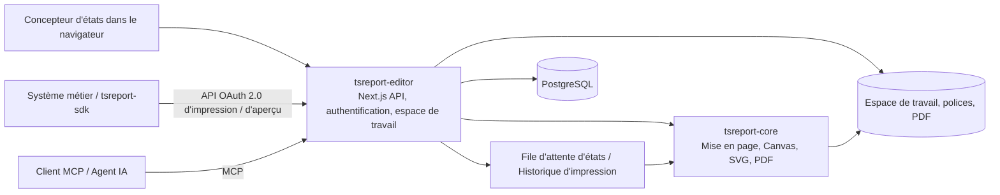

# tsreport-editor

[English](./README.md) | [日本語](./README.ja.md) | [简体中文](./README.zh-CN.md) | [繁體中文](./README.zh-TW.md) | [한국어](./README.ko.md) | [Tiếng Việt](./README.vi.md) | [ไทย](./README.th.md) | [Bahasa Indonesia](./README.id.md) | [Deutsch](./README.de.md) | Français | [Español](./README.es.md) | [Português](./README.pt.md) | [العربية](./README.ar.md) | [עברית](./README.he.md)

`tsreport-editor` est un concepteur d'états et serveur d'états basé sur navigateur qui utilise [`tsreport-core`](https://www.npmjs.com/package/tsreport-core) comme moteur de mise en page et de rendu.

Ce n'est pas seulement un écran de conception d'états. Un seul serveur fournit la gestion des modèles `.report` et des ressources, la prévisualisation avec des données réelles, l'import de PDF, une API d'impression OAuth 2.0 pour les systèmes externes, un MCP pour les agents IA, une file d'attente d'états asynchrone et une traçabilité d'impression.

- **Concepteur d'états** — éditez dans le navigateur des bandes, du texte, des formes, des images, des SVG, des tableaux, des sous-états, des codes-barres, des formules, etc.
- **Cohérence entre aperçu et PDF** — l'Editor, l'aperçu avant impression et la génération de PDF utilisent le même résultat de mise en page et la même implémentation de rendu de `tsreport-core`.
- **Gestion multilingue des polices** — gestion des polices par compte, polices embarquées, contours, polices importées depuis des PDF, et composition pour le japonais, le chinois, le coréen, l'écriture arabe, etc.
- **Serveur d'API d'états** — imprime de manière asynchrone, via OAuth 2.0 Client Credentials, des modèles fixés par des tags publiés.
- **Serveur MCP** — permet à l'IA de lire, modifier, valider des modèles, vérifier la mise en page, effectuer un rendu PNG/PDF, importer un PDF original et comparer des différences.
- **Exploitation et traçabilité** — les impressions via l'API sont mises en file d'attente, et les sorties PDF de l'Editor, de l'API et du MCP sont enregistrées dans un historique d'impression par compte.

## Conception de rapports par IA avec MCP

Ces vidéos montrent une IA concevant un rapport via MCP puis ouvrant l'aperçu final. La version anglaise illustre également la prise en charge des rapports multilingues.

| Version anglaise — rapports multilingues | Version japonaise |
| --- | --- |
| [](https://youtu.be/CHsNew6yQr4) | [](https://youtu.be/0I3ljxLUbys) |

### Gestion des polices

La gestion des polices permet de télécharger des Google Fonts et de téléverser vos propres fichiers de polices.

[](https://youtube.com/shorts/fAUjfFqaVtY)

## Vue d'ensemble du système



`tsreport-core` est un moteur d'états en pure TypeScript, sans dépendance runtime. `tsreport-editor` construit par-dessus Next.js, PostgreSQL, l'authentification, la gestion de fichiers, la file d'attente et l'écran d'administration. Côté Editor, `Argon2id` est utilisé pour le hachage des mots de passe et `sharp` pour la génération PNG du MCP, donc l'ensemble du serveur Editor n'est pas présenté comme « sans dépendance native ».

## Principales fonctionnalités de conception

- Bandes Title, Page Header, Column Header, Detail, Group Header/Footer, Summary, Page Footer, Last Page Footer, Background, No Data, etc.
- Texte fixe, champs d'expression, lignes, rectangles, ellipses, tracés vectoriels, images, SVG, cadres, tableaux, sous-états, codes-barres, formules, sauts de page
- Attributs de dessin incluant RGB, CMYK, couleurs spéciales, dégradés, transparence, découpe (clip) et soft mask
- Édition visuelle et édition JSON du `.report`, onglets multiples, annuler/rétablir, calques, zoom, aperçu avant impression
- Vérification des champs, paramètres, expressions et détails répétitifs à l'aide de données de test JSON
- Import haute fidélité de pages PDF. Conversion du texte, des vecteurs, des images et des polices embarquées en éléments d'état modifiables ou en rendu préservé
- Tags publiés pour les modèles. Sépare le contenu en cours d'édition de la version fixée utilisée par l'API externe

## Démarrage rapide

### Prérequis

- Docker et Docker Compose

Les paquets publiés `tsreport-core` et `tsreport-react` sont installés depuis npm selon le lockfile de l'Editor. Aucun dépôt voisin n'est utilisé.

Pour le développement et la vérification courants, les commandes npm peuvent aussi être exécutées dans le `src/` de l'hôte. Docker reste isolé : les dépendances sont installées depuis le lockfile lors de la construction de l'image Node.js, le démarrage du conteneur n'exécute ni `npm install` ni `npm ci`, et Compose Watch synchronise uniquement les sources en excluant le `node_modules` de l'hôte.

### Démarrage

```sh
cd ../tsreport-editor/server
docker compose up --build --watch
```

Pour démarrer en arrière-plan :

```sh
cd ../tsreport-editor/server
docker compose up -d --build
docker compose ps
docker compose logs -f tsreport_editor_node
```

Le `server/compose.yaml` de développement fixe le nom du projet Compose à `tsreport-editor-dev`, séparant ainsi l'espace de noms des conteneurs et des réseaux des autres produits sur le même hôte et du projet `tsreport-editor` de production.

Pour arrêter :

```sh
cd ../tsreport-editor/server
docker compose down
```

Pour une exploitation normale où l'on souhaite arrêter tout en conservant les données, n'utilisez pas `down -v` et ne supprimez pas les répertoires NFS/DB.

### Services et ports de développement

| Service | Rôle | Côté hôte |
| --- | --- | --- |
| `tsreport_editor_node` | Editor Next.js, API REST | `http://localhost:52005` |
| `tsreport_editor_node` | Listener MCP dédié | `http://localhost:52006` |
| `tsreport_editor_node` | Notification de mise à jour de l'espace de travail | `52007` |
| `tsreport_editor_db` | PostgreSQL | `localhost:52437` |
| `tsreport_editor_cron` | Déclenche la file d'attente d'états toutes les 10 secondes | Interne uniquement |
| `tsreport_editor_nginx` | Proxy inverse HTTP / HTTPS | `52085` / `52448` |

Ouvrez `http://localhost:52005` dans votre navigateur, ou `https://localhost:52448` qui utilise un certificat auto-signé.

## Première connexion et configuration de sécurité obligatoire

Au premier démarrage, l'application crée une seule fois, sous verrouillage de la base de données, les données initiales du schéma, les comptes, les espaces de travail et les modèles de test de non-régression.

| Usage | Identifiant de connexion | Mot de passe initial | Rôle |
| --- | --- | --- | --- |
| Administrateur initial | `admin` | `pass` | Administrateur |
| Test de non-régression | `test` | `pass` | Utilisateur standard |

> **Important :** les mots de passe initiaux sont des identifiants d'initialisation publiés. Changez-les impérativement avant la mise en production. L'UI actuelle n'impose pas automatiquement un changement à la première connexion ; c'est à l'exploitant de vérifier que ce changement a bien été effectué.

Après la première connexion, effectuez les actions suivantes depuis le menu hamburger.

1. Changez le mot de passe initial d'`admin` via « Changer le mot de passe ».
2. Supprimez `test` dans les environnements où il n'est pas utilisé pour les tests de non-régression. Si vous le conservez, changez impérativement son mot de passe.
3. Régénérez la clé MCP dans « Paramètres MCP » pour les comptes initiaux conservés.
4. Supprimez le client API de test de non-régression `test-report-client`, ou reconfigurez son Client Secret et ses autorisations d'accès.
5. Changez les identifiants de base de données et le `REPORT_BATCH_TOKEN` par rapport aux valeurs par défaut dans `server/node/.env` et le `.env` de production.
6. Avant l'exposition externe, remplacez le certificat auto-signé de nginx par un certificat officiel, et vérifiez les ports exposés et le pare-feu.

Les mots de passe des comptes locaux sont hachés avec Argon2id avant d'être enregistrés en base. Au moins un compte doit rester administrateur, y compris `admin`.

## Flux d'utilisation de base

1. Connectez-vous et ouvrez l'espace de travail du compte.
2. Enregistrez les polices nécessaires à l'état dans « Gestion des polices ».
3. Créez un nouveau `.report`, ou ouvrez un `.report`/PDF existant.
4. Placez les bandes et les éléments, et spécifiez si nécessaire un JSON de données de test.
5. Vérifiez les pages multiples, les débordements de détail et la dernière page dans l'affichage de l'Editor et l'aperçu avant impression.
6. Générez le PDF. La sortie est enregistrée dans l'historique d'impression de votre propre compte.
7. Pour une utilisation depuis un système externe, créez un tag publié et configurez le client API et les autorisations d'accès.

L'enregistrement normal met à jour le fichier d'édition dans l'espace de travail. Le tag publié fixe le JSON du modèle à cet instant précis ; un enregistrement normal ultérieur ne modifie donc pas le résultat d'impression via l'API pour un tag existant. Pour publier des modifications en externe, créez un nouveau tag ou mettez explicitement à jour le tag cible.

## Gestion des versions de modèles d'états via les tags publiés

Un tag publié n'est pas un simple indicateur qui bascule le `.report` en cours d'édition vers un état publié en externe. **C'est un mécanisme qui enregistre le contenu du modèle d'état comme une version, permettant à l'API externe de désigner cette version par son nom.**

Par exemple, après avoir publié le contenu actuel d'un modèle de facture sous le nom `v1`, vous pouvez continuer à modifier `invoice.report` dans l'espace de travail. Les modifications apportées par un enregistrement normal ne sont pas automatiquement répercutées sur `v1`. Si vous publiez le contenu modifié sous le nom `v2`, le système externe peut choisir explicitement la version à utiliser dans l'URL de l'API.

```text
invoice.report (version de travail en cours d'édition)
  ├─ v1 (JSON du modèle publié)
  └─ v2 (JSON du modèle publié après modification)

POST /api/report/print/{workspaceKey}/invoice.report/v1
POST /api/report/print/{workspaceKey}/invoice.report/v2
```

Cette séparation rend possible les usages suivants.

- Le système métier continue d'utiliser `v1` existant pendant que vous modifiez et validez une nouvelle mise en page d'état
- Faire passer l'appelant de `v1` à `v2` au moment choisi côté utilisateur de l'API
- Faire coexister plusieurs versions, chaque partenaire utilisant une version différente
- En cas de problème, revenir sur un tag précédent au niveau de l'appel API, sans réécrire le fichier de modèle

Créer un nouveau tag enregistre le JSON du modèle à cet instant. Il est également possible de mettre à jour explicitement le même tag, mais dans ce cas le contenu pointé par la même URL d'API change également. Pour une exploitation privilégiant la reproductibilité ou une migration progressive, créez de nouveaux tags tels que `v1`, `v2`, `2026-07`, plutôt que d'écraser un tag existant.

Ce que le tag publié fixe, c'est le JSON du modèle. Les `rows` et `parameters` de l'appel API ne font pas partie de la version et sont spécifiés à chaque demande d'impression. Par ailleurs, « publié » ici ne signifie pas exposé anonymement sur Internet. Pour une utilisation réelle depuis l'API, il faut satisfaire à la fois la portée OAuth 2.0, les autorisations d'accès du client API, et les droits d'accès à l'espace de travail de l'utilisateur propriétaire.

## Utilisateurs, espaces de travail et partage

### Gestion des utilisateurs

- Chaque compte possède un seul espace de travail.
- L'espace de travail est identifié par un `workspaceKey` UUID immuable.
- L'administrateur peut créer des utilisateurs et gérer le nom d'affichage, l'identifiant de connexion, le rôle, l'autorisation d'utilisation du MCP, le mot de passe, ainsi que les paramètres système.
- Même l'administrateur ne peut pas consulter sans condition l'espace de travail d'un autre compte. Les données d'état sont isolées par locataire (tenant).
- La suppression d'un utilisateur est une suppression physique. Les données associées — espace de travail, polices, partages, clients API, jetons, historique d'impression — sont supprimées et ne peuvent pas être restaurées.

### Partage de dossiers

Il est possible de partager avec un autre compte uniquement les dossiers nécessaires, plutôt que tout l'espace de travail.

- Le destinataire du partage est désigné par son `workspaceKey`.
- La lecture et l'écriture peuvent être autorisées séparément.
- Le partage en lecture autorise la consultation des modèles et des ressources ; le partage en écriture autorise l'édition collaborative.
- Le destinataire peut annuler un partage reçu.
- La même portée d'accès effective s'applique à l'API et au MCP.

Lorsque l'Editor ou le MCP met à jour un espace de travail, un événement de mise à jour est notifié aux autres onglets Editor. En l'absence de modifications non enregistrées, l'onglet recharge ; s'il y a des modifications non enregistrées, l'édition locale est protégée et un avertissement s'affiche.

Le partage, les autorisations d'API et les tags publiés ont des rôles différents.

| Concept | Cible | Rôle |
| --- | --- | --- |
| Partage de dossiers | Entre comptes | Autorise la lecture/écriture pour les opérations humaines dans l'Editor et pour le MCP agissant au nom de ce compte |
| Autorisations d'accès API | Client API | Limite le `workspaceKey` et les dossiers que le système externe peut consulter |
| Tag publié | Version du `.report` | Fixe le contenu du modèle utilisé pour l'impression via API |

Ajouter uniquement des autorisations d'accès API ne suffit pas à en permettre l'utilisation si l'utilisateur propriétaire lui-même n'a pas accès au dossier cible. Inversement, le partage de dossier seul n'expose rien à l'API externe.

## Ajout et gestion des polices

« Gestion des polices » dans le menu hamburger est accessible à tous les utilisateurs. Les polices sont enregistrées par compte sous `/var/nfs/fonts/{accountId}/` et ne sont pas visibles depuis les autres comptes.

### Téléversement

1. Ouvrez « Gestion des polices ».
2. Ajoutez des fichiers via la sélection de fichiers ou le glisser-déposer.
3. Sélectionnez l'ID de police affiché dans la liste via `fontFamily` d'un élément texte.

Les formats pris en charge sont TTF, OTF, TTC, OTC, WOFF et WOFF2. La limite applicative pour un seul fichier est de 256 Mio. Vous pouvez sélectionner plusieurs polices système en une fois, par exemple `/System/Library/Fonts` sous macOS, et les enregistrer en lot. Le système ne lit pas implicitement les polices du système d'exploitation hôte et n'installe pas de polices dans le système d'exploitation.

Les doublons sont déterminés comme suit.

- Même ID de police, même binaire : traité comme un succès en tant que nouvelle tentative de téléversement en lot
- Même ID de police, binaire différent : rejeté comme conflit d'ID
- ID de police différent, même binaire : rejeté comme doublon en indiquant l'ID existant
- Seules les métadonnées telles que le nom de la famille ou le nom PostScript coïncident : peut être enregistré comme police indépendante si le binaire est différent

La correspondance de contenu est établie non seulement par les métadonnées ou le hachage, mais par une comparaison octet par octet complète après vérification de l'égalité de la taille du fichier.

### Google Fonts et polices importées de PDF

« Download Google Fonts » permet de choisir une langue et de télécharger des candidats dans l'espace du compte. Cela suppose une connexion au réseau externe.

L'import de PDF enregistre les polices embarquées réutilisables en tant que polices applicatives dans le compte. Si le programme de police n'est pas disponible, le système compare le nom et le style avec les polices du compte et affiche des candidats et des avertissements.

## Utiliser l'API d'impression externe

L'API externe utilise un Bearer Token OAuth 2.0 Client Credentials, et non un cookie de connexion à l'écran. Trois éléments sont nécessaires pour commencer à l'utiliser.

1. **Tag publié** — créez la version fixée du `.report` utilisée par l'API.
2. **Client API** — créez un Client ID, un Client Secret et des portées dans « Clients API » du menu hamburger.
3. **Autorisation d'accès** — enregistrez le `workspaceKey` et les dossiers que le client peut utiliser.

Les portées disponibles sont `report:print`, `report:status`, `report:download` et `report:preview`. La portée effective d'un client API est l'intersection entre « les autorisations d'accès du client » et « les espaces de travail/dossiers partagés auxquels l'utilisateur propriétaire lui-même peut accéder ».

### Flux de l'API REST

```text
POST /api/oauth/token
  grant_type=client_credentials
  -> access_token

POST /api/report/print/{workspaceKey}/{templatePath}/{tag}
  -> { key }

GET /api/report/status/{key}
  -> queued | processing | completed | error

GET /api/report/download/{key}
  -> application/pdf
```

Exemple :

```sh
BASE_URL=http://localhost:52005
CLIENT_ID=test-report-client
CLIENT_SECRET=test-report-secret

TOKEN=$(curl -sS -u "$CLIENT_ID:$CLIENT_SECRET" \
  -d grant_type=client_credentials \
  -d 'scope=report:print report:status report:download' \
  "$BASE_URL/api/oauth/token" | jq -r .access_token)

curl -sS \
  -H "Authorization: Bearer $TOKEN" \
  -H 'Content-Type: application/json' \
  -d '{"rows":[{"item":"seed"}],"parameters":{}}' \
  "$BASE_URL/api/report/print/00000000-0000-0000-0000-000000000002/invoice.report/v1"
```

Même si `templatePath` contient des `/`, c'est le dernier segment qui est résolu comme tag. Seul le client API ayant créé la demande d'impression peut consulter le statut et le téléchargement.

### tsreport-sdk

[`tsreport-sdk`](../tsreport-sdk) permet de gérer l'obtention du jeton, l'ajout à la file d'attente, le polling et la récupération du PDF via une seule API TypeScript.

```ts
import { TsreportClient } from 'tsreport-sdk'

const client = new TsreportClient({
    baseUrl: 'https://reports.example.com',
    clientId: process.env.REPORT_CLIENT_ID!,
    clientSecret: process.env.REPORT_CLIENT_SECRET!
})

const pdf = await client.printAndDownload(
    '00000000-0000-0000-0000-000000000002',
    'orders/invoice.report',
    'v1',
    { rows: [{ orderId: 42 }], parameters: {} }
)
```

N'intégrez pas le Client Secret dans le navigateur. Pour une utilisation depuis une application navigateur, passez par un backend authentifié de votre propre système. Vous pouvez utiliser `createPreviewEndpoint` de `tsreport-sdk/server` pour relayer en toute sécurité l'API de ressources d'aperçu.

## File d'attente d'états et traçabilité d'impression

Les demandes d'impression provenant de l'API sont enregistrées avec le statut `queued` dans la table `PrintRequest` de la base de données. `tsreport_editor_cron` déclenche le point de terminaison batch authentifié toutes les 10 secondes, faisant transiter le statut de `queued` → `processing` → `completed` ou `error`. Les exécutions simultanées sont sérialisées par verrouillage de la base de données.

Les PDF générés sont enregistrés dans `/var/nfs/report-pdf`. L'écran d'historique d'impression permet de vérifier, pour votre propre compte, les éléments suivants.

- Date et heure d'exécution
- Voie d'exécution : `editor` / `api` / `mcp`
- Espace de travail, modèle, format
- Statut de complétion/erreur et motif de l'erreur
- Nouveau téléchargement du PDF terminé

Le PDF généré dans l'Editor est enregistré via l'API d'historique depuis le navigateur. Le `render_report(format="pdf")` du MCP est également enregistré dans l'historique. L'historique est isolé par compte ; même un administrateur ne peut pas consulter l'historique d'un autre compte.

En exploitation, sauvegardez la base de données et `server/nfs` avec le même point de restauration. Restaurer uniquement les lignes d'historique ou uniquement les fichiers PDF entraînerait une incohérence entre la traçabilité et les livrables. La durée de conservation en fonction du volume de sorties et la surveillance du disque doivent également être décidées côté exploitation.

## Utiliser le MCP

Le MCP est indépendant du client OAuth de l'API d'impression externe. Il s'authentifie avec l'identifiant de connexion et la clé MCP de chaque utilisateur, et fonctionne avec les mêmes droits d'espace de travail/partage que cet utilisateur.

### Activation et identifiants

1. Ouvrez « Paramètres MCP » depuis le menu hamburger.
2. Activez votre utilisation du MCP.
3. Copiez la clé MCP. Régénérez la clé initiale avant la mise en production.
4. L'administrateur peut, dans le même écran, activer/désactiver le MCP globalement et configurer un port dédié.

En temps normal, utilisez `http://localhost:52005/api/mcp`, le même que Next.js. En environnement de développement, un listener dédié `http://localhost:52006` est également disponible. Configurez dans le client MCP l'URL Streamable HTTP ainsi que l'une des authentifications suivantes.

- `x-mcp-account: <identifiant de connexion>` et `x-mcp-key: <clé MCP>`
- `Authorization: Bearer <identifiant de connexion>:<clé MCP>`

Le guide de configuration peut être obtenu sans authentification.

```sh
curl http://localhost:52005/api/mcp
```

Exemple pour vérifier la liste des outils :

```sh
curl -sS http://localhost:52005/api/mcp \
  -H 'Content-Type: application/json' \
  -H 'x-mcp-account: admin' \
  -H 'x-mcp-key: <clé MCP régénérée>' \
  -d '{"jsonrpc":"2.0","id":1,"method":"tools/list","params":{}}'
```

### Outils MCP

| Catégorie | Outils |
| --- | --- |
| Introduction | `get_started` |
| Découverte | `list_workspaces`, `list_templates`, `list_workspace_files`, `list_fonts` |
| Modèle | `get_template`, `get_template_schema`, `validate_template`, `save_template`, `update_template_elements` |
| Ressources | `save_workspace_file`, `delete_workspace_file` |
| Validation et sortie | `layout_report`, `render_report`, `compare_reports` |
| Import d'original | `import_pdf` |

La boucle de travail recommandée est la suivante.

1. Lire `get_started` et `get_template_schema`.
2. Vérifier les ressources disponibles avec `list_workspaces`, `list_templates`, `list_workspace_files` et `list_fonts`.
3. Générer un modèle ou l'obtenir avec `get_template`.
4. Valider la structure et les expressions avec `validate_template`.
5. Vérifier numériquement les coordonnées absolues, le nombre de pages et les éléments hors limites avec `layout_report`.
6. Effectuer une vérification visuelle avec `render_report(format="png")`.
7. Enregistrer avec `save_template` ou `update_template_elements`.
8. Comparer avant/après modification avec `compare_reports` pour s'assurer qu'il n'y a pas de déplacement involontaire.

En présence d'un PDF original, procédez sans reconstruction visuelle manuelle, dans l'ordre suivant : `save_workspace_file` → `import_pdf` → ajustement des expressions ou des bandes → `layout_report` / `render_report`.

## Langue et intégrations externes optionnelles

L'UI de l'Editor peut être affichée en japonais, anglais, chinois simplifié, coréen, chinois traditionnel, vietnamien, thaï, indonésien, allemand, français, espagnol, portugais, arabe et hébreu. En arabe et en hébreu, l'UI passe également en RTL. Cela ne restreint pas les systèmes d'écriture utilisables dans l'état lui-même.

L'administrateur peut configurer la connexion externe Google/Microsoft. Si la connexion externe n'est pas activée, le système peut fonctionner uniquement avec des comptes locaux protégés par Argon2id.

Pour utiliser les fonctionnalités d'assistance IA, enregistrez la clé API et le modèle dans les paramètres système de la base de données. Aucune clé API externe valide n'est incluse dans les valeurs initiales. Ne stockez pas de valeurs secrètes dans le code source, les `.report`, l'espace de travail ou le README.

## Données initiales et environnement de non-régression

Au premier démarrage, les éléments suivants sont créés.

- Les comptes `admin` et `test`, ainsi que leurs `workspaceKey` fixes
- Le client API de non-régression `test-report-client`, appartenant à `test`
- `invoice.report`, `sub.report`, `assets/logo.png` dans l'espace de travail de `test`
- Le tag publié `v1` d'`invoice.report`
- Un partage en lecture/écriture du dossier `assets` de `test` vers `admin`

Clés fixes :

- `admin` : `00000000-0000-0000-0000-000000000001`
- `test` : `00000000-0000-0000-0000-000000000002`

Ces éléments sont utilisés pour les tests de non-régression sur des serveurs réels de `tsreport-editor`, `tsreport-sdk` et `tsreport-react`. En exploitation de production, changez ou supprimez impérativement les identifiants initiaux mentionnés ci-dessus.

### Réinitialiser la base de données de développement

Pour reconstruire entièrement le PostgreSQL de l'environnement de développement, arrêtez les conteneurs, supprimez `server/db/pgdata/data`, puis redémarrez.

```sh
cd ../tsreport-editor/server
docker compose down
rm -rf db/pgdata/data
docker compose up --build --watch
```

Au redémarrage, le DDL PostgreSQL est appliqué, et les données initiales de la base de données — comptes initiaux, clients API, tags publiés, etc. — sont recréées au démarrage de l'application. Les fichiers d'espace de travail de non-régression ne sont réapprovisionnés que s'ils manquent. Ne supprimez jamais `pgdata` pendant que le conteneur de base de données est en cours d'exécution.

Cette opération réinitialise uniquement PostgreSQL. Les espaces de travail, polices, PDF générés, etc., stockés dans `server/nfs` ne sont pas supprimés. Si vous devez réinitialiser à la fois la base de données et le NFS, utilisez « Réinitialisation d'usine » dans le menu administrateur.

« Réinitialisation d'usine » supprime toutes les tables de la base de données, les espaces de travail et les sorties d'états, puis recrée l'état initial. Cette opération est irréversible. Les polices, les certificats et les fichiers cachés tels que `.gitignore` ne sont pas concernés par la suppression.

## Emplacements de stockage des données

| Données | Dans le conteneur | Côté hôte de développement |
| --- | --- | --- |
| PostgreSQL | `/var/pgdata/data` | `server/db/pgdata` |
| Espace de travail | `/var/nfs/workspaces/{workspaceKey}` | `server/nfs/workspaces` |
| Polices du compte | `/var/nfs/fonts/{accountId}` | `server/nfs/fonts` |
| PDF générés | `/var/nfs/report-pdf` | `server/nfs/report-pdf` |
| Journaux nginx | `/var/log/nginx` | `logs/nginx` |

L'export/import des données de l'application peut être exécuté depuis le menu administrateur. Pour la reprise après sinistre de l'ensemble de l'environnement, ne comptez pas uniquement sur cette fonctionnalité et conservez également des sauvegardes cohérentes de PostgreSQL et du NFS.

## Build et démarrage en production

Le build et le démarrage en production reposent également sur Docker Compose. `build.sh`, `build_boot.sh`, `boot.sh`, `boot_db.sh`, `boot_web.sh` et `build_boot_web.sh` sont de fines enveloppes (wrappers) qui appellent Docker Compose. Ce n'est pas une procédure d'installation des dépendances Node.js sur l'hôte pour faire tourner `server.js` directement en résident.

### 1. Préparation préalable

`tsreport-core` et `tsreport-react` sont restaurés depuis npm dans les versions verrouillées par `src/package-lock.json`.

```sh
cd ../tsreport-editor/server
```

Modifiez la configuration de production.

- `boot/web/.env` : informations de connexion à la base de données et `REPORT_BATCH_TOKEN`
- `boot/compose.yaml` : configuration PostgreSQL pour une architecture à serveur unique
- `boot/db/compose.yaml` : configuration PostgreSQL pour une architecture séparée DB/Web
- `nginx/cert` : certificat TLS officiel
- `nginx/conf` : nom d'hôte public, destination de redirection, contrôles d'accès nécessaires

Faites correspondre `DB_PASS` dans `boot/web/.env` avec le `DB_PASS` du Compose de la configuration adoptée. Le Web et le cron utilisent le même `REPORT_BATCH_TOKEN` de `boot/web/.env`. Les valeurs présentes dans le dépôt sont destinées au démarrage local ; changez-les impérativement en production.

### 2. Build de production

```sh
cd ../tsreport-editor/server
./build.sh
```

`build.sh` ne restaure pas les dépendances Node.js côté hôte. Il synchronise `src` vers `server/build/src`, exécute la production build de Next.js dans un environnement de build Docker isolé, et place les livrables standalone comme suit.

```text
server/boot/web/dist/standalone/
  ├─ server.js
  ├─ .next/
  ├─ node_modules/
  ├─ public/
  └─ seed/
```

Le build inclut la vérification TypeScript et la compilation de production de Next.js. Vérifiez que la commande se termine normalement et que `boot/web/dist/standalone/server.js` existe avant de démarrer.

### 3. Démarrer le serveur déjà construit (sans reconstruire)

Si `./build.sh` a déjà réussi et que `boot/web/dist/standalone/server.js` existe, vous pouvez démarrer le serveur de production sans répéter la production build de Next.js.

Pour démarrer la base de données et le Web sur le même serveur :

```sh
cd ../tsreport-editor/server
./boot.sh
```

Pour séparer le serveur de base de données et le serveur Web, exécutez respectivement sur l'hôte DB et l'hôte Web.

```sh
# Hôte BD
cd ../tsreport-editor/server
./boot_db.sh

# Hôte Web
cd ../tsreport-editor/server
./boot_web.sh
```

`boot.sh` et `boot_web.sh` montent le `boot/web/dist/standalone` existant dans le conteneur Node.js et le démarrent avec PM2. L'image d'exécution Docker est mise à jour par Compose si nécessaire, mais la production build de Next.js n'est pas exécutée. Pour refléter des modifications du code source, réexécutez d'abord `./build.sh`.

### 4-A. Architecture à serveur unique

Configuration où la base de données, Node.js, le cron de la file d'attente d'états et nginx tournent sur la même instance de serveur. Du build jusqu'au démarrage résident, tout s'exécute avec la commande unique suivante.

```sh
cd ../tsreport-editor/server
./build_boot.sh
```

Si le build est déjà fait et qu'il ne reste que le démarrage, exécutez `./boot.sh`. `boot.sh` utilise `boot/compose.yaml` et démarre en arrière-plan tous les services suivants en tant que projet `tsreport-editor`, sans conflit avec les projets Compose d'autres produits.

| Service | Rôle | Port exposé |
| --- | --- | --- |
| `tsreport_editor_db` | PostgreSQL | `52437` |
| `tsreport_editor_node` | Next.js standalone déjà construit, MCP, notification de mise à jour | `52005`, `52006`, `52007` |
| `tsreport_editor_cron` | Déclenche la file d'attente d'états asynchrone toutes les 10 secondes | Aucun |
| `tsreport_editor_nginx` | Proxy inverse HTTP/HTTPS | `52085`, `52448` |

Le conteneur Web monte uniquement `boot/web/dist/standalone`, et non l'arborescence source, sur `/var/node`, et exécute `server.js` en mode cluster de PM2. Modifier `src` pendant l'exécution ne se répercute pas sur le serveur de production. Pour répercuter des modifications, réexécutez `./build.sh` puis redémarrez le service Web.

Vérification du démarrage :

```sh
docker compose --project-name tsreport-editor -f boot/compose.yaml ps
docker compose --project-name tsreport-editor -f boot/compose.yaml logs -f tsreport_editor_node
```

Arrêt :

```sh
docker compose --project-name tsreport-editor -f boot/compose.yaml down
```

### 4-B. Architecture séparée serveur DB / serveur Web

Configuration où PostgreSQL tourne sur un serveur dédié à la base de données, et où Node.js, le cron de la file d'attente d'états et nginx tournent sur le serveur Web. Déployez ce dépôt sur les deux hôtes, et exécutez une commande unique respectivement sur l'hôte DB et l'hôte Web.

Sur l'hôte DB, ne démarrez que `boot/db/compose.yaml`.

```sh
cd ../tsreport-editor/server
./boot_db.sh
```

Modifiez `boot/web/.env` de l'hôte Web pour pointer vers le nom DNS privé ou l'adresse IP de l'hôte DB, et le port qu'il expose.

```dotenv
DB_HOST=db.internal.example
DB_PORT=52437
DB_NAME=TSREPORT_EDITOR_DB
DB_USER=postgres
DB_PASS=mot de passe BD de production
REPORT_BATCH_TOKEN=secret partagé de production
```

Sur l'hôte Web, exécutez en une seule commande la production build et le démarrage résident des services côté Web.

```sh
cd ../tsreport-editor/server
./build_boot_web.sh
```

Si le build est déjà fait et qu'il ne reste que le démarrage côté Web, exécutez `./boot_web.sh`. Le `boot/web/compose.yaml` côté Web ne démarre que Node.js, cron et nginx, et ne crée pas de conteneur PostgreSQL.

Vérification du démarrage en architecture séparée :

```sh
# Hôte BD
docker compose --project-name tsreport-editor-db -f boot/db/compose.yaml ps
docker compose --project-name tsreport-editor-db -f boot/db/compose.yaml logs -f tsreport_editor_db

# Hôte Web
docker compose --project-name tsreport-editor-web -f boot/web/compose.yaml ps
docker compose --project-name tsreport-editor-web -f boot/web/compose.yaml logs -f tsreport_editor_node
```

Arrêt en architecture séparée :

```sh
# Hôte Web
docker compose --project-name tsreport-editor-web -f boot/web/compose.yaml down

# Hôte BD
docker compose --project-name tsreport-editor-db -f boot/db/compose.yaml down
```

N'exposez pas directement le port `52437` de la base de données sur Internet ; autorisez-le uniquement au sein d'un réseau privé accessible depuis l'hôte Web. Le `DB_PASS` de `boot/db/compose.yaml` côté hôte DB et le `DB_PASS` de `boot/web/.env` côté Web doivent avoir la même valeur. Les espaces de travail, polices et PDF générés sont stockés dans `server/nfs` côté hôte Web ; aucun système de fichiers partagé avec l'hôte DB n'est nécessaire.

### 5. Vérification commune du fonctionnement

Ouvrez `https://<hôte Web>:52448` ou `http://<hôte Web>:52005` dans un navigateur. Si vous utilisez l'API d'impression externe, vérifiez également que `tsreport_editor_cron` est bien `Up`.

Lors d'un arrêt/redémarrage normal, `server/db/pgdata` et `server/nfs` côté hôte Web sont conservés. Ce n'est que si une réinitialisation de la base de données est nécessaire qu'il faut suivre la procédure d'initialisation mentionnée précédemment et supprimer `db/pgdata/data` après l'arrêt du service DB.

Avant l'exposition en production, vérifiez au minimum les points suivants.

- Les utilisateurs initiaux, les clés MCP et le client API de non-régression ont été changés ou supprimés
- Le mot de passe de la base de données et le `REPORT_BATCH_TOKEN` ont été changés
- Un certificat TLS officiel a été configuré
- `/api/report/batch/process` n'est pas exposé sans authentification en externe
- Des sauvegardes et une surveillance de capacité existent pour la base de données, l'espace de travail, les polices et les PDF générés
- Les polices nécessaires et les tags publiés sont enregistrés pour les comptes cibles
- L'Editor, l'aperçu et l'impression via API ont été vérifiés avec des états multi-pages proches des données réelles

## Variables d'environnement

La configuration de l'application se trouve dans `server/node/.env` en développement, et dans `server/boot/web/.env` en production.

| Variable | Description | Valeur par défaut en développement |
| --- | --- | --- |
| `DB_HOST` | Hôte PostgreSQL | `172.31.0.30` |
| `DB_PORT` | Port PostgreSQL | `15432` |
| `DB_NAME` | Nom de la base de données | `TSREPORT_EDITOR_DB` |
| `DB_USER` | Utilisateur DB | `postgres` |
| `DB_PASS` | Mot de passe DB | `postgres1234` |
| `REPORT_BATCH_TOKEN` | Secret partagé pour le déclenchement du batch | `tsreport-report-batch-local` |
| `WORKSPACES_ROOT` | Racine de l'espace de travail | `/var/nfs/workspaces` |
| `NEXT_TELEMETRY_DISABLED` | Désactivation de la télémétrie Next.js | `1` |

L'état d'activation global du MCP et le port dédié sont gérés comme paramètres système de la base de données, modifiables depuis l'écran d'administration. La configuration OAuth pour la connexion externe et les paramètres optionnels d'assistance IA sont également gérés via l'écran d'administration/SystemProperty ; n'inscrivez pas de valeurs secrètes dans le README ou le code source.

## Développement et validation

```sh
cd ../tsreport-editor

docker compose -f server/compose.yaml exec tsreport_editor_node npx tsc --noEmit
docker compose -f server/compose.yaml exec tsreport_editor_node npm test
docker compose -f server/compose.yaml exec \
  -e TSREPORT_EDITOR_LIVE_BASE=http://localhost:3000 \
  tsreport_editor_node npm run test:live

cd server
./build.sh
```

Le développement, les tests et le build de production restaurent `tsreport-core` et `tsreport-react` depuis npm. Aucun checkout d'un dépôt voisin n'est nécessaire.

## Structure du dépôt

| Chemin | Contenu |
| --- | --- |
| `src/` | Editor Next.js, API REST, MCP, logique serveur |
| `tests/` | Tests unitaires, d'intégration et de non-régression sur serveur réel |
| `server/` | Configuration Docker de développement, de build et de démarrage en production |
| `cli/` | Scripts auxiliaires |

Dépôts liés :

| Dépôt | Contenu |
| --- | --- |
| [`tsreport-core`](https://github.com/pontasan/tsreport-core) | Moteur pure TypeScript de mise en page, rendu, PDF et polices pour les états |
| [`tsreport-editor`](https://github.com/pontasan/tsreport-editor) | Ce concepteur d'états et serveur d'états dans le navigateur |
| [`tsreport-sdk`](https://github.com/pontasan/tsreport-sdk) | SDK TypeScript sans dépendance pour l'API d'impression et d'aperçu |
| [`tsreport-react`](https://github.com/pontasan/tsreport-react) | UI d'aperçu React utilisant `tsreport-core` |

## Licence

tsreport-editor peut être utilisé, au choix de l'utilisateur, sous [licence MIT](./LICENSE-MIT) ou [licence Apache 2.0](./LICENSE-APACHE) (SPDX : `MIT OR Apache-2.0`).
