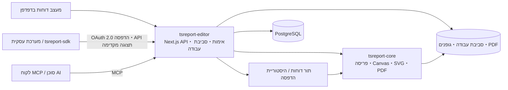

# tsreport-editor

[English](./README.md) | [日本語](./README.ja.md) | [简体中文](./README.zh-CN.md) | [繁體中文](./README.zh-TW.md) | [한국어](./README.ko.md) | [Tiếng Việt](./README.vi.md) | [ไทย](./README.th.md) | [Bahasa Indonesia](./README.id.md) | [Deutsch](./README.de.md) | [Français](./README.fr.md) | [Español](./README.es.md) | [Português](./README.pt.md) | [العربية](./README.ar.md) | עברית

`tsreport-editor` הוא מעצב דוחות ושרת דוחות מבוסס דפדפן, המשתמש ב-[`tsreport-core`](https://www.npmjs.com/package/tsreport-core) כמנוע פריסה ורינדור.

זהו לא רק מסך לעיצוב דוחות. הוא מספק בשרת אחד ניהול של תבניות `.report` וחומרים נלווים, תצוגה מקדימה עם נתונים אמיתיים, ייבוא PDF, API הדפסה מבוסס OAuth 2.0 עבור מערכות חיצוניות, MCP עבור סוכני AI, תור דוחות אסינכרוני, ותיעוד היסטוריית הדפסה.

- **מעצב דוחות** — עריכת רצועות, טקסט, צורות, תמונות, SVG, טבלאות, תת-דוחות, ברקודים, נוסחאות וכדומה בדפדפן.
- **התאמה בין תצוגה מקדימה ל-PDF** — ה-Editor, תצוגת ההדפסה המקדימה ופלט ה-PDF משתמשים באותה תוצאת פריסה ומימוש רינדור של `tsreport-core`.
- **תפעול רב-לשוני וגופנים** — ניהול גופנים לפי חשבון, גופנים משובצים, קווי מתאר, גופנים מיובאים מ-PDF, וטיפוגרפיה עבור יפנית, סינית, קוריאנית, כתב ערבי ועוד.
- **שרת API לדוחות** — הדפסה אסינכרונית באמצעות OAuth 2.0 Client Credentials, של תבניות שנקבעו על ידי תגי פרסום.
- **שרת MCP** — מאפשר ל-AI לקרוא, לערוך, לאמת ולבדוק פריסה של תבניות, לרנדר PNG/PDF, לייבא מסמכי PDF מקוריים ולהשוות הבדלים.
- **תפעול ותיעוד** — הדפסות API מטופלות בתור, ופלטי PDF מה-Editor, מה-API ומ-MCP נרשמים בהיסטוריית הדפסה נפרדת לכל חשבון.

## עיצוב דוחות באמצעות AI דרך MCP

הסרטונים מציגים כיצד AI מעצב דוח דרך MCP ופותח את התצוגה המקדימה המושלמת. הגרסה באנגלית מדגימה גם תמיכה בדוחות רב-לשוניים.

| גרסה באנגלית — תמיכה בדוחות רב-לשוניים | גרסה ביפנית |
| --- | --- |
| [](https://youtu.be/CHsNew6yQr4) | [](https://youtu.be/0I3ljxLUbys) |

### ניהול גופנים

מסך ניהול הגופנים מאפשר להוריד Google Fonts ולהעלות קובצי גופנים משלך.

[](https://youtube.com/shorts/fAUjfFqaVtY)

## תמונת מצב של המערכת



`tsreport-core` הוא מנוע דוחות ב-TypeScript טהור וללא תלות ב-runtime. `tsreport-editor` בונה מעליו את Next.js, PostgreSQL, אימות, ניהול קבצים, תור ומסך ניהול. בצד ה-Editor נעשה שימוש ב-Argon2id לגיבוב סיסמאות וב-`sharp` ליצירת PNG ב-MCP, ולכן שרת ה-Editor כולו אינו מוגדר כ"ללא תלות native".

## תכונות עיצוב עיקריות

- רצועות כגון Title, Page Header, Column Header, Detail, Group Header/Footer, Summary, Page Footer, Last Page Footer, Background, No Data ועוד
- טקסט קבוע, שדות ביטוי, קווים, מלבנים, אליפסות, נתיבי וקטור, תמונות, SVG, מסגרות, טבלאות, תת-דוחות, ברקודים, נוסחאות, מעברי עמוד
- מאפייני ציור הכוללים RGB, CMYK, צבע ספוט, שיפועים, שקיפות, חיתוך ו-soft mask
- עריכה חזותית ועריכת JSON עבור `.report`, כרטיסיות מרובות, Undo/Redo, שכבות, זום, תצוגה מקדימה להדפסה
- אימות שדות, פרמטרים, ביטויים ופרטים חוזרים באמצעות נתוני בדיקה בפורמט JSON
- ייבוא נאמן במיוחד של עמודי PDF. המרת טקסט, וקטורים, תמונות וגופנים משובצים לרכיבי דוח הניתנים לעריכה או לציור שמור
- תגי פרסום לתבניות. הפרדה בין התוכן הנערך לגרסה הקבועה המשמשת ב-API חיצוני

## התחלה מהירה

### דרישות מוקדמות

- Docker ו-Docker Compose

החבילות המפורסמות `tsreport-core` ו-`tsreport-react` מותקנות מ-npm בהתאם לקובץ הנעילה של ה-Editor. לא נעשה שימוש במאגרים סמוכים.

בפיתוח ובאימות רגילים ניתן להריץ פקודות npm גם ב-`src/` שבמארח. Docker נשאר מבודד: התלויות מותקנות מקובץ הנעילה בעת בניית תמונת Node.js, בעת הפעלת הקונטיינר לא מורצים `npm install` או `npm ci`, ו-Compose Watch מסנכרן רק קובצי מקור תוך החרגת `node_modules` של המארח.

### הפעלה

```sh
cd ../tsreport-editor/server
docker compose up --build --watch
```

הפעלה ברקע:

```sh
cd ../tsreport-editor/server
docker compose up -d --build
docker compose ps
docker compose logs -f tsreport_editor_node
```

קובץ `server/compose.yaml` המיועד לפיתוח קובע את שם פרויקט ה-Compose כ-`tsreport-editor-dev`, ומפריד את מרחב השמות של הקונטיינרים והרשת ממוצרים אחרים על אותו מארח ומפרויקט `tsreport-editor` הייצורי.

עצירה:

```sh
cd ../tsreport-editor/server
docker compose down
```

בתפעול רגיל שבו רוצים לשמור על הנתונים, אין להשתמש ב-`down -v` ואין למחוק את תיקיות ה-NFS/DB.

### שירותי פיתוח ופורטים

| שירות | תפקיד | צד המארח |
| --- | --- | --- |
| `tsreport_editor_node` | Next.js Editor・REST API | `http://localhost:52005` |
| `tsreport_editor_node` | מאזין MCP ייעודי | `http://localhost:52006` |
| `tsreport_editor_node` | התראות עדכון סביבת עבודה | `52007` |
| `tsreport_editor_db` | PostgreSQL | `localhost:52437` |
| `tsreport_editor_cron` | הפעלת תור הדוחות כל 10 שניות | פנימי בלבד |
| `tsreport_editor_nginx` | פרוקסי הפוך HTTP / HTTPS | `52085` / `52448` |

בדפדפן פתחו את `http://localhost:52005`, או את `https://localhost:52448` המשתמש בתעודה חתומה עצמית.

## כניסה ראשונה והגדרות אבטחה חיוניות

בהפעלה הראשונה, האפליקציה יוצרת פעם אחת בלבד, תחת נעילת DB, נתוני סכימה ראשוניים, חשבונות, סביבות עבודה ותבניות רגרסיה.

| מטרה | מזהה כניסה | סיסמה ראשונית | הרשאה |
| --- | --- | --- | --- |
| מנהל ראשוני | `admin` | `pass` | מנהל |
| בדיקות רגרסיה | `test` | `pass` | משתמש רגיל |

> **חשוב:** הסיסמאות הראשוניות הן פרטי גישה לאתחול שפורסמו בפומבי. יש לשנות אותן בהכרח לפני תחילת התפעול בפועל. הממשק הנוכחי אינו כופה אוטומטית שינוי בכניסה הראשונה, ולכן על המפעיל לוודא בעצמו שהשינוי בוצע.

לאחר הכניסה הראשונה, יש לבצע מתפריט ההמבורגר את הפעולות הבאות:

1. שינוי הסיסמה הראשונית של `admin` דרך "שינוי סיסמה".
2. מחיקת `test` בסביבות שאינן משתמשות בה לבדיקות רגרסיה. אם משאירים אותה, יש לשנות את הסיסמה בהכרח.
3. יצירה מחדש של מפתח ה-MCP תחת "הגדרות MCP" עבור כל חשבון ראשוני שנשאר.
4. מחיקת לקוח ה-API לרגרסיה `test-report-client`, או הגדרה מחדש של ה-Client Secret וההרשאות שלו.
5. שינוי פרטי הגישה ל-DB ואת `REPORT_BATCH_TOKEN` בקובץ `server/node/.env` ובקובץ `.env` הייצורי, מהערכים ברירת המחדל.
6. החלפת התעודה החתומה עצמית של nginx בתעודה רשמית לפני חשיפה חיצונית, ובדיקת הפורטים הפתוחים והחומת אש.

סיסמאות של חשבונות מקומיים מגובבות ב-Argon2id ונשמרות ב-DB. יש להשאיר לפחות חשבון מנהל אחד, כולל `admin`.

## תהליך שימוש בסיסי

1. התחברות ופתיחת סביבת העבודה של החשבון.
2. רישום הגופנים הנדרשים לדוח תחת "ניהול גופנים".
3. יצירת `.report` חדש, או פתיחת `.report`/PDF קיים.
4. מיקום רצועות ורכיבים, וציון JSON של נתוני בדיקה במידת הצורך.
5. אימות עמודים מרובים, גלישת פרטים ועמוד אחרון בתצוגת ה-Editor ובתצוגה המקדימה להדפסה.
6. הפקת PDF. הפלט נרשם בהיסטוריית ההדפסה של החשבון עצמו.
7. לשימוש ממערכת חיצונית, יצירת תג פרסום והגדרת לקוח API והרשאות גישה.

שמירה רגילה מעדכנת את קובץ העריכה בסביבת העבודה. תג פרסום קובע את ה-JSON של התבנית באותה נקודת זמן, ולכן שמירה רגילה מאוחרת יותר אינה משנה את תוצאת הדפסת ה-API של תג קיים. כדי לפרסם שינויים החוצה, יש ליצור תג חדש או לעדכן במפורש את התג הרלוונטי.

## ניהול גרסאות של תבניות דוח באמצעות תגי פרסום

תג פרסום אינו רק דגל המעביר `.report` נערך למצב חשיפה חיצונית. זהו **מנגנון השומר את תוכן תבנית הדוח כגרסה, ומאפשר לציין אותה בשם מ-API חיצוני**.

לדוגמה, גם לאחר פרסום התוכן הנוכחי של תבנית חשבונית כ-`v1`, ניתן להמשיך לערוך את `invoice.report` בסביבת העבודה. שינויים באמצעות שמירה רגילה אינם משתקפים אוטומטית ב-`v1`. אם התוכן המעודכן מפורסם כ-`v2`, מערכות חיצוניות יכולות לבחור במפורש את הגרסה בה ישתמשו בכתובת ה-API.

```text
invoice.report（גרסת עבודה בעריכה）
  ├─ v1（JSON של התבנית שפורסמה）
  └─ v2（JSON של התבנית שפורסמה לאחר השינוי）

POST /api/report/print/{workspaceKey}/invoice.report/v1
POST /api/report/print/{workspaceKey}/invoice.report/v2
```

הפרדה זו מאפשרת את התפעול הבא:

- המערכת העסקית ממשיכה להשתמש ב-`v1` הקיים בזמן שעורכים ומאמתים פריסת דוח חדשה
- שינוי היעד מ-`v1` ל-`v2` בהתאם לתזמון המעבר של צד ה-API
- קיום מקביל של מספר גרסאות, כאשר כל מערכת מחוברת משתמשת בגרסה שונה
- אם מתגלה בעיה, ניתן להחזיר את הפניית ה-API לתג הקודם, ללא צורך לכתוב מחדש את קובץ התבנית

יצירת תג חדש שומרת את ה-JSON של התבנית באותה נקודת זמן. ניתן גם לעדכן במפורש תג קיים, אך במקרה זה גם תוכן אותה כתובת API ישתנה. בתפעול השם דגש על שחזוריות ומעבר הדרגתי, מומלץ ליצור תגים חדשים כגון `v1`, `v2`, `2026-07`, במקום לדרוס תג קיים.

תג פרסום קובע את ה-JSON של התבנית. `rows` ו-`parameters` בקריאת ה-API אינם חלק מהגרסה, ומצוינים בכל בקשת הדפסה בנפרד. כמו כן, "פרסום" כאן אינו מכוון לחשיפה אנונימית לאינטרנט. לשימוש בפועל דרך ה-API, יש לעמוד בכל התנאים: היקף ה-OAuth 2.0, הרשאות הגישה של לקוח ה-API, והרשאות סביבת העבודה של המשתמש הבעלים.

## משתמשים, סביבות עבודה ושיתוף

### ניהול משתמשים

- לכל חשבון יש סביבת עבודה אחת.
- סביבת העבודה מזוהה על ידי `workspaceKey` מסוג UUID שאינו ניתן לשינוי.
- מנהל יכול ליצור משתמשים, לנהל שם תצוגה, מזהה כניסה, הרשאות, זמינות שימוש ב-MCP וסיסמה, וכן להגדיר הגדרות מערכת.
- גם מנהל אינו יכול לצפות ללא תנאי בסביבת העבודה של חשבון אחר. נתוני הדוחות מופרדים לפי דייר (tenant).
- מחיקת משתמש היא מחיקה פיזית. נתונים קשורים כגון סביבת עבודה, גופנים, שיתופים, לקוחות API, טוקנים והיסטוריית הדפסה נמחקים, ולא ניתן לשחזרם.

### שיתוף תיקיות

ניתן לשתף עם חשבון אחר רק את התיקיות הנדרשות, במקום את כל סביבת העבודה.

- היעד לשיתוף מוגדר על ידי ה-`workspaceKey` של הצד השני.
- ניתן להעניק הרשאת קריאה וכתיבה בנפרד.
- שיתוף לקריאה מאפשר עיון בתבניות וחומרים, ושיתוף לכתיבה מאפשר עריכה משותפת.
- הצד המקבל יכול לבטל את השיתוף שקיבל.
- אותו היקף גישה בפועל חל גם על ה-API וה-MCP.

כאשר ה-Editor או ה-MCP מעדכנים סביבת עבודה, אירוע העדכון מודיע לכרטיסיות Editor אחרות. אם אין שינויים לא שמורים, מתבצעת טעינה מחדש; אם יש שינויים לא שמורים, העריכה המקומית מוגנת ומוצגת אזהרה.

לשיתוף, הרשאות API ותגי פרסום יש מטרות שונות.

| מושג | יעד | תפקיד |
| --- | --- | --- |
| שיתוף תיקיות | בין חשבונות | מאפשר קריאה/כתיבה לפעולת Editor אנושית, ולמנגנון MCP הפועל כאותו חשבון |
| הרשאת גישה ל-API | לקוח API | מגביל את ה-`workspaceKey` והתיקיות שמערכת חיצונית יכולה לעיין בהן |
| תג פרסום | גרסה של `.report` | קובע את תוכן התבנית המשמש להדפסת API |

הוספת הרשאת גישה ל-API בלבד אינה מספיקה לשימוש, אם למשתמש הבעלים עצמו אין גישה לתיקיית היעד. ולהפך, שיתוף תיקיות בלבד אינו חושף אותה ל-API חיצוני.

## הוספה וניהול גופנים

"ניהול גופנים" בתפריט ההמבורגר זמין לכל המשתמשים. גופנים נשמרים לפי חשבון תחת `/var/nfs/fonts/{accountId}/`, ואינם גלויים מחשבונות אחרים.

### העלאה

1. פתיחת "ניהול גופנים".
2. הוספה על ידי בחירת קובץ, או גרירה ושחרור.
3. בחירת מזהה הגופן המוצג ברשימה בשדה `fontFamily` של רכיב טקסט.

הפורמטים הנתמכים הם TTF, OTF, TTC, OTC, WOFF, WOFF2. הגבלת האפליקציה לקובץ בודד היא 256MiB. ניתן לבחור ולרשום בבת אחת גופני מערכת מרובים, למשל מ-`/System/Library/Fonts` ב-macOS. האפליקציה אינה קוראת באופן משתמע גופנים ממערכת ההפעלה המארחת ואינה מתקינה גופנים במערכת ההפעלה.

זיהוי כפילויות נקבע כך:

- אותו מזהה גופן ואותה בינארית: מוגדר כהצלחה, כניסיון חוזר של העלאה קבוצתית
- אותו מזהה גופן ובינארית שונה: נדחה כהתנגשות מזהה
- מזהה גופן שונה ואותה בינארית: נדחה ככפילות, תוך הצגת המזהה הקיים
- רק מידע מטא כמו שם family או שם PostScript זהה: אם הבינארית שונה, ניתן לרשום כגופן נפרד ועצמאי

התאמת תוכן נקבעת לא רק לפי מידע מטא או hash, אלא לפי השוואת כל הבייטים לאחר התאמת גודל הקובץ.

### Google Fonts וגופנים מיובאים מ-PDF

תחת "Download Google Fonts" ניתן לבחור שפה ולהוריד מועמדים אל אזור החשבון. נדרשת אפשרות התחברות לרשת חיצונית.

בייבוא PDF, גופנים משובצים הניתנים לשימוש חוזר נרשמים כגופני אפליקציה בתוך החשבון. אם אין תוכנית גופן, מתבצעת השוואה בין שם וסגנון לגופני החשבון, ומוצגים מועמדים ואזהרות.

## שימוש ב-API ההדפסה החיצוני

ה-API החיצוני משתמש ב-Bearer Token מסוג OAuth 2.0 Client Credentials, ולא בעוגיית הכניסה של המסך. להתחלת השימוש נדרשים שלושה דברים:

1. **תג פרסום** — יצירת גרסה קבועה של `.report` לשימוש ב-API.
2. **לקוח API** — יצירת Client ID, Client Secret והיקפים (scopes) תחת "לקוחות API" בתפריט ההמבורגר.
3. **הרשאת גישה** — רישום ה-`workspaceKey` והתיקיות שהלקוח יכול להשתמש בהם.

ההיקפים הזמינים הם `report:print`, `report:status`, `report:download`, `report:preview`. היקף השימוש בפועל של לקוח API הוא חיתוך בין "הרשאות הגישה של הלקוח" לבין "סביבות העבודה/תיקיות המשותפות שהמשתמש הבעלים עצמו יכול לגשת אליהן".

### תהליך ה-REST API

```text
POST /api/oauth/token
  grant_type=client_credentials
  -> access_token

POST /api/report/print/{workspaceKey}/{templatePath}/{tag}
  -> { key }

GET /api/report/status/{key}
  -> queued | processing | completed | error

GET /api/report/download/{key}
  -> application/pdf
```

דוגמה:

```sh
BASE_URL=http://localhost:52005
CLIENT_ID=test-report-client
CLIENT_SECRET=test-report-secret

TOKEN=$(curl -sS -u "$CLIENT_ID:$CLIENT_SECRET" \
  -d grant_type=client_credentials \
  -d 'scope=report:print report:status report:download' \
  "$BASE_URL/api/oauth/token" | jq -r .access_token)

curl -sS \
  -H "Authorization: Bearer $TOKEN" \
  -H 'Content-Type: application/json' \
  -d '{"rows":[{"item":"seed"}],"parameters":{}}' \
  "$BASE_URL/api/report/print/00000000-0000-0000-0000-000000000002/invoice.report/v1"
```

גם אם `templatePath` מכיל `/`, המקטע האחרון שלאחריו נפתר כתג. רק לקוח ה-API שיצר את בקשת ההדפסה יכול לעיין בסטטוס ובהורדה.

### tsreport-sdk

באמצעות [`tsreport-sdk`](../tsreport-sdk) ניתן לטפל בקבלת טוקן, הכנסה לתור, סקירה (polling) וקבלת PDF, הכל תחת API אחד ב-TypeScript.

```ts
import { TsreportClient } from 'tsreport-sdk'

const client = new TsreportClient({
    baseUrl: 'https://reports.example.com',
    clientId: process.env.REPORT_CLIENT_ID!,
    clientSecret: process.env.REPORT_CLIENT_SECRET!
})

const pdf = await client.printAndDownload(
    '00000000-0000-0000-0000-000000000002',
    'orders/invoice.report',
    'v1',
    { rows: [{ orderId: 42 }], parameters: {} }
)
```

אין להטמיע את ה-Client Secret בדפדפן. לשימוש מאפליקציית דפדפן, יש לעבור דרך backend מאומת של המערכת שלכם. עבור העברה בטוחה של API חומרים לתצוגה מקדימה, ניתן להשתמש ב-`createPreviewEndpoint` מתוך `tsreport-sdk/server`.

## תור דוחות ותיעוד הדפסה

בקשות הדפסה מה-API נרשמות ב-`PrintRequest` שב-DB במצב `queued`. `tsreport_editor_cron` מפעיל כל 10 שניות נקודת קצה (endpoint) מאומתת לעיבוד אצווה, ומעביר את המצב `queued` → `processing` → `completed` או `error`. ריצה מקבילית מסודרת בטור באמצעות נעילת DB.

קובצי PDF שנוצרים נשמרים תחת `/var/nfs/report-pdf`. במסך היסטוריית ההדפסה ניתן לבדוק, עבור החשבון עצמו, את הבאים:

- תאריך ושעת ביצוע
- ערוץ ביצוע: `editor` / `api` / `mcp`
- סביבת עבודה, תבנית ופורמט
- מצב השלמה/שגיאה וסיבת השגיאה
- הורדה חוזרת של PDF שהושלם

PDF שנוצר ב-Editor נרשם ל-API היסטוריה מהדפדפן. גם `render_report(format="pdf")` של MCP נרשם בהיסטוריה. ההיסטוריה מופרדת לפי חשבון, וגם מנהל אינו יכול לצפות בהיסטוריה של חשבון אחר.

בתפעול, יש לגבות את ה-DB ואת `server/nfs` כאותה נקודת שחזור. שחזור של שורות ההיסטוריה בלבד, או של קובצי ה-PDF בלבד, יגרום לאי-התאמה בין התיעוד לתוצרים. יש לקבוע בצד התפעול גם תקופת שמירה בהתאם לכמות הפלטים וניטור דיסק.

## שימוש ב-MCP

MCP עצמאי ביחס ללקוח ה-OAuth של ה-API החיצוני להדפסה. האימות מתבצע באמצעות מזהה הכניסה ומפתח ה-MCP של כל משתמש, והפעולה מתבצעת תחת אותן הרשאות סביבת עבודה/שיתוף כמו אותו משתמש.

### הפעלה ופרטי גישה

1. פתיחת "הגדרות MCP" מתפריט ההמבורגר.
2. הפעלת שימוש ה-MCP האישי שלכם.
3. העתקת מפתח ה-MCP. יש ליצור מחדש את המפתח הראשוני לפני תחילת התפעול.
4. מנהל יכול באותו מסך להגדיר הפעלה/כיבוי כללי של MCP ופורט ייעודי.

בדרך כלל משתמשים באותה כתובת `http://localhost:52005/api/mcp` כמו Next.js. בסביבת פיתוח ניתן להשתמש גם במאזין ייעודי `http://localhost:52006`. יש להגדיר בלקוח ה-MCP את כתובת ה-Streamable HTTP, ואחת מהאימותים הבאים:

- `x-mcp-account: <מזהה כניסה>` ו-`x-mcp-key: <מפתח MCP>`
- `Authorization: Bearer <מזהה כניסה>:<מפתח MCP>`

ניתן לקבל את מדריך ההגדרה ללא אימות.

```sh
curl http://localhost:52005/api/mcp
```

דוגמה לבדיקת רשימת הכלים:

```sh
curl -sS http://localhost:52005/api/mcp \
  -H 'Content-Type: application/json' \
  -H 'x-mcp-account: admin' \
  -H 'x-mcp-key: <מפתח MCP שנוצר מחדש>' \
  -d '{"jsonrpc":"2.0","id":1,"method":"tools/list","params":{}}'
```

### כלי MCP

| קטגוריה | כלים |
| --- | --- |
| הקדמה | `get_started` |
| גילוי | `list_workspaces`, `list_templates`, `list_workspace_files`, `list_fonts` |
| תבנית | `get_template`, `get_template_schema`, `validate_template`, `save_template`, `update_template_elements` |
| חומרים | `save_workspace_file`, `delete_workspace_file` |
| אימות ופלט | `layout_report`, `render_report`, `compare_reports` |
| ייבוא מקור | `import_pdf` |

לולאת העבודה המומלצת היא כדלקמן:

1. קריאת `get_started` ו-`get_template_schema`.
2. בדיקת המשאבים הזמינים באמצעות `list_workspaces`, `list_templates`, `list_workspace_files`, `list_fonts`.
3. יצירת תבנית, או קבלתה באמצעות `get_template`.
4. אימות מבנה וביטויים באמצעות `validate_template`.
5. אימות מספרי של קואורדינטות מוחלטות, מספר עמודים ורכיבים מחוץ לתחום באמצעות `layout_report`.
6. אימות חזותי באמצעות `render_report(format="png")`.
7. שמירה באמצעות `save_template` או `update_template_elements`.
8. השוואת השינויים לפני ואחרי באמצעות `compare_reports`, לוודא שאין תזוזה לא מכוונת.

כאשר קיים PDF מקורי, יש להתקדם לפי הסדר: `save_workspace_file` → `import_pdf` → התאמת ביטויים ורצועות → `layout_report` / `render_report`, במקום לבנות מחדש לפי עיון חזותי.

## שפה וחיבורים חיצוניים אופציונליים

בממשק המשתמש של ה-Editor ניתן לבחור יפנית, אנגלית, סינית מפושטת, קוריאנית, סינית מסורתית, וייטנאמית, תאית, אינדונזית, גרמנית, צרפתית, ספרדית, פורטוגזית, ערבית ועברית. בערבית ובעברית גם הממשק הופך ל-RTL. אין בכך כדי להגביל את מערכות הכתב שניתן להשתמש בהן בתוך הדוח עצמו.

מנהל יכול להגדיר כניסה חיצונית של Google/Microsoft. אם הכניסה החיצונית אינה מופעלת, ניתן לתפעל באמצעות חשבונות מקומיים המוגנים ב-Argon2id בלבד.

בעת שימוש בתכונות סיוע AI, יש לרשום את מפתח ה-API ואת המודל בהגדרות המערכת ב-DB. ערכי ברירת המחדל אינם כוללים מפתח API חיצוני תקף. אין לשמור ערכים סודיים במקור הקוד, ב-`.report`, בסביבת העבודה או ב-README.

## נתונים ראשוניים וסביבת רגרסיה

בהפעלה הראשונה נוצרים הבאים:

- חשבונות `admin` ו-`test`, ו-`workspaceKey` קבועים
- לקוח API לרגרסיה `test-report-client` בבעלות `test`
- `invoice.report`, `sub.report`, `assets/logo.png` בסביבת העבודה של `test`
- תג פרסום `v1` עבור `invoice.report`
- שיתוף קריאה/כתיבה של תיקיית `assets` מ-`test` אל `admin`

מפתחות קבועים:

- `admin`: `00000000-0000-0000-0000-000000000001`
- `test`: `00000000-0000-0000-0000-000000000002`

אלה משמשים לרגרסיה על שרת אמיתי עבור `tsreport-editor`, `tsreport-sdk` ו-`tsreport-react`. בתפעול בפועל יש בהכרח לשנות או למחוק את פרטי הגישה הראשוניים שהוזכרו לעיל.

### איפוס DB הפיתוח למצב ראשוני

כדי לבנות מחדש לחלוטין את ה-PostgreSQL בסביבת הפיתוח, יש לעצור את הקונטיינר, למחוק את `server/db/pgdata/data`, ולהפעיל מחדש.

```sh
cd ../tsreport-editor/server
docker compose down
rm -rf db/pgdata/data
docker compose up --build --watch
```

בהפעלה מחדש, ה-DDL של PostgreSQL מוחל, ובהפעלת האפליקציה נתוני ה-DB הראשוניים כגון חשבונות ראשוניים, לקוחות API ותגי פרסום נוצרים מחדש. קובצי סביבת עבודה לרגרסיה מתמלאים רק אם הם חסרים. אין למחוק את `pgdata` בזמן שקונטיינר ה-DB פעיל.

פעולה זו מאתחלת רק את ה-PostgreSQL. סביבות עבודה, גופנים וקובצי PDF שנוצרו ונשמרו ב-`server/nfs` אינם נמחקים. אם יש צורך לאפס גם את ה-DB וגם את ה-NFS למצב ראשוני, יש להשתמש ב-"איפוס יצרן" (Factory Reset) בתפריט הניהול.

"איפוס יצרן" מוחק את כל טבלאות ה-DB, סביבות העבודה ופלטי הדוחות, ויוצר מחדש את המצב הראשוני. אין דרך חזרה. גופנים, תעודות וקובצי dot כגון `.gitignore` אינם נכללים במחיקה.

## מיקומי שמירת נתונים

| נתונים | בתוך הקונטיינר | צד מארח הפיתוח |
| --- | --- | --- |
| PostgreSQL | `/var/pgdata/data` | `server/db/pgdata` |
| סביבת עבודה | `/var/nfs/workspaces/{workspaceKey}` | `server/nfs/workspaces` |
| גופני חשבון | `/var/nfs/fonts/{accountId}` | `server/nfs/fonts` |
| PDF שנוצר | `/var/nfs/report-pdf` | `server/nfs/report-pdf` |
| לוגי nginx | `/var/log/nginx` | `logs/nginx` |

ניתן לבצע ייצוא/ייבוא נתוני אפליקציה מתפריט הניהול. בשחזור אסון (disaster recovery) של הסביבה כולה, אין להסתמך אך ורק על תכונה זו, ויש לשמור גם גיבוי תואם של PostgreSQL ו-NFS.

## בנייה והפעלה בייצור

גם הבנייה וההפעלה בייצור מבוססות על Docker Compose. `build.sh`, `build_boot.sh`, `boot.sh`, `boot_db.sh`, `boot_web.sh`, `build_boot_web.sh` הם עטיפות דקות (wrappers) לקריאה ל-Docker Compose. אלו אינם תהליכים המתקינים תלויות Node.js על המארח ומריצים את `server.js` ישירות כתהליך קבוע.

### 1. הכנה מוקדמת

`tsreport-core` ו-`tsreport-react` משוחזרים מ-npm בגרסאות שננעלו ב-`src/package-lock.json`.

```sh
cd ../tsreport-editor/server
```

עריכת הגדרות הייצור:

- `boot/web/.env`: פרטי חיבור ל-DB ו-`REPORT_BATCH_TOKEN`
- `boot/compose.yaml`: הגדרות PostgreSQL עבור תצורת שרת יחיד
- `boot/db/compose.yaml`: הגדרות PostgreSQL עבור תצורה נפרדת של DB/Web
- `nginx/cert`: תעודת TLS רשמית
- `nginx/conf`: שם המארח הציבורי, יעד ניתוב ובקרת גישה נדרשת

יש לוודא ש-`DB_PASS` שב-`boot/web/.env` תואם ל-`DB_PASS` שב-Compose של התצורה הנבחרת. Web ו-cron משתמשים באותו `REPORT_BATCH_TOKEN` מתוך `boot/web/.env`. הערכים שבמאגר מיועדים להפעלה מקומית בלבד, ויש לשנותם בהכרח בייצור.

### 2. בנייה לייצור

```sh
cd ../tsreport-editor/server
./build.sh
```

`build.sh` אינו משחזר תלויות Node.js בצד המארח. הוא מסנכרן את `src` אל `server/build/src`, מריץ production build של Next.js בסביבת בנייה מבודדת של Docker, ומניח את תוצרי ה-standalone ב:

```text
server/boot/web/dist/standalone/
  ├─ server.js
  ├─ .next/
  ├─ node_modules/
  ├─ public/
  └─ seed/
```

הבנייה כוללת בדיקת TypeScript וקומפילציית production של Next.js. יש לוודא שהפקודה הסתיימה בהצלחה, ושקיים `boot/web/dist/standalone/server.js`, לפני ההפעלה.

### 3. הפעלת שרת בנוי מראש (ללא בנייה מחדש)

אם `./build.sh` הסתיים בהצלחה וקיים `boot/web/dist/standalone/server.js`, ניתן להפעיל את שרת הייצור ללא חזרה על production build של Next.js.

הפעלת DB ו-Web על אותו שרת:

```sh
cd ../tsreport-editor/server
./boot.sh
```

להפרדה בין שרת DB לשרת Web, יש להריץ בנפרד על מארח ה-DB ומארח ה-Web.

```sh
# מארח DB
cd ../tsreport-editor/server
./boot_db.sh

# מארח Web
cd ../tsreport-editor/server
./boot_web.sh
```

`boot.sh` ו-`boot_web.sh` מעגנים (mount) את ה-`boot/web/dist/standalone` הקיים לתוך קונטיינר Node.js ומפעילים אותו עם PM2. Compose מעדכן את תמונת ריצת ה-Docker לפי הצורך, אך אינו מריץ production build של Next.js. כדי לשקף שינויי מקור, יש להריץ שוב תחילה את `./build.sh`.

### 4-א. תצורת שרת יחיד

תצורה שבה DB, Node.js, cron תור הדוחות ו-nginx פועלים באותה מופע שרת. מהבנייה ועד ההפעלה הקבועה, הכל מתבצע בפקודה אחת:

```sh
cd ../tsreport-editor/server
./build_boot.sh
```

אם כבר בנוי ורוצים רק להפעיל, יש להריץ `./boot.sh`. `boot.sh` משתמש ב-`boot/compose.yaml`, ומפעיל ברקע את כל השירותים הבאים תחת פרויקט `tsreport-editor`, ללא התנגשות עם פרויקטי Compose של מוצרים אחרים.

| שירות | תפקיד | פורט ציבורי |
| --- | --- | --- |
| `tsreport_editor_db` | PostgreSQL | `52437` |
| `tsreport_editor_node` | Next.js standalone בנוי, MCP, התראות עדכון | `52005`, `52006`, `52007` |
| `tsreport_editor_cron` | הפעלת תור הדוחות האסינכרוני כל 10 שניות | ללא |
| `tsreport_editor_nginx` | פרוקסי הפוך HTTP/HTTPS | `52085`, `52448` |

קונטיינר ה-Web מעגן ל-`/var/node` רק את `boot/web/dist/standalone`, ולא את עץ המקור, ומריץ את `server.js` במצב cluster של PM2. שינוי `src` בזמן ההפעלה אינו משתקף בשרת הייצור. כדי לשקף שינויים, יש להריץ שוב את `./build.sh` ואז להפעיל מחדש את שירות ה-Web.

בדיקת הפעלה:

```sh
docker compose --project-name tsreport-editor -f boot/compose.yaml ps
docker compose --project-name tsreport-editor -f boot/compose.yaml logs -f tsreport_editor_node
```

עצירה:

```sh
docker compose --project-name tsreport-editor -f boot/compose.yaml down
```

### 4-ב. תצורה נפרדת של שרת DB ושרת Web

תצורה שבה PostgreSQL פועל על שרת ייעודי ל-DB, ו-Node.js, cron תור הדוחות ו-nginx פועלים על שרת Web. יש למקם את המאגר הזה בשני המארחים, ולהריץ פקודה אחת בכל אחד ממארח ה-DB ומארח ה-Web.

במארח ה-DB, יש להפעיל רק את `boot/db/compose.yaml`.

```sh
cd ../tsreport-editor/server
./boot_db.sh
```

יש לשנות את `boot/web/.env` שבמארח ה-Web כך שיצביע על שם ה-DNS הפרטי או כתובת ה-IP של מארח ה-DB, ועל הפורט שמארח ה-DB חושף.

```dotenv
DB_HOST=db.internal.example
DB_PORT=52437
DB_NAME=TSREPORT_EDITOR_DB
DB_USER=postgres
DB_PASS=סיסמת DB לסביבת ייצור
REPORT_BATCH_TOKEN=סוד משותף לסביבת ייצור
```

במארח ה-Web, מתבצעים production build והפעלה קבועה של שירותי Web בפקודה אחת:

```sh
cd ../tsreport-editor/server
./build_boot_web.sh
```

אם כבר בנוי ורוצים רק להפעיל את צד ה-Web, יש להריץ `./boot_web.sh`. `boot/web/compose.yaml` בצד ה-Web מפעיל רק Node.js, cron ו-nginx, ואינו יוצר קונטיינר PostgreSQL.

בדיקת הפעלה בתצורה הנפרדת:

```sh
# מארח DB
docker compose --project-name tsreport-editor-db -f boot/db/compose.yaml ps
docker compose --project-name tsreport-editor-db -f boot/db/compose.yaml logs -f tsreport_editor_db

# מארח Web
docker compose --project-name tsreport-editor-web -f boot/web/compose.yaml ps
docker compose --project-name tsreport-editor-web -f boot/web/compose.yaml logs -f tsreport_editor_node
```

עצירת התצורה הנפרדת:

```sh
# מארח Web
docker compose --project-name tsreport-editor-web -f boot/web/compose.yaml down

# מארח DB
docker compose --project-name tsreport-editor-db -f boot/db/compose.yaml down
```

אין לחשוף את פורט ה-DB `52437` ישירות לאינטרנט; יש לאפשר אותו רק ברשת פרטית שממנה ניתן להגיע ממארח ה-Web. יש להשתמש באותו ערך עבור `DB_PASS` הן ב-`boot/db/compose.yaml` שבמארח ה-DB והן ב-`boot/web/.env` שבצד ה-Web. סביבות עבודה, גופנים וקובצי PDF שנוצרים נשמרים ב-`server/nfs` שבצד מארח ה-Web, ואין צורך במערכת קבצים משותפת עם מארח ה-DB.

### 5. בדיקת תפעול משותפת

יש לפתוח בדפדפן את `https://<מארח Web>:52448` או `http://<מארח Web>:52005`. בעת שימוש ב-API הדפסה חיצוני, יש לוודא ש-`tsreport_editor_cron` גם הוא במצב `Up`.

בעצירה והפעלה מחדש רגילות, `server/db/pgdata` ו-`server/nfs` שבמארח ה-Web נשמרים. רק כאשר נדרש איפוס DB, יש לפעול לפי הליך האיפוס שהוזכר לעיל, לאחר עצירת שירות ה-DB, ולמחוק את `db/pgdata/data`.

לפני חשיפה לייצור, יש לבדוק לפחות את הבאים:

- שינוי או מחיקה של המשתמשים הראשוניים, מפתח MCP ולקוח API לרגרסיה
- שינוי סיסמת ה-DB וה-`REPORT_BATCH_TOKEN`
- הגדרת תעודת TLS רשמית
- אי-חשיפת `/api/report/batch/process` ללא אימות כלפי חוץ
- קיום גיבוי וניטור נפח עבור DB, סביבות עבודה, גופנים וקובצי PDF שנוצרים
- רישום הגופנים והתגי פרסום הנדרשים בחשבונות היעד
- בדיקת ה-Editor, התצוגה המקדימה והדפסת ה-API עם דוח מרובה עמודים בהיקף נתונים אמיתי

## משתני סביבה

הגדרות האפליקציה נמצאות ב-`server/node/.env` בפיתוח, וב-`server/boot/web/.env` בייצור.

| משתנה | תיאור | ברירת מחדל לפיתוח |
| --- | --- | --- |
| `DB_HOST` | מארח PostgreSQL | `172.31.0.30` |
| `DB_PORT` | פורט PostgreSQL | `15432` |
| `DB_NAME` | שם ה-DB | `TSREPORT_EDITOR_DB` |
| `DB_USER` | משתמש DB | `postgres` |
| `DB_PASS` | סיסמת DB | `postgres1234` |
| `REPORT_BATCH_TOKEN` | סוד משותף להפעלת אצווה | `tsreport-report-batch-local` |
| `WORKSPACES_ROOT` | שורש סביבות העבודה | `/var/nfs/workspaces` |
| `NEXT_TELEMETRY_DISABLED` | ביטול טלמטריה של Next.js | `1` |

מצב ההפעלה הכללי של MCP והפורט הייעודי מנוהלים כהגדרות מערכת ב-DB, ומשתנים מתפריט הניהול. הגדרות OAuth לכניסה חיצונית והגדרות סיוע AI אופציונליות מנוהלות גם הן מתפריט הניהול/SystemProperty, ואין לרשום ערכים סודיים ב-README או במקור הקוד.

## פיתוח ואימות

```sh
cd ../tsreport-editor

docker compose -f server/compose.yaml exec tsreport_editor_node npx tsc --noEmit
docker compose -f server/compose.yaml exec tsreport_editor_node npm test
docker compose -f server/compose.yaml exec \
  -e TSREPORT_EDITOR_LIVE_BASE=http://localhost:3000 \
  tsreport_editor_node npm run test:live

cd server
./build.sh
```

פיתוח, בדיקות ובניית ייצור משחזרים את `tsreport-core` ואת `tsreport-react` מ-npm. אין צורך בשכפול מאגרים סמוכים.

## מבנה המאגר

| נתיב | תוכן |
| --- | --- |
| `src/` | Next.js Editor, REST API, MCP, לוגיקת שרת |
| `tests/` | בדיקות יחידה, אינטגרציה ורגרסיה על שרת אמיתי |
| `server/` | פיתוח Docker, בנייה, תצורות הפעלת ייצור |
| `cli/` | סקריפטים עזר |

מאגרים קשורים:

| מאגר | תוכן |
| --- | --- |
| [`tsreport-core`](https://github.com/pontasan/tsreport-core) | מנוע פריסה, ציור, PDF וגופנים לדוחות ב-TypeScript טהור |
| [`tsreport-editor`](https://github.com/pontasan/tsreport-editor) | מעצב הדוחות ושרת הדוחות מבוסס הדפדפן הזה |
| [`tsreport-sdk`](https://github.com/pontasan/tsreport-sdk) | SDK ב-TypeScript ללא תלויות עבור API הדפסה ותצוגה מקדימה |
| [`tsreport-react`](https://github.com/pontasan/tsreport-react) | ממשק תצוגה מקדימה ב-React המשתמש ב-`tsreport-core` |

## רישיון

tsreport-editor ניתן לשימוש, לפי בחירת המשתמש, תחת [MIT License](./LICENSE-MIT) או [Apache License 2.0](./LICENSE-APACHE)‏ (SPDX: `MIT OR Apache-2.0`).
