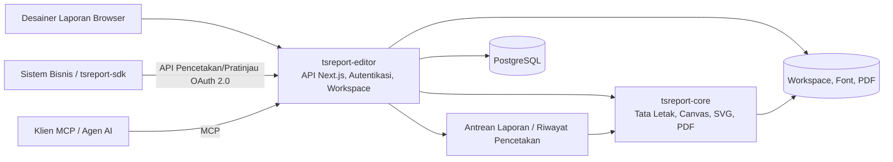

# tsreport-editor

[English](./README.md) | [日本語](./README.ja.md) | [简体中文](./README.zh-CN.md) | [繁體中文](./README.zh-TW.md) | [한국어](./README.ko.md) | [Tiếng Việt](./README.vi.md) | [ไทย](./README.th.md) | Bahasa Indonesia | [Deutsch](./README.de.md) | [Français](./README.fr.md) | [Español](./README.es.md) | [Português](./README.pt.md) | [العربية](./README.ar.md) | [עברית](./README.he.md)

`tsreport-editor` adalah desainer laporan sekaligus server laporan berbasis browser yang menggunakan [`tsreport-core`](https://www.npmjs.com/package/tsreport-core) sebagai mesin tata letak dan rendering.

Ini bukan hanya layar untuk mendesain laporan. Satu server ini menyediakan pengelolaan template `.report` dan aset, pratinjau menggunakan data nyata, impor PDF, API pencetakan OAuth 2.0 untuk sistem eksternal, MCP untuk agen AI, antrean laporan asinkron, hingga jejak audit pencetakan.

- **Desainer Laporan** — mengedit band, teks, bentuk, gambar, SVG, tabel, sub-laporan, barcode, rumus, dan lainnya di browser.
- **Kesesuaian Pratinjau dan PDF** — Editor, pratinjau cetak, dan keluaran PDF menggunakan hasil tata letak dan implementasi rendering `tsreport-core` yang sama.
- **Operasional Multibahasa dan Font** — pengelolaan font per akun, font tersemat, outline, font hasil impor PDF, serta penataan tipografi untuk bahasa Jepang, Tiongkok, Korea, aksara Arab, dan lainnya.
- **Server API Laporan** — mencetak secara asinkron template yang dikunci dengan tag publikasi melalui OAuth 2.0 Client Credentials.
- **Server MCP** — memungkinkan AI membaca, mengedit, memvalidasi template, memeriksa tata letak, merender PNG/PDF, mengimpor PDF asli, dan membandingkan perbedaan.
- **Operasional dan Jejak Audit** — pencetakan API diproses melalui antrean, dan keluaran PDF dari Editor, API, maupun MCP dicatat ke riwayat pencetakan per akun.

## Desain laporan AI dengan MCP

Video ini menunjukkan AI mendesain laporan melalui MCP hingga membuka pratinjau hasil akhirnya. Versi bahasa Inggris juga memperlihatkan dukungan untuk laporan multibahasa.

| Versi bahasa Inggris — laporan multibahasa | Versi bahasa Jepang |
| --- | --- |
| [](https://youtu.be/CHsNew6yQr4) | [](https://youtu.be/0I3ljxLUbys) |

### Pengelolaan font

Layar pengelolaan font mendukung pengunduhan Google Fonts dan pengunggahan file font milik Anda sendiri.

[](https://youtube.com/shorts/fAUjfFqaVtY)

## Gambaran Sistem Secara Keseluruhan



`tsreport-core` adalah mesin laporan pure TypeScript tanpa dependensi runtime. `tsreport-editor` membangun Next.js, PostgreSQL, autentikasi, pengelolaan berkas, antrean, dan panel admin di atasnya. Karena sisi Editor menggunakan Argon2id untuk hashing kata sandi dan `sharp` untuk pembuatan PNG di MCP, seluruh server Editor tidak diposisikan sebagai "tanpa dependensi native".

## Fitur Desain Utama

- Band seperti Title, Page Header, Column Header, Detail, Group Header/Footer, Summary, Page Footer, Last Page Footer, Background, No Data, dan lainnya
- Teks tetap, field ekspresi, garis, persegi panjang, elips, jalur vektor, gambar, SVG, frame, tabel, sub-laporan, barcode, rumus, jeda halaman
- Atribut penggambaran termasuk RGB, CMYK, warna spot, gradien, transparansi, clip, dan soft mask
- Pengeditan visual dan JSON untuk `.report`, beberapa tab, Undo/Redo, layer, zoom, pratinjau cetak
- Konfirmasi field, parameter, ekspresi, dan detail berulang menggunakan data uji JSON
- Impor halaman PDF dengan fidelitas tinggi. Mengonversi teks, vektor, gambar, dan font tersemat menjadi elemen laporan yang dapat diedit atau gambar yang dipertahankan
- Tag publikasi template. Memisahkan konten yang sedang diedit dari versi tetap yang digunakan oleh API eksternal

## Mulai Cepat

### Prasyarat

- Docker dan Docker Compose

Paket `tsreport-core` dan `tsreport-react` yang telah dipublikasikan diinstal dari npm sesuai lockfile Editor. Repositori di direktori sebelah tidak digunakan.

Untuk pengembangan dan verifikasi biasa, perintah npm juga dapat dijalankan di `src/` pada host. Docker tetap terisolasi: dependensi dipasang dari lockfile saat image Node.js dibangun, startup container tidak menjalankan `npm install` atau `npm ci`, dan Compose Watch hanya menyinkronkan source sambil mengecualikan `node_modules` milik host.

### Menjalankan

```sh
cd ../tsreport-editor/server
docker compose up --build --watch
```

Untuk menjalankan di latar belakang:

```sh
cd ../tsreport-editor/server
docker compose up -d --build
docker compose ps
docker compose logs -f tsreport_editor_node
```

`server/compose.yaml` untuk pengembangan mengunci nama proyek Compose menjadi `tsreport-editor-dev`, sehingga namespace container dan jaringan terpisah dari produk lain di host yang sama maupun proyek `tsreport-editor` produksi.

Untuk menghentikan:

```sh
cd ../tsreport-editor/server
docker compose down
```

Untuk operasional normal yang menghentikan layanan sambil mempertahankan data, jangan gunakan `down -v` atau menghapus direktori NFS/DB.

### Layanan dan Port Pengembangan

| Layanan | Peran | Sisi Host |
| --- | --- | --- |
| `tsreport_editor_node` | Editor Next.js, REST API | `http://localhost:52005` |
| `tsreport_editor_node` | Listener MCP khusus | `http://localhost:52006` |
| `tsreport_editor_node` | Notifikasi pembaruan workspace | `52007` |
| `tsreport_editor_db` | PostgreSQL | `localhost:52437` |
| `tsreport_editor_cron` | Menjalankan antrean laporan setiap 10 detik | Hanya internal |
| `tsreport_editor_nginx` | Reverse proxy HTTP / HTTPS | `52085` / `52448` |

Buka `http://localhost:52005` di browser, atau `https://localhost:52448` yang menggunakan sertifikat self-signed.

## Login Pertama Kali dan Konfigurasi Keamanan Wajib

Pada saat pertama kali dijalankan, aplikasi membuat data awal skema, akun, workspace, dan template regresi hanya sekali di bawah kunci DB.

| Kegunaan | ID Login | Kata Sandi Awal | Hak Akses |
| --- | --- | --- | --- |
| Administrator awal | `admin` | `pass` | Administrator |
| Untuk pengujian regresi | `test` | `pass` | Pengguna umum |

> **Penting:** Kata sandi awal adalah kredensial inisialisasi yang telah dipublikasikan. Pastikan untuk mengubahnya sebelum memulai operasional. UI saat ini tidak secara otomatis memaksa perubahan pada login pertama, sehingga operator harus memastikan sendiri perubahan tersebut telah selesai.

Setelah login pertama, lakukan langkah berikut dari menu hamburger.

1. Ubah kata sandi awal melalui "Ubah Kata Sandi" pada `admin`.
2. Hapus `test` di lingkungan yang tidak menggunakannya untuk pengujian regresi. Jika tetap dipertahankan, pastikan kata sandinya diubah.
3. Regenerasi kunci MCP melalui "Pengaturan MCP" pada akun awal yang dipertahankan.
4. Hapus klien API regresi `test-report-client`, atau atur ulang Client Secret dan hak aksesnya.
5. Ubah kredensial DB dan `REPORT_BATCH_TOKEN` dari nilai default pada `server/node/.env` dan `.env` produksi.
6. Sebelum dipublikasikan secara eksternal, ganti sertifikat self-signed nginx dengan sertifikat resmi, dan periksa port publik serta firewall.

Kata sandi akun lokal di-hash dengan Argon2id sebelum disimpan ke DB. Setidaknya satu akun, termasuk administrator, harus tetap dipertahankan sebagai administrator.

## Alur Penggunaan Dasar

1. Login dan buka workspace akun.
2. Daftarkan font yang diperlukan untuk laporan melalui "Pengelolaan Font".
3. Buat `.report` baru, atau buka `.report`/PDF yang sudah ada.
4. Tempatkan band dan elemen, dan tentukan data uji JSON bila diperlukan.
5. Periksa beberapa halaman, luapan detail, dan halaman terakhir pada tampilan Editor dan pratinjau cetak.
6. Keluarkan PDF. Keluaran dicatat ke riwayat pencetakan akun sendiri.
7. Jika digunakan dari sistem eksternal, buat tag publikasi dan atur klien API beserta hak aksesnya.

Penyimpanan normal memperbarui berkas yang sedang diedit di workspace. Karena tag publikasi mengunci JSON template pada saat itu, penyimpanan normal setelahnya tidak mengubah hasil pencetakan API dari tag yang sudah ada. Jika ingin mempublikasikan perubahan ke luar, buat tag baru atau perbarui tag target secara eksplisit.

## Pengelolaan Versi Template Laporan dengan Tag Publikasi

Tag publikasi bukan sekadar flag yang mengubah `.report` yang sedang diedit menjadi status publikasi eksternal. Ini adalah **mekanisme untuk menyimpan konten template laporan sebagai versi, sehingga versi tersebut dapat ditentukan berdasarkan nama dari API eksternal**.

Misalnya, setelah konten template faktur saat ini dipublikasikan sebagai `v1`, `invoice.report` di workspace tetap dapat terus diedit. Perubahan melalui penyimpanan normal tidak otomatis tercermin ke `v1`. Jika konten setelah perubahan dipublikasikan sebagai `v2`, sistem eksternal dapat secara eksplisit memilih versi yang digunakan pada URL API.

```text
invoice.report (versi kerja yang sedang diedit)
  ├─ v1 (JSON templat yang sudah dipublikasikan)
  └─ v2 (JSON templat yang dipublikasikan setelah perubahan)

POST /api/report/print/{workspaceKey}/invoice.report/v1
POST /api/report/print/{workspaceKey}/invoice.report/v2
```

Pemisahan ini memungkinkan operasional berikut.

- Sistem bisnis tetap menggunakan `v1` yang sudah ada selama tata letak laporan baru masih diedit dan diverifikasi
- Mengganti pemanggil dari `v1` ke `v2` sesuai waktu peralihan di sisi pengguna API
- Membiarkan beberapa versi berdampingan, dengan mitra integrasi yang berbeda menggunakan versi yang berbeda
- Jika ditemukan masalah, mengembalikan penunjukan API ke tag sebelumnya tanpa menulis ulang berkas template

Saat membuat tag baru, JSON template pada saat itu disimpan. Tag yang sama juga dapat diperbarui secara eksplisit, tetapi dalam hal itu konten yang ditunjuk oleh URL API yang sama juga berubah. Untuk operasional yang mementingkan reproduktibilitas atau migrasi bertahap, buat tag baru seperti `v1`, `v2`, `2026-07` alih-alih menimpa tag yang sudah ada.

Yang dikunci oleh tag publikasi adalah JSON template. `rows` dan `parameters` pada saat pemanggilan API tidak termasuk dalam versi, dan ditentukan untuk setiap permintaan pencetakan. Selain itu, "publikasi" di sini tidak berarti dipublikasikan secara anonim ke internet. Untuk benar-benar menggunakannya dari API, scope OAuth 2.0, hak akses klien API, dan hak akses workspace pengguna pemilik semuanya harus terpenuhi.

## Pengguna, Workspace, dan Berbagi

### Pengelolaan Pengguna

- Setiap akun memiliki satu workspace.
- Workspace diidentifikasi dengan `workspaceKey` berupa UUID yang tidak dapat diubah.
- Administrator dapat membuat pengguna, mengelola nama tampilan, ID login, hak akses, izin penggunaan MCP, kata sandi, serta pengaturan sistem.
- Bahkan administrator tidak dapat melihat workspace akun lain tanpa syarat. Data laporan dipisahkan per tenant.
- Penghapusan pengguna bersifat penghapusan fisik. Data terkait termasuk workspace, font, berbagi, klien API, token, dan riwayat pencetakan akan dihapus dan tidak dapat dipulihkan.

### Berbagi Folder

Bukan seluruh workspace, tetapi hanya folder yang diperlukan yang dapat dibagikan ke akun lain.

- Tujuan berbagi ditentukan dengan `workspaceKey` pihak lain.
- Baca dan tulis dapat diizinkan secara terpisah.
- Berbagi baca mengizinkan referensi ke template atau aset, berbagi tulis mengizinkan pengeditan bersama.
- Penerima berbagi dapat membatalkan berbagi yang diterima.
- Cakupan akses efektif yang sama juga berlaku pada API dan MCP.

Saat Editor atau MCP memperbarui workspace, event pembaruan diberitahukan ke tab Editor lain. Jika tidak ada perubahan yang belum disimpan, halaman dimuat ulang; jika ada perubahan yang belum disimpan, pengeditan lokal dilindungi dan peringatan ditampilkan.

Berbagi, hak akses API, dan tag publikasi memiliki tujuan yang berbeda.

| Konsep | Objek | Peran |
| --- | --- | --- |
| Berbagi Folder | Antar akun | Mengizinkan baca/tulis untuk operasi Editor manusia dan MCP yang berjalan sebagai akun tersebut |
| Hak Akses API | Klien API | Membatasi `workspaceKey` dan folder yang dapat dirujuk oleh sistem eksternal |
| Tag Publikasi | Versi `.report` | Mengunci konten template yang digunakan untuk pencetakan API |

Meskipun hanya menambahkan hak akses API, jika pengguna pemilik sendiri tidak memiliki hak akses ke folder target, tidak dapat digunakan. Sebaliknya, hanya dengan berbagi folder saja tidak akan dipublikasikan ke API eksternal.

## Menambahkan dan Mengelola Font

"Pengelolaan Font" di menu hamburger dapat digunakan oleh semua pengguna. Font disimpan per akun di `/var/nfs/fonts/{accountId}/` dan tidak terlihat dari akun lain.

### Unggah

1. Buka "Pengelolaan Font".
2. Tambahkan melalui pemilihan berkas, atau drag & drop.
3. Pilih ID font yang ditampilkan di daftar pada `fontFamily` elemen teks.

Format yang didukung adalah TTF, OTF, TTC, OTC, WOFF, WOFF2. Batas aplikasi untuk satu berkas adalah 256MiB. Beberapa font sistem seperti `/System/Library/Fonts` di macOS dapat dipilih dan didaftarkan sekaligus. Font OS host tidak dibaca secara implisit, dan font tidak diinstal ke OS.

Duplikasi ditentukan sebagai berikut.

- ID font sama, biner sama: dianggap berhasil sebagai percobaan ulang unggah massal
- ID font sama, biner berbeda: ditolak sebagai konflik ID
- ID font berbeda, biner sama: menunjukkan ID yang sudah ada dan ditolak sebagai duplikat
- Hanya informasi meta seperti nama family atau nama PostScript yang sama: dapat didaftarkan sebagai font independen jika binernya berbeda

Kecocokan konten ditentukan bukan hanya dari informasi meta atau hash, tetapi dari perbandingan seluruh byte setelah ukuran berkas cocok.

### Google Fonts dan Font Hasil Impor PDF

Pada "Download Google Fonts", Anda dapat memilih bahasa dan mengunduh kandidat ke area akun. Ini mengasumsikan koneksi ke jaringan eksternal tersedia.

Pada impor PDF, font tersemat yang dapat digunakan kembali didaftarkan sebagai font aplikasi dalam akun. Jika tidak ada program font, nama dan gaya dicocokkan dari font akun, dan kandidat serta peringatan ditampilkan.

## Menggunakan API Pencetakan Eksternal

API eksternal menggunakan Bearer Token OAuth 2.0 Client Credentials, bukan cookie login layar. Untuk memulai penggunaan, diperlukan 3 hal berikut.

1. **Tag Publikasi** — buat versi tetap dari `.report` yang digunakan API.
2. **Klien API** — buat Client ID, Client Secret, dan scope melalui "Klien API" di menu hamburger.
3. **Hak Akses** — daftarkan `workspaceKey` dan folder yang dapat digunakan klien.

Scope yang tersedia adalah `report:print`, `report:status`, `report:download`, `report:preview`. Cakupan efektif klien API adalah irisan dari "hak akses klien" dan "workspace/folder berbagi yang dapat diakses oleh pengguna pemilik sendiri".

### Alur REST API

```text
POST /api/oauth/token
  grant_type=client_credentials
  -> access_token

POST /api/report/print/{workspaceKey}/{templatePath}/{tag}
  -> { key }

GET /api/report/status/{key}
  -> queued | processing | completed | error

GET /api/report/download/{key}
  -> application/pdf
```

Contoh:

```sh
BASE_URL=http://localhost:52005
CLIENT_ID=test-report-client
CLIENT_SECRET=test-report-secret

TOKEN=$(curl -sS -u "$CLIENT_ID:$CLIENT_SECRET" \
  -d grant_type=client_credentials \
  -d 'scope=report:print report:status report:download' \
  "$BASE_URL/api/oauth/token" | jq -r .access_token)

curl -sS \
  -H "Authorization: Bearer $TOKEN" \
  -H 'Content-Type: application/json' \
  -d '{"rows":[{"item":"seed"}],"parameters":{}}' \
  "$BASE_URL/api/report/print/00000000-0000-0000-0000-000000000002/invoice.report/v1"
```

Bahkan jika `templatePath` mengandung `/`, segmen terakhir setelahnya diselesaikan sebagai tag. Status dan download hanya dapat dirujuk oleh klien API yang sama yang membuat permintaan pencetakan.

### tsreport-sdk

Dengan menggunakan [`tsreport-sdk`](../tsreport-sdk), Anda dapat menangani pengambilan token, pengiriman antrean, polling, dan pengambilan PDF dalam satu API TypeScript.

```ts
import { TsreportClient } from 'tsreport-sdk'

const client = new TsreportClient({
    baseUrl: 'https://reports.example.com',
    clientId: process.env.REPORT_CLIENT_ID!,
    clientSecret: process.env.REPORT_CLIENT_SECRET!
})

const pdf = await client.printAndDownload(
    '00000000-0000-0000-0000-000000000002',
    'orders/invoice.report',
    'v1',
    { rows: [{ orderId: 42 }], parameters: {} }
)
```

Jangan menyematkan Client Secret di browser. Jika digunakan dari aplikasi browser, lakukan melalui backend terautentikasi milik sistem sendiri. Untuk relay aman API aset pratinjau, dapat digunakan `createPreviewEndpoint` dari `tsreport-sdk/server`.

## Antrean Laporan dan Jejak Audit Pencetakan

Permintaan pencetakan dari API didaftarkan sebagai `queued` ke `PrintRequest` di DB. `tsreport_editor_cron` menjalankan endpoint batch yang terautentikasi setiap 10 detik, memindahkan status dari `queued` → `processing` → `completed` atau `error`. Eksekusi bersamaan diserialisasi dengan kunci DB.

PDF yang dihasilkan disimpan di `/var/nfs/report-pdf`. Di layar riwayat pencetakan, Anda dapat memeriksa hal berikut untuk akun sendiri.

- Tanggal dan waktu eksekusi
- Jalur eksekusi: `editor` / `api` / `mcp`
- Workspace, template, format
- Status selesai/error dan alasan error
- Unduh ulang PDF yang telah selesai

PDF yang dihasilkan di Editor dicatat ke API riwayat dari browser. `render_report(format="pdf")` dari MCP juga dicatat ke riwayat. Riwayat dipisahkan per akun, dan bahkan administrator tidak dapat melihat riwayat akun lain.

Untuk operasional, cadangkan DB dan `server/nfs` sebagai titik pemulihan yang sama. Jika hanya baris riwayat, atau hanya berkas PDF yang dipulihkan, jejak audit dan hasil kerja tidak akan konsisten. Masa retensi dan pemantauan disk sesuai jumlah keluaran juga harus ditentukan oleh pihak operasional.

## Menggunakan MCP

MCP independen dari klien OAuth API pencetakan eksternal. Autentikasi menggunakan ID login dan kunci MCP masing-masing pengguna, dan beroperasi dengan hak akses workspace/berbagi yang sama seperti pengguna tersebut.

### Aktivasi dan Kredensial

1. Buka "Pengaturan MCP" dari menu hamburger.
2. Aktifkan penggunaan MCP Anda sendiri.
3. Salin kunci MCP. Regenerasi kunci awal sebelum operasional.
4. Administrator dapat mengatur ON/OFF MCP secara keseluruhan dan port khusus di layar yang sama.

Biasanya digunakan `http://localhost:52005/api/mcp` yang sama dengan Next.js. Di lingkungan pengembangan, listener khusus `http://localhost:52006` juga dapat digunakan. Atur URL Streamable HTTP dan salah satu autentikasi berikut di klien MCP.

- `x-mcp-account: <ID login>` dan `x-mcp-key: <kunci MCP>`
- `Authorization: Bearer <ID login>:<kunci MCP>`

Panduan pengaturan dapat diperoleh tanpa autentikasi.

```sh
curl http://localhost:52005/api/mcp
```

Contoh memeriksa daftar tool:

```sh
curl -sS http://localhost:52005/api/mcp \
  -H 'Content-Type: application/json' \
  -H 'x-mcp-account: admin' \
  -H 'x-mcp-key: <kunci MCP yang dibuat ulang>' \
  -d '{"jsonrpc":"2.0","id":1,"method":"tools/list","params":{}}'
```

### Tool MCP

| Kategori | Tool |
| --- | --- |
| Pengenalan | `get_started` |
| Penemuan | `list_workspaces`, `list_templates`, `list_workspace_files`, `list_fonts` |
| Template | `get_template`, `get_template_schema`, `validate_template`, `save_template`, `update_template_elements` |
| Aset | `save_workspace_file`, `delete_workspace_file` |
| Verifikasi/Keluaran | `layout_report`, `render_report`, `compare_reports` |
| Impor Asli | `import_pdf` |

Alur kerja yang direkomendasikan adalah sebagai berikut.

1. Baca `get_started` dan `get_template_schema`.
2. Periksa sumber daya yang tersedia dengan `list_workspaces`, `list_templates`, `list_workspace_files`, `list_fonts`.
3. Buat template atau ambil dengan `get_template`.
4. Validasi struktur dan ekspresi dengan `validate_template`.
5. Periksa secara numerik koordinat absolut, jumlah halaman, dan elemen di luar jangkauan dengan `layout_report`.
6. Periksa secara visual dengan `render_report(format="png")`.
7. Simpan dengan `save_template` atau `update_template_elements`.
8. Bandingkan sebelum dan sesudah perubahan dengan `compare_reports`, dan pastikan tidak ada pergeseran yang tidak disengaja.

Jika ada PDF asli, jangan membuat ulang secara visual, tetapi lanjutkan dengan urutan `save_workspace_file` → `import_pdf` → penyesuaian ekspresi atau band → `layout_report` / `render_report`.

## Bahasa dan Integrasi Eksternal Opsional

UI Editor dapat memilih bahasa Jepang, Inggris, Tiongkok Sederhana, Korea, Tiongkok Tradisional, Vietnam, Thai, Indonesia, Jerman, Prancis, Spanyol, Portugis, Arab, dan Ibrani. Untuk bahasa Arab dan Ibrani, UI juga menjadi RTL. Ini tidak membatasi sistem penulisan yang dapat digunakan dalam laporan.

Administrator dapat mengatur login eksternal Google/Microsoft. Jika login eksternal tidak diaktifkan, operasional dapat dilakukan hanya dengan akun lokal yang dilindungi Argon2id.

Jika menggunakan fitur bantuan AI, daftarkan API key dan model ke pengaturan sistem di DB. Nilai awal tidak menyertakan API key eksternal yang valid. Jangan menyimpan nilai rahasia ke source, `.report`, workspace, atau README.

## Data Awal dan Lingkungan Regresi

Pada saat pertama kali dijalankan, hal berikut dibuat.

- Akun `admin` dan `test`, serta `workspaceKey` tetap
- Klien API regresi `test-report-client` milik `test`
- `invoice.report`, `sub.report`, `assets/logo.png` di workspace `test`
- Tag publikasi `v1` dari `invoice.report`
- Berbagi baca/tulis folder `assets` dari `test` ke `admin`

Kunci tetap:

- `admin`: `00000000-0000-0000-0000-000000000001`
- `test`: `00000000-0000-0000-0000-000000000002`

Ini digunakan untuk regresi server nyata `tsreport-editor`, `tsreport-sdk`, dan `tsreport-react`. Untuk operasional produksi, pastikan untuk mengubah atau menghapus kredensial awal yang disebutkan di atas.

### Mengembalikan DB Pengembangan ke Status Awal

Jika ingin membuat ulang PostgreSQL lingkungan pengembangan sepenuhnya, hentikan container, lalu hapus `server/db/pgdata/data`, dan restart.

```sh
cd ../tsreport-editor/server
docker compose down
rm -rf db/pgdata/data
docker compose up --build --watch
```

Saat restart, DDL PostgreSQL diterapkan, dan data awal DB seperti akun awal, klien API, tag publikasi dibuat ulang saat aplikasi dijalankan. Berkas workspace regresi hanya ditambahkan jika kurang. Jangan menghapus `pgdata` saat container DB sedang berjalan.

Operasi ini menginisialisasi PostgreSQL. Workspace, font, PDF yang dihasilkan yang disimpan di `server/nfs` tidak dihapus. Jika perlu mengembalikan DB dan NFS keduanya ke status awal, gunakan "Reset Pabrik" di menu administrator.

"Reset Pabrik" menghapus semua tabel DB, workspace, dan keluaran laporan, lalu membuat ulang status awal. Tidak dapat dikembalikan. Font, sertifikat, dotfile seperti `.gitignore` tidak termasuk objek yang dihapus.

## Lokasi Penyimpanan Data

| Data | Dalam Container | Sisi Host Pengembangan |
| --- | --- | --- |
| PostgreSQL | `/var/pgdata/data` | `server/db/pgdata` |
| Workspace | `/var/nfs/workspaces/{workspaceKey}` | `server/nfs/workspaces` |
| Font Akun | `/var/nfs/fonts/{accountId}` | `server/nfs/fonts` |
| PDF yang Dihasilkan | `/var/nfs/report-pdf` | `server/nfs/report-pdf` |
| Log nginx | `/var/log/nginx` | `logs/nginx` |

Ekspor/impor data aplikasi dapat dijalankan dari menu administrator. Untuk pemulihan bencana seluruh lingkungan, jangan hanya bergantung pada fitur ini, tetapi juga pertahankan backup PostgreSQL dan NFS yang konsisten.

## Build dan Menjalankan Produksi

Build dan menjalankan produksi juga mengasumsikan Docker Compose. `build.sh`, `build_boot.sh`, `boot.sh`, `boot_db.sh`, `boot_web.sh`, `build_boot_web.sh` adalah wrapper tipis untuk memanggil Docker Compose. Ini bukan prosedur untuk menginstal dependensi Node.js ke host dan menjalankan `server.js` secara langsung.

### 1. Persiapan Sebelumnya

`tsreport-core` dan `tsreport-react` dipulihkan dari npm pada versi yang dikunci oleh `src/package-lock.json`.

```sh
cd ../tsreport-editor/server
```

Edit konfigurasi untuk produksi.

- `boot/web/.env`: informasi koneksi DB dan `REPORT_BATCH_TOKEN`
- `boot/compose.yaml`: pengaturan PostgreSQL untuk konfigurasi server tunggal
- `boot/db/compose.yaml`: pengaturan PostgreSQL untuk konfigurasi terpisah DB/Web
- `nginx/cert`: sertifikat TLS resmi
- `nginx/conf`: nama host publik, tujuan penerusan, kontrol akses yang diperlukan

Pastikan `DB_PASS` di `boot/web/.env` cocok dengan `DB_PASS` di Compose konfigurasi yang digunakan. Web dan cron menggunakan `REPORT_BATCH_TOKEN` yang sama di `boot/web/.env`. Nilai dalam repositori untuk penggunaan lokal, pastikan diubah untuk produksi.

### 2. Build Produksi

```sh
cd ../tsreport-editor/server
./build.sh
```

`build.sh` tidak memulihkan dependensi Node.js di sisi host. Ini menyinkronkan `src` ke `server/build/src`, menjalankan production build Next.js di lingkungan build Docker yang terisolasi, dan menempatkan hasil standalone ke berikut.

```text
server/boot/web/dist/standalone/
  ├─ server.js
  ├─ .next/
  ├─ node_modules/
  ├─ public/
  └─ seed/
```

Build termasuk pemeriksaan TypeScript dan production compilation Next.js. Pastikan perintah berhasil dan `boot/web/dist/standalone/server.js` ada sebelum menjalankan.

### 3. Menjalankan Server yang Sudah Dibangun (Tanpa Rebuild)

Jika `./build.sh` sudah berhasil dan `boot/web/dist/standalone/server.js` ada, server produksi dapat dijalankan tanpa mengulangi production build Next.js.

Untuk menjalankan DB dan Web di server yang sama:

```sh
cd ../tsreport-editor/server
./boot.sh
```

Jika memisahkan server DB dan server Web, jalankan masing-masing di host DB dan host Web.

```sh
# Host DB
cd ../tsreport-editor/server
./boot_db.sh

# Host web
cd ../tsreport-editor/server
./boot_web.sh
```

`boot.sh` dan `boot_web.sh` memasang `boot/web/dist/standalone` yang sudah ada ke container Node.js dan menjalankannya dengan PM2. Docker runtime image diperbarui oleh Compose sesuai kebutuhan, tetapi production build Next.js tidak dijalankan. Untuk mencerminkan perubahan source, jalankan ulang `./build.sh` terlebih dahulu.

### 4-A. Konfigurasi Server Tunggal

Konfigurasi yang menjalankan DB, Node.js, cron antrean laporan, dan nginx pada instance server yang sama. Dari build hingga menjalankan secara persisten, jalankan dengan satu perintah berikut.

```sh
cd ../tsreport-editor/server
./build_boot.sh
```

Jika sudah dibangun dan hanya perlu menjalankan, jalankan `./boot.sh`. `boot.sh` menggunakan `boot/compose.yaml`, dan menjalankan seluruh layanan berikut di latar belakang sebagai proyek `tsreport-editor` yang tidak berbenturan dengan proyek Compose produk lain.

| Layanan | Peran | Port Publik |
| --- | --- | --- |
| `tsreport_editor_db` | PostgreSQL | `52437` |
| `tsreport_editor_node` | Next.js standalone yang sudah dibangun, MCP, notifikasi pembaruan | `52005`, `52006`, `52007` |
| `tsreport_editor_cron` | Menjalankan antrean laporan asinkron setiap 10 detik | Tidak ada |
| `tsreport_editor_nginx` | Reverse proxy HTTP/HTTPS | `52085`, `52448` |

Container Web memasang hanya `boot/web/dist/standalone`, bukan pohon source, ke `/var/node`, dan menjalankan `server.js` dalam cluster mode PM2. Perubahan pada `src` selama berjalan tidak tercermin ke server produksi. Untuk mencerminkan perubahan, jalankan ulang `./build.sh` lalu restart layanan Web.

Konfirmasi menjalankan:

```sh
docker compose --project-name tsreport-editor -f boot/compose.yaml ps
docker compose --project-name tsreport-editor -f boot/compose.yaml logs -f tsreport_editor_node
```

Menghentikan:

```sh
docker compose --project-name tsreport-editor -f boot/compose.yaml down
```

### 4-B. Konfigurasi Terpisah Server DB dan Server Web

Konfigurasi yang menjalankan PostgreSQL di server khusus DB, dan Node.js, cron antrean laporan, nginx di server Web. Tempatkan repositori ini di kedua host, dan jalankan satu perintah masing-masing di host DB dan host Web.

Di host DB, jalankan hanya `boot/db/compose.yaml`.

```sh
cd ../tsreport-editor/server
./boot_db.sh
```

Ubah `boot/web/.env` di host Web ke nama DNS privat atau alamat IP host DB, dan port yang dipublikasikan host DB.

```dotenv
DB_HOST=db.internal.example
DB_PORT=52437
DB_NAME=TSREPORT_EDITOR_DB
DB_USER=postgres
DB_PASS=kata sandi DB untuk produksi
REPORT_BATCH_TOKEN=rahasia bersama untuk produksi
```

Di host Web, jalankan production build dan menjalankan layanan sisi Web secara persisten dengan satu perintah.

```sh
cd ../tsreport-editor/server
./build_boot_web.sh
```

Jika sudah dibangun dan hanya perlu menjalankan sisi Web, jalankan `./boot_web.sh`. `boot/web/compose.yaml` sisi Web hanya menjalankan Node.js, cron, nginx, dan tidak membuat container PostgreSQL.

Konfirmasi menjalankan konfigurasi terpisah:

```sh
# Host DB
docker compose --project-name tsreport-editor-db -f boot/db/compose.yaml ps
docker compose --project-name tsreport-editor-db -f boot/db/compose.yaml logs -f tsreport_editor_db

# Host web
docker compose --project-name tsreport-editor-web -f boot/web/compose.yaml ps
docker compose --project-name tsreport-editor-web -f boot/web/compose.yaml logs -f tsreport_editor_node
```

Menghentikan konfigurasi terpisah:

```sh
# Host web
docker compose --project-name tsreport-editor-web -f boot/web/compose.yaml down

# Host DB
docker compose --project-name tsreport-editor-db -f boot/db/compose.yaml down
```

Jangan mempublikasikan `52437` DB langsung ke internet, izinkan hanya di dalam jaringan privat yang dapat dijangkau dari host Web. Samakan `DB_PASS` di `boot/db/compose.yaml` sisi host DB dan `DB_PASS` di `boot/web/.env` sisi Web. Workspace, font, PDF yang dihasilkan disimpan di `server/nfs` sisi host Web, dan sistem berkas bersama dengan host DB tidak diperlukan.

### 5. Konfirmasi Operasional Umum

Buka `https://<host Web>:52448` atau `http://<host Web>:52005` di browser. Jika menggunakan API pencetakan eksternal, pastikan juga `tsreport_editor_cron` dalam status `Up`.

Pada penghentian/restart normal, `server/db/pgdata` dan `server/nfs` sisi host Web dipertahankan. Hanya jika inisialisasi DB diperlukan, ikuti prosedur inisialisasi yang disebutkan di atas dan hapus `db/pgdata/data` setelah menghentikan layanan DB.

Sebelum publikasi produksi, periksa setidaknya hal berikut.

- Pengguna awal, kunci MCP, klien API regresi telah diubah atau dihapus
- Kata sandi DB dan `REPORT_BATCH_TOKEN` telah diubah
- Sertifikat TLS resmi telah dikonfigurasi
- `/api/report/batch/process` tidak dipublikasikan tanpa autentikasi ke eksternal
- Ada backup dan pemantauan kapasitas untuk DB, workspace, font, PDF yang dihasilkan
- Font yang diperlukan dan tag publikasi telah didaftarkan ke akun target
- Editor, pratinjau, dan pencetakan API telah diperiksa dengan laporan multi-halaman yang setara data nyata

## Variabel Lingkungan

Pengaturan aplikasi ditempatkan di `server/node/.env` untuk pengembangan, dan `server/boot/web/.env` untuk produksi.

| Variabel | Deskripsi | Nilai Default Pengembangan |
| --- | --- | --- |
| `DB_HOST` | Host PostgreSQL | `172.31.0.30` |
| `DB_PORT` | Port PostgreSQL | `15432` |
| `DB_NAME` | Nama DB | `TSREPORT_EDITOR_DB` |
| `DB_USER` | Pengguna DB | `postgres` |
| `DB_PASS` | Kata sandi DB | `postgres1234` |
| `REPORT_BATCH_TOKEN` | Secret bersama untuk menjalankan batch | `tsreport-report-batch-local` |
| `WORKSPACES_ROOT` | Root workspace | `/var/nfs/workspaces` |
| `NEXT_TELEMETRY_DISABLED` | Menonaktifkan telemetry Next.js | `1` |

Status aktif keseluruhan MCP dan port khusus dikelola sebagai pengaturan sistem di DB dan diubah dari panel admin. Pengaturan OAuth untuk login eksternal dan pengaturan bantuan AI opsional juga dikelola melalui panel admin/SystemProperty, jangan menuliskan nilai rahasia ke README atau source.

## Pengembangan dan Verifikasi

```sh
cd ../tsreport-editor

docker compose -f server/compose.yaml exec tsreport_editor_node npx tsc --noEmit
docker compose -f server/compose.yaml exec tsreport_editor_node npm test
docker compose -f server/compose.yaml exec \
  -e TSREPORT_EDITOR_LIVE_BASE=http://localhost:3000 \
  tsreport_editor_node npm run test:live

cd server
./build.sh
```

Pengembangan, pengujian, dan build produksi memulihkan `tsreport-core` dan `tsreport-react` dari npm. Checkout repositori sebelah tidak diperlukan.

## Struktur Repositori

| Path | Konten |
| --- | --- |
| `src/` | Editor Next.js, REST API, MCP, logika server |
| `tests/` | Regresi unit, integrasi, server nyata |
| `server/` | Konfigurasi Docker pengembangan, build, menjalankan produksi |
| `cli/` | Skrip pendukung |

Repositori terkait:

| Repositori | Konten |
| --- | --- |
| [`tsreport-core`](https://github.com/pontasan/tsreport-core) | Mesin tata letak laporan, rendering, PDF, font pure TypeScript |
| [`tsreport-editor`](https://github.com/pontasan/tsreport-editor) | Desainer laporan dan server laporan berbasis browser ini |
| [`tsreport-sdk`](https://github.com/pontasan/tsreport-sdk) | SDK TypeScript tanpa dependensi untuk API pencetakan/pratinjau |
| [`tsreport-react`](https://github.com/pontasan/tsreport-react) | UI pratinjau React yang menggunakan `tsreport-core` |

## Lisensi

tsreport-editor dapat digunakan berdasarkan pilihan pengguna dengan [MIT License](./LICENSE-MIT) atau [Apache License 2.0](./LICENSE-APACHE) (SPDX: `MIT OR Apache-2.0`).
