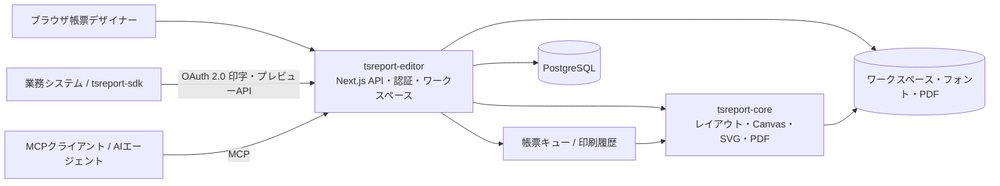

# tsreport-editor

[English](./README.md) | 日本語 | [简体中文](./README.zh-CN.md) | [繁體中文](./README.zh-TW.md) | [한국어](./README.ko.md) | [Tiếng Việt](./README.vi.md) | [ไทย](./README.th.md) | [Bahasa Indonesia](./README.id.md) | [Deutsch](./README.de.md) | [Français](./README.fr.md) | [Español](./README.es.md) | [Português](./README.pt.md) | [العربية](./README.ar.md) | [עברית](./README.he.md)

`tsreport-editor`は、[`tsreport-core`](https://www.npmjs.com/package/tsreport-core)をレイアウト・レンダリングエンジンとして使用する、ブラウザベースの帳票デザイナー兼帳票サーバーです。

帳票を設計する画面だけではありません。`.report`テンプレートと素材の管理、実データを使ったプレビュー、PDF取込み、外部システム向けのOAuth 2.0印字API、AIエージェント向けMCP、非同期帳票キュー、印刷証跡までを一つのサーバーで提供します。

- **帳票デザイナー** — バンド、テキスト、図形、画像、SVG、表、サブレポート、バーコード、数式などをブラウザで編集します。
- **プレビューとPDFの一致** — Editor、印刷プレビュー、PDF出力は同じ`tsreport-core`のレイアウト結果と描画実装を使用します。
- **多言語・フォント運用** — アカウント単位のフォント管理、埋込みフォント、アウトライン、PDF取込みフォント、日本語・中国語・韓国語・アラビア文字などの組版を扱います。
- **帳票APIサーバー** — 公開タグで固定したテンプレートをOAuth 2.0 Client Credentialsで非同期印字します。
- **MCPサーバー** — AIがテンプレートの読取り、編集、検証、レイアウト確認、PNG/PDF描画、PDF原本の取込み、差分比較を実行できます。
- **運用と証跡** — API印字はキュー処理され、Editor・API・MCPのPDF出力はアカウント別の印刷履歴へ記録されます。

## MCPによるAI帳票デザイン

MCP経由でAIが帳票をデザインし、完成した帳票をプレビューするまでの流れを紹介します。英語版では、多言語帳票への対応例も確認できます。

| 英語版 — 多言語帳票への対応例 | 日本語版 |
| --- | --- |
| [](https://youtu.be/CHsNew6yQr4) | [](https://youtu.be/0I3ljxLUbys) |

### フォント管理

フォント管理画面では、Google Fontsのダウンロードと任意のフォントファイルのアップロードが可能です。

[](https://youtube.com/shorts/fAUjfFqaVtY)

## システム全体像



`tsreport-core`はpure TypeScript・runtime依存ゼロの帳票エンジンです。`tsreport-editor`はその上にNext.js、PostgreSQL、認証、ファイル管理、キュー、管理画面を構成します。Editor側ではパスワードハッシュにArgon2id、MCPのPNG生成に`sharp`も使用するため、Editorサーバー全体を「ネイティブ依存ゼロ」とは位置づけていません。

## 主なデザイン機能

- Title、Page Header、Column Header、Detail、Group Header/Footer、Summary、Page Footer、Last Page Footer、Background、No Dataなどのバンド
- 固定テキスト、式フィールド、線、矩形、楕円、ベクタパス、画像、SVG、フレーム、表、サブレポート、バーコード、数式、改ページ
- RGB、CMYK、特色、グラデーション、透明度、クリップ、soft maskを含む描画属性
- `.report`のビジュアル編集とJSON編集、複数タブ、Undo/Redo、レイヤー、ズーム、印刷プレビュー
- JSONテストデータによるフィールド・パラメーター・式・繰り返し明細の確認
- PDFページの高忠実度取込み。テキスト、ベクタ、画像、埋込みフォントを編集可能な帳票要素または保持描画へ変換
- テンプレートの公開タグ。編集中の内容と、外部APIで使用する固定版を分離

## クイックスタート

### 前提

- DockerおよびDocker Compose

公開済みの`tsreport-core`と`tsreport-react`は、Editorのlockfileに従ってnpmからインストールされます。開発・テスト・本番ビルドのいずれも、隣接リポジトリを参照しません。

通常の開発・検証では、ホスト側の`src/`でもnpmコマンドを実行できます。Dockerはホストから分離されており、依存関係はNode.jsイメージのビルド時にlockfileから復元します。コンテナ起動時に`npm install`や`npm ci`は実行せず、Compose Watchはホストの`node_modules`を除外してソースだけを同期します。

### 起動

```sh
cd ../tsreport-editor/server
docker compose up --build --watch
```

ソース同期を行わず、コンテナをバックグラウンドで起動する場合:

```sh
cd ../tsreport-editor/server
docker compose up -d --build
docker compose ps
docker compose logs -f tsreport_editor_node
```

バックグラウンド起動したコンテナでもソースを同期する場合は、別のターミナルで`docker compose watch --no-up`を実行してください。

開発用`server/compose.yaml`はComposeプロジェクト名を`tsreport-editor-dev`に固定しており、同一ホスト上の他製品や本番用`tsreport-editor`プロジェクトとはコンテナ・ネットワークの名前空間を分離します。

停止する場合:

```sh
cd ../tsreport-editor/server
docker compose down
```

データを残したまま停止する通常運用では、`down -v`やNFS/DBディレクトリの削除を行わないでください。

### 開発用サービスとポート

| サービス | 役割 | ホスト側 |
| --- | --- | --- |
| `tsreport_editor_node` | Next.js Editor・REST API | `http://localhost:52005` |
| `tsreport_editor_node` | 専用MCPリスナー | `http://localhost:52006` |
| `tsreport_editor_node` | ワークスペース更新通知 | `52007` |
| `tsreport_editor_db` | PostgreSQL | `localhost:52437` |
| `tsreport_editor_cron` | 帳票キューを10秒間隔で起動 | 内部のみ |
| `tsreport_editor_nginx` | HTTP / HTTPSリバースプロキシ | `52085` / `52448` |

ブラウザでは`http://localhost:52005`、または自己署名証明書を使う`https://localhost:52448`を開きます。

## 初回ログインと必須セキュリティ設定

初回起動時に、アプリケーションがDBロック下でスキーマ初期データ、アカウント、ワークスペース、回帰用テンプレートを一度だけ作成します。

| 用途 | ログインID | 初期パスワード | 権限 |
| --- | --- | --- | --- |
| 初期管理者 | `admin` | `pass` | 管理者 |
| 回帰テスト用 | `test` | `pass` | 一般ユーザー |

> **重要:** 初期パスワードは公開済みの初期化用資格情報です。運用開始前に必ず変更してください。現在のUIは初回ログイン時の変更を自動強制しないため、変更完了は運用者が確認する必要があります。

初回ログイン後、ハンバーガーメニューから次を実施します。

1. `admin`の「パスワード変更」で初期パスワードを変更する。
2. `test`を回帰テストに使わない環境では削除する。残す場合は必ずパスワードを変更する。
3. 残す初期アカウントの「MCP設定」でMCPキーを再生成する。
4. 回帰用APIクライアント`test-report-client`を削除するか、Client Secretとアクセス許可を再設定する。
5. `server/node/.env`および本番`.env`のDB資格情報と`REPORT_BATCH_TOKEN`を既定値から変更する。
6. 外部公開前にnginxの自己署名証明書を正式な証明書へ交換し、公開ポートとファイアウォールを確認する。

ローカルアカウントのパスワードはArgon2idでハッシュ化してDBへ保存されます。管理者を含め、最低1アカウントは管理者として残す必要があります。

## 基本的な利用の流れ

1. ログインし、アカウントのワークスペースを開く。
2. 「フォント管理」で帳票に必要なフォントを登録する。
3. `.report`を新規作成するか、既存`.report`／PDFを開く。
4. バンドと要素を配置し、必要ならテストデータJSONを指定する。
5. Editor表示と印刷プレビューで複数ページ、明細あふれ、最終ページを確認する。
6. PDFを出力する。出力は自アカウントの印刷履歴へ記録される。
7. 外部システムから使う場合は公開タグを作成し、APIクライアントとアクセス許可を設定する。

通常保存はワークスペース上の編集ファイルを更新します。公開タグはその時点のテンプレートJSONを固定するため、後から通常保存しても既存タグのAPI印字結果は変わりません。変更を外部へ公開する場合は、新しいタグを作成するか対象タグを明示的に更新します。

## 公開タグによる帳票テンプレートの版管理

公開タグは、編集中の`.report`を単に外部公開状態へ切り替えるフラグではありません。**帳票テンプレートの内容を版として保存し、その版を外部APIから名前で指定できるようにする仕組み**です。

たとえば、請求書テンプレートの現在の内容を`v1`として公開した後も、ワークスペース上の`invoice.report`は継続して編集できます。通常保存による変更は`v1`へ自動反映されません。変更後の内容を`v2`として公開すれば、外部システムはAPIのURLで使用する版を明示的に選択できます。

```text
invoice.report（編集中の作業版）
  ├─ v1（公開済みのテンプレートJSON）
  └─ v2（変更後に公開したテンプレートJSON）

POST /api/report/print/{workspaceKey}/invoice.report/v1
POST /api/report/print/{workspaceKey}/invoice.report/v2
```

この分離により、次の運用が可能になります。

- 新しい帳票レイアウトを編集・検証している間も、業務システムは既存の`v1`を継続利用する
- API利用側の切替時期に合わせて、呼出先を`v1`から`v2`へ変更する
- 複数の版を併存させ、連携先ごとに異なる版を利用する
- 問題が見つかった場合、テンプレートファイルを書き戻さずにAPIの指定を以前のタグへ戻す

タグを新規作成すると、その時点のテンプレートJSONが保存されます。同じタグを明示的に更新することもできますが、その場合は同じAPI URLが指す内容も変わります。再現性や段階的な移行を重視する運用では、既存タグを上書きせず`v1`、`v2`、`2026-07`など新しいタグを作成してください。

公開タグが固定するのはテンプレートJSONです。API呼出時の`rows`や`parameters`は版に含まれず、印字要求ごとに指定します。また、ここでいう「公開」は匿名でインターネットへ公開する意味ではありません。実際にAPIから利用するには、OAuth 2.0のスコープ、APIクライアントのアクセス許可、所有ユーザーのワークスペース権限をすべて満たす必要があります。

## ユーザー、ワークスペース、共有

### ユーザー管理

- 1アカウントにつき1つのワークスペースを持ちます。
- ワークスペースは変更不可のUUID `workspaceKey`で識別されます。
- 管理者はユーザー作成、表示名・ログインID・権限・MCP利用可否・パスワードの管理、システム設定を行えます。
- 管理者でも他アカウントのワークスペースを無条件には閲覧できません。帳票データはテナント分離されます。
- ユーザー削除は物理削除です。ワークスペース、フォント、共有、APIクライアント、トークン、印刷履歴を含む関連データが削除され、復元できません。

### フォルダー共有

ワークスペース全体ではなく、必要なフォルダーだけを別アカウントへ共有できます。

- 共有先は相手の`workspaceKey`で指定します。
- 読取りと書込みを別々に許可できます。
- 読取り共有はテンプレートや素材の参照、書込み共有は共同編集を許可します。
- 共有先は受け取った共有を解除できます。
- APIとMCPにも同じ実効アクセス範囲が適用されます。

EditorやMCPがワークスペースを更新すると、更新イベントが他のEditorタブへ通知されます。未保存変更がなければ再読込みし、未保存変更がある場合はローカル編集を保護して警告します。

共有、API許可、公開タグは目的が異なります。

| 概念 | 対象 | 役割 |
| --- | --- | --- |
| フォルダー共有 | アカウント間 | 人間のEditor操作と、そのアカウントとして動くMCPに読取り／書込みを許可する |
| APIアクセス許可 | APIクライアント | 外部システムが参照できる`workspaceKey`とフォルダーを制限する |
| 公開タグ | `.report`の版 | API印字に使うテンプレート内容を固定する |

APIアクセス許可だけを追加しても、所有ユーザー自身に対象フォルダーのアクセス権がなければ利用できません。逆に、フォルダー共有だけでは外部APIへ公開されません。

## フォントの追加と管理

ハンバーガーメニューの「フォント管理」は全ユーザーが利用できます。フォントはアカウント単位で`/var/nfs/fonts/{accountId}/`へ保存され、他アカウントからは見えません。

### アップロード

1. 「フォント管理」を開く。
2. ファイル選択、またはドラッグ＆ドロップで追加する。
3. 一覧に表示されたフォントIDをテキスト要素の`fontFamily`で選択する。

対応形式はTTF、OTF、TTC、OTC、WOFF、WOFF2です。単一ファイルのアプリ上限は256MiBです。macOSの`/System/Library/Fonts`など、複数のシステムフォントをまとめて選択して登録できます。ホストOSのフォントを暗黙に読み取ったり、OSへフォントをインストールしたりはしません。

重複は次のように判定します。

- 同じフォントID・同一バイナリ: 一括アップロードの再試行として成功扱い
- 同じフォントID・異なるバイナリ: ID衝突として拒否
- 異なるフォントID・同一バイナリ: 既存IDを示して重複として拒否
- family名やPostScript名などのメタ情報だけが同じ: 別バイナリなら独立フォントとして登録可能

内容一致はメタ情報やハッシュだけではなく、ファイルサイズ一致後の全バイト比較で確定します。

### Google FontsとPDF取込みフォント

「Download Google Fonts」では言語を選び、候補をアカウント領域へダウンロードできます。外部ネットワークへ接続できることが前提です。

PDF取込みでは、再利用可能な埋込みフォントをアカウント内のアプリケーションフォントとして登録します。フォントプログラムがない場合は、アカウントフォントから名称とスタイルを照合し、候補と警告を表示します。

## 外部印字APIを利用する

外部APIは、画面ログイン用CookieではなくOAuth 2.0 Client CredentialsのBearer Tokenを使用します。利用開始には次の3点が必要です。

1. **公開タグ** — APIで使う`.report`の固定版を作成する。
2. **APIクライアント** — ハンバーガーメニューの「APIクライアント」でClient ID、Client Secret、スコープを作成する。
3. **アクセス許可** — クライアントが利用できる`workspaceKey`とフォルダーを登録する。

利用可能なスコープは`report:print`、`report:status`、`report:download`、`report:preview`です。APIクライアントの実効範囲は「クライアントのアクセス許可」と「所有ユーザー自身がアクセスできるワークスペース／共有フォルダー」の積集合です。

### REST APIの流れ

```text
POST /api/oauth/token
  grant_type=client_credentials
  -> access_token

POST /api/report/print/{workspaceKey}/{templatePath}/{tag}
  -> { key }

GET /api/report/status/{key}
  -> queued | processing | completed | error

GET /api/report/download/{key}
  -> application/pdf
```

例:

```sh
BASE_URL=http://localhost:52005
CLIENT_ID=test-report-client
CLIENT_SECRET=test-report-secret

TOKEN=$(curl -sS -u "$CLIENT_ID:$CLIENT_SECRET" \
  -d grant_type=client_credentials \
  -d 'scope=report:print report:status report:download' \
  "$BASE_URL/api/oauth/token" | jq -r .access_token)

curl -sS \
  -H "Authorization: Bearer $TOKEN" \
  -H 'Content-Type: application/json' \
  -d '{"rows":[{"item":"seed"}],"parameters":{}}' \
  "$BASE_URL/api/report/print/00000000-0000-0000-0000-000000000002/invoice.report/v1"
```

`templatePath`に`/`が含まれていても、その後ろの最後のセグメントをタグとして解決します。ステータスとダウンロードは、印字要求を作成した同じAPIクライアントだけが参照できます。

### tsreport-sdk

[`tsreport-sdk`](../tsreport-sdk)を使うと、トークン取得、キュー投入、ポーリング、PDF取得を一つのTypeScript APIで扱えます。

```ts
import { TsreportClient } from 'tsreport-sdk'

const client = new TsreportClient({
    baseUrl: 'https://reports.example.com',
    clientId: process.env.REPORT_CLIENT_ID!,
    clientSecret: process.env.REPORT_CLIENT_SECRET!
})

const pdf = await client.printAndDownload(
    '00000000-0000-0000-0000-000000000002',
    'orders/invoice.report',
    'v1',
    { rows: [{ orderId: 42 }], parameters: {} }
)
```

Client Secretをブラウザへ埋め込まないでください。ブラウザアプリから利用する場合は、自システムの認証済みバックエンドを経由します。プレビュー素材APIの安全な中継には`tsreport-sdk/server`の`createPreviewEndpoint`を使用できます。

## 帳票キューと印刷証跡

APIからの印字要求はDBの`PrintRequest`へ`queued`で登録されます。`tsreport_editor_cron`が認証済みのバッチエンドポイントを10秒間隔で起動し、`queued` → `processing` → `completed`または`error`へ遷移させます。同時実行はDBロックで直列化されます。

生成PDFは`/var/nfs/report-pdf`へ保存されます。印刷履歴画面では、自アカウントについて次を確認できます。

- 実行日時
- 実行経路: `editor` / `api` / `mcp`
- ワークスペース、テンプレート、形式
- 完了／エラー状態とエラー理由
- 完了したPDFの再ダウンロード

Editorで生成したPDFはブラウザから履歴APIへ記録されます。MCPの`render_report(format="pdf")`も履歴へ記録されます。履歴はアカウント分離され、管理者でも別アカウントの履歴は閲覧できません。

運用ではDBと`server/nfs`を同じ復旧点としてバックアップしてください。履歴行だけ、またはPDFファイルだけを復元すると証跡と成果物が一致しません。出力件数に応じた保存期間とディスク監視も運用側で決めてください。

## MCPを利用する

MCPは外部印字APIのOAuthクライアントとは独立しています。各ユーザーのログインIDとMCPキーで認証し、そのユーザーと同じワークスペース／共有権限で動作します。

### 有効化と資格情報

1. ハンバーガーメニューから「MCP設定」を開く。
2. 自分のMCP利用をONにする。
3. MCPキーをコピーする。初期キーは運用前に再生成する。
4. 管理者は同じ画面でMCP全体のON/OFFと専用ポートを設定できる。

通常はNext.jsと同じ`http://localhost:52005/api/mcp`を使います。開発環境では専用リスナー`http://localhost:52006`も利用できます。MCPクライアントにはStreamable HTTPのURLと、次のどちらかの認証を設定します。

- `x-mcp-account: <ログインID>`と`x-mcp-key: <MCPキー>`
- `Authorization: Bearer <ログインID>:<MCPキー>`

セットアップガイドは認証なしで取得できます。

```sh
curl http://localhost:52005/api/mcp
```

ツール一覧を確認する例:

```sh
curl -sS http://localhost:52005/api/mcp \
  -H 'Content-Type: application/json' \
  -H 'x-mcp-account: admin' \
  -H 'x-mcp-key: <再生成したMCPキー>' \
  -d '{"jsonrpc":"2.0","id":1,"method":"tools/list","params":{}}'
```

### MCPツール

| 分類 | ツール |
| --- | --- |
| 導入 | `get_started` |
| 発見 | `list_workspaces`, `list_templates`, `list_workspace_files`, `list_fonts` |
| テンプレート | `get_template`, `get_template_schema`, `validate_template`, `save_template`, `update_template_elements` |
| 素材 | `save_workspace_file`, `delete_workspace_file` |
| 検証・出力 | `layout_report`, `render_report`, `compare_reports` |
| 原本取込み | `import_pdf` |

推奨する作業ループは次のとおりです。

1. `get_started`と`get_template_schema`を読む。
2. `list_workspaces`、`list_templates`、`list_workspace_files`、`list_fonts`で利用可能な資源を確認する。
3. テンプレートを生成または`get_template`で取得する。
4. `validate_template`で構造と式を検証する。
5. `layout_report`で絶対座標、ページ数、範囲外要素を数値確認する。
6. `render_report(format="png")`で視覚確認する。
7. `save_template`または`update_template_elements`で保存する。
8. 変更前後を`compare_reports`で比較し、意図しない移動がないことを確認する。

原本PDFがある場合は、目視で作り直さず、`save_workspace_file` → `import_pdf` → 式やバンドの調整 → `layout_report` / `render_report`の順で進めます。

## 言語と任意の外部連携

Editor UIは日本語、英語、簡体字中国語、韓国語、繁体字中国語、ベトナム語、タイ語、インドネシア語、ドイツ語、フランス語、スペイン語、ポルトガル語、アラビア語、ヘブライ語を選択できます。アラビア語とヘブライ語ではUIもRTLになります。これは帳票内で利用できる文字体系を制限するものではありません。

管理者はGoogle／Microsoftの外部ログインを設定できます。外部ログインを有効にしない場合は、Argon2idで保護されたローカルアカウントだけで運用できます。

AI支援機能を使用する場合は、APIキーとモデルをDBのシステム設定へ登録します。初期値には有効な外部APIキーを含めていません。秘密値をソース、`.report`、ワークスペース、READMEへ保存しないでください。

## 初期データと回帰用環境

初回起動では次を作成します。

- `admin`と`test`アカウント、および固定`workspaceKey`
- `test`所有の回帰用APIクライアント`test-report-client`
- `test`ワークスペースの`invoice.report`、`sub.report`、`assets/logo.png`
- `invoice.report`の公開タグ`v1`
- `test`から`admin`への`assets`フォルダー読取り／書込み共有

固定キー:

- `admin`: `00000000-0000-0000-0000-000000000001`
- `test`: `00000000-0000-0000-0000-000000000002`

これらは`tsreport-editor`、`tsreport-sdk`、`tsreport-react`の実サーバー回帰で使用します。本番運用では前述の初期資格情報を必ず変更または削除してください。

### 開発DBを初期状態へ戻す

開発環境のPostgreSQLを完全に作り直す場合は、コンテナを停止してから`server/db/pgdata/data`を削除し、再起動します。

```sh
cd ../tsreport-editor/server
docker compose down
rm -rf db/pgdata/data
docker compose up --build --watch
```

再起動時にPostgreSQLのDDLが適用され、アプリケーション起動時に初期アカウント、APIクライアント、公開タグなどのDB初期データが再作成されます。回帰用ワークスペースファイルは不足している場合だけ補充されます。DBコンテナの稼働中に`pgdata`を削除してはいけません。

この操作が初期化するのはPostgreSQLです。`server/nfs`に保存されたワークスペース、フォント、生成PDFなどは削除されません。DBとNFSの両方を初期状態へ戻す必要がある場合は、管理者メニューの「ファクトリリセット」を使用してください。

「ファクトリリセット」は全DBテーブル、ワークスペース、帳票出力を削除し、初回状態を再作成します。元に戻せません。フォント、証明書、`.gitignore`等のドットファイルは削除対象外です。

## データの保存場所

| データ | コンテナ内 | 開発ホスト側 |
| --- | --- | --- |
| PostgreSQL | `/var/pgdata/data` | `server/db/pgdata` |
| ワークスペース | `/var/nfs/workspaces/{workspaceKey}` | `server/nfs/workspaces` |
| アカウントフォント | `/var/nfs/fonts/{accountId}` | `server/nfs/fonts` |
| 生成PDF | `/var/nfs/report-pdf` | `server/nfs/report-pdf` |
| nginxログ | `/var/log/nginx` | `logs/nginx` |

アプリケーションのデータエクスポート／インポートは管理者メニューから実行できます。環境全体の災害復旧では、この機能だけに依存せずPostgreSQLとNFSの整合したバックアップも保持してください。

## 本番ビルドと起動

本番ビルドと起動もDocker Composeを前提とします。`build.sh`、`build_boot.sh`、`boot.sh`、`boot_db.sh`、`boot_web.sh`、`build_boot_web.sh`はDocker Composeを呼び出すための薄いラッパーです。ホストへNode.js依存をインストールして`server.js`を直接常駐させる手順ではありません。

### 1. 事前準備

`tsreport-core`と`tsreport-react`は`src/package-lock.json`で固定されたバージョンをnpmから復元します。

```sh
cd ../tsreport-editor/server
```

本番用設定を編集します。

- `boot/web/.env`: DB接続情報と`REPORT_BATCH_TOKEN`
- `boot/compose.yaml`: 単一サーバー構成のPostgreSQL設定
- `boot/db/compose.yaml`: DB/Web分離構成のPostgreSQL設定
- `nginx/cert`: 正式なTLS証明書
- `nginx/conf`: 公開ホスト名、転送先、必要なアクセス制御

`boot/web/.env`の`DB_PASS`と、採用する構成のComposeにある`DB_PASS`を一致させてください。Webとcronは`boot/web/.env`の同じ`REPORT_BATCH_TOKEN`を使います。リポジトリ内の値はローカル起動用であり、本番では必ず変更します。

### 2. プロダクションビルド

```sh
cd ../tsreport-editor/server
./build.sh
```

`build.sh`はホスト側でNode.js依存を復元しません。`src`を`server/build/src`へ同期し、隔離したDockerビルド環境でNext.jsのproduction buildを実行して、standalone成果物を次へ配置します。

```text
server/boot/web/dist/standalone/
  ├─ server.js
  ├─ .next/
  ├─ node_modules/
  ├─ public/
  └─ seed/
```

ビルドはTypeScript検査とNext.jsのproduction compilationを含みます。コマンドが正常終了し、`boot/web/dist/standalone/server.js`が存在することを確認してから起動します。

### 3. ビルド済みサーバーの起動（再ビルドしない）

`./build.sh`が成功済みで、`boot/web/dist/standalone/server.js`が存在する場合は、Next.jsのproduction buildを繰り返さずに本番サーバーを起動できます。

DBとWebを同じサーバーで起動する場合:

```sh
cd ../tsreport-editor/server
./boot.sh
```

DBサーバーとWebサーバーを分離する場合は、DBホストとWebホストでそれぞれ実行します。

```sh
# DBホスト
cd ../tsreport-editor/server
./boot_db.sh

# Webホスト
cd ../tsreport-editor/server
./boot_web.sh
```

`boot.sh`と`boot_web.sh`は既存の`boot/web/dist/standalone`をNode.jsコンテナへマウントしてPM2で起動します。Dockerランタイムイメージは必要に応じてComposeが更新しますが、Next.jsのproduction buildは実行しません。ソース変更を反映する場合は、先に`./build.sh`を再実行してください。

### 4-A. 単一サーバー構成

DB、Node.js、帳票キューcron、nginxを同じサーバーインスタンスで動かす構成です。ビルドから常駐起動まで、次の一コマンドで実行します。

```sh
cd ../tsreport-editor/server
./build_boot.sh
```

ビルド済みで起動だけ行う場合は`./boot.sh`を実行します。`boot.sh`は`boot/compose.yaml`を使い、次の全サービスを他製品のComposeプロジェクトと衝突しない`tsreport-editor`プロジェクトとしてバックグラウンド起動します。

| サービス | 役割 | 公開ポート |
| --- | --- | --- |
| `tsreport_editor_db` | PostgreSQL | `52437` |
| `tsreport_editor_node` | ビルド済みNext.js standalone、MCP、更新通知 | `52005`、`52006`、`52007` |
| `tsreport_editor_cron` | 非同期帳票キューを10秒間隔で起動 | なし |
| `tsreport_editor_nginx` | HTTP/HTTPSリバースプロキシ | `52085`、`52448` |

Webコンテナはソースツリーではなく`boot/web/dist/standalone`だけを`/var/node`へマウントし、PM2のcluster modeで`server.js`を実行します。起動中に`src`を変更しても本番サーバーへは反映されません。変更を反映するには再度`./build.sh`を実行してからWebサービスを再起動します。

起動確認:

```sh
docker compose --project-name tsreport-editor -f boot/compose.yaml ps
docker compose --project-name tsreport-editor -f boot/compose.yaml logs -f tsreport_editor_node
```

停止:

```sh
docker compose --project-name tsreport-editor -f boot/compose.yaml down
```

### 4-B. DBサーバーとWebサーバーの分離構成

PostgreSQLをDB専用サーバーで動かし、Node.js、帳票キューcron、nginxをWebサーバーで動かす構成です。両ホストへこのリポジトリを配置し、DBホストとWebホストでそれぞれ一コマンドを実行します。

DBホストでは`boot/db/compose.yaml`だけを起動します。

```sh
cd ../tsreport-editor/server
./boot_db.sh
```

Webホストの`boot/web/.env`を、DBホストのプライベートDNS名またはIPアドレスと、DBホストが公開するポートへ変更します。

```dotenv
DB_HOST=db.internal.example
DB_PORT=52437
DB_NAME=TSREPORT_EDITOR_DB
DB_USER=postgres
DB_PASS=本番用DBパスワード
REPORT_BATCH_TOKEN=本番用の共有シークレット
```

Webホストでは、production buildとWeb側サービスの常駐起動を一コマンドで実行します。

```sh
cd ../tsreport-editor/server
./build_boot_web.sh
```

ビルド済みでWeb側の起動だけ行う場合は`./boot_web.sh`を実行します。Web側の`boot/web/compose.yaml`はNode.js、cron、nginxだけを起動し、PostgreSQLコンテナは作成しません。

分離構成の起動確認:

```sh
# DBホスト
docker compose --project-name tsreport-editor-db -f boot/db/compose.yaml ps
docker compose --project-name tsreport-editor-db -f boot/db/compose.yaml logs -f tsreport_editor_db

# Webホスト
docker compose --project-name tsreport-editor-web -f boot/web/compose.yaml ps
docker compose --project-name tsreport-editor-web -f boot/web/compose.yaml logs -f tsreport_editor_node
```

分離構成の停止:

```sh
# Webホスト
docker compose --project-name tsreport-editor-web -f boot/web/compose.yaml down

# DBホスト
docker compose --project-name tsreport-editor-db -f boot/db/compose.yaml down
```

DBの`52437`はインターネットへ直接公開せず、Webホストから到達できるプライベートネットワーク内だけで許可してください。DBホスト側`boot/db/compose.yaml`の`DB_PASS`とWeb側`boot/web/.env`の`DB_PASS`は同じ値にします。ワークスペース、フォント、生成PDFはWebホスト側の`server/nfs`に保存され、DBホストとの共有ファイルシステムは必要ありません。

### 5. 共通の稼働確認

ブラウザで`https://<Webホスト>:52448`または`http://<Webホスト>:52005`を開きます。外部印字APIを使う場合は、`tsreport_editor_cron`も`Up`であることを確認してください。

通常の停止・再起動では`server/db/pgdata`とWebホストの`server/nfs`は保持されます。DB初期化が必要な場合だけ、前述の初期化手順に従ってDBサービス停止後に`db/pgdata/data`を削除してください。

本番公開前に、少なくとも次を確認してください。

- 初期ユーザー、MCPキー、回帰用APIクライアントを変更または削除した
- DBパスワードと`REPORT_BATCH_TOKEN`を変更した
- 正式なTLS証明書を設定した
- `/api/report/batch/process`を外部へ無認証公開していない
- DB、ワークスペース、フォント、生成PDFのバックアップと容量監視がある
- 必要なフォントと公開タグが対象アカウントへ登録されている
- 実データ相当の多ページ帳票でEditor、プレビュー、API印字を確認した

## 環境変数

アプリケーション設定は開発では`server/node/.env`、本番では`server/boot/web/.env`に置きます。

| 変数 | 説明 | 開発既定値 |
| --- | --- | --- |
| `DB_HOST` | PostgreSQLホスト | `172.31.0.30` |
| `DB_PORT` | PostgreSQLポート | `15432` |
| `DB_NAME` | DB名 | `TSREPORT_EDITOR_DB` |
| `DB_USER` | DBユーザー | `postgres` |
| `DB_PASS` | DBパスワード | `postgres1234` |
| `REPORT_BATCH_TOKEN` | バッチ起動用共有シークレット | `tsreport-report-batch-local` |
| `WORKSPACES_ROOT` | ワークスペースルート | `/var/nfs/workspaces` |
| `NEXT_TELEMETRY_DISABLED` | Next.js telemetry無効化 | `1` |

MCP全体の有効状態と専用ポートはDBのシステム設定として管理画面から変更します。外部ログイン用OAuth設定と任意のAI支援設定も管理画面／SystemPropertyで管理し、秘密値をREADMEやソースへ書き込まないでください。

## 開発と検証

ホスト側のnpm操作はDockerから独立しており、通常どおり利用できます。

```sh
cd ../tsreport-editor/src
npm ci
npx tsc --noEmit
npm test
npm run build
```

Docker開発サーバーはイメージ内の依存関係を使用します。`package.json`または`package-lock.json`を変更すると、次のコマンドで実行中のCompose Watchがイメージを自動的に再ビルドします。

```sh
cd ../tsreport-editor

docker compose -f server/compose.yaml exec tsreport_editor_node npx tsc --noEmit
docker compose -f server/compose.yaml exec tsreport_editor_node npm test
docker compose -f server/compose.yaml exec \
  -e TSREPORT_EDITOR_LIVE_BASE=http://localhost:3000 \
  tsreport_editor_node npm run test:live

cd server
./build.sh
```

Editorの開発・テスト・本番ビルドは`tsreport-core`と`tsreport-react`をnpmから復元します。隣接リポジトリのチェックアウトは不要です。

## リポジトリ構成

| パス | 内容 |
| --- | --- |
| `src/` | Next.js Editor、REST API、MCP、サーバーロジック |
| `tests/` | 単体・結合・実サーバー回帰 |
| `server/` | Docker開発、ビルド、本番起動構成 |
| `cli/` | 補助スクリプト |

関連リポジトリ:

| リポジトリ | 内容 |
| --- | --- |
| [`tsreport-core`](https://github.com/pontasan/tsreport-core) | pure TypeScriptの帳票レイアウト・描画・PDF・フォントエンジン |
| [`tsreport-editor`](https://github.com/pontasan/tsreport-editor) | このブラウザ帳票デザイナー兼帳票サーバー |
| [`tsreport-sdk`](https://github.com/pontasan/tsreport-sdk) | 印字・プレビューAPI用の依存ゼロTypeScript SDK |
| [`tsreport-react`](https://github.com/pontasan/tsreport-react) | `tsreport-core`を使うReactプレビューUI |

## ライセンス

tsreport-editorは、利用者の選択により[MIT License](./LICENSE-MIT)または[Apache License 2.0](./LICENSE-APACHE)で利用できます（SPDX: `MIT OR Apache-2.0`）。
