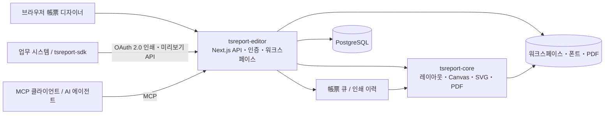

# tsreport-editor

[English](./README.md) | [日本語](./README.ja.md) | [简体中文](./README.zh-CN.md) | [繁體中文](./README.zh-TW.md) | 한국어 | [Tiếng Việt](./README.vi.md) | [ไทย](./README.th.md) | [Bahasa Indonesia](./README.id.md) | [Deutsch](./README.de.md) | [Français](./README.fr.md) | [Español](./README.es.md) | [Português](./README.pt.md) | [العربية](./README.ar.md) | [עברית](./README.he.md)

`tsreport-editor`는 [`tsreport-core`](https://www.npmjs.com/package/tsreport-core)를 레이아웃・렌더링 엔진으로 사용하는, 브라우저 기반 帳票 디자이너 겸 帳票 서버입니다.

帳票를 설계하는 화면만 있는 것이 아닙니다. `.report` 템플릿과 소재의 관리, 실제 데이터를 이용한 미리보기, PDF 가져오기, 외부 시스템용 OAuth 2.0 인쇄 API, AI 에이전트용 MCP, 비동기 帳票 큐, 인쇄 이력까지 하나의 서버에서 제공합니다.

- **帳票 디자이너** — 밴드, 텍스트, 도형, 이미지, SVG, 표, 서브리포트, 바코드, 수식 등을 브라우저에서 편집합니다.
- **미리보기와 PDF의 일치** — Editor, 인쇄 미리보기, PDF 출력은 동일한 `tsreport-core`의 레이아웃 결과와 렌더링 구현을 사용합니다.
- **다국어・폰트 운영** — 계정 단위의 폰트 관리, 내장 폰트, 아웃라인, PDF 가져오기 폰트, 일본어・중국어・한국어・아랍 문자 등의 조판을 다룹니다.
- **帳票 API 서버** — 공개 태그로 고정한 템플릿을 OAuth 2.0 Client Credentials로 비동기 인쇄합니다.
- **MCP 서버** — AI가 템플릿 읽기, 편집, 검증, 레이아웃 확인, PNG/PDF 렌더링, PDF 원본 가져오기, 차이 비교를 수행할 수 있습니다.
- **운영과 이력** — API 인쇄는 큐로 처리되며, Editor・API・MCP의 PDF 출력은 계정별 인쇄 이력에 기록됩니다.

## MCP를 활용한 AI 보고서 디자인

AI가 MCP를 통해 보고서를 디자인하고 완성된 미리보기를 여는 과정을 보여 줍니다. 영어 버전에서는 다국어 보고서 지원 사례도 확인할 수 있습니다.

| 영어 버전 — 다국어 보고서 지원 | 일본어 버전 |
| --- | --- |
| [](https://youtu.be/CHsNew6yQr4) | [](https://youtu.be/0I3ljxLUbys) |

### 글꼴 관리

글꼴 관리 화면에서 Google Fonts를 다운로드하고 원하는 글꼴 파일을 업로드할 수 있습니다.

[](https://youtube.com/shorts/fAUjfFqaVtY)

## 시스템 전체 구조



`tsreport-core`는 pure TypeScript・runtime 의존성 제로의 帳票 엔진입니다. `tsreport-editor`는 그 위에 Next.js, PostgreSQL, 인증, 파일 관리, 큐, 관리 화면을 구성합니다. Editor 측에서는 비밀번호 해시에 Argon2id, MCP의 PNG 생성에 `sharp`도 사용하므로, Editor 서버 전체를 "네이티브 의존성 제로"로 규정하지는 않습니다.

## 주요 디자인 기능

- Title, Page Header, Column Header, Detail, Group Header/Footer, Summary, Page Footer, Last Page Footer, Background, No Data 등의 밴드
- 고정 텍스트, 식 필드, 선, 사각형, 타원, 벡터 패스, 이미지, SVG, 프레임, 표, 서브리포트, 바코드, 수식, 페이지 나누기
- RGB, CMYK, 별색, 그라데이션, 투명도, 클립, soft mask를 포함한 렌더링 속성
- `.report`의 시각적 편집과 JSON 편집, 다중 탭, Undo/Redo, 레이어, 확대/축소, 인쇄 미리보기
- JSON 테스트 데이터를 이용한 필드・파라미터・식・반복 명세의 확인
- PDF 페이지의 고충실도 가져오기. 텍스트, 벡터, 이미지, 내장 폰트를 편집 가능한 帳票 요소 또는 유지 렌더링으로 변환
- 템플릿의 공개 태그. 편집 중인 내용과 외부 API에서 사용하는 고정판을 분리

## 빠른 시작

### 전제 조건

- Docker 및 Docker Compose

공개된 `tsreport-core`와 `tsreport-react` 패키지는 Editor의 lockfile에 따라 npm에서 설치됩니다. 인접 저장소는 사용하지 않습니다.

Editor의 의존성 복원, 타입 검사, 테스트, Next.js 빌드는 Docker 안에서만 실행합니다. 호스트 측 `src/`에서 `npm install`, `npm ci`, `npx`, npm script를 실행하지 마십시오.

### 시작하기

```sh
cd ../tsreport-editor/server
docker compose up
```

백그라운드에서 시작하는 경우:

```sh
cd ../tsreport-editor/server
docker compose up -d
docker compose ps
docker compose logs -f tsreport_editor_node
```

개발용 `server/compose.yaml`은 Compose 프로젝트 이름을 `tsreport-editor-dev`로 고정하고 있어, 동일 호스트상의 다른 제품이나 프로덕션용 `tsreport-editor` 프로젝트와는 컨테이너・네트워크의 네임스페이스가 분리됩니다.

정지하는 경우:

```sh
cd ../tsreport-editor/server
docker compose down
```

데이터를 남긴 채 정지하는 일반적인 운영에서는 `down -v`나 NFS/DB 디렉터리 삭제를 수행하지 마십시오.

### 개발용 서비스와 포트

| 서비스 | 역할 | 호스트 측 |
| --- | --- | --- |
| `tsreport_editor_node` | Next.js Editor・REST API | `http://localhost:52005` |
| `tsreport_editor_node` | 전용 MCP 리스너 | `http://localhost:52006` |
| `tsreport_editor_node` | 워크스페이스 갱신 알림 | `52007` |
| `tsreport_editor_db` | PostgreSQL | `localhost:52437` |
| `tsreport_editor_cron` | 帳票 큐를 10초 간격으로 실행 | 내부 전용 |
| `tsreport_editor_nginx` | HTTP / HTTPS 리버스 프록시 | `52085` / `52448` |

브라우저에서는 `http://localhost:52005`, 또는 자체 서명 인증서를 사용하는 `https://localhost:52448`을 엽니다.

## 최초 로그인과 필수 보안 설정

최초 시작 시, 애플리케이션이 DB 잠금 하에서 스키마 초기 데이터, 계정, 워크스페이스, 회귀 테스트용 템플릿을 한 번만 생성합니다.

| 용도 | 로그인 ID | 초기 비밀번호 | 권한 |
| --- | --- | --- | --- |
| 초기 관리자 | `admin` | `pass` | 관리자 |
| 회귀 테스트용 | `test` | `pass` | 일반 사용자 |

> **중요:** 초기 비밀번호는 공개된 초기화용 자격 증명입니다. 운영 개시 전에 반드시 변경하십시오. 현재 UI는 최초 로그인 시 변경을 자동으로 강제하지 않으므로, 변경 완료는 운영자가 확인해야 합니다.

최초 로그인 후, 햄버거 메뉴에서 다음을 수행합니다.

1. `admin`의 "비밀번호 변경"에서 초기 비밀번호를 변경한다.
2. `test`를 회귀 테스트에 사용하지 않는 환경에서는 삭제한다. 남겨두는 경우에는 반드시 비밀번호를 변경한다.
3. 남겨두는 초기 계정의 "MCP 설정"에서 MCP 키를 재생성한다.
4. 회귀 테스트용 API 클라이언트 `test-report-client`를 삭제하거나, Client Secret과 접근 권한을 재설정한다.
5. `server/node/.env` 및 프로덕션 `.env`의 DB 자격 증명과 `REPORT_BATCH_TOKEN`을 기본값에서 변경한다.
6. 외부 공개 전에 nginx의 자체 서명 인증서를 정식 인증서로 교체하고, 공개 포트와 방화벽을 확인한다.

로컬 계정의 비밀번호는 Argon2id로 해시화되어 DB에 저장됩니다. 관리자를 포함하여 최소 1개의 계정은 관리자로 남아 있어야 합니다.

## 기본적인 이용 흐름

1. 로그인하고 계정의 워크스페이스를 연다.
2. "폰트 관리"에서 帳票에 필요한 폰트를 등록한다.
3. `.report`를 새로 만들거나, 기존 `.report`／PDF를 연다.
4. 밴드와 요소를 배치하고, 필요하면 테스트 데이터 JSON을 지정한다.
5. Editor 화면과 인쇄 미리보기에서 여러 페이지, 명세 넘침, 마지막 페이지를 확인한다.
6. PDF를 출력한다. 출력은 자신의 계정 인쇄 이력에 기록된다.
7. 외부 시스템에서 사용하는 경우 공개 태그를 만들고, API 클라이언트와 접근 권한을 설정한다.

일반 저장은 워크스페이스상의 편집 파일을 갱신합니다. 공개 태그는 그 시점의 템플릿 JSON을 고정하므로, 이후 일반 저장을 해도 기존 태그의 API 인쇄 결과는 변하지 않습니다. 변경 사항을 외부에 공개하는 경우에는 새로운 태그를 만들거나 대상 태그를 명시적으로 갱신합니다.

## 공개 태그를 통한 帳票 템플릿의 버전 관리

공개 태그는 편집 중인 `.report`를 단순히 외부 공개 상태로 전환하는 플래그가 아닙니다. **帳票 템플릿의 내용을 버전으로 저장하고, 그 버전을 외부 API에서 이름으로 지정할 수 있도록 하는 구조**입니다.

예를 들어, 청구서 템플릿의 현재 내용을 `v1`로 공개한 후에도, 워크스페이스상의 `invoice.report`는 계속해서 편집할 수 있습니다. 일반 저장에 의한 변경은 `v1`에 자동으로 반영되지 않습니다. 변경 후의 내용을 `v2`로 공개하면, 외부 시스템은 API의 URL에서 사용할 버전을 명시적으로 선택할 수 있습니다.

```text
invoice.report（편집 중인 작업판）
  ├─ v1（공개된 템플릿 JSON）
  └─ v2（변경 후 공개한 템플릿 JSON）

POST /api/report/print/{workspaceKey}/invoice.report/v1
POST /api/report/print/{workspaceKey}/invoice.report/v2
```

이러한 분리를 통해 다음과 같은 운영이 가능해집니다.

- 새로운 帳票 레이아웃을 편집・검증하는 동안에도, 업무 시스템은 기존의 `v1`을 계속 이용한다
- API 이용 측의 전환 시기에 맞춰, 호출 대상을 `v1`에서 `v2`로 변경한다
- 여러 버전을 병존시켜, 연동 대상마다 다른 버전을 이용한다
- 문제가 발견된 경우, 템플릿 파일을 되돌리지 않고 API의 지정을 이전 태그로 되돌린다

태그를 새로 만들면 그 시점의 템플릿 JSON이 저장됩니다. 동일한 태그를 명시적으로 갱신할 수도 있지만, 그 경우에는 동일한 API URL이 가리키는 내용도 변합니다. 재현성이나 단계적 이관을 중시하는 운영에서는 기존 태그를 덮어쓰지 말고 `v1`, `v2`, `2026-07` 등 새로운 태그를 만드십시오.

공개 태그가 고정하는 것은 템플릿 JSON입니다. API 호출 시의 `rows`나 `parameters`는 버전에 포함되지 않으며, 인쇄 요청마다 지정합니다. 또한 여기서 말하는 "공개"는 익명으로 인터넷에 공개한다는 의미가 아닙니다. 실제로 API에서 이용하려면 OAuth 2.0의 스코프, API 클라이언트의 접근 권한, 소유 사용자의 워크스페이스 권한을 모두 충족해야 합니다.

## 사용자, 워크스페이스, 공유

### 사용자 관리

- 계정당 1개의 워크스페이스를 가집니다.
- 워크스페이스는 변경 불가능한 UUID `workspaceKey`로 식별됩니다.
- 관리자는 사용자 생성, 표시 이름・로그인 ID・권한・MCP 이용 가능 여부・비밀번호 관리, 시스템 설정을 수행할 수 있습니다.
- 관리자라도 다른 계정의 워크스페이스를 무조건 열람할 수는 없습니다. 帳票 데이터는 테넌트별로 분리됩니다.
- 사용자 삭제는 물리 삭제입니다. 워크스페이스, 폰트, 공유, API 클라이언트, 토큰, 인쇄 이력을 포함한 관련 데이터가 삭제되며 복원할 수 없습니다.

### 폴더 공유

워크스페이스 전체가 아니라, 필요한 폴더만 다른 계정에 공유할 수 있습니다.

- 공유 대상은 상대방의 `workspaceKey`로 지정합니다.
- 읽기와 쓰기를 별도로 허용할 수 있습니다.
- 읽기 공유는 템플릿과 소재의 참조를, 쓰기 공유는 공동 편집을 허용합니다.
- 공유 대상은 받은 공유를 해제할 수 있습니다.
- API와 MCP에도 동일한 실질적 접근 범위가 적용됩니다.

Editor나 MCP가 워크스페이스를 갱신하면, 갱신 이벤트가 다른 Editor 탭에 통지됩니다. 저장하지 않은 변경 사항이 없으면 다시 불러오고, 저장하지 않은 변경 사항이 있으면 로컬 편집을 보호하며 경고합니다.

공유, API 허가, 공개 태그는 목적이 다릅니다.

| 개념 | 대상 | 역할 |
| --- | --- | --- |
| 폴더 공유 | 계정 간 | 사람의 Editor 조작과, 해당 계정으로 동작하는 MCP에 읽기／쓰기를 허용한다 |
| API 접근 권한 | API 클라이언트 | 외부 시스템이 참조할 수 있는 `workspaceKey`와 폴더를 제한한다 |
| 공개 태그 | `.report`의 버전 | API 인쇄에 사용하는 템플릿 내용을 고정한다 |

API 접근 권한만 추가해도, 소유 사용자 본인에게 대상 폴더의 접근 권한이 없으면 이용할 수 없습니다. 반대로 폴더 공유만으로는 외부 API에 공개되지 않습니다.

## 폰트 추가와 관리

햄버거 메뉴의 "폰트 관리"는 모든 사용자가 이용할 수 있습니다. 폰트는 계정 단위로 `/var/nfs/fonts/{accountId}/`에 저장되며, 다른 계정에서는 보이지 않습니다.

### 업로드

1. "폰트 관리"를 연다.
2. 파일 선택, 또는 드래그 앤 드롭으로 추가한다.
3. 목록에 표시된 폰트 ID를 텍스트 요소의 `fontFamily`에서 선택한다.

지원 형식은 TTF, OTF, TTC, OTC, WOFF, WOFF2입니다. 단일 파일의 앱 상한은 256MiB입니다. macOS의 `/System/Library/Fonts` 등, 여러 시스템 폰트를 한꺼번에 선택하여 등록할 수 있습니다. 호스트 OS의 폰트를 암묵적으로 읽어들이거나, OS에 폰트를 설치하지는 않습니다.

중복은 다음과 같이 판정합니다.

- 동일한 폰트 ID・동일 바이너리: 일괄 업로드 재시도로 성공 처리
- 동일한 폰트 ID・다른 바이너리: ID 충돌로 거부
- 다른 폰트 ID・동일 바이너리: 기존 ID를 표시하며 중복으로 거부
- family명이나 PostScript명 등의 메타 정보만 동일: 다른 바이너리라면 독립된 폰트로 등록 가능

내용 일치는 메타 정보나 해시만이 아니라, 파일 크기 일치 후의 전체 바이트 비교로 확정합니다.

### Google Fonts와 PDF 가져오기 폰트

"Download Google Fonts"에서는 언어를 선택하여, 후보를 계정 영역으로 다운로드할 수 있습니다. 외부 네트워크에 연결할 수 있는 것이 전제입니다.

PDF 가져오기에서는 재사용 가능한 내장 폰트를 계정 내의 애플리케이션 폰트로 등록합니다. 폰트 프로그램이 없는 경우에는 계정 폰트에서 명칭과 스타일을 대조하여 후보와 경고를 표시합니다.

## 외부 인쇄 API를 이용하다

외부 API는 화면 로그인용 쿠키가 아니라 OAuth 2.0 Client Credentials의 Bearer Token을 사용합니다. 이용을 시작하려면 다음 3가지가 필요합니다.

1. **공개 태그** — API에서 사용할 `.report`의 고정판을 만든다.
2. **API 클라이언트** — 햄버거 메뉴의 "API 클라이언트"에서 Client ID, Client Secret, 스코프를 만든다.
3. **접근 권한** — 클라이언트가 이용할 수 있는 `workspaceKey`와 폴더를 등록한다.

이용 가능한 스코프는 `report:print`, `report:status`, `report:download`, `report:preview`입니다. API 클라이언트의 실질적 범위는 "클라이언트의 접근 권한"과 "소유 사용자 본인이 접근할 수 있는 워크스페이스／공유 폴더"의 교집합입니다.

### REST API의 흐름

```text
POST /api/oauth/token
  grant_type=client_credentials
  -> access_token

POST /api/report/print/{workspaceKey}/{templatePath}/{tag}
  -> { key }

GET /api/report/status/{key}
  -> queued | processing | completed | error

GET /api/report/download/{key}
  -> application/pdf
```

예시:

```sh
BASE_URL=http://localhost:52005
CLIENT_ID=test-report-client
CLIENT_SECRET=test-report-secret

TOKEN=$(curl -sS -u "$CLIENT_ID:$CLIENT_SECRET" \
  -d grant_type=client_credentials \
  -d 'scope=report:print report:status report:download' \
  "$BASE_URL/api/oauth/token" | jq -r .access_token)

curl -sS \
  -H "Authorization: Bearer $TOKEN" \
  -H 'Content-Type: application/json' \
  -d '{"rows":[{"item":"seed"}],"parameters":{}}' \
  "$BASE_URL/api/report/print/00000000-0000-0000-0000-000000000002/invoice.report/v1"
```

`templatePath`에 `/`가 포함되어 있어도, 그 뒤의 마지막 세그먼트를 태그로 해석합니다. 상태와 다운로드는 인쇄 요청을 생성한 동일한 API 클라이언트만 참조할 수 있습니다.

### tsreport-sdk

[`tsreport-sdk`](../tsreport-sdk)를 사용하면, 토큰 취득, 큐 등록, 폴링, PDF 취득을 하나의 TypeScript API로 다룰 수 있습니다.

```ts
import { TsreportClient } from 'tsreport-sdk'

const client = new TsreportClient({
    baseUrl: 'https://reports.example.com',
    clientId: process.env.REPORT_CLIENT_ID!,
    clientSecret: process.env.REPORT_CLIENT_SECRET!
})

const pdf = await client.printAndDownload(
    '00000000-0000-0000-0000-000000000002',
    'orders/invoice.report',
    'v1',
    { rows: [{ orderId: 42 }], parameters: {} }
)
```

Client Secret을 브라우저에 삽입하지 마십시오. 브라우저 앱에서 이용하는 경우에는 자체 시스템의 인증된 백엔드를 경유합니다. 미리보기 소재 API의 안전한 중계에는 `tsreport-sdk/server`의 `createPreviewEndpoint`를 사용할 수 있습니다.

## 帳票 큐와 인쇄 이력

API로부터의 인쇄 요청은 DB의 `PrintRequest`에 `queued`로 등록됩니다. `tsreport_editor_cron`이 인증된 배치 엔드포인트를 10초 간격으로 실행하여, `queued` → `processing` → `completed` 또는 `error`로 전이시킵니다. 동시 실행은 DB 잠금으로 직렬화됩니다.

생성된 PDF는 `/var/nfs/report-pdf`에 저장됩니다. 인쇄 이력 화면에서는 자신의 계정에 대해 다음을 확인할 수 있습니다.

- 실행 일시
- 실행 경로: `editor` / `api` / `mcp`
- 워크스페이스, 템플릿, 형식
- 완료／오류 상태와 오류 사유
- 완료된 PDF의 재다운로드

Editor에서 생성한 PDF는 브라우저에서 이력 API로 기록됩니다. MCP의 `render_report(format="pdf")`도 이력에 기록됩니다. 이력은 계정별로 분리되며, 관리자라도 다른 계정의 이력은 열람할 수 없습니다.

운영에서는 DB와 `server/nfs`를 동일한 복구 시점으로 백업하십시오. 이력 행만, 또는 PDF 파일만 복원하면 이력과 산출물이 일치하지 않습니다. 출력 건수에 따른 보존 기간과 디스크 감시도 운영 측에서 결정하십시오.

## MCP를 이용하다

MCP는 외부 인쇄 API의 OAuth 클라이언트와는 독립되어 있습니다. 각 사용자의 로그인 ID와 MCP 키로 인증하며, 그 사용자와 동일한 워크스페이스／공유 권한으로 동작합니다.

### 활성화와 자격 증명

1. 햄버거 메뉴에서 "MCP 설정"을 연다.
2. 자신의 MCP 이용을 ON으로 한다.
3. MCP 키를 복사한다. 초기 키는 운영 전에 재생성한다.
4. 관리자는 동일한 화면에서 MCP 전체의 ON/OFF와 전용 포트를 설정할 수 있다.

일반적으로는 Next.js와 동일한 `http://localhost:52005/api/mcp`를 사용합니다. 개발 환경에서는 전용 리스너 `http://localhost:52006`도 이용할 수 있습니다. MCP 클라이언트에는 Streamable HTTP의 URL과, 다음 중 하나의 인증을 설정합니다.

- `x-mcp-account: <로그인 ID>`와 `x-mcp-key: <MCP 키>`
- `Authorization: Bearer <로그인 ID>:<MCP 키>`

설정 가이드는 인증 없이 취득할 수 있습니다.

```sh
curl http://localhost:52005/api/mcp
```

도구 목록을 확인하는 예:

```sh
curl -sS http://localhost:52005/api/mcp \
  -H 'Content-Type: application/json' \
  -H 'x-mcp-account: admin' \
  -H 'x-mcp-key: <재생성한 MCP 키>' \
  -d '{"jsonrpc":"2.0","id":1,"method":"tools/list","params":{}}'
```

### MCP 도구

| 분류 | 도구 |
| --- | --- |
| 도입 | `get_started` |
| 발견 | `list_workspaces`, `list_templates`, `list_workspace_files`, `list_fonts` |
| 템플릿 | `get_template`, `get_template_schema`, `validate_template`, `save_template`, `update_template_elements` |
| 소재 | `save_workspace_file`, `delete_workspace_file` |
| 검증・출력 | `layout_report`, `render_report`, `compare_reports` |
| 원본 가져오기 | `import_pdf` |

권장하는 작업 루프는 다음과 같습니다.

1. `get_started`와 `get_template_schema`를 읽는다.
2. `list_workspaces`, `list_templates`, `list_workspace_files`, `list_fonts`로 이용 가능한 자원을 확인한다.
3. 템플릿을 생성하거나 `get_template`으로 취득한다.
4. `validate_template`으로 구조와 식을 검증한다.
5. `layout_report`로 절대 좌표, 페이지 수, 범위 밖 요소를 수치로 확인한다.
6. `render_report(format="png")`로 시각적으로 확인한다.
7. `save_template` 또는 `update_template_elements`로 저장한다.
8. 변경 전후를 `compare_reports`로 비교하여, 의도하지 않은 이동이 없는지 확인한다.

원본 PDF가 있는 경우에는 육안으로 다시 만들지 않고, `save_workspace_file` → `import_pdf` → 식이나 밴드의 조정 → `layout_report` / `render_report` 순서로 진행합니다.

## 언어와 임의의 외부 연동

Editor UI는 일본어, 영어, 간체자 중국어, 한국어, 번체자 중국어, 베트남어, 태국어, 인도네시아어, 독일어, 프랑스어, 스페인어, 포르투갈어, 아랍어, 히브리어를 선택할 수 있습니다. 아랍어와 히브리어에서는 UI도 RTL이 됩니다. 이는 帳票 내에서 이용할 수 있는 문자 체계를 제한하는 것이 아닙니다.

관리자는 Google／Microsoft의 외부 로그인을 설정할 수 있습니다. 외부 로그인을 활성화하지 않는 경우에는 Argon2id로 보호된 로컬 계정만으로 운영할 수 있습니다.

AI 지원 기능을 사용하는 경우에는 API 키와 모델을 DB의 시스템 설정에 등록합니다. 초기값에는 유효한 외부 API 키를 포함하지 않습니다. 비밀 값을 소스, `.report`, 워크스페이스, README에 저장하지 마십시오.

## 초기 데이터와 회귀 테스트용 환경

최초 시작 시 다음을 생성합니다.

- `admin`과 `test` 계정, 및 고정 `workspaceKey`
- `test` 소유의 회귀 테스트용 API 클라이언트 `test-report-client`
- `test` 워크스페이스의 `invoice.report`, `sub.report`, `assets/logo.png`
- `invoice.report`의 공개 태그 `v1`
- `test`에서 `admin`으로의 `assets` 폴더 읽기／쓰기 공유

고정 키:

- `admin`: `00000000-0000-0000-0000-000000000001`
- `test`: `00000000-0000-0000-0000-000000000002`

이들은 `tsreport-editor`, `tsreport-sdk`, `tsreport-react`의 실제 서버 회귀 테스트에서 사용합니다. 프로덕션 운영에서는 앞서 언급한 초기 자격 증명을 반드시 변경하거나 삭제하십시오.

### 개발 DB를 초기 상태로 되돌리기

개발 환경의 PostgreSQL을 완전히 다시 만드는 경우에는 컨테이너를 정지한 후 `server/db/pgdata/data`를 삭제하고, 다시 시작합니다.

```sh
cd ../tsreport-editor/server
docker compose down
rm -rf db/pgdata/data
docker compose up
```

재시작 시 PostgreSQL의 DDL이 적용되며, 애플리케이션 시작 시 초기 계정, API 클라이언트, 공개 태그 등의 DB 초기 데이터가 재생성됩니다. 회귀 테스트용 워크스페이스 파일은 부족한 경우에만 보충됩니다. DB 컨테이너가 가동 중일 때 `pgdata`를 삭제해서는 안 됩니다.

이 조작이 초기화하는 것은 PostgreSQL입니다. `server/nfs`에 저장된 워크스페이스, 폰트, 생성된 PDF 등은 삭제되지 않습니다. DB와 NFS 양쪽을 초기 상태로 되돌려야 하는 경우에는 관리자 메뉴의 "팩토리 리셋"을 사용하십시오.

"팩토리 리셋"은 모든 DB 테이블, 워크스페이스, 帳票 출력을 삭제하고 최초 상태를 재생성합니다. 되돌릴 수 없습니다. 폰트, 인증서, `.gitignore` 등의 점 파일은 삭제 대상에서 제외됩니다.

## 데이터 저장 위치

| 데이터 | 컨테이너 내 | 개발 호스트 측 |
| --- | --- | --- |
| PostgreSQL | `/var/pgdata/data` | `server/db/pgdata` |
| 워크스페이스 | `/var/nfs/workspaces/{workspaceKey}` | `server/nfs/workspaces` |
| 계정 폰트 | `/var/nfs/fonts/{accountId}` | `server/nfs/fonts` |
| 생성된 PDF | `/var/nfs/report-pdf` | `server/nfs/report-pdf` |
| nginx 로그 | `/var/log/nginx` | `logs/nginx` |

애플리케이션의 데이터 내보내기／가져오기는 관리자 메뉴에서 실행할 수 있습니다. 환경 전체의 재해 복구에서는 이 기능만에 의존하지 말고 PostgreSQL과 NFS의 정합성 있는 백업도 유지하십시오.

## 프로덕션 빌드와 시작

프로덕션 빌드와 시작도 Docker Compose를 전제로 합니다. `build.sh`, `build_boot.sh`, `boot.sh`, `boot_db.sh`, `boot_web.sh`, `build_boot_web.sh`는 Docker Compose를 호출하기 위한 얇은 래퍼입니다. 호스트에 Node.js 의존성을 설치하여 `server.js`를 직접 상주시키는 절차가 아닙니다.

### 1. 사전 준비

`tsreport-core`와 `tsreport-react`는 `src/package-lock.json`에 고정된 버전을 npm에서 복원합니다.

```sh
cd ../tsreport-editor/server
```

프로덕션용 설정을 편집합니다.

- `boot/web/.env`: DB 접속 정보와 `REPORT_BATCH_TOKEN`
- `boot/compose.yaml`: 단일 서버 구성의 PostgreSQL 설정
- `boot/db/compose.yaml`: DB/Web 분리 구성의 PostgreSQL 설정
- `nginx/cert`: 정식 TLS 인증서
- `nginx/conf`: 공개 호스트명, 전달 대상, 필요한 접근 제어

`boot/web/.env`의 `DB_PASS`와, 채택하는 구성의 Compose에 있는 `DB_PASS`를 일치시키십시오. Web과 cron은 `boot/web/.env`의 동일한 `REPORT_BATCH_TOKEN`을 사용합니다. 저장소 내의 값은 로컬 시작용이며, 프로덕션에서는 반드시 변경합니다.

### 2. 프로덕션 빌드

```sh
cd ../tsreport-editor/server
./build.sh
```

`build.sh`는 호스트 측에서 Node.js 의존성을 복원하지 않습니다. `src`를 `server/build/src`로 동기화하고, 격리된 Docker 빌드 환경에서 Next.js의 production build를 실행하여, standalone 산출물을 다음에 배치합니다.

```text
server/boot/web/dist/standalone/
  ├─ server.js
  ├─ .next/
  ├─ node_modules/
  ├─ public/
  └─ seed/
```

빌드는 TypeScript 검사와 Next.js의 production compilation을 포함합니다. 명령이 정상 종료되고, `boot/web/dist/standalone/server.js`가 존재하는 것을 확인한 후 시작하십시오.

### 3. 빌드된 서버 시작(재빌드하지 않음)

`./build.sh`가 성공한 상태이고, `boot/web/dist/standalone/server.js`가 존재하는 경우에는 Next.js의 production build를 반복하지 않고 프로덕션 서버를 시작할 수 있습니다.

DB와 Web을 동일한 서버에서 시작하는 경우:

```sh
cd ../tsreport-editor/server
./boot.sh
```

DB 서버와 Web 서버를 분리하는 경우에는 DB 호스트와 Web 호스트에서 각각 실행합니다.

```sh
# DB 호스트
cd ../tsreport-editor/server
./boot_db.sh

# Web 호스트
cd ../tsreport-editor/server
./boot_web.sh
```

`boot.sh`와 `boot_web.sh`는 기존의 `boot/web/dist/standalone`을 Node.js 컨테이너에 마운트하여 PM2로 시작합니다. Docker 런타임 이미지는 필요에 따라 Compose가 갱신하지만, Next.js의 production build는 실행하지 않습니다. 소스 변경을 반영하는 경우에는 먼저 `./build.sh`를 다시 실행하십시오.

### 4-A. 단일 서버 구성

DB, Node.js, 帳票 큐 cron, nginx를 동일한 서버 인스턴스에서 동작시키는 구성입니다. 빌드부터 상주 시작까지, 다음 한 명령으로 실행합니다.

```sh
cd ../tsreport-editor/server
./build_boot.sh
```

빌드가 완료되어 시작만 하는 경우에는 `./boot.sh`를 실행합니다. `boot.sh`는 `boot/compose.yaml`을 사용하여, 다음의 모든 서비스를 다른 제품의 Compose 프로젝트와 충돌하지 않는 `tsreport-editor` 프로젝트로 백그라운드에서 시작합니다.

| 서비스 | 역할 | 공개 포트 |
| --- | --- | --- |
| `tsreport_editor_db` | PostgreSQL | `52437` |
| `tsreport_editor_node` | 빌드된 Next.js standalone, MCP, 갱신 알림 | `52005`、`52006`、`52007` |
| `tsreport_editor_cron` | 비동기 帳票 큐를 10초 간격으로 실행 | 없음 |
| `tsreport_editor_nginx` | HTTP/HTTPS 리버스 프록시 | `52085`、`52448` |

Web 컨테이너는 소스 트리가 아니라 `boot/web/dist/standalone`만을 `/var/node`에 마운트하고, PM2의 cluster mode로 `server.js`를 실행합니다. 시작 중에 `src`를 변경해도 프로덕션 서버에는 반영되지 않습니다. 변경을 반영하려면 다시 `./build.sh`를 실행한 후 Web 서비스를 재시작합니다.

시작 확인:

```sh
docker compose --project-name tsreport-editor -f boot/compose.yaml ps
docker compose --project-name tsreport-editor -f boot/compose.yaml logs -f tsreport_editor_node
```

정지:

```sh
docker compose --project-name tsreport-editor -f boot/compose.yaml down
```

### 4-B. DB 서버와 Web 서버의 분리 구성

PostgreSQL을 DB 전용 서버에서 동작시키고, Node.js, 帳票 큐 cron, nginx를 Web 서버에서 동작시키는 구성입니다. 양쪽 호스트에 이 저장소를 배치하고, DB 호스트와 Web 호스트에서 각각 한 명령을 실행합니다.

DB 호스트에서는 `boot/db/compose.yaml`만을 시작합니다.

```sh
cd ../tsreport-editor/server
./boot_db.sh
```

Web 호스트의 `boot/web/.env`를, DB 호스트의 프라이빗 DNS 이름 또는 IP 주소와, DB 호스트가 공개하는 포트로 변경합니다.

```dotenv
DB_HOST=db.internal.example
DB_PORT=52437
DB_NAME=TSREPORT_EDITOR_DB
DB_USER=postgres
DB_PASS=프로덕션용 DB 비밀번호
REPORT_BATCH_TOKEN=프로덕션용 공유 시크릿
```

Web 호스트에서는 production build와 Web 측 서비스의 상주 시작을 한 명령으로 실행합니다.

```sh
cd ../tsreport-editor/server
./build_boot_web.sh
```

빌드가 완료되어 Web 측 시작만 하는 경우에는 `./boot_web.sh`를 실행합니다. Web 측의 `boot/web/compose.yaml`은 Node.js, cron, nginx만을 시작하며, PostgreSQL 컨테이너는 생성하지 않습니다.

분리 구성의 시작 확인:

```sh
# DB 호스트
docker compose --project-name tsreport-editor-db -f boot/db/compose.yaml ps
docker compose --project-name tsreport-editor-db -f boot/db/compose.yaml logs -f tsreport_editor_db

# Web 호스트
docker compose --project-name tsreport-editor-web -f boot/web/compose.yaml ps
docker compose --project-name tsreport-editor-web -f boot/web/compose.yaml logs -f tsreport_editor_node
```

분리 구성의 정지:

```sh
# Web 호스트
docker compose --project-name tsreport-editor-web -f boot/web/compose.yaml down

# DB 호스트
docker compose --project-name tsreport-editor-db -f boot/db/compose.yaml down
```

DB의 `52437`은 인터넷에 직접 공개하지 말고, Web 호스트에서 도달 가능한 프라이빗 네트워크 내에서만 허용하십시오. DB 호스트 측 `boot/db/compose.yaml`의 `DB_PASS`와 Web 측 `boot/web/.env`의 `DB_PASS`는 동일한 값으로 합니다. 워크스페이스, 폰트, 생성된 PDF는 Web 호스트 측의 `server/nfs`에 저장되며, DB 호스트와의 공유 파일 시스템은 필요하지 않습니다.

### 5. 공통 가동 확인

브라우저에서 `https://<Web 호스트>:52448` 또는 `http://<Web 호스트>:52005`를 엽니다. 외부 인쇄 API를 사용하는 경우에는 `tsreport_editor_cron`도 `Up` 상태인지 확인하십시오.

일반적인 정지・재시작에서는 `server/db/pgdata`와 Web 호스트의 `server/nfs`가 유지됩니다. DB 초기화가 필요한 경우에만, 앞서 언급한 초기화 절차에 따라 DB 서비스 정지 후 `db/pgdata/data`를 삭제하십시오.

프로덕션 공개 전에, 적어도 다음을 확인하십시오.

- 초기 사용자, MCP 키, 회귀 테스트용 API 클라이언트를 변경하거나 삭제했다
- DB 비밀번호와 `REPORT_BATCH_TOKEN`을 변경했다
- 정식 TLS 인증서를 설정했다
- `/api/report/batch/process`를 외부에 무인증으로 공개하지 않았다
- DB, 워크스페이스, 폰트, 생성된 PDF의 백업과 용량 감시가 있다
- 필요한 폰트와 공개 태그가 대상 계정에 등록되어 있다
- 실제 데이터에 준하는 다중 페이지 帳票로 Editor, 미리보기, API 인쇄를 확인했다

## 환경 변수

애플리케이션 설정은 개발에서는 `server/node/.env`, 프로덕션에서는 `server/boot/web/.env`에 둡니다.

| 변수 | 설명 | 개발 기본값 |
| --- | --- | --- |
| `DB_HOST` | PostgreSQL 호스트 | `172.31.0.30` |
| `DB_PORT` | PostgreSQL 포트 | `15432` |
| `DB_NAME` | DB명 | `TSREPORT_EDITOR_DB` |
| `DB_USER` | DB 사용자 | `postgres` |
| `DB_PASS` | DB 비밀번호 | `postgres1234` |
| `REPORT_BATCH_TOKEN` | 배치 실행용 공유 시크릿 | `tsreport-report-batch-local` |
| `WORKSPACES_ROOT` | 워크스페이스 루트 | `/var/nfs/workspaces` |
| `NEXT_TELEMETRY_DISABLED` | Next.js telemetry 비활성화 | `1` |

MCP 전체의 활성화 상태와 전용 포트는 DB의 시스템 설정으로 관리 화면에서 변경합니다. 외부 로그인용 OAuth 설정과 임의의 AI 지원 설정도 관리 화면／SystemProperty에서 관리하며, 비밀 값을 README나 소스에 기록하지 마십시오.

## 개발과 검증

```sh
cd ../tsreport-editor

docker compose -f server/compose.yaml exec tsreport_editor_node npx tsc --noEmit
docker compose -f server/compose.yaml exec tsreport_editor_node npm test
docker compose -f server/compose.yaml exec \
  -e TSREPORT_EDITOR_LIVE_BASE=http://localhost:3000 \
  tsreport_editor_node npm run test:live

cd server
./build.sh
```

개발・테스트・프로덕션 빌드는 `tsreport-core`와 `tsreport-react`를 npm에서 복원합니다. 인접 저장소 체크아웃은 필요하지 않습니다.

## 저장소 구성

| 경로 | 내용 |
| --- | --- |
| `src/` | Next.js Editor, REST API, MCP, 서버 로직 |
| `tests/` | 단위・결합・실제 서버 회귀 테스트 |
| `server/` | Docker 개발, 빌드, 프로덕션 시작 구성 |
| `cli/` | 보조 스크립트 |

관련 저장소:

| 저장소 | 내용 |
| --- | --- |
| [`tsreport-core`](https://github.com/pontasan/tsreport-core) | pure TypeScript의 帳票 레이아웃・렌더링・PDF・폰트 엔진 |
| [`tsreport-editor`](https://github.com/pontasan/tsreport-editor) | 이 브라우저 기반 리포트 디자이너 겸 리포트 서버 |
| [`tsreport-sdk`](https://github.com/pontasan/tsreport-sdk) | 인쇄・미리보기 API용 의존성 제로 TypeScript SDK |
| [`tsreport-react`](https://github.com/pontasan/tsreport-react) | `tsreport-core`를 사용하는 React 미리보기 UI |

## 라이선스

tsreport-editor는 이용자의 선택에 따라 [MIT License](./LICENSE-MIT) 또는 [Apache License 2.0](./LICENSE-APACHE)으로 이용할 수 있습니다(SPDX: `MIT OR Apache-2.0`).
