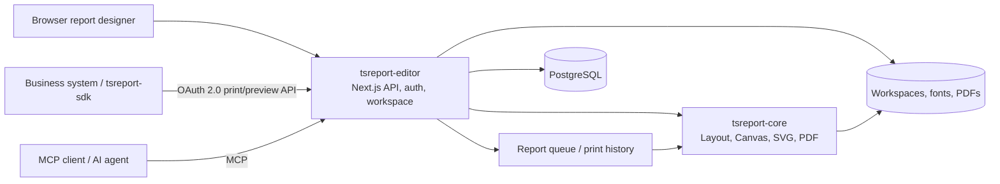

# tsreport-editor

English | [日本語](./README.ja.md) | [简体中文](./README.zh-CN.md) | [繁體中文](./README.zh-TW.md) | [한국어](./README.ko.md) | [Tiếng Việt](./README.vi.md) | [ไทย](./README.th.md) | [Bahasa Indonesia](./README.id.md) | [Deutsch](./README.de.md) | [Français](./README.fr.md) | [Español](./README.es.md) | [Português](./README.pt.md) | [العربية](./README.ar.md) | [עברית](./README.he.md)

`tsreport-editor` is a browser-based report designer and report server that uses [`tsreport-core`](https://www.npmjs.com/package/tsreport-core) as its layout and rendering engine.

It's not just a screen for designing reports. A single server provides `.report` template and asset management, preview using real data, PDF import, an OAuth 2.0 print API for external systems, MCP for AI agents, an asynchronous report queue, and print audit trails.

- **Report designer** — edit bands, text, shapes, images, SVGs, tables, subreports, barcodes, formulas, and more in the browser.
- **Consistency between preview and PDF** — the Editor, print preview, and PDF output all use the same `tsreport-core` layout results and rendering implementation.
- **Multilingual and font operations** — per-account font management, embedded fonts, outlines, PDF-imported fonts, and typesetting for Japanese, Chinese, Korean, Arabic script, and more.
- **Report API server** — asynchronously prints templates pinned by published tags via OAuth 2.0 Client Credentials.
- **MCP server** — lets AI read, edit, and validate templates, check layout, render PNG/PDF, import original PDFs, and diff-compare results.
- **Operations and audit trail** — API print jobs are queued, and PDF output from the Editor, API, and MCP is recorded in per-account print history.

## AI report design with MCP

These videos show AI designing a report through MCP and opening the completed preview. The English demo also demonstrates multilingual report support.

| English demo — multilingual report support | Japanese demo |
| --- | --- |
| [](https://youtu.be/CHsNew6yQr4) | [](https://youtu.be/0I3ljxLUbys) |

### Font management

The font manager supports downloading Google Fonts and uploading your own font files.

[](https://youtube.com/shorts/fAUjfFqaVtY)

## System overview



`tsreport-core` is a pure TypeScript report engine with zero runtime dependencies. `tsreport-editor` builds Next.js, PostgreSQL, authentication, file management, queuing, and an admin screen on top of it. Because the Editor side uses Argon2id for password hashing and `sharp` for MCP PNG generation, the Editor server as a whole is not positioned as having "zero native dependencies."

## Key design features

- Bands such as Title, Page Header, Column Header, Detail, Group Header/Footer, Summary, Page Footer, Last Page Footer, Background, and No Data
- Fixed text, expression fields, lines, rectangles, ellipses, vector paths, images, SVGs, frames, tables, subreports, barcodes, formulas, and page breaks
- Drawing attributes including RGB, CMYK, spot colors, gradients, transparency, clipping, and soft masks
- Visual and JSON editing of `.report` files, multiple tabs, undo/redo, layers, zoom, and print preview
- Verification of fields, parameters, expressions, and repeating detail rows using JSON test data
- High-fidelity import of PDF pages. Converts text, vectors, images, and embedded fonts into editable report elements or retained drawings
- Published tags for templates, separating content being edited from the pinned version used by external APIs

## Quick start

### Prerequisites

- Docker and Docker Compose

The published `tsreport-core` and `tsreport-react` packages are installed from npm by the Editor's lockfile. Sibling repository checkouts are not used by development, tests, or production builds.

Host-side npm commands in `src/` are supported for ordinary development and verification. Docker remains isolated: dependencies are installed from the lockfile when the Node.js image is built, container startup never runs `npm install` or `npm ci`, and Compose Watch synchronizes source files while excluding the host's `node_modules`.

### Startup

```sh
cd ../tsreport-editor/server
docker compose up --build --watch
```

To start the containers in the background without source synchronization:

```sh
cd ../tsreport-editor/server
docker compose up -d --build
docker compose ps
docker compose logs -f tsreport_editor_node
```

Run `docker compose watch --no-up` in another terminal when detached containers also need source synchronization.

The development `server/compose.yaml` pins the Compose project name to `tsreport-editor-dev`, keeping containers and networks isolated from other products on the same host and from the production `tsreport-editor` project.

To stop:

```sh
cd ../tsreport-editor/server
docker compose down
```

For normal operation where you stop while keeping data, do not run `down -v` or delete the NFS/DB directories.

### Development services and ports

| Service | Role | Host side |
| --- | --- | --- |
| `tsreport_editor_node` | Next.js Editor / REST API | `http://localhost:52005` |
| `tsreport_editor_node` | Dedicated MCP listener | `http://localhost:52006` |
| `tsreport_editor_node` | Workspace update notifications | `52007` |
| `tsreport_editor_db` | PostgreSQL | `localhost:52437` |
| `tsreport_editor_cron` | Triggers the report queue every 10 seconds | Internal only |
| `tsreport_editor_nginx` | HTTP / HTTPS reverse proxy | `52085` / `52448` |

Open `http://localhost:52005` in your browser, or `https://localhost:52448`, which uses a self-signed certificate.

## First login and required security setup

On first startup, the application creates schema initial data, accounts, workspaces, and regression templates exactly once under a DB lock.

| Purpose | Login ID | Initial password | Permission |
| --- | --- | --- | --- |
| Initial administrator | `admin` | `pass` | Administrator |
| Regression testing | `test` | `pass` | Regular user |

> **Important:** the initial passwords are publicly known initialization credentials. Be sure to change them before going into production. The current UI does not automatically force a change on first login, so the operator must confirm the change has been completed.

After first login, do the following from the hamburger menu.

1. Change the initial password for `admin` via "Change Password."
2. Delete `test` in environments where it's not used for regression testing. If you keep it, be sure to change its password.
3. Regenerate the MCP key in "MCP Settings" for any initial account you keep.
4. Delete the regression API client `test-report-client`, or reconfigure its Client Secret and access permissions.
5. Change the DB credentials and `REPORT_BATCH_TOKEN` in `server/node/.env` and the production `.env` from their defaults.
6. Before exposing the service externally, replace nginx's self-signed certificate with a proper certificate, and verify the exposed ports and firewall.

Local account passwords are hashed with Argon2id before being stored in the DB. At least one account must remain an administrator, including `admin`.

## Basic usage flow

1. Log in and open your account's workspace.
2. Register the fonts needed for your reports under "Font Management."
3. Create a new `.report`, or open an existing `.report` or PDF.
4. Place bands and elements, and specify test data JSON as needed.
5. Check multiple pages, detail overflow, and the last page in the Editor view and print preview.
6. Output a PDF. The output is recorded in your own account's print history.
7. If using it from an external system, create a published tag and configure an API client and access permissions.

A normal save updates the edited file in the workspace. A published tag pins the template JSON as of that point in time, so a subsequent normal save does not change the API print result of an existing tag. To publish changes externally, create a new tag or explicitly update the target tag.

## Versioning report templates with published tags

A published tag is not simply a flag that switches the `.report` being edited to an externally published state. It is **a mechanism that saves report template content as a version, and lets that version be referenced by name from an external API.**

For example, even after publishing the current content of an invoice template as `v1`, you can continue editing `invoice.report` in the workspace. Changes from normal saves are not automatically reflected in `v1`. If you publish the updated content as `v2`, external systems can explicitly choose which version to use in the API URL.

```text
invoice.report (working copy being edited)
  ├─ v1 (published template JSON)
  └─ v2 (template JSON published after the changes)

POST /api/report/print/{workspaceKey}/invoice.report/v1
POST /api/report/print/{workspaceKey}/invoice.report/v2
```

This separation enables the following operations:

- The business system continues using the existing `v1` while a new report layout is being edited and verified
- Callers switch from `v1` to `v2` on their own schedule
- Multiple versions coexist, with different partners using different versions
- If a problem is found, the API reference can be rolled back to a previous tag without writing back the template file

Creating a new tag saves the template JSON as of that point. You can also explicitly update the same tag, but doing so changes the content referenced by the same API URL. For operations that prioritize reproducibility or staged migration, create new tags such as `v1`, `v2`, or `2026-07` rather than overwriting an existing tag.

What a published tag pins is the template JSON. The `rows` and `parameters` in an API call are not part of the version and are specified per print request. Also, "published" here does not mean publicly exposed to the internet anonymously. To actually use it from the API, the OAuth 2.0 scopes, the API client's access permissions, and the owning user's workspace permissions must all be satisfied.

## Users, workspaces, and sharing

### User management

- Each account has one workspace.
- A workspace is identified by an immutable UUID `workspaceKey`.
- Administrators can create users, manage display names, login IDs, permissions, MCP availability, and passwords, and configure system settings.
- Even administrators cannot unconditionally view another account's workspace. Report data is tenant-isolated.
- Deleting a user is a physical delete. Related data including the workspace, fonts, shares, API clients, tokens, and print history is deleted and cannot be restored.

### Folder sharing

Rather than sharing an entire workspace, you can share only the folders you need with another account.

- The share target is specified by the other account's `workspaceKey`.
- Read and write can be permitted separately.
- Read sharing allows referencing templates and assets; write sharing allows collaborative editing.
- The recipient can revoke a share they've received.
- The same effective access scope applies to the API and MCP as well.

When the Editor or MCP updates a workspace, an update event is notified to other Editor tabs. If there are no unsaved changes, it reloads; if there are unsaved changes, it protects local edits and warns instead.

Sharing, API permissions, and published tags serve different purposes.

| Concept | Scope | Role |
| --- | --- | --- |
| Folder sharing | Between accounts | Grants read/write to a human's Editor operations and to MCP acting as that account |
| API access permission | API client | Restricts which `workspaceKey` and folders an external system can reference |
| Published tag | `.report` version | Pins the template content used for API printing |

Adding only an API access permission is not usable unless the owning user themselves has access to the target folder. Conversely, folder sharing alone does not expose anything to the external API.

## Adding and managing fonts

"Font Management" in the hamburger menu is available to all users. Fonts are stored per account under `/var/nfs/fonts/{accountId}/` and are not visible to other accounts.

### Uploading

1. Open "Font Management."
2. Add fonts via file selection, or by drag and drop.
3. Select the font ID shown in the list in a text element's `fontFamily`.

Supported formats are TTF, OTF, TTC, OTC, WOFF, and WOFF2. The application limit for a single file is 256MiB. You can select and register multiple system fonts at once, such as from macOS's `/System/Library/Fonts`. Fonts on the host OS are never implicitly read, and fonts are never installed onto the OS.

Duplicates are judged as follows:

- Same font ID, identical binary: treated as a success, as a retry of a bulk upload
- Same font ID, different binary: rejected as an ID collision
- Different font ID, identical binary: rejected as a duplicate, indicating the existing ID
- Only metadata such as the family name or PostScript name matches: registerable as an independent font if the binary differs

Content matching is determined not just by metadata or a hash, but by a full byte comparison after confirming the file sizes match.

### Google Fonts and PDF-imported fonts

"Download Google Fonts" lets you choose a language and download candidates into the account's storage area. This assumes external network connectivity is available.

PDF import registers reusable embedded fonts as application fonts within the account. If there is no font program, it matches candidates against account fonts by name and style, and displays candidates and warnings.

## Using the external print API

The external API uses an OAuth 2.0 Client Credentials Bearer Token rather than the screen login cookie. You need the following three things to get started:

1. **Published tag** — create a pinned version of the `.report` to use via the API.
2. **API client** — create a Client ID, Client Secret, and scopes under "API Clients" in the hamburger menu.
3. **Access permission** — register the `workspaceKey` and folders the client can use.

The available scopes are `report:print`, `report:status`, `report:download`, and `report:preview`. The effective scope of an API client is the intersection of "the client's access permissions" and "the workspaces/shared folders the owning user themselves can access."

### REST API flow

```text
POST /api/oauth/token
  grant_type=client_credentials
  -> access_token

POST /api/report/print/{workspaceKey}/{templatePath}/{tag}
  -> { key }

GET /api/report/status/{key}
  -> queued | processing | completed | error

GET /api/report/download/{key}
  -> application/pdf
```

Example:

```sh
BASE_URL=http://localhost:52005
CLIENT_ID=test-report-client
CLIENT_SECRET=test-report-secret

TOKEN=$(curl -sS -u "$CLIENT_ID:$CLIENT_SECRET" \
  -d grant_type=client_credentials \
  -d 'scope=report:print report:status report:download' \
  "$BASE_URL/api/oauth/token" | jq -r .access_token)

curl -sS \
  -H "Authorization: Bearer $TOKEN" \
  -H 'Content-Type: application/json' \
  -d '{"rows":[{"item":"seed"}],"parameters":{}}' \
  "$BASE_URL/api/report/print/00000000-0000-0000-0000-000000000002/invoice.report/v1"
```

Even if `templatePath` contains a `/`, the last segment after it is resolved as the tag. Status and download can only be referenced by the same API client that created the print request.

### tsreport-sdk

Using [`tsreport-sdk`](../tsreport-sdk), you can handle token acquisition, queuing, polling, and PDF retrieval through a single TypeScript API.

```ts
import { TsreportClient } from 'tsreport-sdk'

const client = new TsreportClient({
    baseUrl: 'https://reports.example.com',
    clientId: process.env.REPORT_CLIENT_ID!,
    clientSecret: process.env.REPORT_CLIENT_SECRET!
})

const pdf = await client.printAndDownload(
    '00000000-0000-0000-0000-000000000002',
    'orders/invoice.report',
    'v1',
    { rows: [{ orderId: 42 }], parameters: {} }
)
```

Do not embed the Client Secret in a browser. When using this from a browser app, route it through your own authenticated backend. `createPreviewEndpoint` in `tsreport-sdk/server` can be used to safely relay the preview asset API.

## Report queue and print audit trail

Print requests from the API are registered in the DB's `PrintRequest` as `queued`. `tsreport_editor_cron` triggers an authenticated batch endpoint every 10 seconds, transitioning state from `queued` → `processing` → `completed` or `error`. Concurrent execution is serialized via DB locking.

Generated PDFs are stored under `/var/nfs/report-pdf`. On the print history screen, you can check the following for your own account:

- Execution date/time
- Execution path: `editor` / `api` / `mcp`
- Workspace, template, and format
- Completed/error status and error reason
- Re-download of completed PDFs

PDFs generated in the Editor are recorded to the history API from the browser. MCP's `render_report(format="pdf")` is also recorded in the history. History is account-isolated; even administrators cannot view another account's history.

In operation, back up the DB and `server/nfs` as the same recovery point. Restoring only history rows, or only PDF files, will leave the audit trail and the actual output out of sync. Retention period and disk monitoring appropriate to output volume should also be decided by operations.

## Using MCP

MCP is independent of the OAuth client used for the external print API. It authenticates with each user's login ID and MCP key, and operates with the same workspace/sharing permissions as that user.

### Enabling and credentials

1. Open "MCP Settings" from the hamburger menu.
2. Turn on MCP for your own account.
3. Copy the MCP key. Regenerate the initial key before going into production.
4. Administrators can configure MCP on/off overall and the dedicated port on the same screen.

Normally you use `http://localhost:52005/api/mcp`, the same as Next.js. In the development environment, the dedicated listener `http://localhost:52006` is also available. Configure the MCP client with the Streamable HTTP URL and one of the following authentication methods:

- `x-mcp-account: <login ID>` and `x-mcp-key: <MCP key>`
- `Authorization: Bearer <login ID>:<MCP key>`

The setup guide can be retrieved without authentication.

```sh
curl http://localhost:52005/api/mcp
```

Example of checking the tool list:

```sh
curl -sS http://localhost:52005/api/mcp \
  -H 'Content-Type: application/json' \
  -H 'x-mcp-account: admin' \
  -H 'x-mcp-key: <regenerated MCP key>' \
  -d '{"jsonrpc":"2.0","id":1,"method":"tools/list","params":{}}'
```

### MCP tools

| Category | Tools |
| --- | --- |
| Introduction | `get_started` |
| Discovery | `list_workspaces`, `list_templates`, `list_workspace_files`, `list_fonts` |
| Templates | `get_template`, `get_template_schema`, `validate_template`, `save_template`, `update_template_elements` |
| Assets | `save_workspace_file`, `delete_workspace_file` |
| Validation/output | `layout_report`, `render_report`, `compare_reports` |
| Original import | `import_pdf` |

The recommended work loop is as follows:

1. Read `get_started` and `get_template_schema`.
2. Check available resources with `list_workspaces`, `list_templates`, `list_workspace_files`, and `list_fonts`.
3. Generate a template, or retrieve one with `get_template`.
4. Validate the structure and expressions with `validate_template`.
5. Numerically confirm absolute coordinates, page count, and out-of-bounds elements with `layout_report`.
6. Visually confirm with `render_report(format="png")`.
7. Save with `save_template` or `update_template_elements`.
8. Compare before and after the change with `compare_reports` to confirm there is no unintended movement.

If an original PDF exists, proceed in the order `save_workspace_file` → `import_pdf` → adjusting expressions and bands → `layout_report` / `render_report`, rather than recreating it visually.

## Language and optional external integrations

The Editor UI can be switched between Japanese, English, Simplified Chinese, Korean, Traditional Chinese, Vietnamese, Thai, Indonesian, German, French, Spanish, Portuguese, Arabic, and Hebrew. For Arabic and Hebrew, the UI also becomes RTL. This does not restrict which scripts can be used within a report itself.

Administrators can configure external Google/Microsoft login. If external login is not enabled, the system can be operated using only local accounts protected by Argon2id.

To use AI assistance features, register an API key and model in the DB's system settings. No valid external API key is included by default. Do not store secret values in source, `.report` files, workspaces, or the README.

## Initial data and regression environment

On first startup, the following are created:

- `admin` and `test` accounts, and fixed `workspaceKey` values
- A regression API client `test-report-client` owned by `test`
- `invoice.report`, `sub.report`, and `assets/logo.png` in the `test` workspace
- The published tag `v1` for `invoice.report`
- A read/write share of the `assets` folder from `test` to `admin`

Fixed keys:

- `admin`: `00000000-0000-0000-0000-000000000001`
- `test`: `00000000-0000-0000-0000-000000000002`

These are used for real-server regression testing of `tsreport-editor`, `tsreport-sdk`, and `tsreport-react`. In production, be sure to change or delete the initial credentials described above.

### Resetting the development DB to its initial state

To fully recreate PostgreSQL in the development environment, stop the containers, delete `server/db/pgdata/data`, and restart.

```sh
cd ../tsreport-editor/server
docker compose down
rm -rf db/pgdata/data
docker compose up --build --watch
```

On restart, PostgreSQL's DDL is applied, and initial DB data such as initial accounts, API clients, and published tags is recreated when the application starts. Regression workspace files are only replenished if missing. Do not delete `pgdata` while the DB container is running.

This operation only resets PostgreSQL. Workspaces, fonts, generated PDFs, and other data stored in `server/nfs` are not deleted. If you need to reset both the DB and NFS to their initial state, use "Factory Reset" in the administrator menu.

"Factory Reset" deletes all DB tables, workspaces, and report output, and recreates the first-run state. This cannot be undone. Fonts, certificates, and dotfiles such as `.gitignore` are not deleted.

## Data storage locations

| Data | Inside container | Development host side |
| --- | --- | --- |
| PostgreSQL | `/var/pgdata/data` | `server/db/pgdata` |
| Workspaces | `/var/nfs/workspaces/{workspaceKey}` | `server/nfs/workspaces` |
| Account fonts | `/var/nfs/fonts/{accountId}` | `server/nfs/fonts` |
| Generated PDFs | `/var/nfs/report-pdf` | `server/nfs/report-pdf` |
| nginx logs | `/var/log/nginx` | `logs/nginx` |

Application data export/import can be run from the administrator menu. For whole-environment disaster recovery, do not rely on this feature alone — also maintain consistent backups of PostgreSQL and NFS.

## Production build and startup

Production build and startup also assume Docker Compose. `build.sh`, `build_boot.sh`, `boot.sh`, `boot_db.sh`, `boot_web.sh`, and `build_boot_web.sh` are thin wrappers that invoke Docker Compose. They are not a procedure for installing Node.js dependencies on the host and running `server.js` directly as a resident process.

### 1. Preparation

`tsreport-core` and `tsreport-react` are restored from npm at the versions pinned by `src/package-lock.json`.

```sh
cd ../tsreport-editor/server
```

Edit the production configuration.

- `boot/web/.env`: DB connection information and `REPORT_BATCH_TOKEN`
- `boot/compose.yaml`: PostgreSQL settings for the single-server configuration
- `boot/db/compose.yaml`: PostgreSQL settings for the DB/Web-separated configuration
- `nginx/cert`: proper TLS certificate
- `nginx/conf`: public hostname, forwarding destination, and required access control

Make sure `DB_PASS` in `boot/web/.env` matches `DB_PASS` in the Compose file for the configuration you adopt. The Web and cron services use the same `REPORT_BATCH_TOKEN` from `boot/web/.env`. The values in the repository are for local startup; always change them in production.

### 2. Production build

```sh
cd ../tsreport-editor/server
./build.sh
```

`build.sh` does not restore Node.js dependencies on the host. It syncs `src` to `server/build/src`, runs the Next.js production build in an isolated Docker build environment, and places the standalone output as follows:

```text
server/boot/web/dist/standalone/
  ├─ server.js
  ├─ .next/
  ├─ node_modules/
  ├─ public/
  └─ seed/
```

The build includes TypeScript checking and Next.js production compilation. Confirm the command exits successfully and that `boot/web/dist/standalone/server.js` exists before starting the server.

### 3. Starting a built server (without rebuilding)

If `./build.sh` has already succeeded and `boot/web/dist/standalone/server.js` exists, you can start the production server without repeating the Next.js production build.

To run DB and Web on the same server:

```sh
cd ../tsreport-editor/server
./boot.sh
```

To separate the DB server and the Web server, run the respective commands on the DB host and the Web host.

```sh
# DB host
cd ../tsreport-editor/server
./boot_db.sh

# Web host
cd ../tsreport-editor/server
./boot_web.sh
```

`boot.sh` and `boot_web.sh` mount the existing `boot/web/dist/standalone` into the Node.js container and start it with PM2. Compose may update the Docker runtime image as needed, but it does not run the Next.js production build. To reflect source changes, first re-run `./build.sh`.

### 4-A. Single-server configuration

A configuration where DB, Node.js, the report queue cron, and nginx all run on the same server instance. From build to resident startup, run the following single command.

```sh
cd ../tsreport-editor/server
./build_boot.sh
```

If already built and you only need to start it, run `./boot.sh`. `boot.sh` uses `boot/compose.yaml` and starts all of the following services in the background as the `tsreport-editor` project, which does not conflict with other products' Compose projects:

| Service | Role | Published port |
| --- | --- | --- |
| `tsreport_editor_db` | PostgreSQL | `52437` |
| `tsreport_editor_node` | Built Next.js standalone, MCP, update notifications | `52005`, `52006`, `52007` |
| `tsreport_editor_cron` | Triggers the asynchronous report queue every 10 seconds | None |
| `tsreport_editor_nginx` | HTTP/HTTPS reverse proxy | `52085`, `52448` |

The Web container mounts only `boot/web/dist/standalone`, not the source tree, into `/var/node`, and runs `server.js` in PM2 cluster mode. Changes to `src` while running are not reflected in the production server. To reflect changes, run `./build.sh` again and then restart the Web service.

Confirm startup:

```sh
docker compose --project-name tsreport-editor -f boot/compose.yaml ps
docker compose --project-name tsreport-editor -f boot/compose.yaml logs -f tsreport_editor_node
```

Stop:

```sh
docker compose --project-name tsreport-editor -f boot/compose.yaml down
```

### 4-B. Separated DB server and Web server configuration

A configuration where PostgreSQL runs on a dedicated DB server, and Node.js, the report queue cron, and nginx run on a Web server. Place this repository on both hosts, and run one command on each of the DB host and the Web host.

On the DB host, start only `boot/db/compose.yaml`.

```sh
cd ../tsreport-editor/server
./boot_db.sh
```

Change `boot/web/.env` on the Web host to point to the DB host's private DNS name or IP address and the port the DB host exposes.

```dotenv
DB_HOST=db.internal.example
DB_PORT=52437
DB_NAME=TSREPORT_EDITOR_DB
DB_USER=postgres
DB_PASS=production DB password
REPORT_BATCH_TOKEN=shared secret for production
```

On the Web host, run the production build and start the Web-side services in a resident state with a single command.

```sh
cd ../tsreport-editor/server
./build_boot_web.sh
```

If already built and you only need to start the Web side, run `./boot_web.sh`. The Web side's `boot/web/compose.yaml` starts only Node.js, cron, and nginx, and does not create a PostgreSQL container.

Confirm startup for the separated configuration:

```sh
# DB host
docker compose --project-name tsreport-editor-db -f boot/db/compose.yaml ps
docker compose --project-name tsreport-editor-db -f boot/db/compose.yaml logs -f tsreport_editor_db

# Web host
docker compose --project-name tsreport-editor-web -f boot/web/compose.yaml ps
docker compose --project-name tsreport-editor-web -f boot/web/compose.yaml logs -f tsreport_editor_node
```

Stopping the separated configuration:

```sh
# Web host
docker compose --project-name tsreport-editor-web -f boot/web/compose.yaml down

# DB host
docker compose --project-name tsreport-editor-db -f boot/db/compose.yaml down
```

Do not expose the DB's `52437` directly to the internet — allow it only within a private network reachable from the Web host. The `DB_PASS` in `boot/db/compose.yaml` on the DB host side and the `DB_PASS` in `boot/web/.env` on the Web side must be the same value. Workspaces, fonts, and generated PDFs are stored in `server/nfs` on the Web host side; no shared filesystem with the DB host is required.

### 5. Common operational check

Open `https://<Web host>:52448` or `http://<Web host>:52005` in a browser. If you use the external print API, also confirm that `tsreport_editor_cron` is `Up`.

For a normal stop/restart, `server/db/pgdata` and `server/nfs` on the Web host are preserved. Only when a DB reset is needed, follow the initialization procedure described above and delete `db/pgdata/data` after stopping the DB service.

Before going into production, confirm at least the following:

- The initial users, MCP keys, and regression API client have been changed or deleted
- The DB password and `REPORT_BATCH_TOKEN` have been changed
- A proper TLS certificate has been configured
- `/api/report/batch/process` is not exposed externally without authentication
- There is backup and capacity monitoring for the DB, workspaces, fonts, and generated PDFs
- The required fonts and published tags are registered for the target accounts
- The Editor, preview, and API printing have been verified with a multi-page report comparable to real data

## Environment variables

Application settings are placed in `server/node/.env` for development, and `server/boot/web/.env` for production.

| Variable | Description | Development default |
| --- | --- | --- |
| `DB_HOST` | PostgreSQL host | `172.31.0.30` |
| `DB_PORT` | PostgreSQL port | `15432` |
| `DB_NAME` | DB name | `TSREPORT_EDITOR_DB` |
| `DB_USER` | DB user | `postgres` |
| `DB_PASS` | DB password | `postgres1234` |
| `REPORT_BATCH_TOKEN` | Shared secret for triggering the batch | `tsreport-report-batch-local` |
| `WORKSPACES_ROOT` | Workspace root | `/var/nfs/workspaces` |
| `NEXT_TELEMETRY_DISABLED` | Disables Next.js telemetry | `1` |

The overall MCP enabled state and dedicated port are managed as DB system settings from the admin screen. OAuth settings for external login and optional AI assistance settings are also managed via the admin screen/SystemProperty — do not write secret values into the README or source.

## Development and verification

Host-side npm commands are independent of Docker and can be used normally:

```sh
cd ../tsreport-editor/src
npm ci
npx tsc --noEmit
npm test
npm run build
```

The Docker development server uses the dependencies captured in its image. Rebuild the image after changing `package.json` or `package-lock.json`; Compose Watch performs that rebuild automatically while the following command is running.

```sh
cd ../tsreport-editor

docker compose -f server/compose.yaml exec tsreport_editor_node npx tsc --noEmit
docker compose -f server/compose.yaml exec tsreport_editor_node npm test
docker compose -f server/compose.yaml exec \
  -e TSREPORT_EDITOR_LIVE_BASE=http://localhost:3000 \
  tsreport_editor_node npm run test:live

cd server
./build.sh
```

Development, tests, and production builds restore both `tsreport-core` and `tsreport-react` from npm. No sibling repository checkout is required.

## Repository structure

| Path | Contents |
| --- | --- |
| `src/` | Next.js Editor, REST API, MCP, server logic |
| `tests/` | Unit, integration, and real-server regression tests |
| `server/` | Docker development, build, and production startup configuration |
| `cli/` | Auxiliary scripts |

Related repositories:

| Repository | Contents |
| --- | --- |
| [`tsreport-core`](https://github.com/pontasan/tsreport-core) | A pure TypeScript report layout, rendering, PDF, and font engine |
| [`tsreport-editor`](https://github.com/pontasan/tsreport-editor) | This browser-based report designer and report server |
| [`tsreport-sdk`](https://github.com/pontasan/tsreport-sdk) | A zero-dependency TypeScript SDK for the print/preview API |
| [`tsreport-react`](https://github.com/pontasan/tsreport-react) | A React preview UI that uses `tsreport-core` |

## License

tsreport-editor is available under either the [MIT License](./LICENSE-MIT) or the [Apache License 2.0](./LICENSE-APACHE), at the user's option (SPDX: `MIT OR Apache-2.0`).
