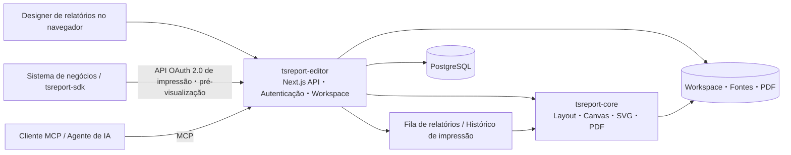

# tsreport-editor

[English](./README.md) | [日本語](./README.ja.md) | [简体中文](./README.zh-CN.md) | [繁體中文](./README.zh-TW.md) | [한국어](./README.ko.md) | [Tiếng Việt](./README.vi.md) | [ไทย](./README.th.md) | [Bahasa Indonesia](./README.id.md) | [Deutsch](./README.de.md) | [Français](./README.fr.md) | [Español](./README.es.md) | Português | [العربية](./README.ar.md) | [עברית](./README.he.md)

`tsreport-editor` é um designer de relatórios baseado em navegador e, ao mesmo tempo, um servidor de relatórios, que usa o [`tsreport-core`](https://www.npmjs.com/package/tsreport-core) como motor de layout e renderização.

Não se trata apenas de uma tela para desenhar relatórios. Um único servidor oferece gerenciamento de templates `.report` e materiais, pré-visualização com dados reais, importação de PDF, uma API de impressão OAuth 2.0 para sistemas externos, MCP para agentes de IA, uma fila assíncrona de relatórios e trilhas de auditoria de impressão.

- **Designer de relatórios** — edite bandas, texto, formas, imagens, SVG, tabelas, sub-relatórios, códigos de barras e fórmulas no navegador.
- **Consistência entre pré-visualização e PDF** — o Editor, a pré-visualização de impressão e a saída em PDF usam o mesmo resultado de layout e a mesma implementação de renderização do `tsreport-core`.
- **Operação multilíngue e de fontes** — gerenciamento de fontes por conta, fontes incorporadas, contornos, fontes importadas de PDF e composição tipográfica para japonês, chinês, coreano, escrita árabe, entre outros.
- **Servidor de API de relatórios** — imprime de forma assíncrona, via OAuth 2.0 Client Credentials, templates fixados por tags publicadas.
- **Servidor MCP** — permite que uma IA leia, edite e valide templates, verifique o layout, renderize PNG/PDF, importe PDFs originais e compare diferenças.
- **Operação e trilhas de auditoria** — a impressão via API é processada em fila, e as saídas em PDF do Editor, da API e do MCP são registradas em um histórico de impressão separado por conta.

## Design de relatórios com IA via MCP

Os vídeos mostram a IA criando um relatório via MCP e abrindo a visualização final. A versão em inglês também demonstra o suporte a relatórios multilíngues.

| Versão em inglês — relatórios multilíngues | Versão em japonês |
| --- | --- |
| [](https://youtu.be/CHsNew6yQr4) | [](https://youtu.be/0I3ljxLUbys) |

### Gerenciamento de fontes

O gerenciamento de fontes permite baixar Google Fonts e enviar seus próprios arquivos de fontes.

[](https://youtube.com/shorts/fAUjfFqaVtY)

## Visão geral do sistema



`tsreport-core` é um motor de relatórios em TypeScript puro, sem dependências de runtime. O `tsreport-editor` constrói sobre ele o Next.js, o PostgreSQL, a autenticação, o gerenciamento de arquivos, a fila e as telas administrativas. Como o lado do Editor usa Argon2id para o hash de senhas e `sharp` para a geração de PNG no MCP, o servidor Editor como um todo não é considerado "zero dependências nativas".

## Principais funcionalidades de design

- Bandas como Title, Page Header, Column Header, Detail, Group Header/Footer, Summary, Page Footer, Last Page Footer, Background, No Data, entre outras
- Texto fixo, campos de expressão, linhas, retângulos, elipses, caminhos vetoriais, imagens, SVG, frames, tabelas, sub-relatórios, códigos de barras, fórmulas e quebras de página
- Atributos de desenho incluindo RGB, CMYK, cores especiais, gradiente, transparência, recorte (clip) e soft mask
- Edição visual e edição em JSON de `.report`, múltiplas abas, Desfazer/Refazer, camadas, zoom e pré-visualização de impressão
- Verificação de campos, parâmetros, expressões e detalhes repetidos usando dados de teste em JSON
- Importação de páginas de PDF com alta fidelidade. Converte texto, vetores, imagens e fontes incorporadas em elementos de relatório editáveis ou em desenho preservado
- Tags de publicação de templates. Separa o conteúdo em edição da versão fixada usada pela API externa

## Início rápido

### Pré-requisitos

- Docker e Docker Compose

Os pacotes publicados `tsreport-core` e `tsreport-react` são instalados do npm conforme o lockfile do Editor. Repositórios adjacentes não são usados.

Restauração de dependências, verificação de tipos, testes e build do Next.js do Editor são executados apenas dentro do Docker. Não execute `npm install`, `npm ci`, `npx` ou scripts npm em `src/` no host.

### Iniciando

```sh
cd ../tsreport-editor/server
docker compose up
```

Para iniciar em segundo plano:

```sh
cd ../tsreport-editor/server
docker compose up -d
docker compose ps
docker compose logs -f tsreport_editor_node
```

O `server/compose.yaml` de desenvolvimento fixa o nome do projeto Compose como `tsreport-editor-dev`, separando os namespaces de contêineres e de rede de outros produtos no mesmo host e do projeto `tsreport-editor` de produção.

Para parar:

```sh
cd ../tsreport-editor/server
docker compose down
```

Na operação normal, em que se para o serviço mantendo os dados, não execute `down -v` nem exclua os diretórios de NFS/DB.

### Serviços de desenvolvimento e portas

| Serviço | Função | Lado do host |
| --- | --- | --- |
| `tsreport_editor_node` | Editor Next.js・REST API | `http://localhost:52005` |
| `tsreport_editor_node` | Listener MCP dedicado | `http://localhost:52006` |
| `tsreport_editor_node` | Notificação de atualização do workspace | `52007` |
| `tsreport_editor_db` | PostgreSQL | `localhost:52437` |
| `tsreport_editor_cron` | Dispara a fila de relatórios a cada 10 segundos | somente interno |
| `tsreport_editor_nginx` | Proxy reverso HTTP / HTTPS | `52085` / `52448` |

No navegador, abra `http://localhost:52005`, ou `https://localhost:52448` usando o certificado autoassinado.

## Primeiro login e configurações de segurança obrigatórias

Na primeira inicialização, sob um lock de banco de dados, a aplicação cria uma única vez os dados iniciais do esquema, as contas, os workspaces e os templates usados na regressão.

| Finalidade | ID de login | Senha inicial | Permissão |
| --- | --- | --- | --- |
| Administrador inicial | `admin` | `pass` | Administrador |
| Testes de regressão | `test` | `pass` | Usuário comum |

> **Importante:** as senhas iniciais são credenciais de inicialização publicamente conhecidas. Certifique-se de alterá-las antes de iniciar a operação em produção. Como a UI atual não força automaticamente a troca no primeiro login, cabe ao operador confirmar que a alteração foi concluída.

Após o primeiro login, realize o seguinte a partir do menu hambúrguer:

1. Altere a senha inicial em "Alterar senha" da conta `admin`.
2. Exclua a conta `test` se ela não for usada para testes de regressão no seu ambiente. Se for mantida, altere a senha sem falta.
3. Regenere a chave MCP em "Configurações de MCP" das contas iniciais que forem mantidas.
4. Exclua o cliente de API de regressão `test-report-client`, ou redefina o Client Secret e as permissões de acesso.
5. Altere as credenciais de DB e o `REPORT_BATCH_TOKEN` em `server/node/.env` e no `.env` de produção, deixando de usar os valores padrão.
6. Antes de expor externamente, substitua o certificado autoassinado do nginx por um certificado oficial e verifique as portas expostas e o firewall.

As senhas de contas locais são armazenadas no DB com hash usando Argon2id. Pelo menos uma conta, incluindo o administrador, deve permanecer como administrador.

## Fluxo básico de utilização

1. Faça login e abra o workspace da conta.
2. Registre as fontes necessárias para o relatório em "Gerenciamento de fontes".
3. Crie um novo `.report` ou abra um `.report`/PDF existente.
4. Posicione bandas e elementos e, se necessário, especifique um JSON de dados de teste.
5. Confirme múltiplas páginas, transbordamento de detalhes e a última página na visualização do Editor e na pré-visualização de impressão.
6. Gere o PDF. A saída é registrada no histórico de impressão da própria conta.
7. Ao utilizar a partir de um sistema externo, crie uma tag de publicação e configure um cliente de API com as permissões de acesso.

O salvamento normal atualiza o arquivo em edição no workspace. A tag de publicação fixa o JSON do template naquele momento; portanto, salvamentos normais posteriores não alteram o resultado da impressão via API para tags já existentes. Para publicar alterações externamente, crie uma nova tag ou atualize explicitamente a tag alvo.

## Versionamento de templates de relatório por meio de tags de publicação

A tag de publicação não é apenas uma flag que alterna o `.report` em edição para um estado de publicação externa. É um mecanismo que **salva o conteúdo do template de relatório como uma versão e permite que essa versão seja referenciada pelo nome a partir de uma API externa**.

Por exemplo, mesmo depois de publicar o conteúdo atual de um template de fatura como `v1`, o `invoice.report` no workspace continua editável. Alterações feitas por salvamento normal não são refletidas automaticamente em `v1`. Ao publicar o conteúdo alterado como `v2`, o sistema externo pode selecionar explicitamente, na URL da API, qual versão utilizar.

```text
invoice.report (versão de trabalho em edição)
  ├─ v1 (JSON do template já publicado)
  └─ v2 (JSON do template publicado após as alterações)

POST /api/report/print/{workspaceKey}/invoice.report/v1
POST /api/report/print/{workspaceKey}/invoice.report/v2
```

Essa separação viabiliza as seguintes operações:

- o sistema de negócios continua usando o `v1` existente enquanto um novo layout de relatório está sendo editado e validado
- a chamada é alterada de `v1` para `v2` no momento de troca planejado pelo lado que consome a API
- múltiplas versões podem coexistir, com cada parceiro utilizando uma versão diferente
- caso um problema seja encontrado, a indicação da API pode voltar para uma tag anterior sem precisar reverter o arquivo de template

Ao criar uma nova tag, o JSON do template daquele momento é salvo. Também é possível atualizar explicitamente a mesma tag, mas nesse caso o conteúdo apontado pela mesma URL de API também muda. Em operações que valorizam reprodutibilidade ou migração gradual, crie novas tags como `v1`, `v2`, `2026-07`, em vez de sobrescrever tags existentes.

O que a tag de publicação fixa é o JSON do template. Os `rows` e `parameters` da chamada de API não fazem parte da versão e são especificados a cada requisição de impressão. Além disso, "publicação" aqui não significa exposição anônima na internet. Para de fato utilizar a partir da API, é necessário satisfazer simultaneamente o escopo OAuth 2.0, as permissões de acesso do cliente de API e as permissões de workspace do usuário proprietário.

## Usuários, workspaces e compartilhamento

### Gerenciamento de usuários

- Cada conta possui um único workspace.
- O workspace é identificado por um `workspaceKey` UUID imutável.
- O administrador pode criar usuários e gerenciar nome de exibição, ID de login, permissões, disponibilidade de uso do MCP, senha e configurações do sistema.
- Mesmo o administrador não pode visualizar incondicionalmente o workspace de outra conta. Os dados de relatório são isolados por tenant.
- A exclusão de usuário é física. Dados relacionados — workspace, fontes, compartilhamentos, clientes de API, tokens e histórico de impressão — são excluídos e não podem ser restaurados.

### Compartilhamento de pastas

É possível compartilhar apenas as pastas necessárias com outra conta, em vez do workspace inteiro.

- O destinatário do compartilhamento é especificado pelo `workspaceKey` da outra parte.
- Leitura e escrita podem ser permitidas separadamente.
- O compartilhamento de leitura permite consultar templates e materiais; o compartilhamento de escrita permite edição colaborativa.
- O destinatário pode cancelar um compartilhamento recebido.
- O mesmo escopo de acesso efetivo se aplica à API e ao MCP.

Quando o Editor ou o MCP atualiza um workspace, um evento de atualização é notificado às outras abas do Editor. Se não houver alterações não salvas, a página é recarregada; se houver alterações não salvas, a edição local é preservada e um aviso é exibido.

Compartilhamento, permissões de API e tags de publicação têm finalidades diferentes.

| Conceito | Alvo | Papel |
| --- | --- | --- |
| Compartilhamento de pastas | Entre contas | Permite leitura/escrita a operações humanas no Editor e ao MCP que atua como essa conta |
| Permissões de acesso da API | Cliente de API | Restringe o `workspaceKey` e as pastas que um sistema externo pode consultar |
| Tag de publicação | Versão do `.report` | Fixa o conteúdo do template usado na impressão via API |

Adicionar apenas permissões de acesso da API não é suficiente se o próprio usuário proprietário não tiver acesso à pasta alvo. Por outro lado, apenas o compartilhamento de pastas não expõe nada à API externa.

## Adição e gerenciamento de fontes

O "Gerenciamento de fontes" no menu hambúrguer está disponível para todos os usuários. As fontes são armazenadas por conta em `/var/nfs/fonts/{accountId}/` e não são visíveis para outras contas.

### Upload

1. Abra "Gerenciamento de fontes".
2. Adicione arquivos selecionando-os ou arrastando e soltando.
3. Selecione o ID de fonte exibido na lista no `fontFamily` de um elemento de texto.

Os formatos suportados são TTF, OTF, TTC, OTC, WOFF e WOFF2. O limite da aplicação para um único arquivo é de 256 MiB. É possível selecionar e registrar em lote múltiplas fontes do sistema, como as de `/System/Library/Fonts` no macOS. O aplicativo não lê implicitamente fontes do SO host nem instala fontes no SO.

Duplicidades são determinadas da seguinte forma:

- Mesmo ID de fonte, binário idêntico: tratado como sucesso, como uma nova tentativa de upload em lote
- Mesmo ID de fonte, binário diferente: rejeitado como conflito de ID
- ID de fonte diferente, binário idêntico: rejeitado como duplicata, indicando o ID existente
- Apenas metadados como nome de família ou nome PostScript iguais: se o binário for diferente, pode ser registrado como uma fonte independente

A correspondência de conteúdo é determinada não apenas por metadados ou hash, mas por comparação byte a byte completa após a confirmação de tamanho de arquivo idêntico.

### Google Fonts e fontes importadas de PDF

Em "Download Google Fonts", é possível escolher o idioma e baixar candidatos para a área da conta. Pressupõe-se que haja conectividade com a rede externa.

Na importação de PDF, fontes incorporadas reutilizáveis são registradas como fontes de aplicação dentro da conta. Quando não há programa de fonte disponível, o sistema faz a correspondência de nome e estilo com as fontes da conta, exibindo candidatos e avisos.

## Utilizando a API de impressão externa

A API externa usa um Bearer Token OAuth 2.0 Client Credentials, em vez do cookie de login usado na tela. Para começar a usar, são necessários três itens:

1. **Tag de publicação** — crie a versão fixada do `.report` usado pela API.
2. **Cliente de API** — crie Client ID, Client Secret e escopos em "Clientes de API" no menu hambúrguer.
3. **Permissões de acesso** — registre o `workspaceKey` e as pastas que o cliente pode utilizar.

Os escopos disponíveis são `report:print`, `report:status`, `report:download` e `report:preview`. O escopo efetivo de um cliente de API é a interseção entre "as permissões de acesso do cliente" e "o workspace/pastas compartilhadas que o próprio usuário proprietário pode acessar".

### Fluxo da REST API

```text
POST /api/oauth/token
  grant_type=client_credentials
  -> access_token

POST /api/report/print/{workspaceKey}/{templatePath}/{tag}
  -> { key }

GET /api/report/status/{key}
  -> queued | processing | completed | error

GET /api/report/download/{key}
  -> application/pdf
```

Exemplo:

```sh
BASE_URL=http://localhost:52005
CLIENT_ID=test-report-client
CLIENT_SECRET=test-report-secret

TOKEN=$(curl -sS -u "$CLIENT_ID:$CLIENT_SECRET" \
  -d grant_type=client_credentials \
  -d 'scope=report:print report:status report:download' \
  "$BASE_URL/api/oauth/token" | jq -r .access_token)

curl -sS \
  -H "Authorization: Bearer $TOKEN" \
  -H 'Content-Type: application/json' \
  -d '{"rows":[{"item":"seed"}],"parameters":{}}' \
  "$BASE_URL/api/report/print/00000000-0000-0000-0000-000000000002/invoice.report/v1"
```

Mesmo que `templatePath` contenha `/`, o último segmento após ele é resolvido como a tag. Status e download só podem ser consultados pelo mesmo cliente de API que criou a requisição de impressão.

### tsreport-sdk

Com o [`tsreport-sdk`](../tsreport-sdk) você pode lidar com obtenção de token, envio à fila, polling e obtenção do PDF por meio de uma única API TypeScript.

```ts
import { TsreportClient } from 'tsreport-sdk'

const client = new TsreportClient({
    baseUrl: 'https://reports.example.com',
    clientId: process.env.REPORT_CLIENT_ID!,
    clientSecret: process.env.REPORT_CLIENT_SECRET!
})

const pdf = await client.printAndDownload(
    '00000000-0000-0000-0000-000000000002',
    'orders/invoice.report',
    'v1',
    { rows: [{ orderId: 42 }], parameters: {} }
)
```

Não incorpore o Client Secret em um navegador. Ao usar a partir de uma aplicação de navegador, faça a chamada por meio de um backend autenticado do seu próprio sistema. Para o encaminhamento seguro da API de materiais de pré-visualização, é possível usar `createPreviewEndpoint` de `tsreport-sdk/server`.

## Fila de relatórios e trilhas de auditoria de impressão

As requisições de impressão vindas da API são registradas em `PrintRequest` no DB com status `queued`. O `tsreport_editor_cron` dispara o endpoint de lote autenticado a cada 10 segundos, transicionando o estado de `queued` → `processing` → `completed` ou `error`. A execução simultânea é serializada por lock no DB.

Os PDFs gerados são salvos em `/var/nfs/report-pdf`. Na tela de histórico de impressão, é possível confirmar, para a própria conta:

- data e hora de execução
- caminho de execução: `editor` / `api` / `mcp`
- workspace, template e formato
- estado de conclusão/erro e motivo do erro
- novo download do PDF concluído

PDFs gerados no Editor são registrados na API de histórico a partir do navegador. O `render_report(format="pdf")` do MCP também é registrado no histórico. O histórico é isolado por conta; mesmo o administrador não pode visualizar o histórico de outra conta.

Na operação, faça backup do DB e de `server/nfs` como o mesmo ponto de recuperação. Restaurar apenas as linhas do histórico, ou apenas os arquivos de PDF, faz com que a trilha de auditoria e os artefatos deixem de corresponder entre si. O período de retenção de acordo com o volume de saída e o monitoramento de disco também devem ser decididos pela operação.

## Utilizando o MCP

O MCP é independente do cliente OAuth da API de impressão externa. Ele autentica com o ID de login e a chave MCP de cada usuário, operando com o mesmo workspace e as mesmas permissões de compartilhamento desse usuário.

### Ativação e credenciais

1. Abra "Configurações de MCP" no menu hambúrguer.
2. Ative o uso do MCP para você mesmo.
3. Copie a chave MCP. Regenere a chave inicial antes de entrar em operação.
4. O administrador pode, na mesma tela, ativar/desativar o MCP globalmente e configurar a porta dedicada.

Normalmente se usa `http://localhost:52005/api/mcp`, o mesmo do Next.js. No ambiente de desenvolvimento, também está disponível o listener dedicado `http://localhost:52006`. Configure no cliente MCP a URL do Streamable HTTP e uma das seguintes formas de autenticação:

- `x-mcp-account: <ID de login>` e `x-mcp-key: <chave MCP>`
- `Authorization: Bearer <ID de login>:<chave MCP>`

O guia de configuração pode ser obtido sem autenticação.

```sh
curl http://localhost:52005/api/mcp
```

Exemplo de verificação da lista de ferramentas:

```sh
curl -sS http://localhost:52005/api/mcp \
  -H 'Content-Type: application/json' \
  -H 'x-mcp-account: admin' \
  -H 'x-mcp-key: <chave MCP regenerada>' \
  -d '{"jsonrpc":"2.0","id":1,"method":"tools/list","params":{}}'
```

### Ferramentas MCP

| Categoria | Ferramenta |
| --- | --- |
| Introdução | `get_started` |
| Descoberta | `list_workspaces`, `list_templates`, `list_workspace_files`, `list_fonts` |
| Template | `get_template`, `get_template_schema`, `validate_template`, `save_template`, `update_template_elements` |
| Materiais | `save_workspace_file`, `delete_workspace_file` |
| Validação・Saída | `layout_report`, `render_report`, `compare_reports` |
| Importação de originais | `import_pdf` |

O fluxo de trabalho recomendado é o seguinte:

1. Leia `get_started` e `get_template_schema`.
2. Confirme os recursos disponíveis com `list_workspaces`, `list_templates`, `list_workspace_files` e `list_fonts`.
3. Gere um template ou obtenha um existente com `get_template`.
4. Valide a estrutura e as expressões com `validate_template`.
5. Confirme numericamente com `layout_report` as coordenadas absolutas, o número de páginas e elementos fora da área.
6. Confirme visualmente com `render_report(format="png")`.
7. Salve com `save_template` ou `update_template_elements`.
8. Compare o antes e o depois da alteração com `compare_reports`, confirmando que não houve deslocamentos indesejados.

Quando houver um PDF original, em vez de recriá-lo visualmente, siga a ordem: `save_workspace_file` → `import_pdf` → ajuste de expressões e bandas → `layout_report` / `render_report`.

## Idiomas e integrações externas opcionais

A UI do Editor pode ser selecionada entre japonês, inglês, chinês simplificado, coreano, chinês tradicional, vietnamita, tailandês, indonésio, alemão, francês, espanhol, português, árabe e hebraico. Em árabe e hebraico, a UI também fica em RTL. Isso não restringe os sistemas de escrita que podem ser usados dentro do relatório.

O administrador pode configurar login externo do Google/Microsoft. Se o login externo não for habilitado, é possível operar apenas com contas locais protegidas por Argon2id.

Para usar recursos assistidos por IA, registre a chave de API e o modelo nas configurações do sistema no DB. O valor inicial não inclui uma chave de API externa válida. Não armazene valores secretos no código-fonte, em `.report`, no workspace ou no README.

## Dados iniciais e ambiente de regressão

Na primeira inicialização, são criados:

- as contas `admin` e `test`, e seus `workspaceKey` fixos
- o cliente de API de regressão `test-report-client`, de propriedade de `test`
- `invoice.report`, `sub.report` e `assets/logo.png` no workspace de `test`
- a tag de publicação `v1` de `invoice.report`
- compartilhamento de leitura/escrita da pasta `assets` de `test` para `admin`

Chaves fixas:

- `admin`: `00000000-0000-0000-0000-000000000001`
- `test`: `00000000-0000-0000-0000-000000000002`

Elas são usadas nas regressões em servidor real de `tsreport-editor`, `tsreport-sdk` e `tsreport-react`. Na operação em produção, certifique-se de alterar ou excluir as credenciais iniciais mencionadas acima.

### Restaurando o DB de desenvolvimento ao estado inicial

Para recriar completamente o PostgreSQL do ambiente de desenvolvimento, pare o contêiner, exclua `server/db/pgdata/data` e reinicie.

```sh
cd ../tsreport-editor/server
docker compose down
rm -rf db/pgdata/data
docker compose up
```

Ao reiniciar, o DDL do PostgreSQL é aplicado, e, na inicialização da aplicação, os dados iniciais do DB — contas iniciais, clientes de API, tags de publicação, etc. — são recriados. Os arquivos de workspace de regressão são reabastecidos apenas se estiverem faltando. Não exclua `pgdata` enquanto o contêiner do DB estiver em execução.

Essa operação inicializa apenas o PostgreSQL. Workspaces, fontes e PDFs gerados armazenados em `server/nfs` não são excluídos. Se for necessário restaurar tanto o DB quanto o NFS ao estado inicial, use "Redefinição de fábrica" no menu do administrador.

A "Redefinição de fábrica" exclui todas as tabelas do DB, os workspaces e as saídas de relatório, recriando o estado inicial. Não pode ser desfeita. Fontes, certificados e arquivos ocultos como `.gitignore` não são excluídos.

## Locais de armazenamento de dados

| Dado | Dentro do contêiner | Lado do host de desenvolvimento |
| --- | --- | --- |
| PostgreSQL | `/var/pgdata/data` | `server/db/pgdata` |
| Workspace | `/var/nfs/workspaces/{workspaceKey}` | `server/nfs/workspaces` |
| Fontes da conta | `/var/nfs/fonts/{accountId}` | `server/nfs/fonts` |
| PDF gerado | `/var/nfs/report-pdf` | `server/nfs/report-pdf` |
| Logs do nginx | `/var/log/nginx` | `logs/nginx` |

A exportação/importação de dados da aplicação pode ser executada a partir do menu do administrador. Para a recuperação de desastres de todo o ambiente, não dependa apenas dessa funcionalidade; mantenha também backups consistentes de PostgreSQL e NFS.

## Build e inicialização em produção

O build e a inicialização em produção também pressupõem o Docker Compose. `build.sh`, `build_boot.sh`, `boot.sh`, `boot_db.sh`, `boot_web.sh` e `build_boot_web.sh` são wrappers finos que chamam o Docker Compose. Não é um procedimento para instalar dependências Node.js no host e manter `server.js` em execução diretamente.

### 1. Preparação prévia

`tsreport-core` e `tsreport-react` são restaurados do npm nas versões fixadas por `src/package-lock.json`.

```sh
cd ../tsreport-editor/server
```

Edite as configurações de produção.

- `boot/web/.env`: informações de conexão com o DB e `REPORT_BATCH_TOKEN`
- `boot/compose.yaml`: configuração do PostgreSQL para a configuração de servidor único
- `boot/db/compose.yaml`: configuração do PostgreSQL para a configuração separada de DB/Web
- `nginx/cert`: certificado TLS oficial
- `nginx/conf`: nome de host público, destino de encaminhamento e controle de acesso necessário

Certifique-se de que `DB_PASS` em `boot/web/.env` corresponda ao `DB_PASS` do Compose da configuração adotada. O Web e o cron usam o mesmo `REPORT_BATCH_TOKEN` de `boot/web/.env`. Os valores presentes no repositório são para inicialização local; altere-os sempre em produção.

### 2. Build de produção

```sh
cd ../tsreport-editor/server
./build.sh
```

O `build.sh` não restaura dependências Node.js no host. Ele sincroniza `src` para `server/build/src`, executa o build de produção do Next.js em um ambiente Docker isolado e coloca os artefatos standalone em:

```text
server/boot/web/dist/standalone/
  ├─ server.js
  ├─ .next/
  ├─ node_modules/
  ├─ public/
  └─ seed/
```

O build inclui verificação de TypeScript e a compilação de produção do Next.js. Inicie somente após confirmar que o comando terminou normalmente e que `boot/web/dist/standalone/server.js` existe.

### 3. Iniciando o servidor já compilado (sem recompilar)

Se `./build.sh` já foi executado com sucesso e `boot/web/dist/standalone/server.js` existe, é possível iniciar o servidor de produção sem repetir o build de produção do Next.js.

Para iniciar o DB e o Web no mesmo servidor:

```sh
cd ../tsreport-editor/server
./boot.sh
```

Para separar o servidor de DB do servidor Web, execute respectivamente no host de DB e no host Web.

```sh
# Host do BD
cd ../tsreport-editor/server
./boot_db.sh

# Host web
cd ../tsreport-editor/server
./boot_web.sh
```

`boot.sh` e `boot_web.sh` montam o `boot/web/dist/standalone` existente em um contêiner Node.js e o iniciam com PM2. A imagem de runtime Docker é atualizada pelo Compose conforme necessário, mas o build de produção do Next.js não é executado. Para refletir alterações no código-fonte, execute primeiro novamente o `./build.sh`.

### 4-A. Configuração de servidor único

Configuração em que DB, Node.js, o cron da fila de relatórios e o nginx rodam na mesma instância de servidor. Do build à inicialização em modo persistente, tudo é feito com o seguinte comando único.

```sh
cd ../tsreport-editor/server
./build_boot.sh
```

Se já estiver compilado e for necessário apenas iniciar, execute `./boot.sh`. `./boot.sh` usa `boot/compose.yaml` e inicia em segundo plano todos os serviços a seguir como o projeto `tsreport-editor`, que não colide com projetos Compose de outros produtos.

| Serviço | Função | Porta exposta |
| --- | --- | --- |
| `tsreport_editor_db` | PostgreSQL | `52437` |
| `tsreport_editor_node` | Next.js standalone compilado, MCP, notificação de atualização | `52005`, `52006`, `52007` |
| `tsreport_editor_cron` | Dispara a fila assíncrona de relatórios a cada 10 segundos | nenhuma |
| `tsreport_editor_nginx` | Proxy reverso HTTP/HTTPS | `52085`, `52448` |

O contêiner Web monta apenas `boot/web/dist/standalone` — não a árvore de código-fonte — em `/var/node`, executando `server.js` em modo cluster do PM2. Alterações em `src` durante a execução não são refletidas no servidor de produção. Para refletir alterações, execute novamente `./build.sh` e reinicie o serviço Web.

Verificação de inicialização:

```sh
docker compose --project-name tsreport-editor -f boot/compose.yaml ps
docker compose --project-name tsreport-editor -f boot/compose.yaml logs -f tsreport_editor_node
```

Parar:

```sh
docker compose --project-name tsreport-editor -f boot/compose.yaml down
```

### 4-B. Configuração separada de servidor de DB e servidor Web

Configuração em que o PostgreSQL roda em um servidor dedicado a DB, e Node.js, o cron da fila de relatórios e o nginx rodam em um servidor Web. Coloque este repositório em ambos os hosts e execute um comando único no host de DB e outro no host Web.

No host de DB, inicie apenas `boot/db/compose.yaml`.

```sh
cd ../tsreport-editor/server
./boot_db.sh
```

Altere o `boot/web/.env` do host Web para o nome DNS privado ou endereço IP do host de DB e a porta exposta pelo host de DB.

```dotenv
DB_HOST=db.internal.example
DB_PORT=52437
DB_NAME=TSREPORT_EDITOR_DB
DB_USER=postgres
DB_PASS=senha do BD de produção
REPORT_BATCH_TOKEN=segredo compartilhado de produção
```

No host Web, execute o build de produção e a inicialização persistente dos serviços do lado Web com um único comando.

```sh
cd ../tsreport-editor/server
./build_boot_web.sh
```

Se já estiver compilado e for necessário apenas iniciar o lado Web, execute `./boot_web.sh`. O `boot/web/compose.yaml` do lado Web inicia apenas Node.js, cron e nginx, sem criar o contêiner PostgreSQL.

Verificação de inicialização na configuração separada:

```sh
# Host do BD
docker compose --project-name tsreport-editor-db -f boot/db/compose.yaml ps
docker compose --project-name tsreport-editor-db -f boot/db/compose.yaml logs -f tsreport_editor_db

# Host web
docker compose --project-name tsreport-editor-web -f boot/web/compose.yaml ps
docker compose --project-name tsreport-editor-web -f boot/web/compose.yaml logs -f tsreport_editor_node
```

Parada da configuração separada:

```sh
# Host web
docker compose --project-name tsreport-editor-web -f boot/web/compose.yaml down

# Host do BD
docker compose --project-name tsreport-editor-db -f boot/db/compose.yaml down
```

Não exponha a porta `52437` do DB diretamente à internet; permita-a apenas dentro de uma rede privada acessível a partir do host Web. O `DB_PASS` de `boot/db/compose.yaml` no host de DB e o `DB_PASS` de `boot/web/.env` no lado Web devem ter o mesmo valor. Workspaces, fontes e PDFs gerados são armazenados em `server/nfs` no lado do host Web, não sendo necessário um sistema de arquivos compartilhado com o host de DB.

### 5. Verificação de funcionamento comum

No navegador, abra `https://<host Web>:52448` ou `http://<host Web>:52005`. Se for usar a API de impressão externa, confirme também que `tsreport_editor_cron` está `Up`.

Em paradas e reinicializações normais, `server/db/pgdata` e o `server/nfs` do host Web são preservados. Somente quando a inicialização do DB for necessária, siga o procedimento de inicialização descrito acima e exclua `db/pgdata/data` após parar o serviço de DB.

Antes da publicação em produção, confirme pelo menos o seguinte:

- os usuários iniciais, a chave MCP e o cliente de API de regressão foram alterados ou excluídos
- a senha do DB e o `REPORT_BATCH_TOKEN` foram alterados
- um certificado TLS oficial foi configurado
- `/api/report/batch/process` não está exposto externamente sem autenticação
- há backup e monitoramento de capacidade para o DB, os workspaces, as fontes e os PDFs gerados
- as fontes necessárias e as tags de publicação estão registradas para as contas alvo
- Editor, pré-visualização e impressão via API foram confirmados com relatórios de múltiplas páginas equivalentes a dados reais

## Variáveis de ambiente

As configurações da aplicação ficam em `server/node/.env` no desenvolvimento e em `server/boot/web/.env` em produção.

| Variável | Descrição | Valor padrão de desenvolvimento |
| --- | --- | --- |
| `DB_HOST` | Host do PostgreSQL | `172.31.0.30` |
| `DB_PORT` | Porta do PostgreSQL | `15432` |
| `DB_NAME` | Nome do DB | `TSREPORT_EDITOR_DB` |
| `DB_USER` | Usuário do DB | `postgres` |
| `DB_PASS` | Senha do DB | `postgres1234` |
| `REPORT_BATCH_TOKEN` | Segredo compartilhado para disparar o lote | `tsreport-report-batch-local` |
| `WORKSPACES_ROOT` | Raiz dos workspaces | `/var/nfs/workspaces` |
| `NEXT_TELEMETRY_DISABLED` | Desativa a telemetria do Next.js | `1` |

O estado de habilitação geral do MCP e a porta dedicada são gerenciados como configurações do sistema no DB, alteráveis pela tela administrativa. As configurações de OAuth para login externo e as configurações opcionais de suporte por IA também são gerenciadas pela tela administrativa/SystemProperty; não grave valores secretos no README ou no código-fonte.

## Desenvolvimento e validação

```sh
cd ../tsreport-editor

docker compose -f server/compose.yaml exec tsreport_editor_node npx tsc --noEmit
docker compose -f server/compose.yaml exec tsreport_editor_node npm test
docker compose -f server/compose.yaml exec \
  -e TSREPORT_EDITOR_LIVE_BASE=http://localhost:3000 \
  tsreport_editor_node npm run test:live

cd server
./build.sh
```

Desenvolvimento, testes e build de produção restauram `tsreport-core` e `tsreport-react` do npm. Não é necessário clonar repositórios adjacentes.

## Estrutura do repositório

| Caminho | Conteúdo |
| --- | --- |
| `src/` | Editor Next.js, REST API, MCP, lógica de servidor |
| `tests/` | Testes unitários, de integração e regressão em servidor real |
| `server/` | Desenvolvimento Docker, build e configuração de inicialização em produção |
| `cli/` | Scripts auxiliares |

Repositórios relacionados:

| Repositório | Conteúdo |
| --- | --- |
| [`tsreport-core`](https://github.com/pontasan/tsreport-core) | Motor de layout, renderização, PDF e fontes de relatório em TypeScript puro |
| [`tsreport-editor`](https://github.com/pontasan/tsreport-editor) | Este designer de relatórios e servidor de relatórios baseado no navegador |
| [`tsreport-sdk`](https://github.com/pontasan/tsreport-sdk) | SDK TypeScript sem dependências para as APIs de impressão e pré-visualização |
| [`tsreport-react`](https://github.com/pontasan/tsreport-react) | UI de pré-visualização React que usa o `tsreport-core` |

## Licença

O tsreport-editor pode ser utilizado, à escolha do usuário, sob a [MIT License](./LICENSE-MIT) ou a [Apache License 2.0](./LICENSE-APACHE) (SPDX: `MIT OR Apache-2.0`).
