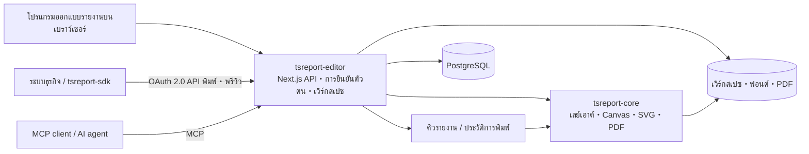

# tsreport-editor

[English](./README.md) | [日本語](./README.ja.md) | [简体中文](./README.zh-CN.md) | [繁體中文](./README.zh-TW.md) | [한국어](./README.ko.md) | [Tiếng Việt](./README.vi.md) | ไทย | [Bahasa Indonesia](./README.id.md) | [Deutsch](./README.de.md) | [Français](./README.fr.md) | [Español](./README.es.md) | [Português](./README.pt.md) | [العربية](./README.ar.md) | [עברית](./README.he.md)

`tsreport-editor` เป็นโปรแกรมออกแบบรายงานและเซิร์ฟเวอร์รายงานบนเบราว์เซอร์ ที่ใช้ [`tsreport-core`](https://www.npmjs.com/package/tsreport-core) เป็นเอนจินสำหรับจัดวางเลย์เอาต์และเรนเดอร์

ไม่ใช่แค่หน้าจอสำหรับออกแบบรายงานเท่านั้น แต่ยังให้บริการการจัดการเทมเพลต `.report` และวัสดุประกอบ การพรีวิวด้วยข้อมูลจริง การนำเข้า PDF, API สำหรับพิมพ์รายงาน OAuth 2.0 สำหรับระบบภายนอก, MCP สำหรับ AI agent, คิวรายงานแบบอะซิงโครนัส ไปจนถึงประวัติการพิมพ์ ทั้งหมดนี้อยู่บนเซิร์ฟเวอร์เดียว

- **โปรแกรมออกแบบรายงาน** — แก้ไขแบนด์ ข้อความ รูปทรง รูปภาพ SVG ตาราง ซับรีพอร์ต บาร์โค้ด และสูตรคำนวณผ่านเบราว์เซอร์
- **ความสอดคล้องระหว่างพรีวิวกับ PDF** — Editor, พรีวิวก่อนพิมพ์ และการส่งออก PDF ใช้ผลลัพธ์การจัดวางเลย์เอาต์และการเรนเดอร์ของ `tsreport-core` ตัวเดียวกัน
- **การรองรับหลายภาษาและฟอนต์** — จัดการฟอนต์แยกตามบัญชี ฟอนต์แบบฝัง (embedded), เค้าร่างตัวอักษร (outline), ฟอนต์ที่นำเข้าจาก PDF และการจัดเรียงพิมพ์สำหรับภาษาญี่ปุ่น จีน เกาหลี อาหรับ เป็นต้น
- **เซิร์ฟเวอร์ API รายงาน** — พิมพ์แบบอะซิงโครนัสด้วย OAuth 2.0 Client Credentials โดยใช้เทมเพลตที่ถูกตรึงไว้ด้วยแท็กเผยแพร่
- **เซิร์ฟเวอร์ MCP** — ให้ AI สามารถอ่าน แก้ไข ตรวจสอบความถูกต้อง ตรวจสอบเลย์เอาต์ เรนเดอร์ PNG/PDF นำเข้า PDF ต้นฉบับ และเปรียบเทียบความแตกต่างของเทมเพลตได้
- **การดำเนินงานและหลักฐาน** — การพิมพ์ผ่าน API จะถูกประมวลผลผ่านคิว และ PDF ที่ส่งออกจาก Editor, API, MCP จะถูกบันทึกลงในประวัติการพิมพ์แยกตามบัญชี

## การออกแบบรายงานด้วย AI ผ่าน MCP

วิดีโอเหล่านี้แสดงขั้นตอนที่ AI ออกแบบรายงานผ่าน MCP และเปิดหน้าตัวอย่างที่เสร็จสมบูรณ์ โดยเวอร์ชันภาษาอังกฤษยังแสดงตัวอย่างการรองรับรายงานหลายภาษาอีกด้วย

| เวอร์ชันภาษาอังกฤษ — รายงานหลายภาษา | เวอร์ชันภาษาญี่ปุ่น |
| --- | --- |
| [](https://youtu.be/CHsNew6yQr4) | [](https://youtu.be/0I3ljxLUbys) |

### การจัดการฟอนต์

หน้าจอจัดการฟอนต์รองรับการดาวน์โหลด Google Fonts และการอัปโหลดไฟล์ฟอนต์ของคุณเอง

[](https://youtube.com/shorts/fAUjfFqaVtY)

## ภาพรวมของระบบทั้งหมด



`tsreport-core` เป็นเอนจินรายงานที่เขียนด้วย pure TypeScript และไม่มี runtime dependency เลย ในขณะที่ `tsreport-editor` สร้างขึ้นด้านบนด้วย Next.js, PostgreSQL, ระบบยืนยันตัวตน, การจัดการไฟล์, คิว และหน้าจอผู้ดูแลระบบ ฝั่ง Editor ใช้ Argon2id สำหรับแฮชรหัสผ่าน และใช้ `sharp` สำหรับสร้าง PNG ใน MCP ด้วย จึงไม่ถือว่าเซิร์ฟเวอร์ Editor ทั้งหมดเป็น "ไม่มี native dependency"

## คุณสมบัติการออกแบบหลัก

- แบนด์ต่างๆ เช่น Title, Page Header, Column Header, Detail, Group Header/Footer, Summary, Page Footer, Last Page Footer, Background, No Data
- ข้อความคงที่, ฟิลด์นิพจน์ (expression field), เส้น, สี่เหลี่ยมผืนผ้า, วงรี, เวกเตอร์พาธ, รูปภาพ, SVG, เฟรม, ตาราง, ซับรีพอร์ต, บาร์โค้ด, สูตรคำนวณ, การขึ้นหน้าใหม่
- คุณสมบัติการวาดภาพ รวมถึง RGB, CMYK, สีพิเศษ (spot color), ไล่ระดับสี, ความโปร่งใส, การ clip, soft mask
- การแก้ไข `.report` แบบ visual และแบบ JSON, หลายแท็บ, Undo/Redo, เลเยอร์, การซูม, พรีวิวก่อนพิมพ์
- การตรวจสอบฟิลด์ พารามิเตอร์ นิพจน์ และรายละเอียดที่ทำซ้ำ ด้วยข้อมูลทดสอบ JSON
- การนำเข้าหน้า PDF ด้วยความแม่นยำสูง แปลงข้อความ เวกเตอร์ รูปภาพ ฟอนต์แบบฝัง เป็นองค์ประกอบรายงานที่แก้ไขได้หรือภาพวาดแบบคงที่
- แท็กเผยแพร่ของเทมเพลต แยกเนื้อหาที่กำลังแก้ไขออกจากเวอร์ชันที่ตรึงไว้สำหรับใช้กับ API ภายนอก

## เริ่มต้นใช้งานอย่างรวดเร็ว

### สิ่งที่ต้องเตรียม

- Docker และ Docker Compose

แพ็กเกจ `tsreport-core` และ `tsreport-react` ที่เผยแพร่แล้วจะถูกติดตั้งจาก npm ตาม lockfile ของ Editor โดยไม่อ้างอิง repository ที่อยู่ข้างเคียง

การคืนค่า dependency, การตรวจสอบ type, การทดสอบ, และการ build Next.js ของ Editor ทั้งหมดจะรันภายใน Docker เท่านั้น อย่ารัน `npm install`, `npm ci`, `npx`, หรือ npm script บน `src/` ฝั่ง host

### การเริ่มระบบ

```sh
cd ../tsreport-editor/server
docker compose up
```

หากต้องการรันแบบ background:

```sh
cd ../tsreport-editor/server
docker compose up -d
docker compose ps
docker compose logs -f tsreport_editor_node
```

`server/compose.yaml` สำหรับการพัฒนากำหนดชื่อโปรเจกต์ Compose ไว้ตายตัวเป็น `tsreport-editor-dev` เพื่อแยก namespace ของคอนเทนเนอร์และเน็ตเวิร์กออกจากผลิตภัณฑ์อื่นบน host เดียวกัน หรือโปรเจกต์ `tsreport-editor` สำหรับ production

หากต้องการหยุดระบบ:

```sh
cd ../tsreport-editor/server
docker compose down
```

สำหรับการใช้งานปกติที่ต้องการหยุดระบบโดยเก็บข้อมูลไว้ อย่าใช้ `down -v` หรือลบไดเรกทอรี NFS/DB

### บริการและพอร์ตสำหรับการพัฒนา

| บริการ | หน้าที่ | ฝั่ง host |
| --- | --- | --- |
| `tsreport_editor_node` | Next.js Editor・REST API | `http://localhost:52005` |
| `tsreport_editor_node` | MCP listener เฉพาะ | `http://localhost:52006` |
| `tsreport_editor_node` | การแจ้งเตือนการอัปเดตเวิร์กสเปซ | `52007` |
| `tsreport_editor_db` | PostgreSQL | `localhost:52437` |
| `tsreport_editor_cron` | เรียกใช้คิวรายงานทุก 10 วินาที | ภายในเท่านั้น |
| `tsreport_editor_nginx` | reverse proxy HTTP / HTTPS | `52085` / `52448` |

เปิด `http://localhost:52005` ในเบราว์เซอร์ หรือ `https://localhost:52448` ซึ่งใช้ใบรับรองแบบ self-signed

## การเข้าสู่ระบบครั้งแรกและการตั้งค่าความปลอดภัยที่จำเป็น

เมื่อเริ่มระบบครั้งแรก แอปพลิเคชันจะสร้างข้อมูลเริ่มต้นของสคีมา บัญชี เวิร์กสเปซ และเทมเพลตสำหรับการทดสอบ regression เพียงครั้งเดียวภายใต้ DB lock

| วัตถุประสงค์ | Login ID | รหัสผ่านเริ่มต้น | สิทธิ์ |
| --- | --- | --- | --- |
| ผู้ดูแลระบบเริ่มต้น | `admin` | `pass` | ผู้ดูแลระบบ |
| สำหรับการทดสอบ regression | `test` | `pass` | ผู้ใช้ทั่วไป |

> **สำคัญ:** รหัสผ่านเริ่มต้นเป็นข้อมูลรับรองสำหรับการตั้งค่าเริ่มต้นที่เปิดเผยต่อสาธารณะแล้ว ต้องเปลี่ยนก่อนเริ่มใช้งานจริงเสมอ เนื่องจาก UI ปัจจุบันไม่ได้บังคับให้เปลี่ยนรหัสผ่านโดยอัตโนมัติในการเข้าสู่ระบบครั้งแรก ผู้ดูแลระบบต้องตรวจสอบด้วยตนเองว่าได้เปลี่ยนรหัสผ่านเรียบร้อยแล้ว

หลังจากเข้าสู่ระบบครั้งแรก ให้ดำเนินการต่อไปนี้จากเมนูแฮมเบอร์เกอร์

1. เปลี่ยนรหัสผ่านเริ่มต้นของ `admin` ด้วยเมนู "เปลี่ยนรหัสผ่าน"
2. ลบบัญชี `test` หากไม่ได้ใช้สำหรับการทดสอบ regression ในสภาพแวดล้อมนั้น หากต้องการเก็บไว้ ต้องเปลี่ยนรหัสผ่านด้วย
3. สร้างคีย์ MCP ใหม่ในเมนู "การตั้งค่า MCP" สำหรับบัญชีเริ่มต้นที่ยังคงเก็บไว้
4. ลบ API client `test-report-client` ที่ใช้สำหรับ regression หรือกำหนด Client Secret และสิทธิ์การเข้าถึงใหม่
5. เปลี่ยนข้อมูลรับรอง DB และ `REPORT_BATCH_TOKEN` ใน `server/node/.env` และ `.env` ของ production จากค่าเริ่มต้น
6. เปลี่ยนใบรับรอง self-signed ของ nginx เป็นใบรับรองที่ถูกต้อง และตรวจสอบพอร์ตที่เปิดใช้งานและ firewall ก่อนเผยแพร่สู่ภายนอก

รหัสผ่านของบัญชีท้องถิ่นจะถูกแฮชด้วย Argon2id และบันทึกลง DB ต้องคงบัญชีที่มีสิทธิ์ผู้ดูแลระบบไว้อย่างน้อย 1 บัญชีเสมอ รวมถึง `admin` ด้วย

## ขั้นตอนการใช้งานพื้นฐาน

1. เข้าสู่ระบบและเปิดเวิร์กสเปซของบัญชี
2. ลงทะเบียนฟอนต์ที่จำเป็นสำหรับรายงานในเมนู "การจัดการฟอนต์"
3. สร้าง `.report` ใหม่ หรือเปิด `.report`／PDF ที่มีอยู่แล้ว
4. จัดวางแบนด์และองค์ประกอบต่างๆ และระบุ JSON ข้อมูลทดสอบหากจำเป็น
5. ตรวจสอบหลายหน้า, การล้นของรายละเอียด (overflow), และหน้าสุดท้าย ด้วยการแสดงผลของ Editor และพรีวิวก่อนพิมพ์
6. ส่งออก PDF ผลลัพธ์จะถูกบันทึกลงในประวัติการพิมพ์ของบัญชีตนเอง
7. หากต้องการใช้งานจากระบบภายนอก ให้สร้างแท็กเผยแพร่ และตั้งค่า API client กับสิทธิ์การเข้าถึง

การบันทึกปกติจะอัปเดตไฟล์ที่กำลังแก้ไขในเวิร์กสเปซ แท็กเผยแพร่จะตรึง JSON ของเทมเพลต ณ เวลานั้นไว้ ดังนั้นการบันทึกปกติในภายหลังจะไม่เปลี่ยนแปลงผลลัพธ์การพิมพ์ผ่าน API ของแท็กที่มีอยู่แล้ว หากต้องการเผยแพร่การเปลี่ยนแปลงสู่ภายนอก ให้สร้างแท็กใหม่หรืออัปเดตแท็กเป้าหมายอย่างชัดเจน

## การจัดการเวอร์ชันเทมเพลตรายงานด้วยแท็กเผยแพร่

แท็กเผยแพร่ไม่ใช่เพียงแฟล็กที่สลับสถานะ `.report` ที่กำลังแก้ไขให้เป็นสถานะเผยแพร่สู่ภายนอก แต่เป็น **กลไกที่บันทึกเนื้อหาของเทมเพลตรายงานเป็นเวอร์ชัน และทำให้สามารถระบุเวอร์ชันนั้นได้ด้วยชื่อจาก API ภายนอก**

ตัวอย่างเช่น แม้หลังจากเผยแพร่เนื้อหาปัจจุบันของเทมเพลตใบแจ้งหนี้เป็น `v1` แล้ว `invoice.report` ในเวิร์กสเปซก็ยังคงสามารถแก้ไขต่อไปได้ การเปลี่ยนแปลงจากการบันทึกปกติจะไม่ถูกสะท้อนไปยัง `v1` โดยอัตโนมัติ หากเผยแพร่เนื้อหาที่เปลี่ยนแปลงแล้วเป็น `v2` ระบบภายนอกก็จะสามารถเลือกเวอร์ชันที่ใช้ได้อย่างชัดเจนผ่าน URL ของ API

```text
invoice.report（ฉบับงานที่กำลังแก้ไข）
  ├─ v1（JSON เทมเพลตที่เผยแพร่แล้ว）
  └─ v2（JSON เทมเพลตที่เผยแพร่หลังการแก้ไข）

POST /api/report/print/{workspaceKey}/invoice.report/v1
POST /api/report/print/{workspaceKey}/invoice.report/v2
```

การแยกส่วนนี้ทำให้สามารถดำเนินงานต่อไปนี้ได้

- ระบบธุรกิจยังคงใช้ `v1` ที่มีอยู่เดิมต่อไปได้ ในขณะที่กำลังแก้ไขและตรวจสอบเลย์เอาต์รายงานใหม่
- เปลี่ยนปลายทางที่เรียกใช้จาก `v1` เป็น `v2` ตามช่วงเวลาที่ฝั่งผู้ใช้ API เปลี่ยนแปลง
- ให้หลายเวอร์ชันอยู่ร่วมกันได้ และใช้เวอร์ชันที่แตกต่างกันตามระบบที่เชื่อมต่อ
- หากพบปัญหา สามารถย้อนการระบุของ API กลับไปยังแท็กก่อนหน้าได้โดยไม่ต้องเขียนไฟล์เทมเพลตกลับ

เมื่อสร้างแท็กใหม่ JSON ของเทมเพลต ณ เวลานั้นจะถูกบันทึกไว้ สามารถอัปเดตแท็กเดิมอย่างชัดเจนได้เช่นกัน แต่ในกรณีนั้นเนื้อหาที่ URL ของ API เดียวกันชี้ไปก็จะเปลี่ยนแปลงด้วย สำหรับการดำเนินงานที่ให้ความสำคัญกับความสามารถในการทำซ้ำ (reproducibility) หรือการย้ายระบบแบบค่อยเป็นค่อยไป ควรสร้างแท็กใหม่ เช่น `v1`, `v2`, `2026-07` แทนการเขียนทับแท็กที่มีอยู่

สิ่งที่แท็กเผยแพร่ตรึงไว้คือ JSON ของเทมเพลต ส่วน `rows` และ `parameters` ตอนเรียก API จะไม่รวมอยู่ในเวอร์ชัน แต่จะถูกระบุในทุกครั้งที่มีการร้องขอพิมพ์ นอกจากนี้ "การเผยแพร่" ในที่นี้ไม่ได้หมายถึงการเปิดเผยสู่อินเทอร์เน็ตแบบไม่ระบุตัวตน การใช้งานจริงจาก API จำเป็นต้องเป็นไปตาม scope ของ OAuth 2.0, สิทธิ์การเข้าถึงของ API client, และสิทธิ์เวิร์กสเปซของผู้ใช้ที่เป็นเจ้าของ ครบทุกเงื่อนไข

## ผู้ใช้, เวิร์กสเปซ, และการแชร์

### การจัดการผู้ใช้

- แต่ละบัญชีมีเวิร์กสเปซของตนเอง 1 แห่ง
- เวิร์กสเปซถูกระบุด้วย UUID `workspaceKey` ที่ไม่สามารถเปลี่ยนแปลงได้
- ผู้ดูแลระบบสามารถสร้างผู้ใช้ จัดการชื่อที่แสดง, login ID, สิทธิ์, การอนุญาตใช้ MCP, รหัสผ่าน และการตั้งค่าระบบ
- แม้เป็นผู้ดูแลระบบก็ไม่สามารถดูเวิร์กสเปซของบัญชีอื่นได้โดยไม่มีเงื่อนไข ข้อมูลรายงานจะถูกแยก tenant
- การลบผู้ใช้เป็นการลบจริง (physical delete) ข้อมูลที่เกี่ยวข้อง เช่น เวิร์กสเปซ, ฟอนต์, การแชร์, API client, token, ประวัติการพิมพ์ จะถูกลบและไม่สามารถกู้คืนได้

### การแชร์โฟลเดอร์

สามารถแชร์เฉพาะโฟลเดอร์ที่จำเป็นให้กับบัญชีอื่นได้ โดยไม่ต้องแชร์เวิร์กสเปซทั้งหมด

- ระบุปลายทางการแชร์ด้วย `workspaceKey` ของอีกฝ่าย
- สามารถอนุญาตสิทธิ์อ่านและเขียนแยกกันได้
- การแชร์แบบอ่านอนุญาตให้อ้างอิงเทมเพลตและวัสดุประกอบ ส่วนการแชร์แบบเขียนอนุญาตให้แก้ไขร่วมกันได้
- ปลายทางการแชร์สามารถยกเลิกการแชร์ที่ได้รับได้
- ขอบเขตการเข้าถึงที่มีผลจริงเดียวกันนี้จะถูกนำไปใช้กับ API และ MCP ด้วย

เมื่อ Editor หรือ MCP อัปเดตเวิร์กสเปซ เหตุการณ์การอัปเดตจะถูกแจ้งไปยังแท็บ Editor อื่นๆ หากไม่มีการเปลี่ยนแปลงที่ยังไม่ได้บันทึก ระบบจะโหลดใหม่ หากมีการเปลี่ยนแปลงที่ยังไม่ได้บันทึก ระบบจะปกป้องการแก้ไขในเครื่องและแจ้งเตือน

การแชร์, สิทธิ์การใช้งาน API, และแท็กเผยแพร่ มีวัตถุประสงค์แตกต่างกัน

| แนวคิด | เป้าหมาย | บทบาท |
| --- | --- | --- |
| การแชร์โฟลเดอร์ | ระหว่างบัญชี | อนุญาตสิทธิ์อ่าน／เขียนให้กับการดำเนินการของมนุษย์ผ่าน Editor และ MCP ที่ทำงานในนามบัญชีนั้น |
| สิทธิ์การเข้าถึง API | API client | จำกัด `workspaceKey` และโฟลเดอร์ที่ระบบภายนอกสามารถอ้างอิงได้ |
| แท็กเผยแพร่ | เวอร์ชันของ `.report` | ตรึงเนื้อหาเทมเพลตที่ใช้สำหรับการพิมพ์ผ่าน API |

แม้เพิ่มเฉพาะสิทธิ์การเข้าถึง API หากผู้ใช้เจ้าของบัญชีเองไม่มีสิทธิ์เข้าถึงโฟลเดอร์เป้าหมาย ก็จะไม่สามารถใช้งานได้ ในทางกลับกัน การแชร์โฟลเดอร์เพียงอย่างเดียวก็จะไม่ถูกเผยแพร่สู่ API ภายนอก

## การเพิ่มและจัดการฟอนต์

เมนู "การจัดการฟอนต์" ในเมนูแฮมเบอร์เกอร์สามารถใช้งานได้โดยผู้ใช้ทุกคน ฟอนต์จะถูกบันทึกแยกตามบัญชีที่ `/var/nfs/fonts/{accountId}/` และจะไม่แสดงให้บัญชีอื่นเห็น

### การอัปโหลด

1. เปิด "การจัดการฟอนต์"
2. เพิ่มไฟล์โดยการเลือกไฟล์ หรือลากแล้วปล่อย (drag & drop)
3. เลือก font ID ที่แสดงในรายการที่ `fontFamily` ขององค์ประกอบข้อความ

รูปแบบที่รองรับคือ TTF, OTF, TTC, OTC, WOFF, WOFF2 ขนาดไฟล์เดี่ยวสูงสุดของแอปคือ 256MiB สามารถเลือกฟอนต์ระบบหลายตัว เช่น จาก `/System/Library/Fonts` ของ macOS มาลงทะเบียนพร้อมกันได้ ระบบจะไม่อ่านฟอนต์ของ host OS โดยปริยาย และไม่ติดตั้งฟอนต์ลงใน OS

การตัดสินความซ้ำซ้อนเป็นดังนี้

- Font ID เดียวกัน・ไบนารีเดียวกัน: ถือว่าสำเร็จในฐานะการลองอัปโหลดชุดใหม่อีกครั้ง
- Font ID เดียวกัน・ไบนารีต่างกัน: ถูกปฏิเสธเนื่องจาก ID ชนกัน
- Font ID ต่างกัน・ไบนารีเดียวกัน: ถูกปฏิเสธเนื่องจากซ้ำซ้อน โดยแสดง ID ที่มีอยู่แล้ว
- ข้อมูล meta เช่นชื่อ family หรือชื่อ PostScript เหมือนกันเท่านั้น: หากเป็นไบนารีต่างกัน จะสามารถลงทะเบียนเป็นฟอนต์อิสระได้

การตรวจสอบว่าเนื้อหาตรงกันไม่ได้ใช้เพียงข้อมูล meta หรือ hash เท่านั้น แต่ยืนยันด้วยการเปรียบเทียบทุกไบต์หลังจากขนาดไฟล์ตรงกัน

### Google Fonts และฟอนต์ที่นำเข้าจาก PDF

"Download Google Fonts" ให้เลือกภาษาและดาวน์โหลดตัวเลือกไปยังพื้นที่ของบัญชี โดยมีเงื่อนไขว่าต้องสามารถเชื่อมต่อเครือข่ายภายนอกได้

การนำเข้า PDF จะลงทะเบียนฟอนต์แบบฝังที่สามารถนำกลับมาใช้ใหม่ได้ เป็นฟอนต์ของแอปพลิเคชันภายในบัญชี หากไม่มีโปรแกรมฟอนต์ (font program) ระบบจะจับคู่ชื่อและสไตล์จากฟอนต์ของบัญชี และแสดงตัวเลือกพร้อมคำเตือน

## การใช้งาน API พิมพ์ภายนอก

API ภายนอกใช้ Bearer Token ของ OAuth 2.0 Client Credentials แทนคุกกี้สำหรับเข้าสู่ระบบผ่านหน้าจอ การเริ่มใช้งานต้องมี 3 สิ่งต่อไปนี้

1. **แท็กเผยแพร่** — สร้างเวอร์ชันที่ตรึงไว้ของ `.report` สำหรับใช้กับ API
2. **API client** — สร้าง Client ID, Client Secret, และ scope ในเมนู "API client" ของเมนูแฮมเบอร์เกอร์
3. **สิทธิ์การเข้าถึง** — ลงทะเบียน `workspaceKey` และโฟลเดอร์ที่ client สามารถใช้งานได้

scope ที่ใช้งานได้คือ `report:print`, `report:status`, `report:download`, `report:preview` ขอบเขตที่มีผลจริงของ API client คือส่วนที่ตัดกัน (intersection) ระหว่าง "สิทธิ์การเข้าถึงของ client" และ "เวิร์กสเปซ／โฟลเดอร์ที่แชร์ที่ผู้ใช้เจ้าของสามารถเข้าถึงได้เอง"

### ขั้นตอนของ REST API

```text
POST /api/oauth/token
  grant_type=client_credentials
  -> access_token

POST /api/report/print/{workspaceKey}/{templatePath}/{tag}
  -> { key }

GET /api/report/status/{key}
  -> queued | processing | completed | error

GET /api/report/download/{key}
  -> application/pdf
```

ตัวอย่าง:

```sh
BASE_URL=http://localhost:52005
CLIENT_ID=test-report-client
CLIENT_SECRET=test-report-secret

TOKEN=$(curl -sS -u "$CLIENT_ID:$CLIENT_SECRET" \
  -d grant_type=client_credentials \
  -d 'scope=report:print report:status report:download' \
  "$BASE_URL/api/oauth/token" | jq -r .access_token)

curl -sS \
  -H "Authorization: Bearer $TOKEN" \
  -H 'Content-Type: application/json' \
  -d '{"rows":[{"item":"seed"}],"parameters":{}}' \
  "$BASE_URL/api/report/print/00000000-0000-0000-0000-000000000002/invoice.report/v1"
```

แม้ `templatePath` จะมี `/` อยู่ ระบบจะแก้ไข segment สุดท้ายหลังจากนั้นเป็นแท็ก ทั้งสถานะและการดาวน์โหลดสามารถอ้างอิงได้เฉพาะโดย API client เดียวกันกับที่สร้างคำขอพิมพ์นั้น

### tsreport-sdk

[`tsreport-sdk`](../tsreport-sdk) ช่วยให้จัดการการรับ token, การเข้าคิว, การ polling, และการรับ PDF ได้ด้วย TypeScript API เดียว

```ts
import { TsreportClient } from 'tsreport-sdk'

const client = new TsreportClient({
    baseUrl: 'https://reports.example.com',
    clientId: process.env.REPORT_CLIENT_ID!,
    clientSecret: process.env.REPORT_CLIENT_SECRET!
})

const pdf = await client.printAndDownload(
    '00000000-0000-0000-0000-000000000002',
    'orders/invoice.report',
    'v1',
    { rows: [{ orderId: 42 }], parameters: {} }
)
```

อย่าฝัง Client Secret ไว้ในเบราว์เซอร์ หากใช้งานจากแอปเบราว์เซอร์ ให้ผ่าน backend ที่ยืนยันตัวตนแล้วของระบบตนเอง สามารถใช้ `createPreviewEndpoint` ของ `tsreport-sdk/server` สำหรับการรีเลย์ API วัสดุพรีวิวอย่างปลอดภัย

## คิวรายงานและหลักฐานการพิมพ์

คำขอพิมพ์จาก API จะถูกลงทะเบียนใน `PrintRequest` ของ DB ด้วยสถานะ `queued` `tsreport_editor_cron` จะเรียก batch endpoint ที่ยืนยันตัวตนแล้วทุก 10 วินาที และเปลี่ยนสถานะ `queued` → `processing` → `completed` หรือ `error` การรันพร้อมกันจะถูกทำให้เป็นแบบ serial ด้วย DB lock

PDF ที่สร้างขึ้นจะถูกบันทึกที่ `/var/nfs/report-pdf` ในหน้าจอประวัติการพิมพ์ สามารถตรวจสอบสิ่งต่อไปนี้สำหรับบัญชีตนเองได้

- วันเวลาที่ดำเนินการ
- เส้นทางการดำเนินการ: `editor` / `api` / `mcp`
- เวิร์กสเปซ, เทมเพลต, รูปแบบ
- สถานะเสร็จสิ้น／ข้อผิดพลาด และเหตุผลของข้อผิดพลาด
- การดาวน์โหลด PDF ที่เสร็จสิ้นแล้วซ้ำอีกครั้ง

PDF ที่สร้างจาก Editor จะถูกบันทึกไปยัง history API จากเบราว์เซอร์ `render_report(format="pdf")` ของ MCP ก็ถูกบันทึกลงในประวัติเช่นกัน ประวัติถูกแยกตามบัญชี แม้เป็นผู้ดูแลระบบก็ไม่สามารถดูประวัติของบัญชีอื่นได้

ในการดำเนินงานจริง ควรสำรองข้อมูล DB และ `server/nfs` โดยใช้จุดกู้คืน (recovery point) เดียวกัน หากกู้คืนเฉพาะแถวประวัติ หรือเฉพาะไฟล์ PDF อย่างใดอย่างหนึ่ง หลักฐานและผลลัพธ์จะไม่ตรงกัน ระยะเวลาการเก็บรักษาและการเฝ้าระวังพื้นที่ดิสก์ตามจำนวนผลลัพธ์ที่ส่งออก ก็ต้องกำหนดโดยฝ่ายดำเนินงานเช่นกัน

## การใช้งาน MCP

MCP เป็นอิสระจาก OAuth client ของ API พิมพ์ภายนอก โดยจะยืนยันตัวตนด้วย login ID และ MCP key ของผู้ใช้แต่ละคน และทำงานด้วยสิทธิ์เวิร์กสเปซ／การแชร์เดียวกันกับผู้ใช้นั้น

### การเปิดใช้งานและข้อมูลรับรอง

1. เปิด "การตั้งค่า MCP" จากเมนูแฮมเบอร์เกอร์
2. เปิดใช้งาน MCP ของตนเอง (ON)
3. คัดลอก MCP key คีย์เริ่มต้นควรสร้างใหม่ก่อนเริ่มใช้งานจริง
4. ผู้ดูแลระบบสามารถตั้งค่าเปิด/ปิด MCP ทั้งระบบและพอร์ตเฉพาะได้ในหน้าจอเดียวกัน

โดยปกติจะใช้ `http://localhost:52005/api/mcp` ซึ่งเป็น URL เดียวกับ Next.js ในสภาพแวดล้อมพัฒนาสามารถใช้ listener เฉพาะ `http://localhost:52006` ได้เช่นกัน ตั้งค่า MCP client ด้วย URL ของ Streamable HTTP และการยืนยันตัวตนอย่างใดอย่างหนึ่งต่อไปนี้

- `x-mcp-account: <login ID>` และ `x-mcp-key: <MCP key>`
- `Authorization: Bearer <login ID>:<MCP key>`

สามารถรับคู่มือการตั้งค่าได้โดยไม่ต้องยืนยันตัวตน

```sh
curl http://localhost:52005/api/mcp
```

ตัวอย่างการตรวจสอบรายการ tool:

```sh
curl -sS http://localhost:52005/api/mcp \
  -H 'Content-Type: application/json' \
  -H 'x-mcp-account: admin' \
  -H 'x-mcp-key: <คีย์ MCP ที่สร้างใหม่>' \
  -d '{"jsonrpc":"2.0","id":1,"method":"tools/list","params":{}}'
```

### MCP tools

| หมวดหมู่ | Tool |
| --- | --- |
| การเริ่มต้น | `get_started` |
| การค้นหา | `list_workspaces`, `list_templates`, `list_workspace_files`, `list_fonts` |
| เทมเพลต | `get_template`, `get_template_schema`, `validate_template`, `save_template`, `update_template_elements` |
| วัสดุประกอบ | `save_workspace_file`, `delete_workspace_file` |
| การตรวจสอบ・การแสดงผล | `layout_report`, `render_report`, `compare_reports` |
| การนำเข้าต้นฉบับ | `import_pdf` |

ลูปการทำงานที่แนะนำมีดังนี้

1. อ่าน `get_started` และ `get_template_schema`
2. ตรวจสอบทรัพยากรที่ใช้งานได้ด้วย `list_workspaces`, `list_templates`, `list_workspace_files`, `list_fonts`
3. สร้างเทมเพลต หรือรับด้วย `get_template`
4. ตรวจสอบโครงสร้างและนิพจน์ด้วย `validate_template`
5. ตรวจสอบพิกัดสัมบูรณ์ จำนวนหน้า และองค์ประกอบที่อยู่นอกขอบเขต ด้วยตัวเลขจาก `layout_report`
6. ตรวจสอบด้วยสายตาด้วย `render_report(format="png")`
7. บันทึกด้วย `save_template` หรือ `update_template_elements`
8. เปรียบเทียบก่อนและหลังการเปลี่ยนแปลงด้วย `compare_reports` เพื่อยืนยันว่าไม่มีการเลื่อนตำแหน่งที่ไม่ได้ตั้งใจ

หากมี PDF ต้นฉบับ ให้ดำเนินการตามลำดับ `save_workspace_file` → `import_pdf` → ปรับนิพจน์หรือแบนด์ → `layout_report` / `render_report` แทนการสร้างใหม่ด้วยสายตา

## ภาษาและการเชื่อมต่อกับภายนอกที่เป็นทางเลือก

UI ของ Editor สามารถเลือกได้ระหว่างภาษาญี่ปุ่น อังกฤษ จีนตัวย่อ เกาหลี จีนตัวเต็ม เวียดนาม ไทย อินโดนีเซีย เยอรมัน ฝรั่งเศส สเปน โปรตุเกส อาหรับ และฮีบรู สำหรับภาษาอาหรับและฮีบรู UI จะแสดงผลแบบ RTL ด้วย สิ่งนี้ไม่ได้จำกัดระบบตัวอักษรที่สามารถใช้งานได้ภายในรายงาน

ผู้ดูแลระบบสามารถตั้งค่าการเข้าสู่ระบบภายนอกของ Google／Microsoft ได้ หากไม่เปิดใช้งานการเข้าสู่ระบบภายนอก ก็สามารถดำเนินงานด้วยบัญชีท้องถิ่นที่ได้รับการป้องกันด้วย Argon2id เพียงอย่างเดียวได้

หากใช้ฟีเจอร์ AI ช่วยเหลือ ให้ลงทะเบียน API key และโมเดลในการตั้งค่าระบบของ DB ค่าเริ่มต้นไม่มี API key ภายนอกที่ใช้งานได้รวมอยู่ด้วย อย่าบันทึกค่าลับไว้ใน source, `.report`, เวิร์กสเปซ, หรือ README

## ข้อมูลเริ่มต้นและสภาพแวดล้อมสำหรับ regression

เมื่อเริ่มระบบครั้งแรก จะสร้างสิ่งต่อไปนี้

- บัญชี `admin` และ `test` และ `workspaceKey` ที่ตายตัว
- API client สำหรับ regression `test-report-client` ที่เป็นเจ้าของโดย `test`
- `invoice.report`, `sub.report`, `assets/logo.png` ในเวิร์กสเปซของ `test`
- แท็กเผยแพร่ `v1` ของ `invoice.report`
- การแชร์สิทธิ์อ่าน／เขียนโฟลเดอร์ `assets` จาก `test` ไปยัง `admin`

คีย์ที่ตายตัว:

- `admin`: `00000000-0000-0000-0000-000000000001`
- `test`: `00000000-0000-0000-0000-000000000002`

สิ่งเหล่านี้ใช้สำหรับ regression บนเซิร์ฟเวอร์จริงของ `tsreport-editor`, `tsreport-sdk`, `tsreport-react` ในการใช้งานจริง ต้องเปลี่ยนหรือลบข้อมูลรับรองเริ่มต้นที่กล่าวมาข้างต้นเสมอ

### การรีเซ็ต DB สำหรับการพัฒนากลับสู่สถานะเริ่มต้น

หากต้องการสร้าง PostgreSQL ของสภาพแวดล้อมพัฒนาขึ้นใหม่ทั้งหมด ให้หยุดคอนเทนเนอร์ก่อน แล้วลบ `server/db/pgdata/data` จากนั้นเริ่มระบบใหม่

```sh
cd ../tsreport-editor/server
docker compose down
rm -rf db/pgdata/data
docker compose up
```

เมื่อเริ่มระบบใหม่ DDL ของ PostgreSQL จะถูกนำไปใช้ และเมื่อแอปพลิเคชันเริ่มทำงาน ข้อมูลเริ่มต้นของ DB เช่น บัญชีเริ่มต้น, API client, แท็กเผยแพร่ จะถูกสร้างขึ้นใหม่ ไฟล์เวิร์กสเปซสำหรับ regression จะถูกเติมเฉพาะในกรณีที่ขาดหายไปเท่านั้น ห้ามลบ `pgdata` ในขณะที่คอนเทนเนอร์ DB กำลังทำงานอยู่

การดำเนินการนี้จะรีเซ็ตเฉพาะ PostgreSQL เท่านั้น เวิร์กสเปซ ฟอนต์ PDF ที่สร้างขึ้น ซึ่งบันทึกไว้ใน `server/nfs` จะไม่ถูกลบ หากต้องการรีเซ็ตทั้ง DB และ NFS กลับสู่สถานะเริ่มต้น ให้ใช้เมนู "Factory Reset" ในเมนูผู้ดูแลระบบ

"Factory Reset" จะลบตาราง DB ทั้งหมด เวิร์กสเปซ และผลลัพธ์รายงาน แล้วสร้างสถานะเริ่มต้นขึ้นใหม่ ไม่สามารถย้อนกลับได้ ฟอนต์ ใบรับรอง และไฟล์ dotfile เช่น `.gitignore` จะไม่ถูกลบ

## ตำแหน่งจัดเก็บข้อมูล

| ข้อมูล | ภายในคอนเทนเนอร์ | ฝั่ง host สำหรับพัฒนา |
| --- | --- | --- |
| PostgreSQL | `/var/pgdata/data` | `server/db/pgdata` |
| เวิร์กสเปซ | `/var/nfs/workspaces/{workspaceKey}` | `server/nfs/workspaces` |
| ฟอนต์ของบัญชี | `/var/nfs/fonts/{accountId}` | `server/nfs/fonts` |
| PDF ที่สร้างขึ้น | `/var/nfs/report-pdf` | `server/nfs/report-pdf` |
| log ของ nginx | `/var/log/nginx` | `logs/nginx` |

สามารถส่งออก／นำเข้าข้อมูลของแอปพลิเคชันได้จากเมนูผู้ดูแลระบบ สำหรับ disaster recovery ของสภาพแวดล้อมทั้งหมด อย่าพึ่งพาเฉพาะฟีเจอร์นี้เท่านั้น ควรเก็บสำรองข้อมูลที่สอดคล้องกันของ PostgreSQL และ NFS ไว้ด้วย

## การ build และเริ่มระบบสำหรับ production

การ build และเริ่มระบบสำหรับ production ก็ตั้งอยู่บนพื้นฐานของ Docker Compose เช่นกัน `build.sh`, `build_boot.sh`, `boot.sh`, `boot_db.sh`, `boot_web.sh`, `build_boot_web.sh` เป็น wrapper บางๆ สำหรับเรียก Docker Compose ไม่ใช่ขั้นตอนที่ติดตั้ง Node.js dependency บน host แล้วรัน `server.js` ค้างไว้โดยตรง

### 1. การเตรียมการล่วงหน้า

`tsreport-core` และ `tsreport-react` จะถูกกู้คืนจาก npm ตามเวอร์ชันที่ล็อกไว้ใน `src/package-lock.json`

```sh
cd ../tsreport-editor/server
```

แก้ไขการตั้งค่าสำหรับ production

- `boot/web/.env`: ข้อมูลการเชื่อมต่อ DB และ `REPORT_BATCH_TOKEN`
- `boot/compose.yaml`: การตั้งค่า PostgreSQL สำหรับโครงสร้างเซิร์ฟเวอร์เดี่ยว
- `boot/db/compose.yaml`: การตั้งค่า PostgreSQL สำหรับโครงสร้างแยก DB/Web
- `nginx/cert`: ใบรับรอง TLS ที่ถูกต้อง
- `nginx/conf`: ชื่อ host ที่เผยแพร่, ปลายทางการส่งต่อ, การควบคุมการเข้าถึงที่จำเป็น

ให้ `DB_PASS` ใน `boot/web/.env` ตรงกับ `DB_PASS` ใน Compose ของโครงสร้างที่เลือกใช้ Web และ cron ใช้ `REPORT_BATCH_TOKEN` เดียวกันใน `boot/web/.env` ค่าที่อยู่ใน repository เป็นค่าสำหรับการเริ่มระบบในเครื่อง (local) ต้องเปลี่ยนใน production เสมอ

### 2. การ build สำหรับ production

```sh
cd ../tsreport-editor/server
./build.sh
```

`build.sh` จะไม่คืนค่า Node.js dependency บนฝั่ง host แต่จะซิงค์ `src` ไปยัง `server/build/src` และรัน Next.js production build ในสภาพแวดล้อม build ของ Docker ที่แยกออกไป แล้ววางผลลัพธ์แบบ standalone ไว้ที่ต่อไปนี้

```text
server/boot/web/dist/standalone/
  ├─ server.js
  ├─ .next/
  ├─ node_modules/
  ├─ public/
  └─ seed/
```

การ build รวมถึงการตรวจสอบ TypeScript และ Next.js production compilation ให้ตรวจสอบว่าคำสั่งจบสมบูรณ์และ `boot/web/dist/standalone/server.js` มีอยู่จริง ก่อนเริ่มระบบ

### 3. การเริ่มระบบเซิร์ฟเวอร์ที่ build เสร็จแล้ว (ไม่ build ใหม่)

หาก `./build.sh` สำเร็จแล้ว และ `boot/web/dist/standalone/server.js` มีอยู่จริง สามารถเริ่มเซิร์ฟเวอร์ production ได้โดยไม่ต้องทำ Next.js production build ซ้ำ

หากต้องการเริ่ม DB และ Web บนเซิร์ฟเวอร์เดียวกัน:

```sh
cd ../tsreport-editor/server
./boot.sh
```

หากต้องการแยกเซิร์ฟเวอร์ DB และ Web ให้รันคำสั่งบน host ของ DB และ host ของ Web ตามลำดับ

```sh
# โฮสต์ DB
cd ../tsreport-editor/server
./boot_db.sh

# โฮสต์ Web
cd ../tsreport-editor/server
./boot_web.sh
```

`boot.sh` และ `boot_web.sh` จะ mount `boot/web/dist/standalone` ที่มีอยู่แล้วเข้าไปในคอนเทนเนอร์ Node.js แล้วเริ่มด้วย PM2 Docker runtime image จะถูกอัปเดตโดย Compose ตามความจำเป็น แต่จะไม่ทำ Next.js production build หากต้องการสะท้อนการเปลี่ยนแปลง source ให้รัน `./build.sh` ใหม่ก่อน

### 4-A. โครงสร้างเซิร์ฟเวอร์เดี่ยว

โครงสร้างที่รัน DB, Node.js, cron คิวรายงาน, และ nginx บนเซิร์ฟเวอร์เดียวกัน ตั้งแต่การ build จนถึงการเริ่มระบบค้างไว้ สามารถทำได้ด้วยคำสั่งเดียวต่อไปนี้

```sh
cd ../tsreport-editor/server
./build_boot.sh
```

หากต้องการเริ่มระบบเท่านั้นเมื่อ build เสร็จแล้ว ให้รัน `./boot.sh` `boot.sh` ใช้ `boot/compose.yaml` และเริ่มบริการทั้งหมดต่อไปนี้แบบ background ในฐานะโปรเจกต์ `tsreport-editor` ซึ่งไม่ชนกับโปรเจกต์ Compose ของผลิตภัณฑ์อื่น

| บริการ | หน้าที่ | พอร์ตที่เปิดใช้งาน |
| --- | --- | --- |
| `tsreport_editor_db` | PostgreSQL | `52437` |
| `tsreport_editor_node` | Next.js standalone ที่ build เสร็จแล้ว, MCP, การแจ้งเตือนการอัปเดต | `52005`, `52006`, `52007` |
| `tsreport_editor_cron` | เรียกใช้คิวรายงานแบบอะซิงโครนัสทุก 10 วินาที | ไม่มี |
| `tsreport_editor_nginx` | reverse proxy HTTP/HTTPS | `52085`, `52448` |

คอนเทนเนอร์ Web จะ mount เฉพาะ `boot/web/dist/standalone` ไม่ใช่ source tree ไปยัง `/var/node` และรัน `server.js` ด้วย PM2 cluster mode แม้เปลี่ยน `src` ระหว่างการทำงาน ก็จะไม่ถูกสะท้อนไปยังเซิร์ฟเวอร์ production หากต้องการสะท้อนการเปลี่ยนแปลง ให้รัน `./build.sh` อีกครั้งแล้วเริ่มบริการ Web ใหม่

การตรวจสอบการเริ่มระบบ:

```sh
docker compose --project-name tsreport-editor -f boot/compose.yaml ps
docker compose --project-name tsreport-editor -f boot/compose.yaml logs -f tsreport_editor_node
```

การหยุดระบบ:

```sh
docker compose --project-name tsreport-editor -f boot/compose.yaml down
```

### 4-B. โครงสร้างแยกเซิร์ฟเวอร์ DB และ Web

โครงสร้างที่รัน PostgreSQL บนเซิร์ฟเวอร์เฉพาะ DB และรัน Node.js, cron คิวรายงาน, nginx บนเซิร์ฟเวอร์ Web วาง repository นี้ไว้บนทั้งสอง host แล้วรันคำสั่งเดียวบน host ของ DB และ host ของ Web ตามลำดับ

บน host ของ DB ให้เริ่มเฉพาะ `boot/db/compose.yaml`

```sh
cd ../tsreport-editor/server
./boot_db.sh
```

เปลี่ยน `boot/web/.env` ของ host Web เป็นชื่อ private DNS หรือ IP address ของ host DB และพอร์ตที่ host DB เปิดใช้งาน

```dotenv
DB_HOST=db.internal.example
DB_PORT=52437
DB_NAME=TSREPORT_EDITOR_DB
DB_USER=postgres
DB_PASS=รหัสผ่าน DB สำหรับโปรดักชัน
REPORT_BATCH_TOKEN=ซีเคร็ตที่ใช้ร่วมกันสำหรับโปรดักชัน
```

บน host ของ Web ให้ทำ production build และเริ่มบริการฝั่ง Web ค้างไว้ด้วยคำสั่งเดียว

```sh
cd ../tsreport-editor/server
./build_boot_web.sh
```

หากต้องการเริ่มเฉพาะฝั่ง Web เมื่อ build เสร็จแล้ว ให้รัน `./boot_web.sh` `boot/web/compose.yaml` ฝั่ง Web จะเริ่มเฉพาะ Node.js, cron, nginx และจะไม่สร้างคอนเทนเนอร์ PostgreSQL

การตรวจสอบการเริ่มระบบของโครงสร้างแยก:

```sh
# โฮสต์ DB
docker compose --project-name tsreport-editor-db -f boot/db/compose.yaml ps
docker compose --project-name tsreport-editor-db -f boot/db/compose.yaml logs -f tsreport_editor_db

# โฮสต์ Web
docker compose --project-name tsreport-editor-web -f boot/web/compose.yaml ps
docker compose --project-name tsreport-editor-web -f boot/web/compose.yaml logs -f tsreport_editor_node
```

การหยุดระบบของโครงสร้างแยก:

```sh
# โฮสต์ Web
docker compose --project-name tsreport-editor-web -f boot/web/compose.yaml down

# โฮสต์ DB
docker compose --project-name tsreport-editor-db -f boot/db/compose.yaml down
```

`52437` ของ DB ไม่ควรเผยแพร่สู่อินเทอร์เน็ตโดยตรง ควรอนุญาตเฉพาะภายใน private network ที่ host Web สามารถเข้าถึงได้เท่านั้น `DB_PASS` ของ `boot/db/compose.yaml` ฝั่ง host DB และ `DB_PASS` ของ `boot/web/.env` ฝั่ง Web ต้องใช้ค่าเดียวกัน เวิร์กสเปซ ฟอนต์ PDF ที่สร้างขึ้นจะถูกบันทึกที่ `server/nfs` ของฝั่ง host Web และไม่จำเป็นต้องมีระบบไฟล์ที่ใช้ร่วมกันกับ host DB

### 5. การตรวจสอบการทำงานทั่วไป

เปิด `https://<Web host>:52448` หรือ `http://<Web host>:52005` ในเบราว์เซอร์ หากใช้ API พิมพ์ภายนอก ให้ตรวจสอบว่า `tsreport_editor_cron` อยู่ในสถานะ `Up` ด้วย

การหยุดและเริ่มระบบใหม่ตามปกติจะรักษา `server/db/pgdata` และ `server/nfs` ของ host Web ไว้ เฉพาะกรณีที่จำเป็นต้องรีเซ็ต DB เท่านั้น ให้ลบ `db/pgdata/data` หลังจากหยุดบริการ DB ตามขั้นตอนการรีเซ็ตที่กล่าวมาข้างต้น

ก่อนเผยแพร่สู่ production ให้ตรวจสอบอย่างน้อยสิ่งต่อไปนี้

- เปลี่ยนหรือลบผู้ใช้เริ่มต้น, MCP key, และ API client สำหรับ regression แล้ว
- เปลี่ยนรหัสผ่าน DB และ `REPORT_BATCH_TOKEN` แล้ว
- ตั้งค่าใบรับรอง TLS ที่ถูกต้องแล้ว
- ไม่ได้เผยแพร่ `/api/report/batch/process` สู่ภายนอกโดยไม่มีการยืนยันตัวตน
- มีการสำรองข้อมูลและการเฝ้าระวังความจุของ DB, เวิร์กสเปซ, ฟอนต์, PDF ที่สร้างขึ้น
- ลงทะเบียนฟอนต์และแท็กเผยแพร่ที่จำเป็นสำหรับบัญชีเป้าหมายแล้ว
- ตรวจสอบ Editor, พรีวิว, การพิมพ์ผ่าน API ด้วยรายงานหลายหน้าที่เทียบเท่าข้อมูลจริงแล้ว

## ตัวแปรสภาพแวดล้อม

การตั้งค่าแอปพลิเคชันจะอยู่ที่ `server/node/.env` สำหรับการพัฒนา และ `server/boot/web/.env` สำหรับ production

| ตัวแปร | คำอธิบาย | ค่าเริ่มต้นสำหรับพัฒนา |
| --- | --- | --- |
| `DB_HOST` | PostgreSQL host | `172.31.0.30` |
| `DB_PORT` | PostgreSQL port | `15432` |
| `DB_NAME` | ชื่อ DB | `TSREPORT_EDITOR_DB` |
| `DB_USER` | ผู้ใช้ DB | `postgres` |
| `DB_PASS` | รหัสผ่าน DB | `postgres1234` |
| `REPORT_BATCH_TOKEN` | ความลับที่ใช้ร่วมกันสำหรับเรียก batch | `tsreport-report-batch-local` |
| `WORKSPACES_ROOT` | root ของเวิร์กสเปซ | `/var/nfs/workspaces` |
| `NEXT_TELEMETRY_DISABLED` | ปิดใช้งาน telemetry ของ Next.js | `1` |

สถานะเปิดใช้งานของ MCP ทั้งระบบและพอร์ตเฉพาะ จัดการเป็นการตั้งค่าระบบใน DB และเปลี่ยนแปลงได้จากหน้าจอผู้ดูแลระบบ การตั้งค่า OAuth สำหรับการเข้าสู่ระบบภายนอก และการตั้งค่า AI ช่วยเหลือที่เป็นทางเลือก ก็จัดการผ่านหน้าจอผู้ดูแลระบบ／SystemProperty เช่นกัน อย่าเขียนค่าลับลงใน README หรือ source

## การพัฒนาและการตรวจสอบ

```sh
cd ../tsreport-editor

docker compose -f server/compose.yaml exec tsreport_editor_node npx tsc --noEmit
docker compose -f server/compose.yaml exec tsreport_editor_node npm test
docker compose -f server/compose.yaml exec \
  -e TSREPORT_EDITOR_LIVE_BASE=http://localhost:3000 \
  tsreport_editor_node npm run test:live

cd server
./build.sh
```

การพัฒนา การทดสอบ และ production build จะกู้คืน `tsreport-core` และ `tsreport-react` จาก npm โดยไม่ต้อง checkout repository ข้างเคียง

## โครงสร้าง repository

| Path | เนื้อหา |
| --- | --- |
| `src/` | Next.js Editor, REST API, MCP, server logic |
| `tests/` | การทดสอบ unit・integration・regression บนเซิร์ฟเวอร์จริง |
| `server/` | การพัฒนาด้วย Docker, การ build, โครงสร้างการเริ่มระบบ production |
| `cli/` | สคริปต์เสริม |

Repository ที่เกี่ยวข้อง:

| Repository | เนื้อหา |
| --- | --- |
| [`tsreport-core`](https://github.com/pontasan/tsreport-core) | เอนจินการจัดวางเลย์เอาต์・การเรนเดอร์・PDF・ฟอนต์ของรายงานแบบ pure TypeScript |
| [`tsreport-editor`](https://github.com/pontasan/tsreport-editor) | เครื่องมือออกแบบรายงานและเซิร์ฟเวอร์รายงานบนเบราว์เซอร์นี้ |
| [`tsreport-sdk`](https://github.com/pontasan/tsreport-sdk) | TypeScript SDK แบบไม่มี dependency สำหรับ API พิมพ์・พรีวิว |
| [`tsreport-react`](https://github.com/pontasan/tsreport-react) | React preview UI ที่ใช้ `tsreport-core` |

## สัญญาอนุญาต

tsreport-editor สามารถใช้งานได้ภายใต้ [MIT License](./LICENSE-MIT) หรือ [Apache License 2.0](./LICENSE-APACHE) ตามที่ผู้ใช้เลือก (SPDX: `MIT OR Apache-2.0`)
