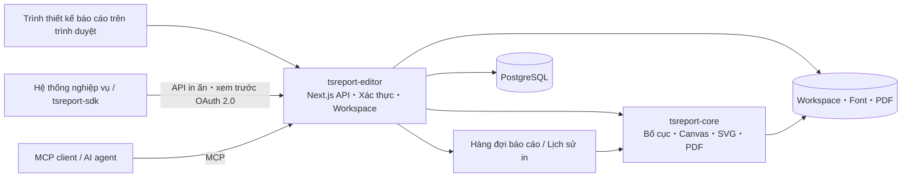

# tsreport-editor

[English](./README.md) | [日本語](./README.ja.md) | [简体中文](./README.zh-CN.md) | [繁體中文](./README.zh-TW.md) | [한국어](./README.ko.md) | Tiếng Việt | [ไทย](./README.th.md) | [Bahasa Indonesia](./README.id.md) | [Deutsch](./README.de.md) | [Français](./README.fr.md) | [Español](./README.es.md) | [Português](./README.pt.md) | [العربية](./README.ar.md) | [עברית](./README.he.md)

`tsreport-editor` là một trình thiết kế báo cáo kiêm máy chủ báo cáo dựa trên trình duyệt, sử dụng [`tsreport-core`](https://www.npmjs.com/package/tsreport-core) làm engine bố cục và kết xuất.

Đây không chỉ là màn hình thiết kế báo cáo. Nó cung cấp trong một máy chủ duy nhất: quản lý template `.report` và tài nguyên, xem trước bằng dữ liệu thực, nhập PDF, API in ấn OAuth 2.0 cho hệ thống bên ngoài, MCP cho AI agent, hàng đợi báo cáo bất đồng bộ, và nhật ký in ấn.

- **Trình thiết kế báo cáo** — Chỉnh sửa band, văn bản, hình vẽ, hình ảnh, SVG, bảng, sub-report, mã vạch, công thức toán học, v.v. trên trình duyệt.
- **Sự nhất quán giữa xem trước và PDF** — Editor, xem trước bản in, và xuất PDF đều sử dụng cùng kết quả bố cục và triển khai kết xuất của `tsreport-core`.
- **Vận hành đa ngôn ngữ và font chữ** — Xử lý quản lý font theo tài khoản, font nhúng, đường viền, font nhập từ PDF, và dàn trang cho tiếng Nhật, tiếng Trung, tiếng Hàn, chữ Ả Rập, v.v.
- **Máy chủ API báo cáo** — In ấn bất đồng bộ các template đã cố định bằng tag công khai thông qua OAuth 2.0 Client Credentials.
- **Máy chủ MCP** — AI có thể đọc, chỉnh sửa, xác thực, kiểm tra bố cục template, kết xuất PNG/PDF, nhập bản gốc PDF, và so sánh sự khác biệt.
- **Vận hành và nhật ký** — Yêu cầu in qua API được xử lý qua hàng đợi, và kết quả xuất PDF từ Editor, API, MCP đều được ghi lại vào lịch sử in ấn theo từng tài khoản.

## Thiết kế báo cáo bằng AI qua MCP

Các video cho thấy AI thiết kế báo cáo qua MCP và mở bản xem trước hoàn chỉnh. Phiên bản tiếng Anh cũng minh họa khả năng hỗ trợ báo cáo đa ngôn ngữ.

| Phiên bản tiếng Anh — báo cáo đa ngôn ngữ | Phiên bản tiếng Nhật |
| --- | --- |
| [](https://youtu.be/CHsNew6yQr4) | [](https://youtu.be/0I3ljxLUbys) |

### Quản lý phông chữ

Màn hình quản lý phông chữ hỗ trợ tải Google Fonts xuống và tải lên các tệp phông chữ của riêng bạn.

[](https://youtube.com/shorts/fAUjfFqaVtY)

## Toàn cảnh hệ thống



`tsreport-core` là engine báo cáo pure TypeScript, không phụ thuộc runtime. `tsreport-editor` xây dựng trên đó với Next.js, PostgreSQL, xác thực, quản lý tệp, hàng đợi, và màn hình quản trị. Phía Editor sử dụng Argon2id để băm mật khẩu và `sharp` để tạo PNG cho MCP, nên toàn bộ máy chủ Editor không được coi là "không phụ thuộc native" hoàn toàn.

## Các tính năng thiết kế chính

- Các band như Title, Page Header, Column Header, Detail, Group Header/Footer, Summary, Page Footer, Last Page Footer, Background, No Data, v.v.
- Văn bản cố định, trường biểu thức, đường thẳng, hình chữ nhật, hình elip, đường path vector, hình ảnh, SVG, khung (frame), bảng, sub-report, mã vạch, công thức toán học, ngắt trang
- Các thuộc tính vẽ bao gồm RGB, CMYK, màu pha (spot color), gradient, độ trong suốt, clip, soft mask
- Chỉnh sửa trực quan và chỉnh sửa JSON cho `.report`, nhiều tab, Undo/Redo, layer, zoom, xem trước bản in
- Xác nhận trường, tham số, biểu thức, chi tiết lặp lại bằng dữ liệu test JSON
- Nhập PDF độ trung thực cao. Chuyển đổi văn bản, vector, hình ảnh, font nhúng thành các thành phần báo cáo có thể chỉnh sửa hoặc giữ nguyên bản vẽ
- Tag công khai của template. Tách nội dung đang chỉnh sửa với phiên bản cố định dùng cho API bên ngoài

## Bắt đầu nhanh

### Điều kiện tiên quyết

- Docker và Docker Compose

Các gói `tsreport-core` và `tsreport-react` đã phát hành được cài từ npm theo lockfile của Editor. Không dùng repository liền kề.

Việc khôi phục dependency, kiểm tra kiểu, chạy test, và build Next.js của Editor chỉ được thực hiện trong Docker. Không chạy `npm install`, `npm ci`, `npx`, hoặc npm script trên `src/` phía host.

### Khởi động

```sh
cd ../tsreport-editor/server
docker compose up
```

Khi khởi động ở chế độ nền:

```sh
cd ../tsreport-editor/server
docker compose up -d
docker compose ps
docker compose logs -f tsreport_editor_node
```

`server/compose.yaml` dành cho phát triển cố định tên project Compose là `tsreport-editor-dev`, tách biệt namespace container/network với các sản phẩm khác trên cùng host và project `tsreport-editor` dùng cho production.

Khi dừng:

```sh
cd ../tsreport-editor/server
docker compose down
```

Trong vận hành thông thường muốn dừng mà vẫn giữ lại dữ liệu, không thực hiện `down -v` hoặc xóa thư mục NFS/DB.

### Dịch vụ và cổng dùng cho phát triển

| Dịch vụ | Vai trò | Phía host |
| --- | --- | --- |
| `tsreport_editor_node` | Editor Next.js・REST API | `http://localhost:52005` |
| `tsreport_editor_node` | MCP listener chuyên dụng | `http://localhost:52006` |
| `tsreport_editor_node` | Thông báo cập nhật workspace | `52007` |
| `tsreport_editor_db` | PostgreSQL | `localhost:52437` |
| `tsreport_editor_cron` | Khởi động hàng đợi báo cáo mỗi 10 giây | Chỉ nội bộ |
| `tsreport_editor_nginx` | Reverse proxy HTTP / HTTPS | `52085` / `52448` |

Mở `http://localhost:52005` trên trình duyệt, hoặc `https://localhost:52448` nếu dùng chứng chỉ tự ký.

## Đăng nhập lần đầu và cài đặt bảo mật bắt buộc

Khi khởi động lần đầu, ứng dụng sẽ tạo một lần duy nhất dữ liệu ban đầu của schema, tài khoản, workspace, và template dùng cho hồi quy, dưới khóa DB.

| Mục đích | ID đăng nhập | Mật khẩu ban đầu | Quyền |
| --- | --- | --- | --- |
| Quản trị viên ban đầu | `admin` | `pass` | Quản trị viên |
| Dùng cho test hồi quy | `test` | `pass` | Người dùng thông thường |

> **Quan trọng:** Mật khẩu ban đầu là thông tin xác thực khởi tạo đã được công khai. Nhất định phải thay đổi trước khi đưa vào vận hành. UI hiện tại không tự động bắt buộc đổi mật khẩu khi đăng nhập lần đầu, nên người vận hành cần tự xác nhận việc thay đổi đã hoàn tất.

Sau khi đăng nhập lần đầu, thực hiện các bước sau từ menu hamburger.

1. Đổi mật khẩu ban đầu bằng chức năng "Đổi mật khẩu" của `admin`.
2. Xóa `test` nếu môi trường không dùng để test hồi quy. Nếu giữ lại, nhất định phải đổi mật khẩu.
3. Tạo lại MCP key trong "Cài đặt MCP" của tài khoản ban đầu còn giữ lại.
4. Xóa API client dùng cho hồi quy `test-report-client`, hoặc thiết lập lại Client Secret và quyền truy cập.
5. Thay đổi thông tin xác thực DB và `REPORT_BATCH_TOKEN` trong `server/node/.env` và `.env` production khỏi giá trị mặc định.
6. Trước khi công khai ra bên ngoài, thay chứng chỉ tự ký của nginx bằng chứng chỉ chính thức, và kiểm tra cổng công khai cùng firewall.

Mật khẩu của tài khoản local được băm bằng Argon2id và lưu vào DB. Cần giữ lại ít nhất một tài khoản làm quản trị viên, kể cả `admin`.

## Luồng sử dụng cơ bản

1. Đăng nhập và mở workspace của tài khoản.
2. Đăng ký font cần thiết cho báo cáo trong "Quản lý font".
3. Tạo mới `.report`, hoặc mở `.report`／PDF đã có.
4. Bố trí band và thành phần, chỉ định dữ liệu test JSON nếu cần.
5. Xác nhận nhiều trang, tràn chi tiết, trang cuối trong màn hình Editor và xem trước bản in.
6. Xuất PDF. Kết quả xuất được ghi vào lịch sử in của tài khoản mình.
7. Nếu dùng từ hệ thống bên ngoài, tạo tag công khai và thiết lập API client cùng quyền truy cập.

Lưu thông thường sẽ cập nhật tệp đang chỉnh sửa trên workspace. Tag công khai cố định JSON template tại thời điểm đó, nên dù sau này có lưu thông thường, kết quả in ấn qua API của tag hiện có không thay đổi. Khi muốn công khai thay đổi ra bên ngoài, hãy tạo tag mới hoặc cập nhật rõ ràng tag mục tiêu.

## Quản lý phiên bản template báo cáo bằng tag công khai

Tag công khai không đơn thuần là cờ chuyển `.report` đang chỉnh sửa sang trạng thái công khai bên ngoài. Đây là **cơ chế lưu nội dung của template báo cáo dưới dạng phiên bản, cho phép API bên ngoài chỉ định phiên bản đó bằng tên**.

Ví dụ, sau khi công khai nội dung hiện tại của template hóa đơn dưới dạng `v1`, `invoice.report` trên workspace vẫn có thể tiếp tục chỉnh sửa. Thay đổi qua lưu thông thường không tự động phản ánh vào `v1`. Nếu công khai nội dung sau khi thay đổi dưới dạng `v2`, hệ thống bên ngoài có thể chọn rõ ràng phiên bản nào sẽ dùng qua URL của API.

```text
invoice.report（bản làm việc đang chỉnh sửa）
  ├─ v1（JSON mẫu đã công bố）
  └─ v2（JSON mẫu được công bố sau khi thay đổi）

POST /api/report/print/{workspaceKey}/invoice.report/v1
POST /api/report/print/{workspaceKey}/invoice.report/v2
```

Sự tách biệt này cho phép các cách vận hành sau:

- Hệ thống nghiệp vụ tiếp tục dùng `v1` hiện có trong khi đang chỉnh sửa và xác thực bố cục báo cáo mới
- Chuyển nơi gọi từ `v1` sang `v2` phù hợp với thời điểm chuyển đổi phía dùng API
- Cho nhiều phiên bản cùng tồn tại, mỗi bên liên kết dùng phiên bản khác nhau
- Nếu phát hiện vấn đề, quay lại chỉ định API về tag trước đó mà không cần ghi đè lại tệp template

Khi tạo tag mới, JSON template tại thời điểm đó sẽ được lưu. Có thể cập nhật rõ ràng cùng một tag, nhưng khi đó nội dung mà cùng một API URL trỏ tới cũng sẽ thay đổi. Trong vận hành coi trọng khả năng tái hiện và chuyển đổi từng bước, hãy tạo tag mới như `v1`, `v2`, `2026-07` thay vì ghi đè tag hiện có.

Tag công khai cố định JSON template. `rows` và `parameters` khi gọi API không nằm trong phiên bản, được chỉ định riêng cho mỗi yêu cầu in. Ngoài ra, "công khai" ở đây không có nghĩa là công khai ẩn danh ra internet. Để thực sự sử dụng từ API, cần thỏa mãn đồng thời scope OAuth 2.0, quyền truy cập của API client, và quyền workspace của người dùng sở hữu.

## Người dùng, workspace, và chia sẻ

### Quản lý người dùng

- Mỗi tài khoản có một workspace.
- Workspace được nhận diện bằng `workspaceKey` dạng UUID không thể thay đổi.
- Quản trị viên có thể tạo người dùng, quản lý tên hiển thị・ID đăng nhập・quyền・khả năng dùng MCP・mật khẩu, và cài đặt hệ thống.
- Ngay cả quản trị viên cũng không thể xem workspace của tài khoản khác một cách vô điều kiện. Dữ liệu báo cáo được tách biệt theo tenant.
- Xóa người dùng là xóa vật lý. Dữ liệu liên quan bao gồm workspace, font, chia sẻ, API client, token, lịch sử in sẽ bị xóa và không thể khôi phục.

### Chia sẻ thư mục

Có thể chia sẻ chỉ những thư mục cần thiết cho tài khoản khác, thay vì toàn bộ workspace.

- Nơi nhận chia sẻ được chỉ định bằng `workspaceKey` của đối phương.
- Có thể cho phép đọc và ghi riêng biệt.
- Chia sẻ đọc cho phép tham chiếu template và tài nguyên, chia sẻ ghi cho phép cùng chỉnh sửa.
- Nơi nhận chia sẻ có thể hủy chia sẻ đã nhận.
- API và MCP cũng áp dụng cùng phạm vi truy cập thực tế.

Khi Editor hoặc MCP cập nhật workspace, sự kiện cập nhật sẽ được thông báo đến các tab Editor khác. Nếu không có thay đổi chưa lưu thì sẽ tải lại, nếu có thay đổi chưa lưu thì cảnh báo và bảo vệ chỉnh sửa cục bộ.

Chia sẻ, quyền truy cập API, và tag công khai có mục đích khác nhau.

| Khái niệm | Đối tượng | Vai trò |
| --- | --- | --- |
| Chia sẻ thư mục | Giữa các tài khoản | Cho phép đọc／ghi đối với thao tác Editor của con người và MCP hoạt động dưới danh nghĩa tài khoản đó |
| Quyền truy cập API | API client | Giới hạn `workspaceKey` và thư mục mà hệ thống bên ngoài có thể tham chiếu |
| Tag công khai | Phiên bản của `.report` | Cố định nội dung template dùng cho in ấn qua API |

Chỉ thêm quyền truy cập API vẫn không thể sử dụng nếu bản thân người dùng sở hữu không có quyền truy cập thư mục mục tiêu. Ngược lại, chỉ chia sẻ thư mục cũng không được công khai ra API bên ngoài.

## Thêm và quản lý font

"Quản lý font" trong menu hamburger có thể sử dụng bởi tất cả người dùng. Font được lưu theo từng tài khoản tại `/var/nfs/fonts/{accountId}/`, và không nhìn thấy được từ tài khoản khác.

### Tải lên

1. Mở "Quản lý font".
2. Thêm bằng cách chọn tệp, hoặc kéo thả.
3. Chọn font ID hiển thị trong danh sách qua `fontFamily` của thành phần văn bản.

Định dạng hỗ trợ là TTF, OTF, TTC, OTC, WOFF, WOFF2. Giới hạn ứng dụng cho một tệp đơn lẻ là 256MiB. Có thể chọn và đăng ký nhiều font hệ thống cùng lúc, ví dụ `/System/Library/Fonts` trên macOS. Ứng dụng không ngầm đọc font của OS host, cũng không cài đặt font vào OS.

Trùng lặp được xác định như sau:

- Cùng font ID・cùng binary: coi là thành công khi thử lại tải lên hàng loạt
- Cùng font ID・binary khác: từ chối vì xung đột ID
- Font ID khác・cùng binary: từ chối vì trùng lặp, kèm chỉ ra ID hiện có
- Chỉ thông tin meta như tên family hay tên PostScript giống nhau: nếu binary khác thì có thể đăng ký như font độc lập

Việc xác định nội dung trùng khớp không chỉ dựa vào thông tin meta hay hash, mà được xác định qua so sánh toàn bộ byte sau khi kích thước tệp khớp nhau.

### Google Fonts và font nhập từ PDF

Trong "Download Google Fonts", có thể chọn ngôn ngữ và tải các ứng viên xuống vùng của tài khoản. Điều kiện tiên quyết là có thể kết nối đến mạng bên ngoài.

Khi nhập PDF, font nhúng có thể tái sử dụng sẽ được đăng ký như font ứng dụng trong tài khoản. Nếu không có chương trình font, hệ thống sẽ đối chiếu tên và style từ font của tài khoản, và hiển thị ứng viên cùng cảnh báo.

## Sử dụng API in ấn bên ngoài

API bên ngoài sử dụng Bearer Token của OAuth 2.0 Client Credentials, không phải Cookie đăng nhập màn hình. Cần 3 điều sau để bắt đầu sử dụng:

1. **Tag công khai** — Tạo phiên bản cố định của `.report` dùng cho API.
2. **API client** — Tạo Client ID, Client Secret, scope trong "API client" của menu hamburger.
3. **Quyền truy cập** — Đăng ký `workspaceKey` và thư mục mà client có thể sử dụng.

Các scope có thể sử dụng là `report:print`, `report:status`, `report:download`, `report:preview`. Phạm vi thực tế của API client là giao của "quyền truy cập của client" và "workspace／thư mục chia sẻ mà bản thân người dùng sở hữu có thể truy cập".

### Luồng REST API

```text
POST /api/oauth/token
  grant_type=client_credentials
  -> access_token

POST /api/report/print/{workspaceKey}/{templatePath}/{tag}
  -> { key }

GET /api/report/status/{key}
  -> queued | processing | completed | error

GET /api/report/download/{key}
  -> application/pdf
```

Ví dụ:

```sh
BASE_URL=http://localhost:52005
CLIENT_ID=test-report-client
CLIENT_SECRET=test-report-secret

TOKEN=$(curl -sS -u "$CLIENT_ID:$CLIENT_SECRET" \
  -d grant_type=client_credentials \
  -d 'scope=report:print report:status report:download' \
  "$BASE_URL/api/oauth/token" | jq -r .access_token)

curl -sS \
  -H "Authorization: Bearer $TOKEN" \
  -H 'Content-Type: application/json' \
  -d '{"rows":[{"item":"seed"}],"parameters":{}}' \
  "$BASE_URL/api/report/print/00000000-0000-0000-0000-000000000002/invoice.report/v1"
```

Ngay cả khi `templatePath` có chứa `/`, phân đoạn cuối cùng phía sau đó sẽ được giải quyết như tag. Trạng thái và tải xuống chỉ có thể được tham chiếu bởi cùng một API client đã tạo yêu cầu in ấn.

### tsreport-sdk

Sử dụng [`tsreport-sdk`](../tsreport-sdk) cho phép xử lý việc lấy token, đưa vào hàng đợi, polling, và lấy PDF trong một API TypeScript duy nhất.

```ts
import { TsreportClient } from 'tsreport-sdk'

const client = new TsreportClient({
    baseUrl: 'https://reports.example.com',
    clientId: process.env.REPORT_CLIENT_ID!,
    clientSecret: process.env.REPORT_CLIENT_SECRET!
})

const pdf = await client.printAndDownload(
    '00000000-0000-0000-0000-000000000002',
    'orders/invoice.report',
    'v1',
    { rows: [{ orderId: 42 }], parameters: {} }
)
```

Không nhúng Client Secret vào trình duyệt. Khi sử dụng từ ứng dụng trình duyệt, hãy đi qua backend đã xác thực của hệ thống mình. Có thể sử dụng `createPreviewEndpoint` của `tsreport-sdk/server` để chuyển tiếp an toàn cho API tài nguyên xem trước.

## Hàng đợi báo cáo và nhật ký in ấn

Yêu cầu in ấn từ API được đăng ký vào `PrintRequest` của DB với trạng thái `queued`. `tsreport_editor_cron` khởi động endpoint batch đã xác thực mỗi 10 giây, chuyển trạng thái `queued` → `processing` → `completed` hoặc `error`. Việc chạy đồng thời được tuần tự hóa bằng khóa DB.

PDF được tạo ra sẽ lưu vào `/var/nfs/report-pdf`. Trong màn hình lịch sử in, có thể xác nhận các mục sau cho tài khoản của mình:

- Ngày giờ thực hiện
- Đường dẫn thực hiện: `editor` / `api` / `mcp`
- Workspace, template, định dạng
- Trạng thái hoàn thành／lỗi và lý do lỗi
- Tải lại PDF đã hoàn thành

PDF được tạo bởi Editor sẽ được ghi lại vào API lịch sử từ trình duyệt. `render_report(format="pdf")` của MCP cũng được ghi vào lịch sử. Lịch sử được tách biệt theo tài khoản, ngay cả quản trị viên cũng không thể xem lịch sử của tài khoản khác.

Trong vận hành, hãy sao lưu DB và `server/nfs` như cùng một điểm khôi phục. Nếu chỉ khôi phục dòng lịch sử, hoặc chỉ khôi phục tệp PDF, nhật ký và sản phẩm sẽ không khớp nhau. Thời gian lưu trữ và giám sát dung lượng đĩa tùy theo số lượng xuất ra cũng cần do phía vận hành quyết định.

## Sử dụng MCP

MCP độc lập với OAuth client của API in ấn bên ngoài. Xác thực bằng ID đăng nhập và MCP key của mỗi người dùng, và hoạt động với cùng quyền workspace／chia sẻ như người dùng đó.

### Kích hoạt và thông tin xác thực

1. Mở "Cài đặt MCP" từ menu hamburger.
2. Bật sử dụng MCP của mình.
3. Copy MCP key. Tạo lại key ban đầu trước khi vận hành.
4. Quản trị viên có thể thiết lập bật/tắt toàn bộ MCP và cổng chuyên dụng ở cùng màn hình.

Thông thường dùng `http://localhost:52005/api/mcp` giống với Next.js. Trong môi trường phát triển cũng có thể dùng listener chuyên dụng `http://localhost:52006`. Thiết lập cho MCP client URL Streamable HTTP, và một trong hai cách xác thực sau:

- `x-mcp-account: <ID đăng nhập>` và `x-mcp-key: <MCP key>`
- `Authorization: Bearer <ID đăng nhập>:<MCP key>`

Có thể lấy hướng dẫn thiết lập mà không cần xác thực.

```sh
curl http://localhost:52005/api/mcp
```

Ví dụ xác nhận danh sách tool:

```sh
curl -sS http://localhost:52005/api/mcp \
  -H 'Content-Type: application/json' \
  -H 'x-mcp-account: admin' \
  -H 'x-mcp-key: <khóa MCP đã tạo lại>' \
  -d '{"jsonrpc":"2.0","id":1,"method":"tools/list","params":{}}'
```

### Các tool MCP

| Phân loại | Tool |
| --- | --- |
| Giới thiệu | `get_started` |
| Khám phá | `list_workspaces`, `list_templates`, `list_workspace_files`, `list_fonts` |
| Template | `get_template`, `get_template_schema`, `validate_template`, `save_template`, `update_template_elements` |
| Tài nguyên | `save_workspace_file`, `delete_workspace_file` |
| Xác thực・xuất | `layout_report`, `render_report`, `compare_reports` |
| Nhập bản gốc | `import_pdf` |

Vòng lặp công việc được khuyến nghị như sau:

1. Đọc `get_started` và `get_template_schema`.
2. Xác nhận tài nguyên có thể sử dụng bằng `list_workspaces`, `list_templates`, `list_workspace_files`, `list_fonts`.
3. Tạo template hoặc lấy bằng `get_template`.
4. Xác thực cấu trúc và biểu thức bằng `validate_template`.
5. Xác nhận bằng số liệu tọa độ tuyệt đối, số trang, thành phần nằm ngoài phạm vi bằng `layout_report`.
6. Xác nhận trực quan bằng `render_report(format="png")`.
7. Lưu bằng `save_template` hoặc `update_template_elements`.
8. So sánh trước và sau thay đổi bằng `compare_reports`, xác nhận không có sự di chuyển ngoài ý muốn.

Nếu có PDF gốc, không tạo lại bằng mắt mà tiến hành theo thứ tự `save_workspace_file` → `import_pdf` → điều chỉnh biểu thức và band → `layout_report` / `render_report`.

## Ngôn ngữ và liên kết bên ngoài tùy chọn

UI của Editor có thể chọn tiếng Nhật, tiếng Anh, tiếng Trung giản thể, tiếng Hàn, tiếng Trung phồn thể, tiếng Việt, tiếng Thái, tiếng Indonesia, tiếng Đức, tiếng Pháp, tiếng Tây Ban Nha, tiếng Bồ Đào Nha, tiếng Ả Rập, tiếng Do Thái. Với tiếng Ả Rập và tiếng Do Thái, UI cũng sẽ là RTL. Điều này không giới hạn hệ chữ viết có thể sử dụng trong báo cáo.

Quản trị viên có thể thiết lập đăng nhập ngoài của Google／Microsoft. Nếu không kích hoạt đăng nhập ngoài, vẫn có thể vận hành chỉ với tài khoản local được bảo vệ bằng Argon2id.

Khi sử dụng tính năng hỗ trợ AI, đăng ký API key và model vào cài đặt hệ thống của DB. Giá trị ban đầu không bao gồm API key ngoài hợp lệ. Không lưu giá trị bí mật vào source, `.report`, workspace, hoặc README.

## Dữ liệu ban đầu và môi trường dùng cho hồi quy

Khi khởi động lần đầu, các mục sau sẽ được tạo:

- Tài khoản `admin` và `test`, cùng `workspaceKey` cố định
- API client dùng cho hồi quy `test-report-client` thuộc sở hữu của `test`
- `invoice.report`, `sub.report`, `assets/logo.png` trên workspace của `test`
- Tag công khai `v1` của `invoice.report`
- Chia sẻ đọc／ghi thư mục `assets` từ `test` đến `admin`

Key cố định:

- `admin`: `00000000-0000-0000-0000-000000000001`
- `test`: `00000000-0000-0000-0000-000000000002`

Các thông tin này được dùng cho hồi quy máy chủ thực của `tsreport-editor`, `tsreport-sdk`, `tsreport-react`. Trong vận hành production, nhất định phải thay đổi hoặc xóa thông tin xác thực ban đầu nêu trên.

### Đưa DB phát triển về trạng thái ban đầu

Khi muốn tạo lại hoàn toàn PostgreSQL của môi trường phát triển, dừng container rồi xóa `server/db/pgdata/data`, sau đó khởi động lại.

```sh
cd ../tsreport-editor/server
docker compose down
rm -rf db/pgdata/data
docker compose up
```

Khi khởi động lại, DDL của PostgreSQL sẽ được áp dụng, và dữ liệu ban đầu của DB như tài khoản ban đầu, API client, tag công khai, v.v. sẽ được tạo lại khi ứng dụng khởi động. Các tệp workspace dùng cho hồi quy chỉ được bổ sung nếu bị thiếu. Không được xóa `pgdata` trong khi container DB đang chạy.

Thao tác này chỉ khởi tạo lại PostgreSQL. Workspace, font, PDF đã tạo được lưu trong `server/nfs` sẽ không bị xóa. Nếu cần đưa cả DB và NFS về trạng thái ban đầu, hãy sử dụng "Factory Reset" trong menu quản trị viên.

"Factory Reset" sẽ xóa toàn bộ bảng DB, workspace, kết quả xuất báo cáo, và tạo lại trạng thái ban đầu. Không thể hoàn tác. Font, chứng chỉ, và các dotfile như `.gitignore` không nằm trong đối tượng bị xóa.

## Vị trí lưu trữ dữ liệu

| Dữ liệu | Trong container | Phía host phát triển |
| --- | --- | --- |
| PostgreSQL | `/var/pgdata/data` | `server/db/pgdata` |
| Workspace | `/var/nfs/workspaces/{workspaceKey}` | `server/nfs/workspaces` |
| Font theo tài khoản | `/var/nfs/fonts/{accountId}` | `server/nfs/fonts` |
| PDF đã tạo | `/var/nfs/report-pdf` | `server/nfs/report-pdf` |
| Log nginx | `/var/log/nginx` | `logs/nginx` |

Có thể thực hiện xuất／nhập dữ liệu ứng dụng từ menu quản trị viên. Đối với khôi phục thảm họa cho toàn bộ môi trường, đừng chỉ dựa vào chức năng này, hãy giữ thêm bản sao lưu nhất quán của PostgreSQL và NFS.

## Build và khởi động production

Build và khởi động production cũng dựa trên tiền đề Docker Compose. `build.sh`, `build_boot.sh`, `boot.sh`, `boot_db.sh`, `boot_web.sh`, `build_boot_web.sh` là các wrapper mỏng để gọi Docker Compose. Đây không phải quy trình cài đặt dependency Node.js trực tiếp lên host và thường trực chạy `server.js`.

### 1. Chuẩn bị trước

`tsreport-core` và `tsreport-react` được khôi phục từ npm ở các phiên bản được khóa trong `src/package-lock.json`.

```sh
cd ../tsreport-editor/server
```

Chỉnh sửa cài đặt dùng cho production.

- `boot/web/.env`: Thông tin kết nối DB và `REPORT_BATCH_TOKEN`
- `boot/compose.yaml`: Cài đặt PostgreSQL cho cấu hình máy chủ đơn
- `boot/db/compose.yaml`: Cài đặt PostgreSQL cho cấu hình tách biệt DB/Web
- `nginx/cert`: Chứng chỉ TLS chính thức
- `nginx/conf`: Tên host công khai, đích chuyển tiếp, kiểm soát truy cập cần thiết

Hãy làm khớp `DB_PASS` trong `boot/web/.env` với `DB_PASS` trong Compose của cấu hình được áp dụng. Web và cron dùng cùng `REPORT_BATCH_TOKEN` trong `boot/web/.env`. Giá trị trong repository dùng cho khởi động cục bộ, nhất định phải thay đổi trong production.

### 2. Production build

```sh
cd ../tsreport-editor/server
./build.sh
```

`build.sh` không khôi phục dependency Node.js phía host. Nó đồng bộ `src` vào `server/build/src`, thực hiện production build của Next.js trong môi trường build Docker cách ly, và đặt sản phẩm standalone vào vị trí sau.

```text
server/boot/web/dist/standalone/
  ├─ server.js
  ├─ .next/
  ├─ node_modules/
  ├─ public/
  └─ seed/
```

Build bao gồm kiểm tra TypeScript và compilation production của Next.js. Hãy xác nhận lệnh kết thúc bình thường và `boot/web/dist/standalone/server.js` tồn tại trước khi khởi động.

### 3. Khởi động máy chủ đã build sẵn (không build lại)

Nếu `./build.sh` đã thành công và `boot/web/dist/standalone/server.js` đã tồn tại, có thể khởi động máy chủ production mà không lặp lại production build của Next.js.

Khi khởi động DB và Web trên cùng một máy chủ:

```sh
cd ../tsreport-editor/server
./boot.sh
```

Khi tách biệt máy chủ DB và máy chủ Web, hãy thực thi riêng trên host DB và host Web.

```sh
# Máy chủ DB
cd ../tsreport-editor/server
./boot_db.sh

# Máy chủ Web
cd ../tsreport-editor/server
./boot_web.sh
```

`boot.sh` và `boot_web.sh` mount `boot/web/dist/standalone` hiện có vào container Node.js và khởi động bằng PM2. Docker runtime image sẽ được Compose cập nhật khi cần, nhưng không thực hiện production build của Next.js. Khi muốn phản ánh thay đổi source, hãy chạy lại `./build.sh` trước.

### 4-A. Cấu hình máy chủ đơn

Cấu hình chạy DB, Node.js, cron hàng đợi báo cáo, nginx trên cùng một instance máy chủ. Từ build đến khởi động thường trực, thực thi bằng một lệnh duy nhất sau.

```sh
cd ../tsreport-editor/server
./build_boot.sh
```

Nếu đã build sẵn và chỉ muốn khởi động, thực thi `./boot.sh`. `boot.sh` sử dụng `boot/compose.yaml`, khởi động nền tất cả dịch vụ sau như project `tsreport-editor` không xung đột với project Compose của sản phẩm khác.

| Dịch vụ | Vai trò | Cổng công khai |
| --- | --- | --- |
| `tsreport_editor_db` | PostgreSQL | `52437` |
| `tsreport_editor_node` | Next.js standalone đã build, MCP, thông báo cập nhật | `52005`、`52006`、`52007` |
| `tsreport_editor_cron` | Khởi động hàng đợi báo cáo bất đồng bộ mỗi 10 giây | Không có |
| `tsreport_editor_nginx` | Reverse proxy HTTP/HTTPS | `52085`、`52448` |

Container Web chỉ mount `boot/web/dist/standalone` vào `/var/node`, không phải cây source, và chạy `server.js` bằng cluster mode của PM2. Ngay cả khi thay đổi `src` trong khi đang chạy, cũng không được phản ánh vào máy chủ production. Để phản ánh thay đổi, hãy chạy lại `./build.sh` rồi khởi động lại dịch vụ Web.

Xác nhận khởi động:

```sh
docker compose --project-name tsreport-editor -f boot/compose.yaml ps
docker compose --project-name tsreport-editor -f boot/compose.yaml logs -f tsreport_editor_node
```

Dừng:

```sh
docker compose --project-name tsreport-editor -f boot/compose.yaml down
```

### 4-B. Cấu hình tách biệt máy chủ DB và máy chủ Web

Cấu hình chạy PostgreSQL trên máy chủ chuyên dụng cho DB, và Node.js, cron hàng đợi báo cáo, nginx trên máy chủ Web. Đặt repository này trên cả hai host, và thực thi mỗi một lệnh riêng trên host DB và host Web.

Trên host DB, chỉ khởi động `boot/db/compose.yaml`.

```sh
cd ../tsreport-editor/server
./boot_db.sh
```

Thay đổi `boot/web/.env` của host Web thành DNS name nội bộ hoặc địa chỉ IP của host DB, và cổng mà host DB công khai.

```dotenv
DB_HOST=db.internal.example
DB_PORT=52437
DB_NAME=TSREPORT_EDITOR_DB
DB_USER=postgres
DB_PASS=mật khẩu DB cho môi trường production
REPORT_BATCH_TOKEN=bí mật dùng chung cho môi trường production
```

Trên host Web, thực thi production build và khởi động thường trực dịch vụ phía Web bằng một lệnh duy nhất.

```sh
cd ../tsreport-editor/server
./build_boot_web.sh
```

Nếu đã build sẵn và chỉ muốn khởi động phía Web, thực thi `./boot_web.sh`. `boot/web/compose.yaml` phía Web chỉ khởi động Node.js, cron, nginx, không tạo container PostgreSQL.

Xác nhận khởi động cho cấu hình tách biệt:

```sh
# Máy chủ DB
docker compose --project-name tsreport-editor-db -f boot/db/compose.yaml ps
docker compose --project-name tsreport-editor-db -f boot/db/compose.yaml logs -f tsreport_editor_db

# Máy chủ Web
docker compose --project-name tsreport-editor-web -f boot/web/compose.yaml ps
docker compose --project-name tsreport-editor-web -f boot/web/compose.yaml logs -f tsreport_editor_node
```

Dừng cấu hình tách biệt:

```sh
# Máy chủ Web
docker compose --project-name tsreport-editor-web -f boot/web/compose.yaml down

# Máy chủ DB
docker compose --project-name tsreport-editor-db -f boot/db/compose.yaml down
```

Không công khai `52437` của DB trực tiếp ra internet, chỉ cho phép trong mạng nội bộ mà host Web có thể truy cập tới. `DB_PASS` của `boot/db/compose.yaml` phía host DB và `DB_PASS` của `boot/web/.env` phía Web phải cùng giá trị. Workspace, font, PDF đã tạo được lưu tại `server/nfs` phía host Web, không cần hệ thống tệp chia sẻ với host DB.

### 5. Xác nhận vận hành chung

Mở `https://<Host Web>:52448` hoặc `http://<Host Web>:52005` trên trình duyệt. Nếu sử dụng API in ấn bên ngoài, hãy xác nhận `tsreport_editor_cron` cũng đang `Up`.

Trong khi dừng・khởi động lại thông thường, `server/db/pgdata` và `server/nfs` phía host Web vẫn được giữ nguyên. Chỉ khi cần khởi tạo lại DB, hãy làm theo quy trình khởi tạo nêu trên, xóa `db/pgdata/data` sau khi dừng dịch vụ DB.

Trước khi công khai production, hãy xác nhận ít nhất các mục sau.

- Đã thay đổi hoặc xóa người dùng ban đầu, MCP key, API client dùng cho hồi quy
- Đã thay đổi mật khẩu DB và `REPORT_BATCH_TOKEN`
- Đã thiết lập chứng chỉ TLS chính thức
- `/api/report/batch/process` không được công khai ra bên ngoài mà không xác thực
- Có sao lưu và giám sát dung lượng cho DB, workspace, font, PDF đã tạo
- Font cần thiết và tag công khai đã được đăng ký cho tài khoản mục tiêu
- Đã xác nhận Editor, xem trước, in ấn qua API với báo cáo nhiều trang tương đương dữ liệu thực

## Biến môi trường

Cài đặt ứng dụng đặt tại `server/node/.env` khi phát triển, `server/boot/web/.env` khi production.

| Biến | Mô tả | Giá trị mặc định khi phát triển |
| --- | --- | --- |
| `DB_HOST` | Host PostgreSQL | `172.31.0.30` |
| `DB_PORT` | Cổng PostgreSQL | `15432` |
| `DB_NAME` | Tên DB | `TSREPORT_EDITOR_DB` |
| `DB_USER` | Người dùng DB | `postgres` |
| `DB_PASS` | Mật khẩu DB | `postgres1234` |
| `REPORT_BATCH_TOKEN` | Shared secret dùng cho khởi động batch | `tsreport-report-batch-local` |
| `WORKSPACES_ROOT` | Thư mục gốc workspace | `/var/nfs/workspaces` |
| `NEXT_TELEMETRY_DISABLED` | Vô hiệu hóa telemetry của Next.js | `1` |

Trạng thái kích hoạt toàn bộ MCP và cổng chuyên dụng được quản lý dưới dạng cài đặt hệ thống của DB, thay đổi từ màn hình quản trị. Cài đặt OAuth cho đăng nhập ngoài và cài đặt hỗ trợ AI tùy chọn cũng được quản lý qua màn hình quản trị／SystemProperty, không ghi giá trị bí mật vào README hoặc source.

## Phát triển và xác thực

```sh
cd ../tsreport-editor

docker compose -f server/compose.yaml exec tsreport_editor_node npx tsc --noEmit
docker compose -f server/compose.yaml exec tsreport_editor_node npm test
docker compose -f server/compose.yaml exec \
  -e TSREPORT_EDITOR_LIVE_BASE=http://localhost:3000 \
  tsreport_editor_node npm run test:live

cd server
./build.sh
```

Quá trình phát triển, kiểm thử và build production khôi phục `tsreport-core` và `tsreport-react` từ npm. Không cần checkout repository liền kề.

## Cấu trúc repository

| Đường dẫn | Nội dung |
| --- | --- |
| `src/` | Editor Next.js, REST API, MCP, logic máy chủ |
| `tests/` | Test đơn vị・tích hợp・hồi quy máy chủ thực |
| `server/` | Cấu hình phát triển Docker, build, khởi động production |
| `cli/` | Script hỗ trợ |

Repository liên quan:

| Repository | Nội dung |
| --- | --- |
| [`tsreport-core`](https://github.com/pontasan/tsreport-core) | Engine bố cục・kết xuất・PDF・font báo cáo pure TypeScript |
| [`tsreport-editor`](https://github.com/pontasan/tsreport-editor) | Trình thiết kế báo cáo và máy chủ báo cáo trên trình duyệt này |
| [`tsreport-sdk`](https://github.com/pontasan/tsreport-sdk) | SDK TypeScript không phụ thuộc cho API in ấn・xem trước |
| [`tsreport-react`](https://github.com/pontasan/tsreport-react) | UI xem trước React sử dụng `tsreport-core` |

## Giấy phép

tsreport-editor có thể được sử dụng theo lựa chọn của người dùng dưới [MIT License](./LICENSE-MIT) hoặc [Apache License 2.0](./LICENSE-APACHE) (SPDX: `MIT OR Apache-2.0`).
