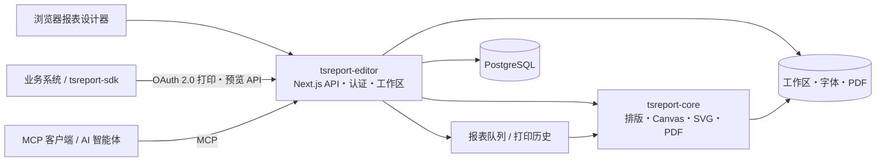

# tsreport-editor

[English](./README.md) | [日本語](./README.ja.md) | 简体中文 | [繁體中文](./README.zh-TW.md) | [한국어](./README.ko.md) | [Tiếng Việt](./README.vi.md) | [ไทย](./README.th.md) | [Bahasa Indonesia](./README.id.md) | [Deutsch](./README.de.md) | [Français](./README.fr.md) | [Español](./README.es.md) | [Português](./README.pt.md) | [العربية](./README.ar.md) | [עברית](./README.he.md)

`tsreport-editor` 是一款基于浏览器的报表设计器兼报表服务器，使用 [`tsreport-core`](https://www.npmjs.com/package/tsreport-core) 作为排版・渲染引擎。

它不仅仅是设计报表的画面。`.report` 模板与素材的管理、使用真实数据的预览、PDF 导入、面向外部系统的 OAuth 2.0 打印 API、面向 AI 智能体的 MCP、异步报表队列、打印留痕，全部由一个服务器提供。

- **报表设计器** — 在浏览器中编辑条带、文本、图形、图片、SVG、表格、子报表、条形码、公式等。
- **预览与 PDF 的一致性** — Editor、打印预览、PDF 输出均使用同一个 `tsreport-core` 的排版结果与渲染实现。
- **多语言・字体运用** — 处理按账户管理字体、内嵌字体、轮廓化、PDF 导入字体，以及日文・中文・韩文・阿拉伯文字等排版。
- **报表 API 服务器** — 通过 OAuth 2.0 Client Credentials，对以公开标签固定的模板进行异步打印。
- **MCP 服务器** — AI 可执行模板的读取、编辑、校验、排版确认、PNG/PDF 渲染、PDF 原件导入、差异比较。
- **运维与留痕** — API 打印以队列方式处理，Editor、API、MCP 的 PDF 输出均按账户记录到打印历史中。

## 通过 MCP 进行 AI 报表设计

视频展示了 AI 通过 MCP 设计报表并打开最终预览的完整过程。英文版还演示了对多语言报表的支持。

| 英文版 — 多语言报表支持 | 日文版 |
| --- | --- |
| [](https://youtu.be/CHsNew6yQr4) | [](https://youtu.be/0I3ljxLUbys) |

### 字体管理

字体管理界面支持下载 Google Fonts，也可以上传自己的字体文件。

[](https://youtube.com/shorts/fAUjfFqaVtY)

## 系统全景



`tsreport-core` 是纯 TypeScript、零运行时依赖的报表引擎。`tsreport-editor` 在其之上构建了 Next.js、PostgreSQL、认证、文件管理、队列、管理画面。由于 Editor 侧在密码哈希中使用了 Argon2id、在 MCP 的 PNG 生成中使用了 `sharp`，因此不将 Editor 服务器整体定位为“零原生依赖”。

## 主要设计功能

- Title、Page Header、Column Header、Detail、Group Header/Footer、Summary、Page Footer、Last Page Footer、Background、No Data 等条带
- 固定文本、表达式字段、线条、矩形、椭圆、矢量路径、图片、SVG、框架、表格、子报表、条形码、公式、分页
- 包含 RGB、CMYK、专色、渐变、透明度、裁剪、soft mask 的绘制属性
- `.report` 的可视化编辑与 JSON 编辑、多标签页、撤销/重做、图层、缩放、打印预览
- 使用 JSON 测试数据确认字段、参数、表达式、重复明细
- PDF 页面的高保真导入。将文本、矢量、图片、内嵌字体转换为可编辑的报表要素或保持原样的绘制内容
- 模板的公开标签。将编辑中的内容与外部 API 使用的固定版本分离

## 快速开始

### 前提条件

- Docker 及 Docker Compose

已发布的 `tsreport-core` 和 `tsreport-react` 包会按照 Editor 的 lockfile 从 npm 安装，不使用相邻仓库。

Editor 的依赖恢复、类型检查、测试、Next.js 构建都只在 Docker 内执行。请勿在宿主机侧的 `src/` 中执行 `npm install`、`npm ci`、`npx`、npm script。

### 启动

```sh
cd ../tsreport-editor/server
docker compose up
```

后台启动的情况：

```sh
cd ../tsreport-editor/server
docker compose up -d
docker compose ps
docker compose logs -f tsreport_editor_node
```

开发用 `server/compose.yaml` 将 Compose 项目名固定为 `tsreport-editor-dev`，与同一宿主机上的其他产品或生产用 `tsreport-editor` 项目在容器・网络的命名空间上分离。

停止的情况：

```sh
cd ../tsreport-editor/server
docker compose down
```

在保留数据的常规运维中，请勿执行 `down -v` 或删除 NFS/DB 目录。

### 开发用服务与端口

| 服务 | 作用 | 宿主机侧 |
| --- | --- | --- |
| `tsreport_editor_node` | Next.js Editor・REST API | `http://localhost:52005` |
| `tsreport_editor_node` | 专用 MCP 监听器 | `http://localhost:52006` |
| `tsreport_editor_node` | 工作区更新通知 | `52007` |
| `tsreport_editor_db` | PostgreSQL | `localhost:52437` |
| `tsreport_editor_cron` | 每 10 秒启动一次报表队列 | 仅内部 |
| `tsreport_editor_nginx` | HTTP / HTTPS 反向代理 | `52085` / `52448` |

在浏览器中打开 `http://localhost:52005`，或使用自签名证书的 `https://localhost:52448`。

## 首次登录与必要的安全设置

首次启动时，应用程序会在 DB 锁定下一次性创建架构初始数据、账户、工作区、回归测试用模板。

| 用途 | 登录 ID | 初始密码 | 权限 |
| --- | --- | --- | --- |
| 初始管理员 | `admin` | `pass` | 管理员 |
| 回归测试用 | `test` | `pass` | 普通用户 |

> **重要：** 初始密码是公开的初始化用凭据。在投入运维前请务必更改。目前的 UI 不会在首次登录时强制自动更改，因此运维人员必须自行确认变更是否已完成。

首次登录后，请从汉堡菜单中执行以下操作。

1. 在 `admin` 的“更改密码”中更改初始密码。
2. 在不将 `test` 用于回归测试的环境中将其删除。如需保留，请务必更改密码。
3. 在保留的初始账户的“MCP 设置”中重新生成 MCP 密钥。
4. 删除回归用 API 客户端 `test-report-client`，或重新设置其 Client Secret 与访问权限。
5. 将 `server/node/.env` 及生产环境 `.env` 中的 DB 凭据与 `REPORT_BATCH_TOKEN` 从默认值更改。
6. 在对外公开前，将 nginx 的自签名证书替换为正式证书，并确认公开端口与防火墙设置。

本地账户的密码会使用 Argon2id 哈希后保存到 DB。包括管理员在内，必须至少保留一个账户作为管理员。

## 基本使用流程

1. 登录，打开账户的工作区。
2. 在“字体管理”中注册报表所需的字体。
3. 新建 `.report`，或打开现有的 `.report`／PDF。
4. 配置条带与要素，如有需要指定测试数据 JSON。
5. 在 Editor 显示与打印预览中确认多页、明细溢出、末页。
6. 输出 PDF。输出结果会记录到本账户的打印历史中。
7. 若供外部系统使用，则创建公开标签，并设置 API 客户端与访问权限。

常规保存会更新工作区上的编辑文件。公开标签会固定该时间点的模板 JSON，因此之后即使进行常规保存，现有标签的 API 打印结果也不会改变。若要将变更对外公开，需创建新标签，或明确更新目标标签。

## 通过公开标签管理报表模板的版本

公开标签并不只是将编辑中的 `.report` 简单切换为对外公开状态的标志。它是一种**将报表模板的内容保存为版本，并使该版本能够通过名称从外部 API 指定的机制**。

例如，即使将发票模板当前的内容作为 `v1` 公开后，工作区上的 `invoice.report` 仍可继续编辑。常规保存所做的变更不会自动反映到 `v1` 上。若将变更后的内容作为 `v2` 公开，外部系统就可以在 API 的 URL 中明确选择使用哪个版本。

```text
invoice.report（编辑中的工作版本）
  ├─ v1（已发布的模板JSON）
  └─ v2（变更后发布的模板JSON）

POST /api/report/print/{workspaceKey}/invoice.report/v1
POST /api/report/print/{workspaceKey}/invoice.report/v2
```

通过这种分离，可以实现以下运维方式。

- 在编辑・验证新的报表布局期间，业务系统继续使用现有的 `v1`
- 配合 API 使用方的切换时机，将调用方从 `v1` 变更为 `v2`
- 让多个版本并存，不同的联动对象使用不同的版本
- 发现问题时，无需回写模板文件，只需将 API 的指定改回之前的标签

新建标签时，会保存该时间点的模板 JSON。也可以明确更新同一个标签，但这样一来，同一个 API URL 所指向的内容也会随之改变。在重视可复现性与分阶段迁移的运维中，请不要覆盖现有标签，而是创建 `v1`、`v2`、`2026-07` 等新标签。

公开标签所固定的是模板 JSON。API 调用时的 `rows` 与 `parameters` 不包含在版本中，而是在每次打印请求时指定。此外，这里所说的“公开”并非指匿名向互联网公开的意思。实际要从 API 使用时，需要同时满足 OAuth 2.0 的作用域、API 客户端的访问权限、以及所有者用户的工作区权限。

## 用户、工作区与共享

### 用户管理

- 每个账户拥有一个工作区。
- 工作区由不可变更的 UUID `workspaceKey` 标识。
- 管理员可以创建用户，管理显示名称・登录 ID・权限・MCP 使用许可・密码，以及进行系统设置。
- 即使是管理员，也不能无条件查看其他账户的工作区。报表数据按租户隔离。
- 删除用户是物理删除。包含工作区、字体、共享、API 客户端、令牌、打印历史在内的相关数据都会被删除，且无法恢复。

### 文件夹共享

无需共享整个工作区，只需要将必要的文件夹共享给其他账户即可。

- 共享对象通过对方的 `workspaceKey` 指定。
- 可以分别授予读取与写入权限。
- 读取共享允许参照模板与素材，写入共享允许协同编辑。
- 共享对象可以解除已接收的共享。
- API 与 MCP 也适用相同的实际访问范围。

当 Editor 或 MCP 更新工作区时，更新事件会通知给其他 Editor 标签页。如果没有未保存的更改，则会重新加载；如果存在未保存的更改，则会保护本地编辑内容并发出警告。

共享、API 权限、公开标签的目的各不相同。

| 概念 | 对象 | 作用 |
| --- | --- | --- |
| 文件夹共享 | 账户之间 | 允许人类的 Editor 操作，以及以该账户身份运作的 MCP 进行读取／写入 |
| API 访问权限 | API 客户端 | 限制外部系统可参照的 `workspaceKey` 与文件夹 |
| 公开标签 | `.report` 的版本 | 固定用于 API 打印的模板内容 |

即使只添加 API 访问权限，如果所有者用户本人没有目标文件夹的访问权，也无法使用。反之，仅靠文件夹共享也不会对外部 API 公开。

## 字体的添加与管理

汉堡菜单中的“字体管理”所有用户均可使用。字体按账户单位保存在 `/var/nfs/fonts/{accountId}/` 中，其他账户无法查看。

### 上传

1. 打开“字体管理”。
2. 通过选择文件，或拖放方式添加。
3. 在文本要素的 `fontFamily` 中选择列表中显示的字体 ID。

支持格式为 TTF、OTF、TTC、OTC、WOFF、WOFF2。单文件的应用上限为 256MiB。可以像 macOS 的 `/System/Library/Fonts` 那样，一并选择多个系统字体进行批量注册。不会隐式读取宿主操作系统的字体，也不会向操作系统安装字体。

重复情况的判定方式如下。

- 相同字体 ID・相同二进制文件：视为批量上传的重试，判定为成功
- 相同字体 ID・不同二进制文件：判定为 ID 冲突而拒绝
- 不同字体 ID・相同二进制文件：提示已存在的 ID，判定为重复而拒绝
- 仅 family 名或 PostScript 名等元信息相同：若二进制文件不同，则可作为独立字体注册

内容一致性并非仅凭元信息或哈希值判定，而是在文件大小一致的基础上，通过全字节比较来确定。

### Google Fonts 与 PDF 导入字体

在“Download Google Fonts”中可以选择语言，将候选字体下载到账户空间内。前提是能够连接外部网络。

在 PDF 导入中，会将可复用的内嵌字体注册为账户内的应用字体。如果没有字体程序，会根据账户字体核对名称与样式，并显示候选与警告。

## 使用外部打印 API

外部 API 不使用画面登录用的 Cookie，而是使用 OAuth 2.0 Client Credentials 的 Bearer Token。开始使用需要以下三项。

1. **公开标签** — 创建供 API 使用的 `.report` 固定版本。
2. **API 客户端** — 在汉堡菜单的“API 客户端”中创建 Client ID、Client Secret、作用域。
3. **访问权限** — 注册客户端可使用的 `workspaceKey` 与文件夹。

可用的作用域为 `report:print`、`report:status`、`report:download`、`report:preview`。API 客户端的实际范围是“客户端的访问权限”与“所有者用户本人可访问的工作区／共享文件夹”的交集。

### REST API 流程

```text
POST /api/oauth/token
  grant_type=client_credentials
  -> access_token

POST /api/report/print/{workspaceKey}/{templatePath}/{tag}
  -> { key }

GET /api/report/status/{key}
  -> queued | processing | completed | error

GET /api/report/download/{key}
  -> application/pdf
```

示例：

```sh
BASE_URL=http://localhost:52005
CLIENT_ID=test-report-client
CLIENT_SECRET=test-report-secret

TOKEN=$(curl -sS -u "$CLIENT_ID:$CLIENT_SECRET" \
  -d grant_type=client_credentials \
  -d 'scope=report:print report:status report:download' \
  "$BASE_URL/api/oauth/token" | jq -r .access_token)

curl -sS \
  -H "Authorization: Bearer $TOKEN" \
  -H 'Content-Type: application/json' \
  -d '{"rows":[{"item":"seed"}],"parameters":{}}' \
  "$BASE_URL/api/report/print/00000000-0000-0000-0000-000000000002/invoice.report/v1"
```

即使 `templatePath` 中包含 `/`，也会将其后的最后一段解析为标签。状态与下载只能由创建打印请求的同一个 API 客户端参照。

### tsreport-sdk

使用 [`tsreport-sdk`](../tsreport-sdk)，可以用一个 TypeScript API 处理令牌获取、入队、轮询、PDF 获取。

```ts
import { TsreportClient } from 'tsreport-sdk'

const client = new TsreportClient({
    baseUrl: 'https://reports.example.com',
    clientId: process.env.REPORT_CLIENT_ID!,
    clientSecret: process.env.REPORT_CLIENT_SECRET!
})

const pdf = await client.printAndDownload(
    '00000000-0000-0000-0000-000000000002',
    'orders/invoice.report',
    'v1',
    { rows: [{ orderId: 42 }], parameters: {} }
)
```

请勿将 Client Secret 嵌入浏览器。若从浏览器应用使用，请经由自身系统已认证的后端。预览素材 API 的安全中转可以使用 `tsreport-sdk/server` 的 `createPreviewEndpoint`。

## 报表队列与打印留痕

来自 API 的打印请求会以 `queued` 状态注册到 DB 的 `PrintRequest` 中。`tsreport_editor_cron` 每 10 秒启动一次已认证的批处理端点，将其状态迁移为 `queued` → `processing` → `completed` 或 `error`。并发执行通过 DB 锁进行串行化。

生成的 PDF 保存在 `/var/nfs/report-pdf` 中。在打印历史画面中，可以确认本账户的以下信息。

- 执行日期时间
- 执行途径：`editor` / `api` / `mcp`
- 工作区、模板、格式
- 完成／错误状态与错误原因
- 重新下载已完成的 PDF

在 Editor 中生成的 PDF 会从浏览器记录到历史 API 中。MCP 的 `render_report(format="pdf")` 也会记录到历史中。历史按账户隔离，即使是管理员也无法查看其他账户的历史。

在运维中，请将 DB 与 `server/nfs` 作为同一个恢复点进行备份。仅恢复历史记录行，或仅恢复 PDF 文件，都会导致留痕与成果物不一致。请根据输出数量在运维侧决定保存期限与磁盘监控方案。

## 使用 MCP

MCP 独立于外部打印 API 的 OAuth 客户端。使用各用户的登录 ID 与 MCP 密钥进行认证，并以与该用户相同的工作区／共享权限运作。

### 启用与凭据

1. 从汉堡菜单打开“MCP 设置”。
2. 打开自己的 MCP 使用开关。
3. 复制 MCP 密钥。请在投入运维前重新生成初始密钥。
4. 管理员可以在同一画面中设置 MCP 整体的开关与专用端口。

通常使用与 Next.js 相同的 `http://localhost:52005/api/mcp`。开发环境中也可使用专用监听器 `http://localhost:52006`。请在 MCP 客户端中设置 Streamable HTTP 的 URL，并配置以下任一种认证方式。

- `x-mcp-account: <登录 ID>` 与 `x-mcp-key: <MCP 密钥>`
- `Authorization: Bearer <登录 ID>:<MCP 密钥>`

设置指南无需认证即可获取。

```sh
curl http://localhost:52005/api/mcp
```

确认工具列表的示例：

```sh
curl -sS http://localhost:52005/api/mcp \
  -H 'Content-Type: application/json' \
  -H 'x-mcp-account: admin' \
  -H 'x-mcp-key: <重新生成的MCP密钥>' \
  -d '{"jsonrpc":"2.0","id":1,"method":"tools/list","params":{}}'
```

### MCP 工具

| 分类 | 工具 |
| --- | --- |
| 导入 | `get_started` |
| 发现 | `list_workspaces`, `list_templates`, `list_workspace_files`, `list_fonts` |
| 模板 | `get_template`, `get_template_schema`, `validate_template`, `save_template`, `update_template_elements` |
| 素材 | `save_workspace_file`, `delete_workspace_file` |
| 校验・输出 | `layout_report`, `render_report`, `compare_reports` |
| 原件导入 | `import_pdf` |

推荐的工作循环如下所示。

1. 阅读 `get_started` 与 `get_template_schema`。
2. 通过 `list_workspaces`、`list_templates`、`list_workspace_files`、`list_fonts` 确认可用资源。
3. 生成模板，或通过 `get_template` 获取模板。
4. 使用 `validate_template` 校验结构与表达式。
5. 使用 `layout_report` 以数值方式确认绝对坐标、页数、超出范围的要素。
6. 使用 `render_report(format="png")` 进行视觉确认。
7. 使用 `save_template` 或 `update_template_elements` 保存。
8. 使用 `compare_reports` 比较变更前后，确认没有意外的移动。

如果存在原始 PDF，请不要凭肉眼重新制作，而是按照 `save_workspace_file` → `import_pdf` → 调整表达式与条带 → `layout_report` / `render_report` 的顺序进行。

## 语言与可选的外部集成

Editor UI 可以选择日语、英语、简体中文、韩语、繁体中文、越南语、泰语、印度尼西亚语、德语、法语、西班牙语、葡萄牙语、阿拉伯语、希伯来语。使用阿拉伯语与希伯来语时，UI 也会变为 RTL。这并不会限制报表内可使用的文字体系。

管理员可以设置 Google／Microsoft 的外部登录。如果不启用外部登录，仅使用受 Argon2id 保护的本地账户即可运维。

若要使用 AI 辅助功能，需要将 API 密钥与模型注册到 DB 的系统设置中。初始值中不包含有效的外部 API 密钥。请勿将秘密值保存到源代码、`.report`、工作区、README 中。

## 初始数据与回归测试用环境

首次启动会创建以下内容。

- `admin` 与 `test` 账户，以及固定的 `workspaceKey`
- 由 `test` 拥有的回归测试用 API 客户端 `test-report-client`
- `test` 工作区中的 `invoice.report`、`sub.report`、`assets/logo.png`
- `invoice.report` 的公开标签 `v1`
- 从 `test` 到 `admin` 的 `assets` 文件夹读取／写入共享

固定密钥：

- `admin`: `00000000-0000-0000-0000-000000000001`
- `test`: `00000000-0000-0000-0000-000000000002`

这些用于 `tsreport-editor`、`tsreport-sdk`、`tsreport-react` 的真实服务器回归测试。在生产运维中，请务必更改或删除前述的初始凭据。

### 将开发用 DB 恢复到初始状态

如需完全重建开发环境的 PostgreSQL，请先停止容器，然后删除 `server/db/pgdata/data`，再重新启动。

```sh
cd ../tsreport-editor/server
docker compose down
rm -rf db/pgdata/data
docker compose up
```

重启时会应用 PostgreSQL 的 DDL，应用程序启动时会重新创建初始账户、API 客户端、公开标签等 DB 初始数据。回归测试用的工作区文件仅在缺失时才会补充。请勿在 DB 容器运行期间删除 `pgdata`。

此操作初始化的是 PostgreSQL。保存在 `server/nfs` 中的工作区、字体、生成的 PDF 等不会被删除。如需将 DB 与 NFS 两者都恢复到初始状态，请使用管理员菜单中的“出厂重置”。

“出厂重置”会删除所有 DB 表、工作区、报表输出，并重新创建初始状态。此操作无法撤销。字体、证书、`.gitignore` 等点文件不在删除对象之列。

## 数据的保存位置

| 数据 | 容器内 | 开发用宿主机侧 |
| --- | --- | --- |
| PostgreSQL | `/var/pgdata/data` | `server/db/pgdata` |
| 工作区 | `/var/nfs/workspaces/{workspaceKey}` | `server/nfs/workspaces` |
| 账户字体 | `/var/nfs/fonts/{accountId}` | `server/nfs/fonts` |
| 生成的 PDF | `/var/nfs/report-pdf` | `server/nfs/report-pdf` |
| nginx 日志 | `/var/log/nginx` | `logs/nginx` |

应用程序的数据导出／导入可以从管理员菜单执行。在针对整个环境的灾难恢复中，请不要仅依赖此功能，还需保持 PostgreSQL 与 NFS 的一致性备份。

## 生产环境构建与启动

生产环境的构建与启动也以 Docker Compose 为前提。`build.sh`、`build_boot.sh`、`boot.sh`、`boot_db.sh`、`boot_web.sh`、`build_boot_web.sh` 都是用于调用 Docker Compose 的薄封装脚本。这并非在宿主机安装 Node.js 依赖并直接常驻运行 `server.js` 的流程。

### 1. 事前准备

`tsreport-core` 和 `tsreport-react` 会按 `src/package-lock.json` 固定的版本从 npm 恢复。

```sh
cd ../tsreport-editor/server
```

编辑生产环境用配置。

- `boot/web/.env`：DB 连接信息与 `REPORT_BATCH_TOKEN`
- `boot/compose.yaml`：单服务器配置的 PostgreSQL 设置
- `boot/db/compose.yaml`：DB/Web 分离配置的 PostgreSQL 设置
- `nginx/cert`：正式的 TLS 证书
- `nginx/conf`：公开主机名、转发目标、所需的访问控制

请使 `boot/web/.env` 中的 `DB_PASS` 与所采用配置对应 Compose 中的 `DB_PASS` 保持一致。Web 与 cron 使用 `boot/web/.env` 中相同的 `REPORT_BATCH_TOKEN`。仓库内的值仅供本地启动使用，生产环境务必更改。

### 2. 生产环境构建

```sh
cd ../tsreport-editor/server
./build.sh
```

`build.sh` 不会在宿主机侧恢复 Node.js 依赖。它会将 `src` 同步到 `server/build/src`，在隔离的 Docker 构建环境中执行 Next.js 的 production build，并将 standalone 成果物配置到以下位置。

```text
server/boot/web/dist/standalone/
  ├─ server.js
  ├─ .next/
  ├─ node_modules/
  ├─ public/
  └─ seed/
```

构建过程包含 TypeScript 检查与 Next.js 的 production compilation。请在确认命令正常结束、且 `boot/web/dist/standalone/server.js` 存在之后再启动。

### 3. 启动已构建的服务器（不重新构建）

如果 `./build.sh` 已成功执行、且 `boot/web/dist/standalone/server.js` 已存在，则无需重复执行 Next.js 的 production build，即可启动生产服务器。

在同一台服务器上启动 DB 与 Web 的情况：

```sh
cd ../tsreport-editor/server
./boot.sh
```

将 DB 服务器与 Web 服务器分离的情况，请分别在 DB 主机与 Web 主机上执行。

```sh
# DB主机
cd ../tsreport-editor/server
./boot_db.sh

# Web主机
cd ../tsreport-editor/server
./boot_web.sh
```

`boot.sh` 与 `boot_web.sh` 会将已有的 `boot/web/dist/standalone` 挂载到 Node.js 容器中，并使用 PM2 启动。Docker 运行时镜像会根据需要由 Compose 更新，但不会执行 Next.js 的 production build。若要反映源代码变更，请先重新执行 `./build.sh`。

### 4-A. 单服务器配置

在同一台服务器实例上运行 DB、Node.js、报表队列 cron、nginx 的配置。从构建到常驻启动，通过以下一条命令执行。

```sh
cd ../tsreport-editor/server
./build_boot.sh
```

如果已经构建完毕，仅需启动，请执行 `./boot.sh`。`boot.sh` 使用 `boot/compose.yaml`，将以下全部服务作为不与其他产品的 Compose 项目冲突的 `tsreport-editor` 项目在后台启动。

| 服务 | 作用 | 公开端口 |
| --- | --- | --- |
| `tsreport_editor_db` | PostgreSQL | `52437` |
| `tsreport_editor_node` | 已构建的 Next.js standalone、MCP、更新通知 | `52005`、`52006`、`52007` |
| `tsreport_editor_cron` | 每 10 秒启动一次异步报表队列 | 无 |
| `tsreport_editor_nginx` | HTTP/HTTPS 反向代理 | `52085`、`52448` |

Web 容器不挂载源代码树，而是仅将 `boot/web/dist/standalone` 挂载到 `/var/node`，并以 PM2 的 cluster mode 运行 `server.js`。即使在运行期间更改 `src`，也不会反映到生产服务器上。若要反映变更，请再次执行 `./build.sh`，然后重启 Web 服务。

启动确认：

```sh
docker compose --project-name tsreport-editor -f boot/compose.yaml ps
docker compose --project-name tsreport-editor -f boot/compose.yaml logs -f tsreport_editor_node
```

停止：

```sh
docker compose --project-name tsreport-editor -f boot/compose.yaml down
```

### 4-B. DB 服务器与 Web 服务器的分离配置

在 DB 专用服务器上运行 PostgreSQL，在 Web 服务器上运行 Node.js、报表队列 cron、nginx 的配置。请在两台主机上都部署本仓库，并分别在 DB 主机与 Web 主机上执行一条命令。

在 DB 主机上仅启动 `boot/db/compose.yaml`。

```sh
cd ../tsreport-editor/server
./boot_db.sh
```

请将 Web 主机的 `boot/web/.env` 更改为指向 DB 主机的私有 DNS 名称或 IP 地址，以及 DB 主机公开的端口。

```dotenv
DB_HOST=db.internal.example
DB_PORT=52437
DB_NAME=TSREPORT_EDITOR_DB
DB_USER=postgres
DB_PASS=生产环境DB密码
REPORT_BATCH_TOKEN=生产环境的共享密钥
```

在 Web 主机上，通过一条命令执行 production build 与 Web 侧服务的常驻启动。

```sh
cd ../tsreport-editor/server
./build_boot_web.sh
```

如果已经构建完毕，仅需启动 Web 侧，请执行 `./boot_web.sh`。Web 侧的 `boot/web/compose.yaml` 只启动 Node.js、cron、nginx，不会创建 PostgreSQL 容器。

分离配置的启动确认：

```sh
# DB主机
docker compose --project-name tsreport-editor-db -f boot/db/compose.yaml ps
docker compose --project-name tsreport-editor-db -f boot/db/compose.yaml logs -f tsreport_editor_db

# Web主机
docker compose --project-name tsreport-editor-web -f boot/web/compose.yaml ps
docker compose --project-name tsreport-editor-web -f boot/web/compose.yaml logs -f tsreport_editor_node
```

分离配置的停止：

```sh
# Web主机
docker compose --project-name tsreport-editor-web -f boot/web/compose.yaml down

# DB主机
docker compose --project-name tsreport-editor-db -f boot/db/compose.yaml down
```

请勿将 DB 的 `52437` 直接公开到互联网，只应在 Web 主机能够到达的私有网络内允许访问。DB 主机侧 `boot/db/compose.yaml` 的 `DB_PASS` 与 Web 侧 `boot/web/.env` 的 `DB_PASS` 应设为相同的值。工作区、字体、生成的 PDF 保存在 Web 主机侧的 `server/nfs` 中，不需要与 DB 主机共享文件系统。

### 5. 通用运行确认

在浏览器中打开 `https://<Web 主机>:52448` 或 `http://<Web 主机>:52005`。若使用外部打印 API，请同时确认 `tsreport_editor_cron` 也处于 `Up` 状态。

在常规的停止・重启中，`server/db/pgdata` 与 Web 主机的 `server/nfs` 会被保留。仅当需要初始化 DB 时，才按照前述的初始化步骤，在停止 DB 服务后删除 `db/pgdata/data`。

在对外公开生产环境之前，请至少确认以下事项。

- 已更改或删除初始用户、MCP 密钥、回归测试用 API 客户端
- 已更改 DB 密码与 `REPORT_BATCH_TOKEN`
- 已设置正式的 TLS 证书
- 未将 `/api/report/batch/process` 无认证地对外公开
- 已具备 DB、工作区、字体、生成 PDF 的备份与容量监控
- 所需的字体与公开标签已注册到目标账户
- 已使用与真实数据相当的多页报表确认了 Editor、预览、API 打印

## 环境变量

应用程序设置在开发环境中位于 `server/node/.env`，在生产环境中位于 `server/boot/web/.env`。

| 变量 | 说明 | 开发环境默认值 |
| --- | --- | --- |
| `DB_HOST` | PostgreSQL 主机 | `172.31.0.30` |
| `DB_PORT` | PostgreSQL 端口 | `15432` |
| `DB_NAME` | DB 名称 | `TSREPORT_EDITOR_DB` |
| `DB_USER` | DB 用户 | `postgres` |
| `DB_PASS` | DB 密码 | `postgres1234` |
| `REPORT_BATCH_TOKEN` | 批处理启动用共享密钥 | `tsreport-report-batch-local` |
| `WORKSPACES_ROOT` | 工作区根目录 | `/var/nfs/workspaces` |
| `NEXT_TELEMETRY_DISABLED` | 禁用 Next.js telemetry | `1` |

MCP 整体的启用状态与专用端口作为 DB 的系统设置，从管理画面进行更改。用于外部登录的 OAuth 设置以及可选的 AI 辅助设置，也通过管理画面／SystemProperty 管理，请勿将秘密值写入 README 或源代码。

## 开发与验证

```sh
cd ../tsreport-editor

docker compose -f server/compose.yaml exec tsreport_editor_node npx tsc --noEmit
docker compose -f server/compose.yaml exec tsreport_editor_node npm test
docker compose -f server/compose.yaml exec \
  -e TSREPORT_EDITOR_LIVE_BASE=http://localhost:3000 \
  tsreport_editor_node npm run test:live

cd server
./build.sh
```

开发、测试和生产构建都会从 npm 恢复 `tsreport-core` 和 `tsreport-react`，无需检出相邻仓库。

## 仓库结构

| 路径 | 内容 |
| --- | --- |
| `src/` | Next.js Editor、REST API、MCP、服务器逻辑 |
| `tests/` | 单元・集成・真实服务器回归测试 |
| `server/` | Docker 开发、构建、生产启动配置 |
| `cli/` | 辅助脚本 |

相关仓库：

| 仓库 | 内容 |
| --- | --- |
| [`tsreport-core`](https://github.com/pontasan/tsreport-core) | 纯 TypeScript 的报表排版・渲染・PDF・字体引擎 |
| [`tsreport-editor`](https://github.com/pontasan/tsreport-editor) | 本浏览器报表设计器兼报表服务器 |
| [`tsreport-sdk`](https://github.com/pontasan/tsreport-sdk) | 用于打印・预览 API 的零依赖 TypeScript SDK |
| [`tsreport-react`](https://github.com/pontasan/tsreport-react) | 使用 `tsreport-core` 的 React 预览 UI |

## 许可证

tsreport-editor 可由用户自行选择，依据 [MIT License](./LICENSE-MIT) 或 [Apache License 2.0](./LICENSE-APACHE) 使用（SPDX：`MIT OR Apache-2.0`）。
