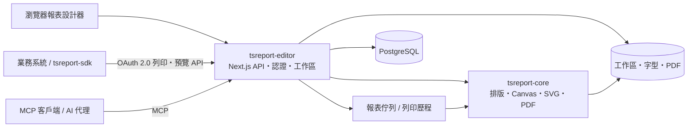

# tsreport-editor

[English](./README.md) | [日本語](./README.ja.md) | [简体中文](./README.zh-CN.md) | 繁體中文 | [한국어](./README.ko.md) | [Tiếng Việt](./README.vi.md) | [ไทย](./README.th.md) | [Bahasa Indonesia](./README.id.md) | [Deutsch](./README.de.md) | [Français](./README.fr.md) | [Español](./README.es.md) | [Português](./README.pt.md) | [العربية](./README.ar.md) | [עברית](./README.he.md)

`tsreport-editor` 是一款以瀏覽器為基礎的報表設計工具兼報表伺服器，使用 [`tsreport-core`](https://www.npmjs.com/package/tsreport-core) 作為排版與渲染引擎。

它不僅僅是一個設計報表的畫面。單一伺服器即可提供 `.report` 範本與素材的管理、使用實際資料的預覽、PDF 匯入、供外部系統使用的 OAuth 2.0 列印 API、供 AI 代理使用的 MCP、非同步報表佇列，以及列印軌跡記錄等功能。

- **報表設計器** — 可在瀏覽器中編輯區塊（band）、文字、圖形、圖片、SVG、表格、子報表、條碼、公式等。
- **預覽與 PDF 的一致性** — Editor、列印預覽與 PDF 輸出皆使用相同的 `tsreport-core` 排版結果與繪製實作。
- **多語言與字型管理** — 可處理帳戶單位的字型管理、內嵌字型、外框化、PDF 匯入字型，以及日文、中文、韓文、阿拉伯文字等排版。
- **報表 API 伺服器** — 以公開標籤固定的範本，透過 OAuth 2.0 Client Credentials 進行非同步列印。
- **MCP 伺服器** — AI 可執行範本的讀取、編輯、驗證、版面確認、PNG/PDF 繪製、PDF 原稿匯入以及差異比較。
- **維運與軌跡記錄** — API 列印會進行佇列處理，Editor、API、MCP 的 PDF 輸出皆會依帳戶分別記錄於列印歷程中。

## 透過 MCP 進行 AI 報表設計

影片展示 AI 透過 MCP 設計報表並開啟最終預覽的完整流程。英文版也示範了對多語言報表的支援。

| 英文版 — 多語言報表支援 | 日文版 |
| --- | --- |
| [](https://youtu.be/CHsNew6yQr4) | [](https://youtu.be/0I3ljxLUbys) |

### 字型管理

字型管理畫面支援下載 Google Fonts，也可以上傳自己的字型檔案。

[](https://youtube.com/shorts/fAUjfFqaVtY)

## 系統全貌



`tsreport-core` 是純 TypeScript、零 runtime 依賴的報表引擎。`tsreport-editor` 在其之上構建了 Next.js、PostgreSQL、認證、檔案管理、佇列、管理畫面等功能。由於 Editor 端在密碼雜湊上使用 Argon2id，並在 MCP 的 PNG 生成中使用 `sharp`，因此整個 Editor 伺服器並不定位為「零原生依賴」。

## 主要設計功能

- Title、Page Header、Column Header、Detail、Group Header/Footer、Summary、Page Footer、Last Page Footer、Background、No Data 等區塊（band）
- 固定文字、運算式欄位、線條、矩形、橢圓、向量路徑、圖片、SVG、框架、表格、子報表、條碼、公式、分頁
- 包含 RGB、CMYK、特別色、漸層、透明度、裁切、soft mask 的繪製屬性
- `.report` 的視覺化編輯與 JSON 編輯、多分頁、Undo/Redo、圖層、縮放、列印預覽
- 使用 JSON 測試資料確認欄位、參數、運算式、重複明細
- 高保真度的 PDF 頁面匯入。可將文字、向量、圖片、內嵌字型轉換為可編輯的報表元素或保留原始繪製結果
- `.report` 的公開標籤功能。可將編輯中的內容與供外部 API 使用的固定版本分離

## 快速開始

### 前提條件

- Docker 及 Docker Compose

已發布的 `tsreport-core` 與 `tsreport-react` 套件會依照 Editor 的 lockfile 從 npm 安裝，不使用相鄰儲存庫。

Editor 的依賴還原、型別檢查、測試、Next.js 建置皆僅在 Docker 內執行。請勿在主機端的 `src/` 中執行 `npm install`、`npm ci`、`npx`、npm script。

### 啟動

```sh
cd ../tsreport-editor/server
docker compose up
```

若要在背景啟動：

```sh
cd ../tsreport-editor/server
docker compose up -d
docker compose ps
docker compose logs -f tsreport_editor_node
```

開發用的 `server/compose.yaml` 將 Compose 專案名稱固定為 `tsreport-editor-dev`，可與同一主機上的其他產品或正式環境用的 `tsreport-editor` 專案在容器・網路的命名空間上分離。

若要停止：

```sh
cd ../tsreport-editor/server
docker compose down
```

在保留資料的一般運行情境中，請勿執行 `down -v` 或刪除 NFS/DB 目錄。

### 開發用服務與埠號

| 服務 | 角色 | 主機端 |
| --- | --- | --- |
| `tsreport_editor_node` | Next.js Editor・REST API | `http://localhost:52005` |
| `tsreport_editor_node` | 專用 MCP listener | `http://localhost:52006` |
| `tsreport_editor_node` | 工作區更新通知 | `52007` |
| `tsreport_editor_db` | PostgreSQL | `localhost:52437` |
| `tsreport_editor_cron` | 每 10 秒啟動一次報表佇列 | 僅限內部 |
| `tsreport_editor_nginx` | HTTP / HTTPS 反向代理 | `52085` / `52448` |

請在瀏覽器中開啟 `http://localhost:52005`，或使用自簽憑證的 `https://localhost:52448`。

## 首次登入與必要的安全設定

首次啟動時，應用程式會在 DB 鎖定狀態下，僅一次性地建立結構描述（schema）初始資料、帳戶、工作區、回歸測試用範本。

| 用途 | 登入 ID | 初始密碼 | 權限 |
| --- | --- | --- | --- |
| 初始管理員 | `admin` | `pass` | 管理員 |
| 回歸測試用 | `test` | `pass` | 一般使用者 |

> **重要：** 初始密碼是已公開的初始化用憑證。請務必在正式運行前變更。由於目前的 UI 不會在首次登入時自動強制變更，因此運維人員必須自行確認變更是否完成。

首次登入後，請從漢堡選單執行以下事項。

1. 於 `admin` 的「變更密碼」中變更初始密碼。
2. 若環境中不將 `test` 用於回歸測試，則予以刪除。若要保留，務必變更密碼。
3. 於保留下來的初始帳戶的「MCP 設定」中重新生成 MCP 金鑰。
4. 刪除回歸測試用 API 客戶端 `test-report-client`，或重新設定其 Client Secret 與存取權限。
5. 將 `server/node/.env` 與正式環境 `.env` 中的 DB 憑證及 `REPORT_BATCH_TOKEN` 由預設值變更。
6. 在對外公開前，將 nginx 的自簽憑證更換為正式憑證，並確認公開的埠號與防火牆設定。

本機帳戶的密碼會以 Argon2id 雜湊後儲存於 DB 中。包含管理員在內，至少必須保留一個管理員帳戶。

## 基本使用流程

1. 登入並開啟該帳戶的工作區。
2. 於「字型管理」中登錄報表所需的字型。
3. 新建 `.report`，或開啟既有的 `.report`／PDF。
4. 配置區塊與元素，若有需要則指定測試資料 JSON。
5. 於 Editor 顯示與列印預覽中確認多頁、明細溢出、最後一頁等情況。
6. 輸出 PDF。輸出結果會記錄於自己帳戶的列印歷程中。
7. 若要供外部系統使用，請建立公開標籤，並設定 API 客戶端與存取權限。

一般儲存會更新工作區上的編輯檔案。公開標籤會固定當下時間點的範本 JSON，因此之後即使進行一般儲存，既有標籤的 API 列印結果也不會改變。若要對外公開變更內容，請建立新標籤，或明確更新對象標籤。

## 以公開標籤進行報表範本的版本管理

公開標籤並不僅僅是將編輯中的 `.report` 切換為對外公開狀態的旗標。**它是一套將報表範本的內容以版本方式保存，並使該版本可透過外部 API 以名稱指定的機制。**

舉例來說，即使將發票範本目前的內容以 `v1` 公開後，工作區上的 `invoice.report` 仍可持續編輯。一般儲存所做的變更不會自動反映到 `v1`。若將變更後的內容以 `v2` 公開，外部系統即可在 API 的 URL 中明確選擇要使用的版本。

```text
invoice.report（編輯中的工作版本）
  ├─ v1（已發布的範本JSON）
  └─ v2（變更後發布的範本JSON）

POST /api/report/print/{workspaceKey}/invoice.report/v1
POST /api/report/print/{workspaceKey}/invoice.report/v2
```

透過這種分離方式，可以實現以下維運方式：

- 在編輯與驗證新的報表版面配置期間，業務系統仍可持續使用既有的 `v1`
- 配合 API 使用端的切換時機，將呼叫對象從 `v1` 變更為 `v2`
- 讓多個版本並存，依連接對象使用不同版本
- 若發現問題，可不重寫範本檔案，直接將 API 的指定還原至先前的標籤

新建標籤時，會保存當下時間點的範本 JSON。也可以明確更新同一個標籤，但此時同一個 API URL 所指向的內容也會隨之改變。若重視可重現性或分階段轉移的維運方式，請不要覆寫既有標籤，而是建立 `v1`、`v2`、`2026-07` 等新標籤。

公開標籤固定的是範本 JSON。API 呼叫時的 `rows` 與 `parameters` 不包含在版本之中，而是依每次列印要求分別指定。此外，此處所謂的「公開」並非指以匿名方式對外公開於網際網路。實際上要透過 API 使用，必須同時滿足 OAuth 2.0 的 scope、API 客戶端的存取權限，以及擁有者使用者的工作區權限。

## 使用者、工作區與共用

### 使用者管理

- 每個帳戶擁有一個工作區。
- 工作區由不可變更的 UUID `workspaceKey` 識別。
- 管理員可進行使用者建立、顯示名稱・登入 ID・權限・MCP 可用性・密碼的管理，以及系統設定。
- 即使是管理員，也無法無條件檢視其他帳戶的工作區。報表資料採租戶隔離。
- 刪除使用者為實體刪除。包含工作區、字型、共用、API 客戶端、權杖、列印歷程在內的相關資料皆會被刪除，且無法復原。

### 資料夾共用

無需共用整個工作區，只需將必要的資料夾共用給其他帳戶即可。

- 共用對象以對方的 `workspaceKey` 指定。
- 可分別授予讀取與寫入權限。
- 讀取共用允許參照範本或素材，寫入共用允許共同編輯。
- 共用對象可解除已接收的共用。
- API 與 MCP 也適用相同的有效存取範圍。

當 Editor 或 MCP 更新工作區時，更新事件會通知給其他 Editor 分頁。若無未儲存的變更則會重新載入，若有未儲存的變更，則會保護本機編輯內容並發出警告。

共用、API 權限、公開標籤各有不同的用途。

| 概念 | 對象 | 角色 |
| --- | --- | --- |
| 資料夾共用 | 帳戶之間 | 允許人類的 Editor 操作，以及以該帳戶身分運作的 MCP 進行讀取／寫入 |
| API 存取權限 | API 客戶端 | 限制外部系統可參照的 `workspaceKey` 與資料夾 |
| 公開標籤 | `.report` 的版本 | 固定用於 API 列印的範本內容 |

即使只新增 API 存取權限，若擁有者使用者本身沒有該資料夾的存取權，則無法使用。反之，僅有資料夾共用並不會對外部 API 公開。

## 新增與管理字型

漢堡選單中的「字型管理」供所有使用者使用。字型會依帳戶單位儲存於 `/var/nfs/fonts/{accountId}/`，其他帳戶無法看到。

### 上傳

1. 開啟「字型管理」。
2. 透過選擇檔案或拖放方式新增。
3. 於清單中顯示的字型 ID，可在文字元素的 `fontFamily` 中選用。

支援格式為 TTF、OTF、TTC、OTC、WOFF、WOFF2。應用程式對單一檔案的上限為 256MiB。可以像 macOS 的 `/System/Library/Fonts` 一樣，一次選取並登錄多個系統字型。不會隱含讀取主機作業系統的字型，也不會將字型安裝至作業系統。

重複判定方式如下：

- 相同字型 ID・相同二進位檔案：視為批次上傳的重試，判定為成功
- 相同字型 ID・不同二進位檔案：視為 ID 衝突而拒絕
- 不同字型 ID・相同二進位檔案：顯示既有 ID 並判定為重複而拒絕
- 僅 family 名稱或 PostScript 名稱等中繼資訊相同：若為不同的二進位檔案，可作為獨立字型登錄

內容是否一致，並非僅依中繼資訊或雜湊值判定，而是在檔案大小一致後，透過全位元組比對來確定。

### Google Fonts 與 PDF 匯入字型

於「Download Google Fonts」中選擇語言，即可將候選字型下載至帳戶區域。此功能以能夠連線至外部網路為前提。

於 PDF 匯入時，會將可重複使用的內嵌字型登錄為帳戶內的應用程式字型。若沒有字型程式，則會從帳戶字型中比對名稱與樣式，並顯示候選項目與警告。

## 使用外部列印 API

外部 API 使用的是 OAuth 2.0 Client Credentials 的 Bearer Token，而非畫面登入用的 Cookie。開始使用需具備以下三點：

1. **公開標籤** — 建立供 API 使用的 `.report` 固定版本。
2. **API 客戶端** — 於漢堡選單的「API 客戶端」中建立 Client ID、Client Secret、scope。
3. **存取權限** — 登錄客戶端可使用的 `workspaceKey` 與資料夾。

可使用的 scope 為 `report:print`、`report:status`、`report:download`、`report:preview`。API 客戶端的有效範圍是「客戶端的存取權限」與「擁有者使用者本身可存取的工作區／共用資料夾」的交集。

### REST API 流程

```text
POST /api/oauth/token
  grant_type=client_credentials
  -> access_token

POST /api/report/print/{workspaceKey}/{templatePath}/{tag}
  -> { key }

GET /api/report/status/{key}
  -> queued | processing | completed | error

GET /api/report/download/{key}
  -> application/pdf
```

範例：

```sh
BASE_URL=http://localhost:52005
CLIENT_ID=test-report-client
CLIENT_SECRET=test-report-secret

TOKEN=$(curl -sS -u "$CLIENT_ID:$CLIENT_SECRET" \
  -d grant_type=client_credentials \
  -d 'scope=report:print report:status report:download' \
  "$BASE_URL/api/oauth/token" | jq -r .access_token)

curl -sS \
  -H "Authorization: Bearer $TOKEN" \
  -H 'Content-Type: application/json' \
  -d '{"rows":[{"item":"seed"}],"parameters":{}}' \
  "$BASE_URL/api/report/print/00000000-0000-0000-0000-000000000002/invoice.report/v1"
```

即使 `templatePath` 中包含 `/`，也會將其後的最後一個區段解析為標籤。狀態與下載僅能由建立該列印要求的同一個 API 客戶端參照。

### tsreport-sdk

使用 [`tsreport-sdk`](../tsreport-sdk)，即可透過單一 TypeScript API 處理權杖取得、佇列投入、輪詢、PDF 取得等操作。

```ts
import { TsreportClient } from 'tsreport-sdk'

const client = new TsreportClient({
    baseUrl: 'https://reports.example.com',
    clientId: process.env.REPORT_CLIENT_ID!,
    clientSecret: process.env.REPORT_CLIENT_SECRET!
})

const pdf = await client.printAndDownload(
    '00000000-0000-0000-0000-000000000002',
    'orders/invoice.report',
    'v1',
    { rows: [{ orderId: 42 }], parameters: {} }
)
```

請勿將 Client Secret 嵌入瀏覽器中。若要從瀏覽器應用程式使用，請透過自己系統中已驗證的後端進行中繼。若要安全地中繼預覽素材 API，可使用 `tsreport-sdk/server` 的 `createPreviewEndpoint`。

## 報表佇列與列印軌跡記錄

來自 API 的列印要求會以 `queued` 狀態登錄於 DB 的 `PrintRequest` 中。`tsreport_editor_cron` 每 10 秒啟動一次已驗證的批次端點，將狀態從 `queued` → `processing` 轉移至 `completed` 或 `error`。並行執行會透過 DB 鎖定進行序列化處理。

生成的 PDF 會儲存於 `/var/nfs/report-pdf`。在列印歷程畫面中，可確認自己帳戶的以下資訊：

- 執行日期時間
- 執行路徑：`editor` / `api` / `mcp`
- 工作區、範本、格式
- 完成／錯誤狀態與錯誤原因
- 重新下載已完成的 PDF

在 Editor 中生成的 PDF，會從瀏覽器記錄至歷程 API。MCP 的 `render_report(format="pdf")` 也會記錄於歷程中。歷程依帳戶隔離，即使是管理員也無法檢視其他帳戶的歷程。

在維運上，請將 DB 與 `server/nfs` 作為相同的復原點進行備份。若僅還原歷程記錄行，或僅還原 PDF 檔案，會導致軌跡記錄與成果物不一致。依輸出件數而定的保存期限與磁碟監控，也請由維運端自行決定。

## 使用 MCP

MCP 與外部列印 API 的 OAuth 客戶端相互獨立。以各使用者的登入 ID 與 MCP 金鑰進行驗證，並以與該使用者相同的工作區／共用權限運作。

### 啟用與憑證

1. 從漢堡選單開啟「MCP 設定」。
2. 開啟自己的 MCP 使用功能。
3. 複製 MCP 金鑰。初始金鑰應在正式運行前重新生成。
4. 管理員可在同一畫面中設定整個 MCP 的開關與專用埠號。

一般情況下使用與 Next.js 相同的 `http://localhost:52005/api/mcp`。在開發環境中，也可使用專用 listener `http://localhost:52006`。請於 MCP 客戶端中設定 Streamable HTTP 的 URL，以及以下任一種驗證方式：

- `x-mcp-account: <登入 ID>` 與 `x-mcp-key: <MCP 金鑰>`
- `Authorization: Bearer <登入 ID>:<MCP 金鑰>`

設定指南可在無需驗證的情況下取得。

```sh
curl http://localhost:52005/api/mcp
```

確認工具清單的範例：

```sh
curl -sS http://localhost:52005/api/mcp \
  -H 'Content-Type: application/json' \
  -H 'x-mcp-account: admin' \
  -H 'x-mcp-key: <重新產生的MCP金鑰>' \
  -d '{"jsonrpc":"2.0","id":1,"method":"tools/list","params":{}}'
```

### MCP 工具

| 分類 | 工具 |
| --- | --- |
| 導入 | `get_started` |
| 探索 | `list_workspaces`, `list_templates`, `list_workspace_files`, `list_fonts` |
| 範本 | `get_template`, `get_template_schema`, `validate_template`, `save_template`, `update_template_elements` |
| 素材 | `save_workspace_file`, `delete_workspace_file` |
| 驗證・輸出 | `layout_report`, `render_report`, `compare_reports` |
| 原稿匯入 | `import_pdf` |

建議的作業循環如下：

1. 閱讀 `get_started` 與 `get_template_schema`。
2. 以 `list_workspaces`、`list_templates`、`list_workspace_files`、`list_fonts` 確認可用的資源。
3. 生成範本，或以 `get_template` 取得。
4. 以 `validate_template` 驗證結構與運算式。
5. 以 `layout_report` 就絕對座標、頁數、超出範圍的元素進行數值確認。
6. 以 `render_report(format="png")` 進行視覺確認。
7. 以 `save_template` 或 `update_template_elements` 進行儲存。
8. 以 `compare_reports` 比較變更前後，確認沒有非預期的位移。

若有原稿 PDF，請不要以肉眼重新製作，而是依 `save_workspace_file` → `import_pdf` → 調整運算式或區塊 → `layout_report` / `render_report` 的順序進行。

## 語言與可選的外部整合

Editor UI 可選擇日文、英文、簡體中文、韓文、繁體中文、越南文、泰文、印尼文、德文、法文、西班牙文、葡萄牙文、阿拉伯文、希伯來文。阿拉伯文與希伯來文的 UI 也會呈現 RTL。這並不會限制報表內可使用的文字體系。

管理員可設定 Google／Microsoft 的外部登入。若不啟用外部登入，也可僅以受 Argon2id 保護的本機帳戶運行。

若要使用 AI 輔助功能，請將 API 金鑰與模型登錄於 DB 的系統設定中。初始值不包含有效的外部 API 金鑰。請勿將機密值儲存於原始碼、`.report`、工作區、README 中。

## 初始資料與回歸測試用環境

首次啟動時會建立以下內容：

- `admin` 與 `test` 帳戶，以及固定的 `workspaceKey`
- `test` 擁有的回歸測試用 API 客戶端 `test-report-client`
- `test` 工作區的 `invoice.report`、`sub.report`、`assets/logo.png`
- `invoice.report` 的公開標籤 `v1`
- 從 `test` 到 `admin` 的 `assets` 資料夾讀取／寫入共用

固定金鑰：

- `admin`: `00000000-0000-0000-0000-000000000001`
- `test`: `00000000-0000-0000-0000-000000000002`

這些用於 `tsreport-editor`、`tsreport-sdk`、`tsreport-react` 的實際伺服器回歸測試。在正式運行時，請務必變更或刪除前述的初始憑證。

### 將開發用 DB 還原至初始狀態

若要完全重建開發環境的 PostgreSQL，請先停止容器，然後刪除 `server/db/pgdata/data`，再重新啟動。

```sh
cd ../tsreport-editor/server
docker compose down
rm -rf db/pgdata/data
docker compose up
```

重新啟動時會套用 PostgreSQL 的 DDL，並在應用程式啟動時重新建立初始帳戶、API 客戶端、公開標籤等 DB 初始資料。回歸測試用的工作區檔案僅在不足時才會補充。請勿在 DB 容器運行中刪除 `pgdata`。

此操作所初始化的是 PostgreSQL。儲存於 `server/nfs` 的工作區、字型、生成的 PDF 等不會被刪除。若需要將 DB 與 NFS 兩者皆還原至初始狀態，請使用管理員選單中的「Factory Reset（原廠重設）」。

「Factory Reset」會刪除所有 DB 資料表、工作區、報表輸出，並重新建立首次啟動時的狀態。此操作無法復原。字型、憑證、`.gitignore` 等點檔案（dotfile）不在刪除範圍內。

## 資料儲存位置

| 資料 | 容器內 | 開發用主機端 |
| --- | --- | --- |
| PostgreSQL | `/var/pgdata/data` | `server/db/pgdata` |
| 工作區 | `/var/nfs/workspaces/{workspaceKey}` | `server/nfs/workspaces` |
| 帳戶字型 | `/var/nfs/fonts/{accountId}` | `server/nfs/fonts` |
| 生成 PDF | `/var/nfs/report-pdf` | `server/nfs/report-pdf` |
| nginx 記錄 | `/var/log/nginx` | `logs/nginx` |

應用程式的資料匯出／匯入可從管理員選單執行。針對整個環境的災難復原，請勿僅依賴此功能，也請保持 PostgreSQL 與 NFS 的一致性備份。

## 正式環境建置與啟動

正式環境的建置與啟動同樣以 Docker Compose 為前提。`build.sh`、`build_boot.sh`、`boot.sh`、`boot_db.sh`、`boot_web.sh`、`build_boot_web.sh` 是用於呼叫 Docker Compose 的簡易包裝腳本。並非於主機上安裝 Node.js 依賴後直接常駐執行 `server.js` 的操作步驟。

### 1. 事前準備

`tsreport-core` 與 `tsreport-react` 會依 `src/package-lock.json` 鎖定的版本從 npm 還原。

```sh
cd ../tsreport-editor/server
```

編輯正式環境用設定。

- `boot/web/.env`：DB 連線資訊與 `REPORT_BATCH_TOKEN`
- `boot/compose.yaml`：單一伺服器架構的 PostgreSQL 設定
- `boot/db/compose.yaml`：DB/Web 分離架構的 PostgreSQL 設定
- `nginx/cert`：正式的 TLS 憑證
- `nginx/conf`：公開主機名稱、轉送目的地、所需的存取控制

請使 `boot/web/.env` 的 `DB_PASS` 與所採用架構之 Compose 中的 `DB_PASS` 一致。Web 與 cron 使用 `boot/web/.env` 中相同的 `REPORT_BATCH_TOKEN`。儲存庫內的值僅供本機啟動使用，正式環境中務必變更。

### 2. 正式環境建置

```sh
cd ../tsreport-editor/server
./build.sh
```

`build.sh` 不會在主機端還原 Node.js 依賴。它會將 `src` 同步至 `server/build/src`，在隔離的 Docker 建置環境中執行 Next.js 的 production build，並將 standalone 成果物配置至以下位置。

```text
server/boot/web/dist/standalone/
  ├─ server.js
  ├─ .next/
  ├─ node_modules/
  ├─ public/
  └─ seed/
```

建置過程包含 TypeScript 檢查與 Next.js 的 production compilation。請在確認指令正常結束，且 `boot/web/dist/standalone/server.js` 已存在後再啟動。

### 3. 啟動已建置完成的伺服器（不重新建置）

若 `./build.sh` 已成功執行，且 `boot/web/dist/standalone/server.js` 已存在，即可在不重複執行 Next.js 的 production build 的情況下啟動正式伺服器。

若要在同一伺服器上啟動 DB 與 Web：

```sh
cd ../tsreport-editor/server
./boot.sh
```

若要將 DB 伺服器與 Web 伺服器分離，請分別於 DB 主機與 Web 主機上執行。

```sh
# DB主機
cd ../tsreport-editor/server
./boot_db.sh

# Web主機
cd ../tsreport-editor/server
./boot_web.sh
```

`boot.sh` 與 `boot_web.sh` 會將既有的 `boot/web/dist/standalone` 掛載至 Node.js 容器，並以 PM2 啟動。Docker runtime 映像會依需要由 Compose 更新，但不會執行 Next.js 的 production build。若要反映原始碼變更，請先重新執行 `./build.sh`。

### 4-A. 單一伺服器架構

DB、Node.js、報表佇列 cron、nginx 於同一伺服器實例上運行的架構。從建置到常駐啟動，可透過以下單一指令執行。

```sh
cd ../tsreport-editor/server
./build_boot.sh
```

若已完成建置，僅需啟動，請執行 `./boot.sh`。`boot.sh` 使用 `boot/compose.yaml`，並將以下所有服務以 `tsreport-editor` 專案（不會與其他產品的 Compose 專案衝突）於背景啟動。

| 服務 | 角色 | 公開埠號 |
| --- | --- | --- |
| `tsreport_editor_db` | PostgreSQL | `52437` |
| `tsreport_editor_node` | 已建置完成的 Next.js standalone、MCP、更新通知 | `52005`、`52006`、`52007` |
| `tsreport_editor_cron` | 每 10 秒啟動一次非同步報表佇列 | 無 |
| `tsreport_editor_nginx` | HTTP/HTTPS 反向代理 | `52085`、`52448` |

Web 容器並非掛載原始碼樹，而是僅將 `boot/web/dist/standalone` 掛載至 `/var/node`，並以 PM2 的 cluster mode 執行 `server.js`。啟動期間即使變更 `src`，也不會反映至正式伺服器。若要反映變更，請再次執行 `./build.sh` 後，重新啟動 Web 服務。

啟動確認：

```sh
docker compose --project-name tsreport-editor -f boot/compose.yaml ps
docker compose --project-name tsreport-editor -f boot/compose.yaml logs -f tsreport_editor_node
```

停止：

```sh
docker compose --project-name tsreport-editor -f boot/compose.yaml down
```

### 4-B. DB 伺服器與 Web 伺服器的分離架構

將 PostgreSQL 運行於 DB 專用伺服器，並將 Node.js、報表佇列 cron、nginx 運行於 Web 伺服器的架構。請於兩台主機上配置本儲存庫，並分別於 DB 主機與 Web 主機上各執行一個指令。

在 DB 主機上僅啟動 `boot/db/compose.yaml`。

```sh
cd ../tsreport-editor/server
./boot_db.sh
```

請將 Web 主機的 `boot/web/.env` 變更為 DB 主機的私有 DNS 名稱或 IP 位址，以及 DB 主機所公開的埠號。

```dotenv
DB_HOST=db.internal.example
DB_PORT=52437
DB_NAME=TSREPORT_EDITOR_DB
DB_USER=postgres
DB_PASS=正式環境用DB密碼
REPORT_BATCH_TOKEN=正式環境用的共用祕密
```

在 Web 主機上，可透過單一指令執行 production build 與 Web 端服務的常駐啟動。

```sh
cd ../tsreport-editor/server
./build_boot_web.sh
```

若已完成建置，僅需啟動 Web 端，請執行 `./boot_web.sh`。Web 端的 `boot/web/compose.yaml` 僅啟動 Node.js、cron、nginx，不會建立 PostgreSQL 容器。

分離架構的啟動確認：

```sh
# DB主機
docker compose --project-name tsreport-editor-db -f boot/db/compose.yaml ps
docker compose --project-name tsreport-editor-db -f boot/db/compose.yaml logs -f tsreport_editor_db

# Web主機
docker compose --project-name tsreport-editor-web -f boot/web/compose.yaml ps
docker compose --project-name tsreport-editor-web -f boot/web/compose.yaml logs -f tsreport_editor_node
```

分離架構的停止：

```sh
# Web主機
docker compose --project-name tsreport-editor-web -f boot/web/compose.yaml down

# DB主機
docker compose --project-name tsreport-editor-db -f boot/db/compose.yaml down
```

請勿將 DB 的 `52437` 直接公開至網際網路，僅在 Web 主機可到達的私有網路內允許存取。DB 主機端 `boot/db/compose.yaml` 的 `DB_PASS` 與 Web 端 `boot/web/.env` 的 `DB_PASS` 應設為相同值。工作區、字型、生成的 PDF 儲存於 Web 主機端的 `server/nfs`，不需要與 DB 主機共用檔案系統。

### 5. 共通的運作確認

於瀏覽器中開啟 `https://<Web 主機>:52448` 或 `http://<Web 主機>:52005`。若要使用外部列印 API，請確認 `tsreport_editor_cron` 也處於 `Up` 狀態。

在一般的停止・重新啟動中，`server/db/pgdata` 與 Web 主機的 `server/nfs` 會被保留。僅在需要初始化 DB 時，才依照前述的初始化步驟，於停止 DB 服務後刪除 `db/pgdata/data`。

在正式對外公開前，請至少確認以下事項：

- 已變更或刪除初始使用者、MCP 金鑰、回歸測試用 API 客戶端
- 已變更 DB 密碼與 `REPORT_BATCH_TOKEN`
- 已設定正式的 TLS 憑證
- 未將 `/api/report/batch/process` 以無驗證方式對外公開
- 已具備 DB、工作區、字型、生成 PDF 的備份與容量監控
- 所需的字型與公開標籤已登錄於對象帳戶
- 已使用相當於實際資料的多頁報表確認 Editor、預覽、API 列印

## 環境變數

應用程式設定於開發環境中置於 `server/node/.env`，於正式環境中置於 `server/boot/web/.env`。

| 變數 | 說明 | 開發環境預設值 |
| --- | --- | --- |
| `DB_HOST` | PostgreSQL 主機 | `172.31.0.30` |
| `DB_PORT` | PostgreSQL 埠號 | `15432` |
| `DB_NAME` | DB 名稱 | `TSREPORT_EDITOR_DB` |
| `DB_USER` | DB 使用者 | `postgres` |
| `DB_PASS` | DB 密碼 | `postgres1234` |
| `REPORT_BATCH_TOKEN` | 批次啟動用共用密鑰 | `tsreport-report-batch-local` |
| `WORKSPACES_ROOT` | 工作區根目錄 | `/var/nfs/workspaces` |
| `NEXT_TELEMETRY_DISABLED` | 停用 Next.js telemetry | `1` |

MCP 整體的啟用狀態與專用埠號，皆作為 DB 的系統設定，可從管理畫面變更。外部登入用的 OAuth 設定與可選的 AI 輔助設定，也由管理畫面／SystemProperty 管理，請勿將機密值寫入 README 或原始碼中。

## 開發與驗證

```sh
cd ../tsreport-editor

docker compose -f server/compose.yaml exec tsreport_editor_node npx tsc --noEmit
docker compose -f server/compose.yaml exec tsreport_editor_node npm test
docker compose -f server/compose.yaml exec \
  -e TSREPORT_EDITOR_LIVE_BASE=http://localhost:3000 \
  tsreport_editor_node npm run test:live

cd server
./build.sh
```

開發、測試與正式環境建置都會從 npm 還原 `tsreport-core` 與 `tsreport-react`，不需簽出相鄰儲存庫。

## 儲存庫結構

| 路徑 | 內容 |
| --- | --- |
| `src/` | Next.js Editor、REST API、MCP、伺服器邏輯 |
| `tests/` | 單元・整合・實際伺服器回歸測試 |
| `server/` | Docker 開發、建置、正式環境啟動設定 |
| `cli/` | 輔助腳本 |

相關儲存庫：

| 儲存庫 | 內容 |
| --- | --- |
| [`tsreport-core`](https://github.com/pontasan/tsreport-core) | 純 TypeScript 的報表排版・繪製・PDF・字型引擎 |
| [`tsreport-editor`](https://github.com/pontasan/tsreport-editor) | 此瀏覽器報表設計器兼報表伺服器 |
| [`tsreport-sdk`](https://github.com/pontasan/tsreport-sdk) | 供列印・預覽 API 使用的零依賴 TypeScript SDK |
| [`tsreport-react`](https://github.com/pontasan/tsreport-react) | 使用 `tsreport-core` 的 React 預覽 UI |

## 授權條款

tsreport-editor 可依使用者的選擇，以 [MIT License](./LICENSE-MIT) 或 [Apache License 2.0](./LICENSE-APACHE) 授權使用（SPDX：`MIT OR Apache-2.0`）。
